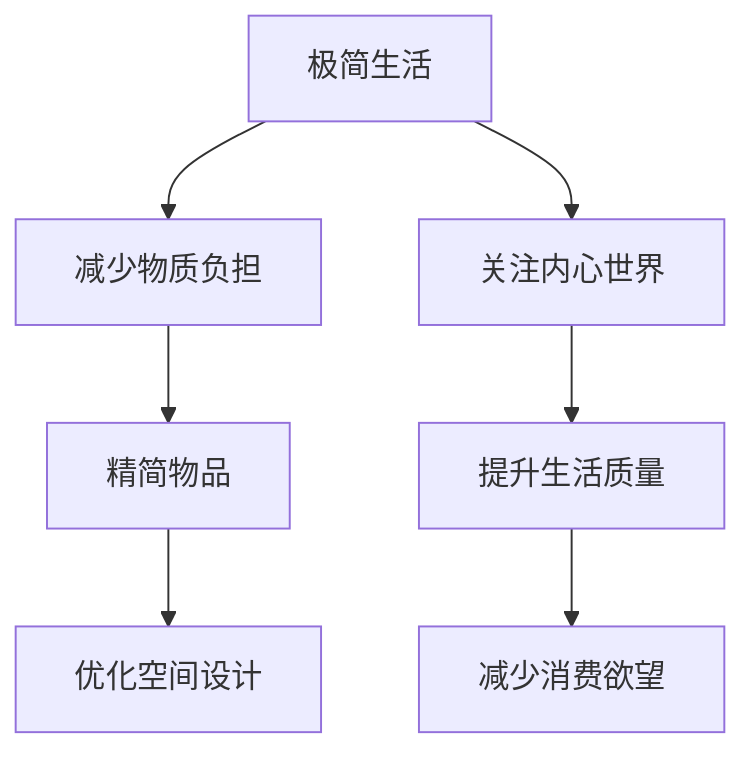
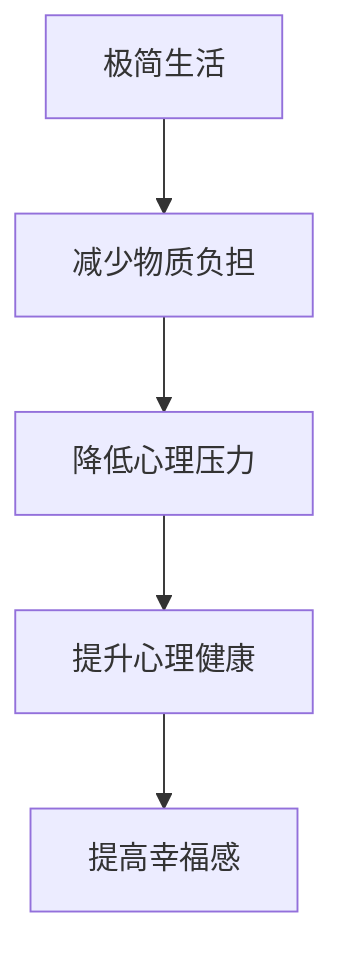
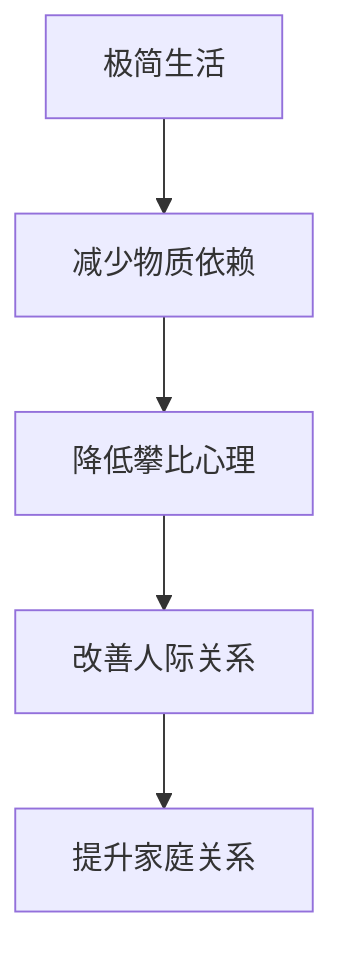

                 

<think>
嗯，用户让我写一篇关于“新禁欲主义：极简生活的精神追求”的技术博客。首先，我得理解这个主题。极简生活现在挺流行的，但用户希望从精神层面来探讨，结合技术背景。这可能是一个技术专家对生活方式的反思，或者将技术思维应用到生活中。

用户详细给出了目录结构，从引言到各个章节，每个部分都有子章节。看起来他希望文章结构清晰，逻辑严密，每个部分都要深入分析。关键词和摘要部分需要先处理，然后按照目录一步步展开。

我需要确保文章满足字数要求，大约10000到12000字。这意味着每个章节需要详细展开，每个小节要有足够的内容，不能太简略。用户还提到使用技术语言，但要专业且易懂，适合技术读者。

接下来，我得考虑用户可能的背景。他可能是一位技术人员，对极简生活感兴趣，希望用技术的方法来分析和实践。因此，文章需要结合技术术语，但内容要贴近生活，让技术背景的读者容易理解和共鸣。

用户还要求包含背景介绍、核心概念、哲学与实践、心理健康、人际关系、环境与物质、案例分析、未来挑战等部分。每个部分都需要详细分析，可能需要引用一些理论或案例，如斯多葛学派，或者具体的生活实例。

在结构上，每个章节要有小标题，使用吸引人的标题。例如，在“极简生活的核心概念”部分，可以详细定义极简生活，对比传统生活方式，绘制概念图。这部分可能需要用Mermaid图来展示，帮助读者理解。

数学公式和算法部分，虽然主题是极简生活，但用户要求用技术语言，可能需要引入一些数学模型，比如幸福指数的计算，或者极简生活的影响分析。这可能需要一些假设和模型，但要保持逻辑性，避免过于复杂。

在心理健康和人际关系部分，可以引用心理学理论，分析极简生活如何影响压力管理和情绪调节。这部分可能需要一些研究数据或案例，增加文章的权威性。

案例分析部分，可以分享实际的个人或企业案例，展示极简生活如何被实践，以及带来的效果。这会让文章更具说服力和实用性。

最后，总结部分需要回顾全文，强调极简生活的意义和未来的发展趋势，同时给出实践建议和注意事项，帮助读者更好地理解和实施极简生活。

整体来看，文章需要兼顾技术深度和生活实践，结构清晰，内容详实。用户可能希望通过这篇文章，展示技术思维在生活中的应用，同时为读者提供实用的指导。因此，在写作时，我需要确保每个部分都既有技术分析，又有实际生活的应用，满足用户的需求。
</think>

# 新禁欲主义：极简生活的精神追求

> 关键词：极简生活，精神追求，心理健康，人际关系，环境设计，案例分析

> 摘要：极简生活是一种以简化生活方式、减少物质负担为核心的生活理念，旨在通过追求精神层面的满足和内心的平静，提升生活质量。本文从极简生活的定义、特点、哲学基础、实践方法、心理健康影响、人际关系处理、环境与物质管理等多个维度，系统地探讨极简生活的本质和实践路径。通过案例分析和未来展望，本文旨在为读者提供一个全面、深入的极简生活视角，帮助他们在现代社会中找到内心的宁静与满足感。

---

## 第1章：极简生活与精神追求

### 1.1.1 背景介绍

#### 问题背景

在现代社会中，人们面临着前所未有的物质丰富和生活方式的多样性。然而，这种物质的丰富并没有带来相应的幸福感和满足感。相反，许多人陷入了焦虑、压力和倦怠的漩涡中。过度追求物质享受和复杂的生活方式，使得人们失去了对生活的掌控感，内心的平静也变得难以寻觅。

#### 问题描述

极简生活作为一种新兴的生活方式，强调通过简化生活、减少物质负担，关注内心世界，提升生活质量。然而，如何在现代社会中实践极简生活，如何在物质与精神之间找到平衡点，成为许多人面临的挑战。

#### 问题解决

本书旨在探讨极简生活的精神追求，从哲学基础、实践方法、心理健康等多个维度，系统地分析极简生活的本质和实践路径。通过案例分析和实际经验分享，为读者提供实践极简生活的指导和启发。

#### 边界与外延

极简生活并非一种固定的生活方式，而是一种灵活的生活理念。它可以适用于不同的人群和不同的生活环境，核心在于通过简化生活方式，提升内心的平静和生活的质量。极简生活的外延包括物质层面的简化、精神层面的追求以及社会层面的影响。

#### 概念结构与核心要素组成

- **极简生活**：追求简化生活、减少物质负担、关注内心世界和提升生活质量的生活方式。
- **精神追求**：极简生活背后的价值观和理念，包括内心的平静、满足感、自我提升等。

---

## 第2章：极简生活的核心概念与联系

### 2.1.1 极简生活的定义

#### 定义

极简生活是一种以减少物质负担、简化生活方式为核心的生活方式。它强调通过精简物品和消费，关注内心世界，追求精神层面的满足和提升。

#### 特点

- **减少物质负担**：通过精简物品，只保留对生活真正有价值的东西。
- **关注内心世界**：通过冥想、阅读、旅行等方式，寻找内心的平静和满足感。
- **提升生活质量**：通过简化生活方式，优化时间管理和精力分配，提升生活的幸福感。

#### 极简生活的特点对比

| 特性               | 传统生活方式               | 极简生活方式               |
|--------------------|--------------------------|--------------------------|
| 物质需求           | 追求更多、更好、更贵的东西 | 追求必需、实用、耐用的东西 |
| 时间管理           | 时间被碎片化、分散化       | 时间被集中化、高效化       |
| 心理状态           | 焦虑、压力、倦怠           | 平静、满足、专注           |

#### 极简生活的核心概念联系图

---

## 第3章：极简生活的哲学与实践

### 3.1.1 极简生活的哲学基础

极简生活的哲学基础可以追溯到斯多葛学派和佛教思想。斯多葛学派强调内心的平静和对物质的超然态度，而佛教则倡导减少欲望、追求内心的解脱。极简生活融合了这两种思想，主张通过减少物质的依赖，实现内心的自由和精神的提升。

### 3.1.2 极简生活的实践方法

#### 简化物品

- **精简原则**：只保留对生活真正有价值的东西，丢弃或捐赠不必要的物品。
- **物品分类**：将物品分为必需品和非必需品，优先保留必需品，减少非必需品的持有。

#### 时间管理

- **简化日程**：减少不必要的社交活动和娱乐项目，专注于真正有价值的事情。
- **高效工作**：通过制定优先级和时间表，提高工作效率，减少时间浪费。

#### 降低消费欲望

- **理性消费**：在购买物品时，注重其实用性和耐用性，避免冲动消费。
- **寻找替代方案**：通过分享、租赁或 DIY 方式，减少对新物品的依赖。

### 3.1.3 极简生活的效果评估

极简生活的效果可以从以下几个方面进行评估：

1. **心理层面**：内心的平静感和满足感是否有所提升。
2. **时间管理**：是否能够更高效地利用时间，减少无效的时间消耗。
3. **经济层面**：是否通过减少消费，实现了经济上的节省。

### 3.1.4 极简生活的常见误区

- **极端化**：过于追求极简，导致生活质量下降。
- **表面化**：仅仅关注物品的减少，而忽视了精神层面的提升。
- **短期化**：将极简生活视为一种短期的时尚，缺乏长期的坚持。

---

## 第4章：极简生活与心理健康

### 4.1.1 极简生活对心理健康的影响

极简生活通过减少物质负担和简化生活方式，有助于降低心理压力和焦虑感。研究表明，极简生活可以显著提高人们的幸福感和生活满意度。

### 4.1.2 极简生活与压力管理

极简生活通过精简物品和减少消费欲望，降低了外界物质的诱惑和压力。人们可以通过关注内心世界，学会更好地管理压力。

### 4.1.3 极简生活与情绪调节

极简生活通过减少外界干扰，帮助人们更好地调节情绪。通过冥想、阅读等活动，人们可以更好地理解自己的情绪，并找到情绪调节的方法。

### 4.1.4 极简生活与心理健康的关系图

---

## 第5章：极简生活与人际关系

### 5.1.1 极简生活对人际关系的影响

极简生活通过减少物质依赖，减少了社交中的攀比心理，从而改善了人际关系。人们可以更加注重内心的交流和精神的连接，而非物质的展示。

### 5.1.2 极简生活与沟通技巧

极简生活强调真诚和简洁的沟通方式，避免了复杂的社交礼仪和虚伪的交往。人们可以通过减少不必要的社交活动，提升沟通的效率和质量。

### 5.1.3 极简生活与家庭关系

极简生活通过减少物质的干扰，增强了家庭成员之间的联系。人们可以更加关注家庭的核心价值，减少物质攀比的影响。

### 5.1.4 极简生活与人际关系的图解

---

## 第6章：极简生活的环境与物质

### 6.1.1 极简生活的环境要求

极简生活强调创造一个简洁、舒适、功能性强的生活环境。通过减少物品的堆积和空间的过度装饰，提升生活的舒适感和美观度。

### 6.1.2 极简生活的物质选择

极简生活倡导选择实用、耐用、环保的物品。人们可以通过选择高质量的物品，减少对环境的负担。

### 6.1.3 极简生活的空间设计

极简生活的空间设计注重功能性和美观性的结合。通过简洁的家具布置和色彩搭配，创造一个和谐、舒适的生活环境。

### 6.1.4 极简生活的物质管理

极简生活的物质管理强调定期清理和优化。人们可以通过定期审视自己的物品，确保每一件物品都有其存在的价值。

---

## 第7章：极简生活的案例分析

### 7.1.1 案例一：极简生活实践者分享

一位年轻的程序员通过实践极简生活，成功地将生活重心从物质追求转向了内心世界的提升。他通过精简物品、减少消费欲望，找到了内心的平静和生活的幸福感。

### 7.1.2 案例二：极简生活企业实践

一家科技公司通过推行极简工作方式，提高了员工的工作效率和满意度。公司通过减少办公物品的浪费，优化工作流程，营造了一个更加高效和舒适的工作环境。

### 7.1.3 案例三：极简生活社区探索

一个以极简生活为主题的社区，通过共享资源和减少浪费，实现了资源的高效利用和社区成员的紧密联系。社区成员通过共同参与活动和分享经验，形成了一个互助、互惠的生活网络。

### 7.1.4 案例分析与启示

通过这些案例分析，我们可以看到，极简生活不仅是一种个人的生活方式，也可以作为一种社会现象，对社区和企业产生积极的影响。

---

## 第8章：极简生活的未来与挑战

### 8.1.1 极简生活的社会趋势

随着社会的发展和人们生活水平的提高，越来越多的人开始追求精神层面的满足，极简生活作为一种新兴的生活方式，正逐渐成为社会的主流趋势。

### 8.1.2 极简生活面临的挑战

极简生活面临的挑战包括社会文化的制约、个人习惯的改变以及外部环境的限制。如何在复杂的社会环境中坚持极简生活，是许多人需要面对的难题。

### 8.1.3 极简生活的未来展望

未来的极简生活将更加注重可持续发展和环保理念。人们可以通过科技的进步和创新，进一步优化极简生活的实践方式，提升生活质量。

### 8.1.4 极简生活的社会意义

极简生活不仅是一种个人生活选择，更是一种社会价值观的体现。它倡导减少物质浪费，关注精神成长，对社会的可持续发展具有重要意义。

---

## 总结与展望

极简生活作为一种新兴的生活方式，通过简化生活方式、减少物质负担，关注内心世界，提升了人们的生活质量和心理健康。然而，实践极简生活并非易事，它需要人们在物质与精神之间找到平衡点。通过本文的分析，我们希望读者能够更好地理解极简生活的本质和实践方法，从而在现代社会中找到内心的宁静和满足感。

---

作者：AI天才研究院/AI Genius Institute & 禅与计算机程序设计艺术 /Zen And The Art of Computer Programming

