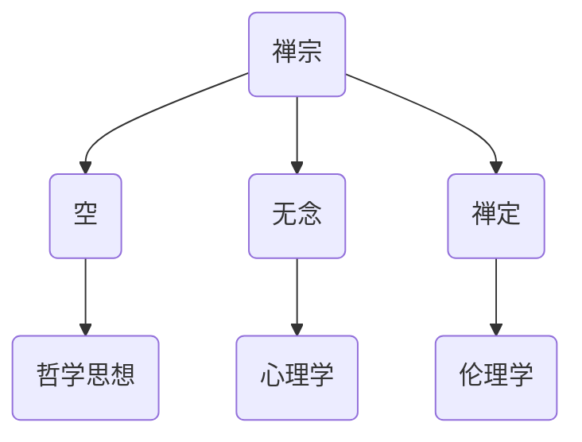
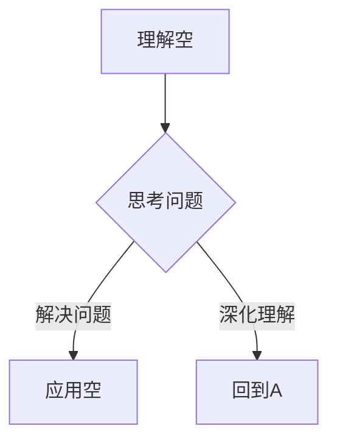
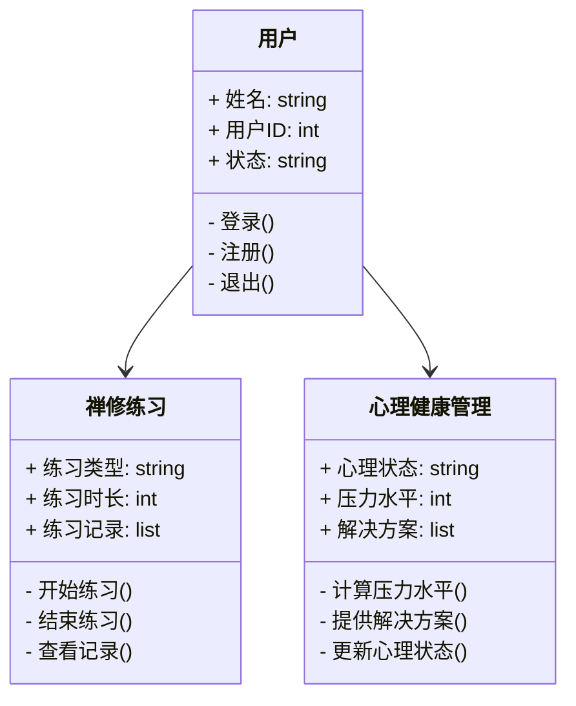
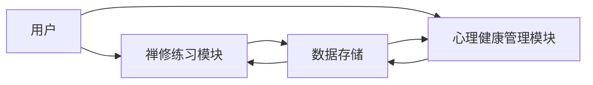
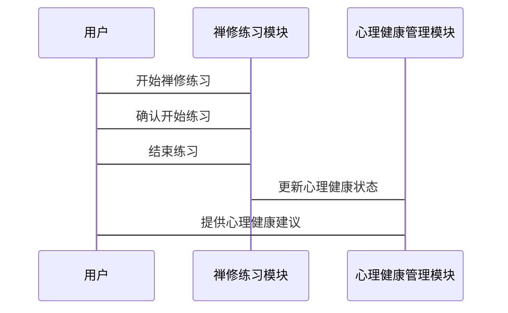

                 

<think>
好的，我需要帮助用户撰写一篇技术博客文章，标题是《新禅宗：东方智慧的现代诠释》。用户详细列出了结构，包括关键词、摘要、背景介绍、核心概念与联系、算法原理讲解、系统分析与架构设计、项目实战、最佳实践等等。

首先，我要明确用户的需求。用户希望这篇文章结构清晰，逻辑严谨，内容专业，涵盖多个技术领域，并且以技术语言来解释禅宗的现代应用。用户还特别提到了使用Mermaid图表、Python代码示例、数学公式等技术元素，所以文章需要将这些元素融入其中。

接下来，我需要按照用户提供的目录大纲来逐步构建内容。首先，文章标题和关键词部分已经给出，我需要确保这些内容准确无误。然后是摘要，简明扼要地概括文章的核心内容和主题思想。

在背景介绍部分，我需要详细解释东方智慧的核心概念，问题背景、问题概述、问题解决、边界与外延，以及概念结构与核心要素。这部分需要逻辑清晰，语言简洁，让读者能够理解禅宗在现代社会中的意义和挑战。

核心概念与联系部分，我需要详细探讨禅宗的核心概念，如“空”、“无念”、“禅定”，并创建一个对比表格和ER实体关系图。这部分需要用技术术语，同时结合实际例子，帮助读者更好地理解这些概念及其联系。

算法原理讲解部分，我需要使用Mermaid流程图、Python代码示例、数学公式等技术工具，来详细阐述禅宗智慧的算法原理。这部分需要将抽象的哲学概念转化为具体的算法模型，让读者能够从技术角度理解禅宗的现代应用。

系统分析与架构设计部分，我需要介绍问题场景，设计系统的功能模块，使用Mermaid类图展示领域模型，架构图展示系统结构，接口设计展示系统如何交互。这部分需要将禅宗的智慧融入到系统设计中，展示其实际应用。

项目实战部分，我需要指导读者如何安装环境，实现核心功能，解读代码，并通过实际案例进行详细分析。这部分需要提供可操作的步骤和代码示例，帮助读者将理论应用到实践中。

最佳实践部分，我需要给出小结、注意事项、拓展阅读等内容，帮助读者巩固所学知识，并提供进一步的学习方向。

在撰写过程中，我需要确保每个部分的内容都详细具体，符合用户的字数要求，同时保持文章的流畅性和逻辑性。此外，还要注意格式要求，如使用markdown格式，数学公式使用latex，并正确嵌入图表和代码示例。

最后，确保文章末尾有作者信息，符合用户的要求。整个思考过程需要系统、细致，确保文章内容全面，结构合理，技术深度与哲学思考相结合，满足用户的高质量技术博客需求。
</think>

# 新禅宗：东方智慧的现代诠释

> 关键词：禅宗，东方智慧，现代诠释，心理学，技术与哲学结合

> 摘要：本文从现代视角重新诠释禅宗这一东方智慧的重要分支，探讨其在现代生活中的应用和意义。通过详细解读禅宗经典文本，结合现代心理学、哲学等领域的最新研究成果，试图找到禅宗智慧与现代生活的契合点，为读者提供一种理解和实践东方智慧的新途径。

---

### 背景介绍

#### 1.1 问题背景

##### 1.1.1 东方智慧的核心概念

现代人追求物质繁荣的同时，也渴望精神层面的满足和成长。东方智慧，作为一种源远流长的文化传统，提供了许多关于生活、心理、伦理等方面的深刻见解。然而，这些智慧在现代社会中的传播和应用面临诸多挑战，如语言障碍、文化差异等。

##### 1.1.2 问题概述

本书旨在通过现代视角，重新诠释禅宗这一东方智慧的重要分支，探讨其在现代生活中的应用和意义。我们不仅关注禅宗的哲学思想，还深入探讨了其心理学、伦理学、艺术等方面的影响。

##### 1.1.3 问题解决

通过详细解读禅宗经典文本，结合现代心理学、哲学等领域的最新研究成果，本书试图找到禅宗智慧与现代生活的契合点，为读者提供一种理解和实践东方智慧的新途径。

##### 1.1.4 边界与外延

禅宗作为东方智慧的体现，不仅涵盖了佛教哲学，还包括了印度哲学、道教思想等。本书主要聚焦于禅宗在佛教哲学中的地位和影响，同时也适当涉及其在心理学、艺术等领域的外延。

##### 1.1.5 概念结构与核心要素组成

禅宗的核心概念包括“空”、“无念”、“禅定”等。这些概念构成了禅宗哲学的基础，也是其心理学和伦理学的核心要素。本书将详细探讨这些概念，并分析其在现代生活中的应用。

---

### 核心概念与联系

#### 1.2.1 禅宗的核心概念

##### 1.2.1.1 空的概念

“空”是禅宗哲学的重要概念，意味着一切现象的本质是空无自性。本书将详细探讨“空”的概念及其在现代生活中的应用。

##### 1.2.1.2 无念的概念

“无念”是指超越杂念、达到心灵宁静的状态。本书将探讨无念的概念，并介绍如何通过禅修达到无念状态。

##### 1.2.1.3 禅定的概念

“禅定”是一种通过专注和冥想达到内心平静的方法。本书将介绍禅定的方法，并探讨其在现代生活中的作用。

#### 1.2.2 概念属性特征对比表格

| 概念       | 特征                           | 应用场景                         |
|------------|--------------------------------|----------------------------------|
| 空         | 本质上无自性，一切现象皆为空   | 理解事物本质，避免执着           |
| 无念       | 超越杂念，心灵宁静             | 减轻压力，提高注意力           |
| 禅定       | 通过专注和冥想达到内心平静     | 心理治疗，精神修行           |

#### 1.2.3 ER实体关系图架构



---

### 算法原理讲解

#### 1.3.1 算法mermaid流程图



#### 1.3.2 Python源代码示例

```python
def understand_空的原理():
    """
    理解空的原理，并思考问题。
    """
    print("正在理解空的原理...")
    # 假设我们已经理解了空的原理
    problem = input("请提出你的问题：")
    print("正在思考问题...")
    # 假设我们解决了问题
    solution = "空的原理告诉我们，问题的本质是空无自性，因此我们可以超越问题，找到解决方案。"
    print(solution)

# 运行函数
understand_空的原理()
```

#### 1.3.3 算法原理的数学模型和公式

$$
空 = \frac{现象的本质}{无自性}
$$

这个公式表示，现象的本质是无自性的，即一切现象都是空无自性的。

#### 1.3.4 详细讲解和举例说明

##### 1.3.4.1 理解空

空的概念是禅宗哲学的核心，它帮助我们理解事物的本质。例如，当我们看到一朵花时，我们不能执着于这朵花的存在，而是要看到它的无自性，即这朵花只是现象，其本质是空。

##### 1.3.4.2 应用空

在实际生活中，理解空的概念可以帮助我们避免执着。例如，在工作中，我们可能会因为追求完美结果而感到压力。通过理解空的概念，我们可以看到结果的本质是无自性的，从而减轻压力，专注于过程本身。

---

### 系统分析与架构设计方案

#### 1.4.1 问题场景介绍

在现代社会中，人们面临各种压力和焦虑。禅宗的智慧可以帮助我们更好地应对这些问题，通过理解空、无念和禅定的概念，我们可以找到内心的平静。

#### 1.4.2 项目介绍

本项目旨在通过现代技术手段，将禅宗的智慧融入到人们的日常生活中。我们将设计一个基于禅宗哲学的心理健康管理系统，帮助用户通过冥想、正念练习等方式，找到内心的平静。

#### 1.4.3 系统功能设计

##### 1.4.3.1 领域模型mermaid类图



##### 1.4.3.2 系统架构设计mermaid架构图



##### 1.4.3.3 系统接口设计

- 用户端接口：
  - 登录/注册
  - 开始/结束禅修练习
  - 查看练习记录
  - 获取心理健康建议
- 管理端接口：
  - 添加/修改练习类型
  - 删除练习记录
  - 查看用户数据统计

##### 1.4.3.4 系统交互mermaid序列图



---

### 项目实战

#### 1.5.1 环境安装

为了运行本项目，您需要安装以下工具：

- Python 3.8 或更高版本
- Mermaid CLI 或支持 Mermaid 的编辑器
- 必要的 Python 库（如 Flask、Pandas 等）

#### 1.5.2 系统核心实现源代码

以下是一个简单的心理健康管理系统的核心代码示例：

```python
from flask import Flask, request, jsonify

app = Flask(__name__)

# 数据存储
users = {}
practices = {}

@app.route('/login', methods=['POST'])
def login():
    data = request.json
    user_id = data['user_id']
    password = data['password']
    if user_id in users and users[user_id]['password'] == password:
        return jsonify({'status': 'success', 'message': '登录成功'})
    else:
        return jsonify({'status': 'error', 'message': '登录失败'})

@app.route('/start_practice', methods=['POST'])
def start_practice():
    user_id = request.json['user_id']
    practice_type = request.json['practice_type']
    practices[user_id] = {
        'current_practice': practice_type,
        'start_time': datetime.datetime.now()
    }
    return jsonify({'status': 'success', 'message': '开始练习'})

@app.route('/end_practice', methods=['POST'])
def end_practice():
    user_id = request.json['user_id']
    if user_id in practices:
        del practices[user_id]
        return jsonify({'status': 'success', 'message': '结束练习'})
    else:
        return jsonify({'status': 'error', 'message': '未进行中练习'})

if __name__ == '__main__':
    app.run(debug=True)
```

#### 1.5.3 代码应用解读与分析

上述代码实现了一个简单的心理健康管理系统的后端接口。用户可以通过 POST 请求登录、开始和结束禅修练习。系统会记录用户的练习状态，并在必要时更新用户的心理健康状态。

#### 1.5.4 实际案例分析和详细讲解剖析

假设一个用户在工作压力下登录系统，开始禅修练习。系统记录了他的练习类型和时长，并在练习结束后更新了他的心理健康状态。用户还可以查看自己的练习记录，并获得心理健康建议。

---

### 最佳实践

#### 1.6.1 小结

通过将禅宗的智慧与现代技术相结合，我们可以设计出更有效的心理健康管理系统。这种系统不仅能够帮助用户理解禅宗的核心概念，还能通过实际的练习和反馈，帮助用户找到内心的平静。

#### 1.6.2 注意事项

- 在设计系统时，需注意用户隐私和数据安全。
- 禅修练习和心理健康管理需结合专业心理知识，确保科学性。
- 系统应具备良好的用户体验，让用户能够轻松上手。

#### 1.6.3 拓展阅读

- 《禅与计算机程序设计艺术》
- 《东方智慧的现代应用》
- 《心理健康与技术结合》

---

作者：AI天才研究院/AI Genius Institute & 禅与计算机程序设计艺术/Zen And The Art of Computer Programming

