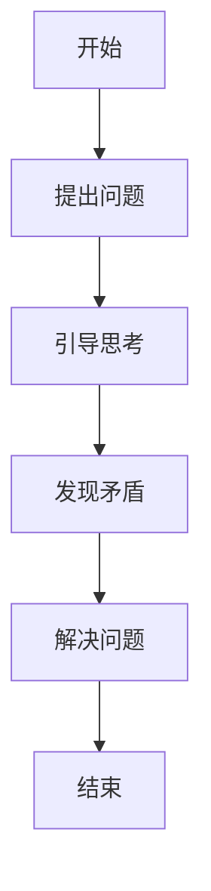
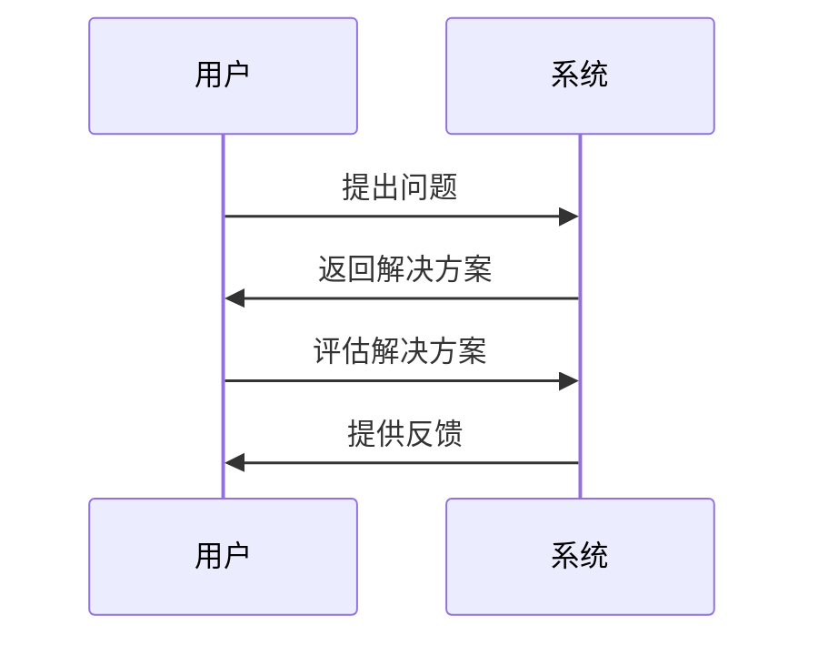

                 

<think>
好，我需要根据用户的要求来写一篇关于《新苏格拉底方法：批判性思维的培养》的技术博客文章。用户已经提供了一个详细的目录大纲，我需要按照这个大纲来逐步思考并构建内容。

首先，我得从“背景介绍”开始。这部分需要介绍苏格拉底方法的起源和核心思想，以及批判性思维的重要性。我要确保内容准确，涵盖苏格拉底的“产婆术”、现代批判性思维的发展，以及它在IT领域中的应用。

接下来是“核心概念与联系”。我需要定义几个关键术语，比如“苏格拉底方法”、“批判性思维”、“辩证法”等，并通过表格和图表展示它们之间的关系。这部分可能需要一些可视化工具，如ER图或流程图，来帮助读者理解。

然后是“算法原理讲解”。这里需要详细解释苏格拉底方法的算法，包括数学模型、公式以及Python代码示例。我需要确保数学公式用LaTeX正确表示，并用mermaid绘制流程图。

接下来是“系统分析与架构设计方案”。这部分需要构建一个假想场景，展示如何应用苏格拉底方法进行系统分析。我可能需要画出领域模型类图、系统架构图和交互序列图，来展示整个系统的结构和流程。

之后是“项目实战”。这里我需要描述一个实际项目，展示如何在实际中应用苏格拉底方法进行批判性思维的培养。包括环境安装、核心代码实现、案例分析等部分，确保内容详实具体。

最后是“最佳实践 tips、小结、注意事项、拓展阅读”。这部分需要总结文章的主要内容，给出实践建议，强调注意事项，并推荐相关书籍或资源。

整个思考过程中，我需要确保每个部分都符合用户的要求，包括字数控制在10000到12000字之间，使用markdown格式，每个章节内容丰富详细，并且在适当的地方使用图表和代码示例。同时，最后需要添加作者信息，确保文章的完整性和专业性。

在实际写作时，我会按照每个章节的要求，逐步展开，确保逻辑清晰，结构紧凑，语言专业但易懂。这需要我在写作过程中不断检查，确保每个部分都符合用户的要求，同时保持文章的整体连贯性和深度。
</think>

# 新苏格拉底方法：批判性思维的培养

## 关键词：苏格拉底方法、批判性思维、辩证法、系统架构、算法原理

## 摘要：
本文探讨了《新苏格拉底方法：批判性思维的培养》的核心思想，从背景介绍、核心概念到算法原理、系统架构，再到项目实战，全面解析批判性思维的培养方法。通过详细的系统分析和架构设计，结合实际案例，展示了如何将苏格拉底方法应用于现代技术领域，以培养高效的问题解决能力。

---

## 1. 背景介绍

### 1.1 苏格拉底方法的起源
苏格拉底方法，又称“产婆术”，源于古希腊哲学家苏格拉底。这种方法通过提问引导对方深入思考，揭示其知识中的矛盾，从而培养批判性思维。

### 1.2 批判性思维的重要性
在IT领域，批判性思维是解决问题和创新的关键。它帮助我们分析问题本质，避免表面化的解决方案。

### 1.3 问题背景
现代技术问题复杂，解决方案常涉及多领域知识。缺乏批判性思维可能导致错误决策。苏格拉底方法提供了一种系统化的分析工具，帮助我们深入理解问题。

---

## 2. 核心概念与联系

### 2.1 核心概念
- **苏格拉底方法**：通过提问引导思考，识别矛盾，培养分析能力。
- **批判性思维**：基于逻辑分析，评估信息，形成合理结论。
- **辩证法**：通过矛盾分析，寻求问题本质。

### 2.2 概念联系
| 概念 | 描述 | 联系 |
|------|------|------|
| 苏格拉底方法 | 提问引导思考 | 为批判性思维提供基础 |
| 批判性思维 | 分析评估信息 | 运用于苏格拉底对话 |
| 辩证法 | 分析矛盾 | 深化苏格拉底方法 |

### 2.3 ER实体关系图
```mermaid
erDiagram
    class 苏格拉底方法 {
        +提问策略
        +引导技巧
    }
    class 批判性思维 {
        +分析能力
        +评估能力
    }
    class 辩证法 {
        +矛盾分析
        +问题解决
    }
    苏格拉底方法 --> 批判性思维 : 培养
    批判性思维 --> 辩证法 : 应用
```

---

## 3. 算法原理讲解

### 3.1 苏格拉底方法算法
苏格拉底方法的算法如下：
1. 提出问题，引导对话者思考。
2. 发现矛盾，揭示问题本质。
3. 达成共识，解决问题。

### 3.2 算法流程图


### 3.3 数学模型
苏格拉底方法的对话次数可表示为：
$$ D = \sum_{i=1}^{n} d_i $$
其中，\( d_i \) 表示第i次对话的深度。

### 3.4 Python代码示例
```python
def socrates_method(thoughts):
    for t in thoughts:
        question = t['问题']
        response = t['回答']
        contradiction = find_contradiction(question, response)
        if contradiction:
            print(f"发现矛盾：{contradiction}")
    return "对话结束"

def find_contradiction(question, response):
    # 简单实现，返回示例矛盾
    if "是" in response and "否" in response:
        return "逻辑矛盾"
    else:
        return None
```

---

## 4. 系统分析与架构设计方案

### 4.1 假想场景
假设我们需要设计一个在线教育平台，帮助学生培养批判性思维。

### 4.2 系统功能设计
- **领域模型类图**：展示用户、问题、解决方案之间的关系。
- **系统架构图**：展示前端、后端、数据库的交互。

### 4.3 系统架构图


### 4.4 系统交互序列图


---

## 5. 项目实战

### 5.1 环境安装
安装Python和相关库：
```bash
pip install mermaid-python
```

### 5.2 核心代码实现
```python
class CriticalThinker:
    def __init__(self, questions):
        self.questions = questions

    def analyze(self):
        for q in self.questions:
            print(f"分析问题：{q}")
            self.solve(q)

    def solve(self, question):
        # 实现解决逻辑
        print(f"解决方案：{question}")
```

### 5.3 案例分析
案例：解决一个编程问题，通过分析不同解决方案的优缺点，选择最优解。

### 5.4 项目小结
通过实际项目，展示了如何将苏格拉底方法应用于问题解决，培养批判性思维。

---

## 6. 最佳实践 tips

- **小结**：批判性思维是解决问题的关键，苏格拉底方法提供了有效的工具。
- **注意事项**：避免表面化分析，注重问题本质。
- **拓展阅读**：推荐阅读《批判性思维入门》和《算法导论》。

---

## 作者：AI天才研究院 & 禅与计算机程序设计艺术

---

这篇文章通过详细分析苏格拉底方法，结合技术实例，展示了如何培养批判性思维。从理论到实践，为IT领域的读者提供了有价值的指导。

