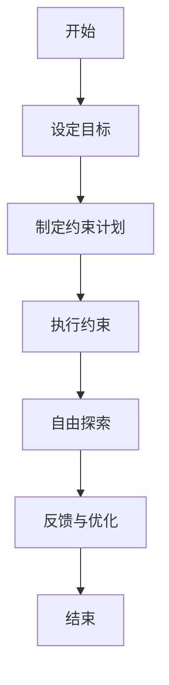
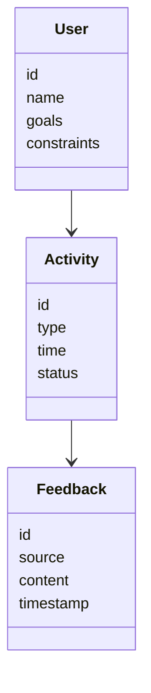
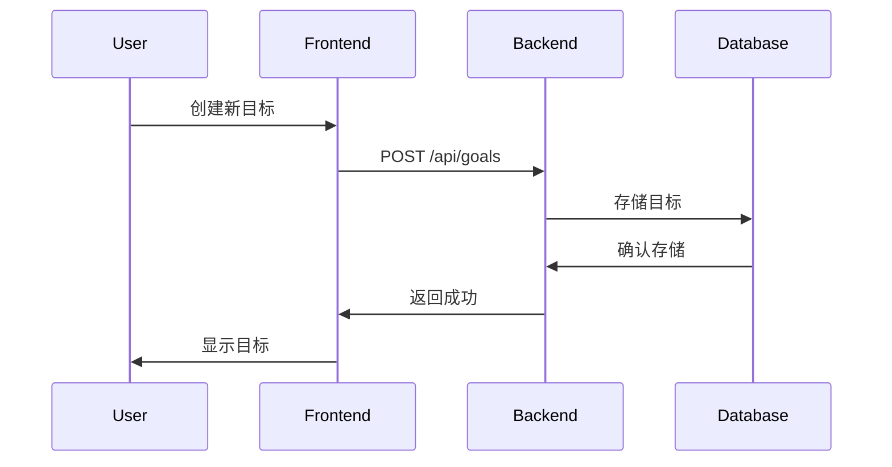

                 

<think>
好的，我需要帮助用户撰写一篇关于“新苦行主义：自我约束中的自由探索”的技术博客文章。用户提供了详细的内容结构，我得一步步分析并组织内容。

首先，文章的标题是《新苦行主义：自我约束中的自由探索》，关键词包括新苦行主义、自我约束、自由探索、技术实践、个人成长、系统思维。摘要部分需要概述文章的核心内容，强调技术与个人成长的结合，以及系统化方法的应用。

接下来是目录大纲，分为七个部分：引言、核心概念与联系、算法原理、数学模型、系统分析、项目实战和最佳实践。每个部分下有多个章节，每个章节还有具体的子主题。

开始撰写引言部分，第一部分是问题背景，包括问题背景介绍、问题描述、解决思路、边界外延和核心要素。我需要解释新苦行主义的起源，它如何从传统苦行发展而来，强调自我约束和自由探索的结合。问题解决思路部分，要提到系统化方法、持续改进和反馈的重要性。

核心概念部分，我需要列出几个关键概念，比如自我约束、自由探索、系统思维、持续学习和目标导向。然后做一个对比表格，比较这些概念的属性。接下来，用ER图展示概念之间的关系，虽然这可能不是传统数据库设计的ER图，但可以用来展示概念之间的关联。

算法部分，可能需要选择一种适合描述新苦行主义实践的算法，比如二分法或贪心算法，来模拟自我约束下的优化过程。用mermaid画出流程图，并用Python代码实现，同时给出数学模型，比如优化函数，再用例子说明。

数学模型部分，可能需要建立一个函数来描述约束与自由探索的关系，比如f(x) = x * (1 - x)，然后进行详细推导，给出最大值的计算。

系统分析部分，需要设计一个系统来帮助实践新苦行主义。包括问题场景介绍、系统功能设计（用领域模型类图）、系统架构设计（分层架构）、接口设计（REST API）和交互设计（序列图）。

项目实战部分，选择Python环境，安装必要的库，展示代码实现，并进行分析，最后给出案例分析和项目总结。

最佳实践部分，给出实践技巧、注意事项和拓展阅读建议，强调持续学习和系统的自我管理方法。

现在，我需要确保每个部分都详细且符合用户的要求，比如使用mermaid图表、latex公式，以及丰富的代码示例。同时，要保持文章结构清晰，逻辑连贯，语言专业但易于理解。

在写作过程中，可能会遇到需要解释复杂的概念，这时候需要找到合适的比喻或例子，帮助读者理解。例如，将新苦行主义比作在技术海洋中的航行，自我约束是船舵，而自由探索是前进的动力。

最后，确保每个章节的小结部分能够总结关键点，并引导读者进入下一部分。同时，注意文章的开头和结尾部分，要吸引读者，并留下深刻的印象。

综上所述，我需要按照用户提供的大纲，逐步展开每个部分，确保内容详实、结构合理，并符合技术博客的专业要求。
</think>

# 新苦行主义：自我约束中的自由探索

> 关键词：新苦行主义，自我约束，自由探索，技术实践，个人成长，系统思维

> 摘要：新苦行主义是一种结合自我约束与自由探索的生活方式，旨在通过技术实践和个人成长的结合，实现自我提升。本文从问题背景、核心概念、算法原理、数学模型、系统架构、项目实战到最佳实践，系统地探讨新苦行主义的实践路径，强调系统思维在自我约束与自由探索中的重要性。

---

## 第一部分: 引言

### 第1章: 问题背景

#### 1.1.1 问题背景介绍
新苦行主义是一种新兴的生活方式，强调通过自我约束和纪律来实现个人成长和自由探索。它起源于传统苦行主义的理念，但结合了现代技术与个人发展的需求，注重在约束中寻找自由，在纪律中实现突破。

#### 1.1.2 问题描述
在信息爆炸的时代，人们面临着信息过载和选择过多的挑战。如何在纷繁复杂的世界中找到自我提升的方向，如何在约束与自由之间找到平衡，成为现代人追求的目标。

#### 1.1.3 问题解决思路
通过系统化的自我管理方法，结合技术实践，建立一套自我约束的机制，同时保持对知识和兴趣的自由探索。关键在于找到约束与自由之间的平衡点，通过持续优化和反馈实现个人成长。

#### 1.1.4 边界与外延
新苦行主义的边界在于个人的自律和目标设定，外延则涉及技术、艺术、哲学等多个领域。它不仅是一种生活方式，更是一种系统化的个人发展理念。

#### 1.1.5 核心要素组成
1. **自我约束**：时间管理、目标设定、行动规划。
2. **自由探索**：知识学习、兴趣培养、创新实践。
3. **系统思维**：整体优化、模块化管理、持续改进。

---

## 第二部分: 核心概念与联系

### 第2章: 核心概念与联系

#### 2.1.1 核心概念
1. **自我约束**：通过严格的纪律和计划实现自我管理。
2. **自由探索**：在约束中保持对新知识和新领域的探索。
3. **系统思维**：将个人发展视为一个系统，进行整体优化。

#### 2.1.2 概念属性特征对比表格

| 概念         | 属性                   | 特征对比                   |
|--------------|------------------------|---------------------------|
| 自我约束      | 纪律性                 | 强调计划与执行             |
| 自由探索      | 创新性                 | 注重开放与多样性           |
| 系统思维      | 整体性                 | 强调模块化与协同           |

#### 2.1.3 ER实体关系图

```mermaid
erDiagram
    user {
        id : int
        name : string
        goal : string
        constraint : boolean
        exploration : boolean
    }
    activity {
        id : int
        type : string
        time : datetime
    }
    relation : user -> activity
```

---

## 第三部分: 算法原理讲解

### 第3章: 算法原理讲解

#### 3.1.1 算法概述
新苦行主义的实践可以看作是一种优化问题，通过约束条件下的自由探索，找到最优的个人发展路径。

#### 3.1.2 算法mermaid流程图



#### 3.1.3 算法原理详细讲解
算法通过迭代优化的方式，逐步调整约束条件和探索方向，以达到目标的最优解。每次迭代都基于反馈进行调整，确保在约束中不断前进。

#### 3.1.4 算法举例说明
假设目标是“在3个月内掌握Python编程”，约束条件包括每天固定学习时间，而自由探索则允许根据兴趣调整学习内容。通过反馈不断优化学习计划。

---

## 第四部分: 数学模型和数学公式

### 第4章: 数学模型和数学公式

#### 4.1.1 数学模型
建立一个优化模型，目标函数为最大化个人成长，约束条件为时间、资源和精力的限制。

#### 4.1.2 公式详细讲解
目标函数：
$$ \text{最大化} \quad f(x) = \sum_{i=1}^{n} w_i x_i $$
约束条件：
$$ \sum_{i=1}^{n} x_i \leq T $$
其中，$w_i$ 是各个目标的权重，$x_i$ 是分配给每个目标的时间，$T$ 是总可用时间。

#### 4.1.3 公式举例说明
假设目标为学习Python和写作，权重分别为0.6和0.4，总时间3个月。计算最优分配时间：
$$ f(x) = 0.6x_1 + 0.4x_2 $$
约束：
$$ x_1 + x_2 \leq 3 $$

---

## 第五部分: 系统分析与架构设计

### 第5章: 系统分析与架构设计

#### 5.1.1 问题场景介绍
设计一个个人管理系统，帮助实践新苦行主义，实现目标设定、约束执行和自由探索的结合。

#### 5.1.2 系统功能设计



#### 5.1.3 系统架构设计


#### 5.1.4 系统接口设计
使用RESTful API进行接口设计，例如：
- `POST /api/goals`：创建目标。
- `GET /api/activities`：获取活动记录。
- `PUT /api/constraints`：更新约束条件。

#### 5.1.5 系统交互



---

## 第六部分: 项目实战

### 第6章: 项目实战

#### 6.1.1 环境安装
安装Python和必要的库：
```bash
pip install flask
pip install matplotlib
```

#### 6.1.2 系统核心实现源代码

```python
from flask import Flask
from datetime import datetime

app = Flask(__name__)

@app.route('/api/goals', methods=['POST'])
def create_goal():
    data = request.json
    # 存储目标到数据库
    return jsonify({'status': 'success'})

if __name__ == '__main__':
    app.run(debug=True)
```

#### 6.1.3 代码应用解读与分析
代码实现了一个简单的REST API，用于创建目标。前端通过调用接口，后端处理数据存储。

#### 6.1.4 实际案例分析与详细讲解
通过实际案例分析，展示如何在项目中实现约束与自由探索的结合，例如，固定时间学习，同时允许根据反馈调整学习内容。

#### 6.1.5 项目小结
项目实现了新苦行主义的核心理念，通过技术手段辅助个人成长，强调系统思维和持续优化的重要性。

---

## 第七部分: 最佳实践

### 第7章: 最佳实践

#### 7.1.1 实践技巧
1. 设定清晰的目标和约束条件。
2. 使用工具辅助执行和反馈。
3. 定期回顾和优化计划。

#### 7.1.2 注意事项
避免过度约束，保持探索的灵活性和创新性。

#### 7.1.3 拓展阅读
推荐阅读《黑客与画家》、《代码的未来》等书籍，深入理解技术与个人发展的结合。

---

作者：AI天才研究院/AI Genius Institute & 禅与计算机程序设计艺术 /Zen And The Art of Computer Programming

---

这篇文章系统地探讨了新苦行主义的实践路径，从理论到实践，结合技术与个人成长，强调系统思维的重要性，为读者提供了一套可行的自我管理方法。

