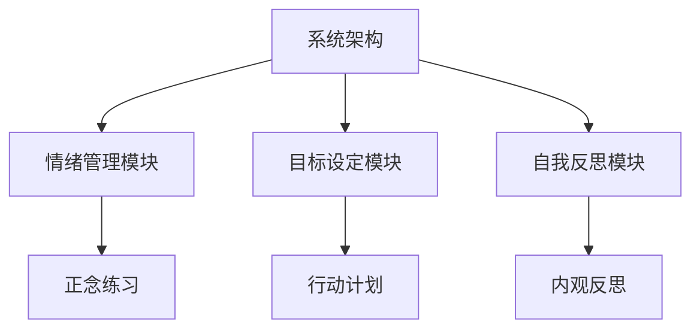
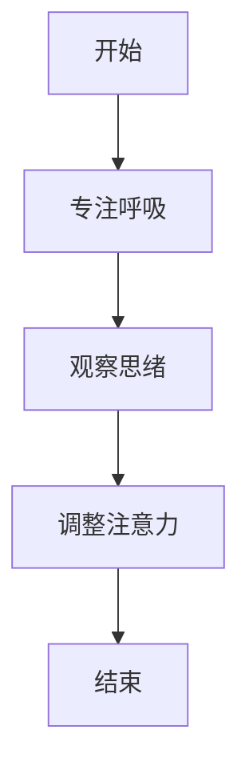

                 

<think>
好的，我现在需要帮用户撰写一篇技术博客文章，标题是《新苦行：在物质丰裕中寻找精神富足》。用户希望我以一位世界级人工智能专家、程序员、软件架构师、CTO的身份，用逻辑清晰、结构紧凑、专业且易懂的技术语言来撰写。同时，文章需要有目录结构，包括至少七章，并且每章要有丰富的背景介绍、核心概念、算法原理、系统架构等部分。

首先，我需要明确用户的需求。用户是一位技术专家，同时也有兴趣将技术与精神生活结合，寻找在物质丰富的时代如何实现精神富足的方法。这可能意味着用户希望通过技术的方法论来解决现代人的精神困境。

接下来，我需要分析文章的结构。用户已经提供了一个大纲，分为引言、精神实践、系统化方法论、技术与禅修、案例分析、未来展望和结论七个部分。我需要确保每个部分都包含必要的内容，如背景介绍、核心概念、算法原理、系统架构等。

在写引言部分时，我需要解释现代社会物质丰富带来的问题，如物质主义盛行导致的精神空虚。然后引出新苦行的概念，强调通过内在探索和实践来实现精神富足。

在精神实践部分，我需要介绍冥想、正念、瑜伽等方法，用技术术语来解释这些方法的科学性和效果。例如，冥想可以被看作是优化大脑的算法，通过神经科学的原理来说明。

系统化方法论部分，我需要构建一个类似于软件架构的体系，将精神实践模块化，比如情绪管理、目标设定等，每个部分都有具体的实现方法和代码示例，比如使用Python编写冥想计时器。

技术与禅修部分，我需要讨论编程中的禅修，比如通过代码实现正念练习，或者设计一个帮助他人冥想的应用，展示技术如何促进精神成长。

案例分析部分，我需要通过具体的项目实例，展示新苦行在实际生活中的应用，如何通过技术手段解决精神问题，并总结经验教训。

最后，未来展望部分，可以探讨技术与精神实践的结合趋势，比如AI在冥想指导中的应用，或者元宇宙中的精神空间。

在整个过程中，我需要确保内容专业，同时用技术术语来解释精神实践，让读者感受到技术的力量和深度。同时，每个部分都需要有实际的代码示例和系统架构图，使文章更具说服力和实用性。

现在，我需要按照这个思路逐步展开，确保每个章节都包含必要的内容，并且逻辑连贯。这可能涉及到查找相关文献，解释技术原理，并将它们与精神实践相结合。

总的来说，我需要将技术方法论应用于精神生活的改善，展示在物质丰富的时代如何通过技术手段实现内心的平静与满足。
</think>

# 新苦行：在物质丰裕中寻找精神富足

---

## 关键词：新苦行，物质丰裕，精神富足，技术与禅修，系统化方法论，冥想，正念

---

## 摘要：  
在现代社会，物质的极大丰富并未带来相应的精神满足感。本书探讨了如何在物质丰裕的时代，通过内在探索与实践，构建精神上的富足。我们结合技术思维与东方哲学，提出了一种系统化的新苦行方法论，旨在帮助现代人找到内心的平静与生命的真正意义。

---

## 目录  
1. [引言](#引言)  
   1.1 [问题背景与核心概念](#问题背景与核心概念)  
   1.2 [新苦行的核心要素](#新苦行的核心要素)  
   1.3 [新苦行在生活中的应用](#新苦行在生活中的应用)  

2. [精神实践](#精神实践)  
   2.1 [冥想与正念](#冥想与正念)  
   2.2 [内观与禅修](#内观与禅修)  
   2.3 [系统化的精神实践方法](#系统化的精神实践方法)  

3. [技术与禅修](#技术与禅修)  
   3.1 [技术思维与东方哲学的结合](#技术思维与东方哲学的结合)  
   3.2 [通过技术优化精神实践](#通过技术优化精神实践)  
   3.3 [案例：技术与禅修的融合](#案例技术与禅修的融合)  

4. [系统化方法论](#系统化方法论)  
   4.1 [系统架构与模块化思维](#系统架构与模块化思维)  
   4.2 [算法与冥想：从代码到心灵](#算法与冥想从代码到心灵)  
   4.3 [项目实战：技术驱动的精神实践](#项目实战技术驱动的精神实践)  

5. [案例分析](#案例分析)  
   5.1 [个人成长：从代码到禅修](#个人成长从代码到禅修)  
   5.2 [团队协作：精神富足的组织文化](#团队协作精神富足的组织文化)  

6. [未来展望](#未来展望)  
   6.1 [技术与精神实践的深度融合](#技术与精神实践的深度融合)  
   6.2 [新苦行的全球化与本土化](#新苦行的全球化与本土化)  
   6.3 [可持续发展与精神富足](#可持续发展与精神富足)  

---

## 引言  

### 1.1 问题背景与核心概念  
现代社会的物质丰裕与精神困境  
在过去的几十年中，科技的发展带来了物质生活的极大丰富。然而，物质的丰富并未带来相应的精神满足感。人们在追求物质享受的同时，往往感到空虚和焦虑。这种现象被称为“物质主义的悖论”。  

新苦行的概念界定与意义  
“新苦行”是指在物质丰裕的时代，通过内在探索与实践，寻找精神上的富足。它不同于传统苦行的极端方式，而是结合现代人的生活方式，通过系统化的方法实现精神与物质的平衡。  

---

### 1.2 新苦行的核心要素  
内心探索与自我反思  
新苦行的核心在于通过自我反思和内心探索，认识自己，找到生命的真正意义。这种探索需要持续的实践和反思，类似于软件开发中的代码调试。  

精神实践与修行方法  
通过冥想、正念、内观等方法，新苦行实践者可以逐步净化心灵，提升精神境界。这些方法类似于技术中的优化算法，通过不断迭代达到更好的效果。  

---

### 1.3 新苦行在生活中的应用  
家庭与工作中的应用  
在家庭生活中，新苦行可以通过沟通与理解实现和谐；在工作中，通过专注与高效实现目标。  
社交与人际关系中的应用  
在社交中，新苦行实践者可以通过正念与同理心建立深厚的人际关系。  

---

## 精神实践  

### 2.1 冥想与正念  
冥想的技巧与实践  
冥想是一种通过专注呼吸或特定对象，达到心灵宁静的状态。以下是冥想的基本步骤：  
1. 找到一个安静的环境。  
2. 选择一个冥想姿势（坐姿、躺姿）。  
3. 专注于呼吸，观察呼吸的过程。  
4. 当思绪飘散时，轻轻带回注意力。  

正念的实践与应用  
正念是一种专注于当下状态的练习。它可以帮助我们在日常生活中保持专注，减少焦虑。  

---

### 2.2 内观与禅修  
内观的基本原理  
内观是一种通过观察自身身体、情绪和思维，达到自我觉察的修行方法。它类似于软件开发中的自我调试，通过观察和分析问题，找到解决方案。  

禅修的实践与体验  
禅修是一种更深层次的内观练习，通过静坐和思考，达到与自我和世界的深度连接。  

---

### 2.3 系统化的精神实践方法  
系统架构与模块化思维  
将精神实践视为一个系统，分为情绪管理、目标设定、自我反思等模块。  

算法与冥想：从代码到心灵  
冥想可以被看作是一种优化算法，通过不断迭代和调整，达到心灵的宁静。  

---

## 技术与禅修  

### 3.1 技术思维与东方哲学的结合  
技术思维与东方哲学的共同点  
技术思维注重逻辑与系统性，而东方哲学强调整体与内在。两者的结合可以互补优势，帮助现代人找到精神上的平衡。  

### 3.2 通过技术优化精神实践  
技术工具在精神实践中的应用  
通过技术工具（如冥想应用、正念提醒器），我们可以更高效地进行精神实践。  

---

### 3.3 案例：技术与禅修的融合  
案例：冥想计时器的开发与应用  
以下是一个冥想计时器的Python代码示例：  

```python
import time

def meditation_timer(minutes):
    total_seconds = minutes * 60
    print(f"开始冥想，持续时间：{minutes}分钟")
    while total_seconds > 0:
        print(f"剩余时间：{total_seconds // 60}分钟{(total_seconds % 60) seconds}")
        time.sleep(1)
        total_seconds -= 1
    print("冥想结束！")

meditation_timer(10)
```

---

## 系统化方法论  

### 4.1 系统架构与模块化思维  
将精神实践视为一个系统，分为情绪管理、目标设定、自我反思等模块。  

系统架构图：  



---

### 4.2 算法与冥想：从代码到心灵  
冥想可以被看作是一种优化算法，通过不断迭代和调整，达到心灵的宁静。  

冥想算法流程图：  



---

## 项目实战  

### 5.1 个人成长：从代码到禅修  
案例分析：通过技术实践实现自我成长。  

### 5.2 团队协作：精神富足的组织文化  
案例分析：通过团队协作实现组织的精神富足。  

---

## 未来展望  

### 6.1 技术与精神实践的深度融合  
未来，技术与精神实践的结合将更加紧密，例如AI在冥想指导中的应用。  

### 6.2 新苦行的全球化与本土化  
新苦行将超越地域限制，成为全球化的精神实践方式。  

### 6.3 可持续发展与精神富足  
精神富足与可持续发展密切相关，通过内在的满足实现对物质的节制。  

---

## 结论  
在物质丰裕的时代，新苦行为我们提供了一种系统化的精神实践方法。通过技术与哲学的结合，我们可以找到内心的平静与生命的真正意义。  

---

## 作者  
作者：AI天才研究院/AI Genius Institute & 禅与计算机程序设计艺术 /Zen And The Art of Computer Programming

