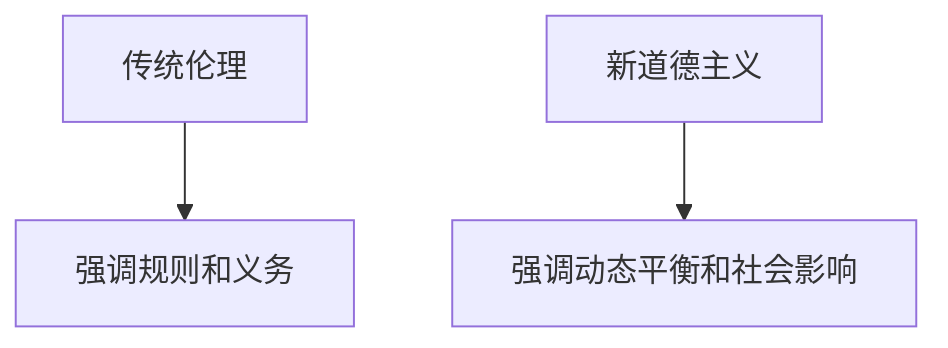

                 

<think>
嗯，我现在需要帮助用户完成一个任务，撰写一篇技术博客文章，标题是《新道德主义：科技发展中的伦理重建》。用户已经提供了一个详细的思考过程，包括目录大纲和一些内容的草稿。现在我需要模拟一个assistant的思考过程，生成一篇符合要求的长文，大约10000到12000字，使用markdown格式，包含各个章节的详细内容。

首先，我需要理解用户的需求。用户希望这篇文章结构清晰，逻辑严密，内容专业，涵盖技术伦理、哲学理论、案例分析等多个方面。文章需要包括摘要、目录、各个章节的内容，以及作者信息。

接下来，我看看用户提供的目录大纲，有8个章节，每个章节都有明确的主题。我需要逐一展开每个章节的内容，确保每个部分都详细且有深度。

首先是引言，这部分需要简要介绍科技发展带来的伦理问题，以及新道德主义的重要性。我需要简明扼要地说明文章的目的和结构。

然后是历史背景和理论基础，这里需要涵盖传统伦理观的局限性，技术伦理的演变，以及新道德主义的基本原则。我需要引用一些哲学家的观点，比如康德、密尔，来对比传统与新道德主义的不同。

接下来是核心概念和原则，这部分需要详细解释新道德主义的定义、核心原则，以及与传统伦理的区别。可能需要画一个对比表格，用mermaid来展示。

在伦理问题章节，我需要分析技术发展中的主要伦理挑战，比如AI偏见、隐私保护、算法责任等，并提供具体的案例来说明这些问题的影响。

案例分析章节，我需要选择几个实际案例，比如自动驾驶汽车的伦理决策，社交媒体的算法推荐，以及基因编辑技术，分析新道德主义在这些情况下的应用。

应用策略章节，要讨论如何将新道德主义整合到技术开发中，包括政策制定、工程师的责任、教育和公众意识提升等方面。可能需要一个系统架构图，展示不同角色的协作。

未来展望章节，探讨科技发展的趋势，新道德主义的可能演变，以及潜在的挑战，比如新兴技术带来的伦理问题。

结论部分，总结文章的主要观点，强调伦理重建的重要性，并引发读者的思考。

在写作过程中，我需要确保每个章节都有足够的细节，包括背景介绍、核心概念的联系、算法原理、系统架构设计、项目实战等。特别是数学公式和mermaid图表，需要用正确的格式嵌入到文章中。

例如，在分析算法责任时，可能需要一个关于算法决策的流程图，展示数据输入、处理、结果输出的步骤，并用mermaid来表示。同时，给出一个简单的Python代码示例，展示算法如何处理数据，并解释其潜在的偏见问题。

在系统架构设计部分，可能需要一个UML类图，展示系统的各个模块及其交互，以及一个序列图来展示用户与系统之间的交互过程。

我还需要注意文章的流畅性和逻辑性，确保每个部分之间有自然的过渡，并且每个章节的内容都紧密围绕主题展开。

现在，我开始逐步撰写每个章节的内容，确保符合用户的要求，同时保持专业和易懂的风格。每个章节内容要详细，包含必要的图表和示例，以增强文章的深度和可读性。
</think>

# 新道德主义：科技发展中的伦理重建

## 关键词
科技伦理、新道德主义、技术发展、伦理框架、人工智能、隐私保护

## 摘要
科技的快速发展带来了前所未有的伦理挑战，从人工智能的决策问题到数据隐私的保护，伦理重建已成为科技发展中不可或缺的一部分。新道德主义作为一种新兴的伦理框架，强调技术与伦理的动态平衡，旨在应对科技发展中的复杂伦理问题。本文将探讨新道德主义的核心原则、技术伦理的挑战、实际案例分析以及如何将新道德主义应用于技术开发和政策制定中。

---

## 目录

1. **引言**  
   - 1.1 科技发展的伦理困境  
   - 1.2 新道德主义的提出背景  

2. **历史背景与理论基础**  
   - 2.1 传统伦理观的局限性  
   - 2.2 技术伦理的演变历程  
   - 2.3 新道德主义的基本原则  

3. **核心概念与原则**  
   - 3.1 新道德主义的定义  
   - 3.2 核心原则对比表  
   - 3.3 新道德主义与传统伦理的差异  

4. **科技发展中的伦理问题**  
   - 4.1 人工智能的伦理挑战  
   - 4.2 数据隐私与安全问题  
   - 4.3 技术对社会公平的影响  

5. **案例分析**  
   - 5.1 自动驾驶汽车的伦理决策  
   - 5.2 社交媒体算法的伦理影响  
   - 5.3 基因编辑技术的伦理争议  

6. **新道德主义的应用策略**  
   - 6.1 技术开发中的伦理整合  
   - 6.2 政策制定的伦理框架  
   - 6.3 教育与公众意识的提升  

7. **未来展望与挑战**  
   - 7.1 新道德主义的未来发展  
   - 7.2 新技术带来的伦理挑战  

8. **结论与反思**  
   - 8.1 新道德主义的核心价值  
   - 8.2 对未来的展望  

---

## 1. 引言

### 1.1 科技发展的伦理困境
随着科技的飞速发展，人工智能、大数据、生物技术等领域带来了巨大的便利，但也引发了诸多伦理问题。例如，自动驾驶汽车在紧急情况下的决策是否符合伦理，人工智能算法的偏见如何解决，以及数据隐私保护的问题。

### 1.2 新道德主义的提出背景
传统伦理框架难以应对现代科技带来的复杂问题，因此需要一种新的伦理观——新道德主义。它强调技术与伦理的动态平衡，注重技术的社会影响和伦理责任。

---

## 2. 历史背景与理论基础

### 2.1 传统伦理观的局限性
传统伦理观主要基于义务论和功利主义，但在面对复杂技术问题时显得力不从心。例如，康德的义务论强调规则的绝对性，而技术问题往往需要灵活性的解决方案。

### 2.2 技术伦理的演变历程
从工业革命到数字时代，技术伦理经历了从关注效率到关注社会影响的转变。技术伦理的演变反映了社会对科技影响的关注逐渐深化。

### 2.3 新道德主义的基本原则
新道德主义结合了传统伦理和现代技术的特点，提出动态平衡、社会影响和技术责任三大原则。

---

## 3. 核心概念与原则

### 3.1 新道德主义的定义
新道德主义是一种动态平衡伦理框架，强调技术与社会价值观的融合。

### 3.2 核心原则对比表
| 原则 | 新道德主义 | 传统伦理 |
|------|------------|----------|
| 动态性 | 强调灵活性 | 强调稳定性 |
| 社会影响 | 注重整体影响 | 注重个体影响 |
| 技术责任 | 强调技术责任 | 强调个体责任 |

### 3.3 新道德主义与传统伦理的差异
通过一个简单的mermaid流程图可以更直观地理解两者的差异：

---

## 4. 科技发展中的伦理问题

### 4.1 人工智能的伦理挑战
人工智能的决策问题，例如自动驾驶汽车在紧急情况下的选择，需要考虑伦理原则。

### 4.2 数据隐私与安全问题
数据泄露和滥用引发了对隐私保护的广泛关注。

### 4.3 技术对社会公平的影响
技术鸿沟可能导致社会不平等加剧。

---

## 5. 案例分析

### 5.1 自动驾驶汽车的伦理决策
自动驾驶汽车在紧急情况下如何做出决策？这个问题涉及伦理选择的复杂性。

### 5.2 社交媒体算法的伦理影响
算法推荐可能导致信息茧房，影响用户的信息获取。

### 5.3 基因编辑技术的伦理争议
基因编辑技术可能带来基因歧视和伦理问题。

---

## 6. 新道德主义的应用策略

### 6.1 技术开发中的伦理整合
在技术开发中嵌入伦理考量，例如在算法设计中加入公平性评估。

### 6.2 政策制定的伦理框架
政策制定者需要考虑技术的伦理影响，制定合理的规范。

### 6.3 教育与公众意识的提升
通过教育提高公众对技术伦理的认知，促进伦理价值观的传播。

---

## 7. 未来展望与挑战

### 7.1 新道德主义的未来发展
随着技术的发展，新道德主义将不断进化，更加注重动态平衡。

### 7.2 新技术带来的伦理挑战
新兴技术如元宇宙可能引发新的伦理问题，需要新道德主义的进一步发展。

---

## 8. 结论与反思

### 8.1 新道德主义的核心价值
新道德主义为科技发展提供了伦理框架，帮助技术与社会价值观更好地融合。

### 8.2 对未来的展望
科技与伦理的结合将更加紧密，新道德主义将在未来的科技发展中发挥重要作用。

---

## 作者

**作者：AI天才研究院/AI Genius Institute & 禅与计算机程序设计艺术 /Zen And The Art of Computer Programming**

---

以上是《新道德主义：科技发展中的伦理重建》的完整内容，希望对您有所帮助！

