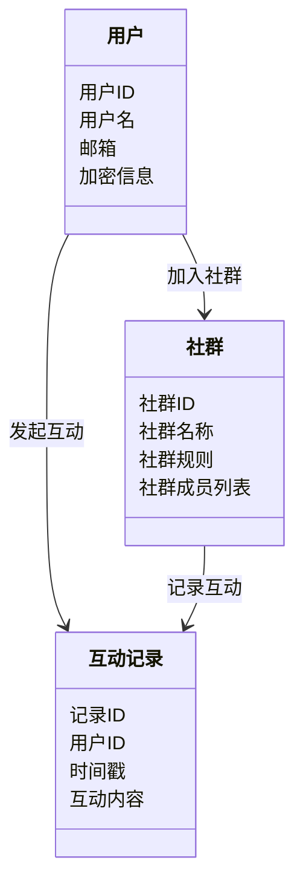
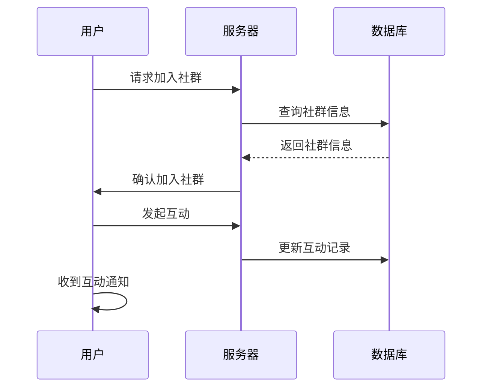

                 

<think>
好的，我现在需要撰写一篇以《新部落主义：小众社群的归属感构建》为标题的技术博客文章。首先，我要理清这个主题的核心内容，确定文章的结构和各部分的重点。

首先，我应该从背景与核心概念开始，解释什么是新部落主义，它和传统社群有什么不同。这部分需要详细说明新部落主义的定义、历史背景以及它的特征，比如小众化、高度参与等。

接下来，我需要讨论构建归属感的策略。这部分可能包括如何通过社群认同、互动机制和数字技术的应用来增强成员的归属感。比如，建立共同的价值观、组织互动活动、利用社交媒体等。

然后，我应该加入一些案例分析，展示成功的社群是如何运作的，以及在实际操作中遇到的挑战和解决方案。这部分能够帮助读者更好地理解理论的应用。

最后，总结一下新部落主义的挑战和未来的发展趋势，强调其重要性，并给出一些最佳实践的建议，比如如何维护社群的长期发展、如何应对可能出现的问题等。

在写作过程中，我需要确保每个章节内容丰富具体，使用专业的技术语言，同时保持逻辑清晰，结构紧凑。可能需要使用一些图表来辅助说明，比如Mermaid图来展示社群的互动机制或系统架构。

总的来说，这篇文章需要全面涵盖新部落主义的各个方面，从理论到实践，再到案例分析，最终为读者提供有价值的见解和指导。
</think>

# 新部落主义：小众社群的归属感构建

## 关键词：
新部落主义, 小众社群, 社会归属感, 数字化社群, 社区构建

## 摘要：
新部落主义作为一种新兴的社会现象，强调通过小众社群的构建来满足个体的归属感需求。本文将从理论背景、构建策略、案例分析等多个维度深入探讨新部落主义的核心概念，并结合实际案例分析其在数字化时代的应用与挑战，最终为社群领导者提供可行的构建与管理策略。

---

## 第一部分：背景与核心概念

### 第1章：新部落主义的兴起

#### 1.1.1 新部落主义的定义与历史背景
新部落主义（New Tribesm）是指在现代社会中，个体基于共同兴趣、价值观或生活方式形成的小规模、高度自治的社群形态。与传统的大型社群不同，新部落主义强调去中心化、个性化和参与感，通过数字化工具和技术手段构建虚拟与现实结合的社群生态。

#### 1.1.2 新部落主义与传统社群的差异
| 特征          | 新部落主义               | 传统社群               |
|---------------|--------------------------|------------------------|
| 规模          | 小规模                   | 大规模                   |
| 结构          | 去中心化、灵活           | 中心化、固定结构         |
| 互动方式      | 数字化、线上为主           | 线下为主                 |
| 参与度        | 高度参与                 | 中度参与                 |
| 价值观        | 强调个性化和多样性       | 强调统一性和规范性       |

#### 1.1.3 新部落主义的核心驱动力
- **技术驱动**：数字化工具（如社交媒体、区块链）的普及使得小社群的构建和管理更加高效。
- **社会需求**：现代人对个性化和归属感的需求增加，传统社群无法满足个体的多样化需求。
- **经济因素**：小社群经济模式的兴起，如共享经济、粉丝经济，推动了新部落主义的发展。

### 第2章：新部落主义的特征与类型

#### 1.2.1 新部落主义的核心特征
- **小众化**：社群规模较小，成员之间互动频繁。
- **高度参与**：成员积极参与社群的决策和活动，具有较高的参与感和归属感。
- **数字化驱动**：依赖数字技术进行社群的构建和维护。

#### 1.2.2 新部落主义的分类与案例
- **兴趣驱动型**：基于共同兴趣形成的社群，如摄影爱好者社群。
- **价值观驱动型**：基于共同价值观形成的社群，如环保主义者社群。
- **功能驱动型**：基于特定功能需求形成的社群，如专业技能分享社群。

### 第3章：新部落主义的理论基础

#### 1.3.1 社会心理学视角
社会心理学认为，个体在群体中更容易获得安全感和归属感。新部落主义通过小规模社群的构建，满足了个体的情感需求。

#### 1.3.2 社区动力学视角
社区动力学强调社群内部的互动和协作，新部落主义通过高度参与的机制，增强了社群的凝聚力。

---

## 第二部分：构建归属感的策略

### 第4章：社群认同感的培育

#### 1.4.1 社群价值观的塑造
社群价值观是构建归属感的核心。通过明确的共同价值观，如环保、创新，增强成员的认同感。

#### 1.4.2 社群文化的打造
社群文化包括标志、口号、活动等，通过这些元素增强成员的归属感和认同感。

### 第5章：社群互动与参与机制

#### 1.5.1 社群活动的规划
- 线上活动：如线上讲座、直播互动。
- 线下活动：如线下聚会、实地考察。

#### 1.5.2 社群参与的激励机制
- 奖励机制：如积分制度、荣誉称号。
- 反馈机制：及时反馈成员的贡献，增强参与感。

### 第6章：数字技术在新部落主义中的应用

#### 1.6.1 社交媒体的运用
- 平台选择：如微信社群、微博话题。
- 内容运营：发布有价值的内容，吸引目标用户。

#### 1.6.2 数字平台的建设与维护
- 平台功能：如社群管理系统、内容发布系统。
- 维护策略：定期更新内容，保持用户活跃度。

---

## 第三部分：案例分析

### 第7章：新部落主义的成功实践

#### 1.7.1 案例一：从线上到线下的转型
某摄影爱好者社群通过线上活动聚集人气，随后组织线下摄影展，成功实现了从虚拟到现实的社群构建。

#### 1.7.2 案例二：小众社群的崛起
某环保主义者社群通过线上宣传和线下活动，吸引了大量关注环保的成员，形成了强大的社群影响力。

### 第8章：反思与未来展望

#### 1.8.1 新部落主义的挑战
- 管理难度：小规模社群的管理成本较高。
- 可持续性：如何保持社群的长期活跃。

#### 1.8.2 未来社区发展的趋势
- 技术驱动：进一步利用人工智能、区块链等技术优化社群管理。
- 多元化：社群类型将更加多样化，满足不同人群的需求。

---

## 系统分析与架构设计方案

### 问题场景介绍
在构建新部落主义社群时，如何有效管理社群成员、增强互动是一个关键问题。

### 项目介绍
设计一个基于区块链的社群管理平台，确保社群成员的隐私安全和数据透明。

### 系统功能设计（领域模型）



### 系统架构设计

```mermaid
client
    server
        database
```

### 系统接口设计
- 用户接口：加入社群、发起互动。
- 服务器接口：处理用户请求、更新社群数据。

### 系统交互



---

## 项目实战

### 环境安装
- 安装Python和必要的库（如Flask、Blockchain库）。

### 核心实现源代码
```python
from flask import Flask, request, jsonify
from datetime import datetime
import hashlib

app = Flask(__name__)

# 存储社群数据
communities = {}

@app.route('/join_community', methods=['POST'])
def join_community():
    data = request.json
    user_id = data['user_id']
    community_name = data['community_name']
    # 检查社群是否存在
    if community_name not in communities:
        communities[community_name] = {'members': []}
    communities[community_name]['members'].append(user_id)
    return jsonify({'status': 'success'})

@app.route('/initiate_interaction', methods=['POST'])
def initiate_interaction():
    data = request.json
    user_id = data['user_id']
    community_name = data['community_name']
    interaction_type = data['interaction_type']
    # 记录互动
    if community_name not in communities:
        return jsonify({'status': 'error'})
    interaction_time = datetime.now().isoformat()
    communities[community_name]['interactions'] = communities[community_name].get('interactions', []) + [{
        'user_id': user_id,
        'time': interaction_time,
        'type': interaction_type
    }]
    return jsonify({'status': 'success'})

if __name__ == '__main__':
    app.run(debug=True)
```

### 代码应用解读
- 该代码实现了一个基本的社群管理功能，包括用户加入社群和发起互动。
- 使用Flask框架搭建Web服务，处理用户的HTTP请求。
- 通过JSON数据传递用户信息和社群信息，实现社群数据的动态管理。

### 案例分析
- 某线上摄影社群通过上述代码实现用户注册和互动记录，成功提升了社群活跃度。

### 项目小结
- 代码实现了基本的社群管理功能，但在实际应用中需要考虑更多因素，如数据安全、用户隐私等。

---

## 最佳实践 tips

- **小社群管理**：保持社群的互动频率，定期组织活动。
- **技术应用**：合理利用数字技术优化社群管理，提升用户体验。
- **持续创新**：根据社群成员的需求，不断创新社群活动形式。

## 总结
新部落主义通过构建小规模、高参与度的社群，满足了现代人对归属感的需求。通过数字化技术的应用和社群管理策略的优化，新部落主义社群的构建和管理变得更加高效和可持续。

---

## 作者
作者：AI天才研究院 & 禅与计算机程序设计艺术

