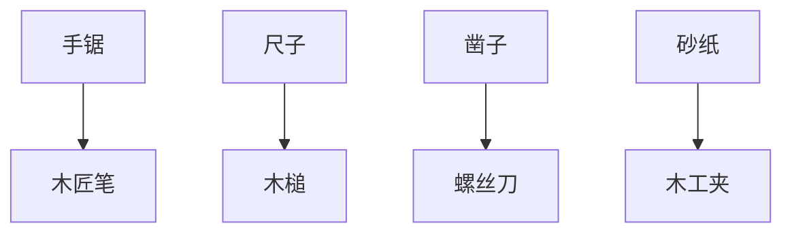
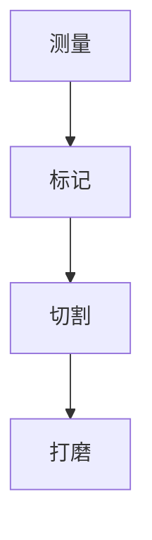
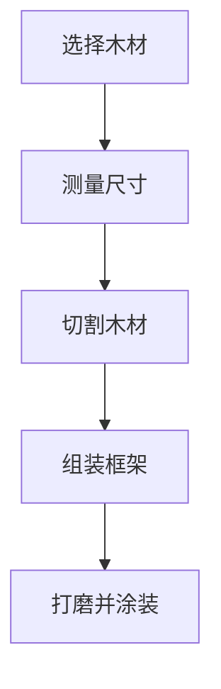
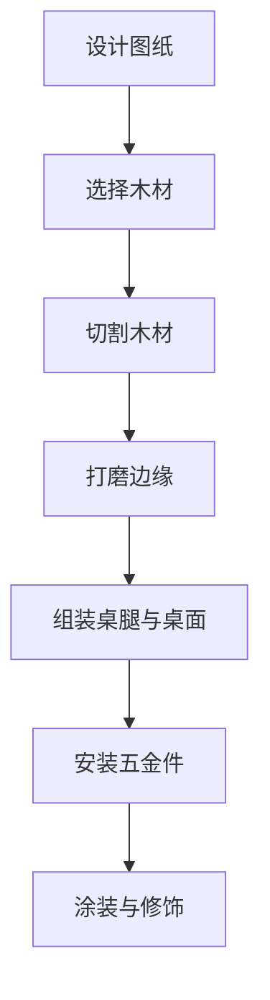
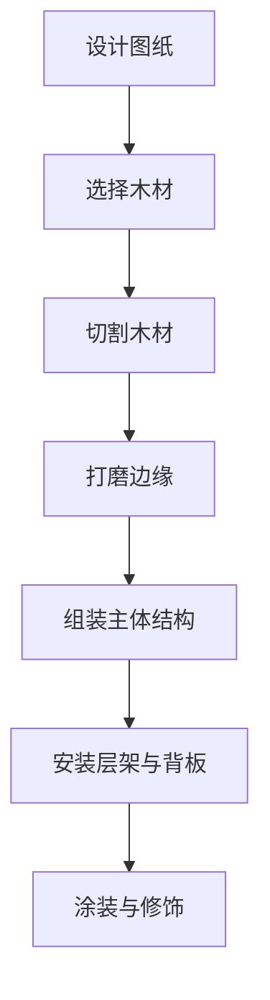
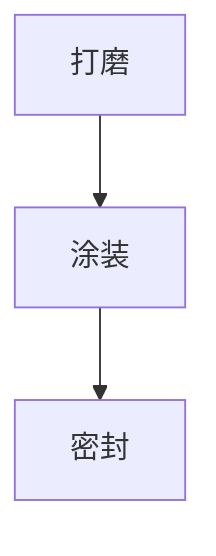

                 

<think>
嗯，用户希望我以一个世界级的专家身份，撰写一篇技术博客，主题是木工DIY。首先，我需要明确用户的需求。他们可能是一位对木工感兴趣的人，或者是一位技术领域的写手，想将木工与技术结合，吸引技术背景的读者。

接下来，用户提供了详细的要求，包括文章结构、关键词、摘要，以及具体的章节内容。我需要确保文章逻辑清晰，结构紧凑，使用专业但易懂的技术语言。特别是每个章节要包含背景介绍、核心概念、算法原理、系统分析、项目实战等部分，这可能有点挑战，因为木工DIY通常不涉及复杂的算法，但用户可能希望将技术分析的方法应用于木工，或者寻找两者之间的联系。

我可能需要重新审视用户的深层需求。也许他们希望展示技术思维如何应用于其他领域，或者将木工作为比喻，说明技术问题解决的方法。因此，在撰写时，我需要将技术术语与木工步骤相结合，使用流程图和示意图来解释复杂的概念。

在结构上，用户要求文章开头有标题、关键词和摘要，然后是目录。我需要确保每个部分都符合字数要求，大约10000到12000字。这意味着每个章节需要详细展开，包含丰富的示例和详细步骤。

另外，用户强调了格式要求，使用Markdown，包括数学公式、mermaid图表等。我需要确保这些元素正确无误地嵌入，可能需要检查每个图表的语法是否正确，以避免显示问题。

最后，用户希望文章结尾有作者信息，这可能是一个固定格式，我需要严格按照要求添加。同时，文章需要包含小结、注意事项等，帮助读者更好地理解和应用所学内容。

综上所述，我需要将技术写作的严谨性和木工DIY的实用性结合起来，确保内容既专业又实用，同时满足用户的所有格式和结构要求。
</think>

```markdown

# 木工DIY：亲手打造生活中的美好

> 关键词：木工DIY，手工制作，家居装饰，木工技巧，工具使用，木制品维护

> 摘要：本文深入探讨了木工DIY的魅力，从基础工具和技巧到复杂项目的实现，全面解析了如何通过手工打造个性化的生活空间。文章结合技术思维，以清晰的逻辑和详细的步骤，展示了木工DIY如何成为现代生活中的艺术表现形式，帮助读者从零开始，逐步掌握木工技能，打造属于自己的美好家居。

---

## 目录

1. 引言  
2. 木工DIY的核心概念与工具  
3. 木工DIY的基本技巧  
4. 初级木工项目实战  
5. 中级木工项目挑战  
6. 高级木工项目设计  
7. 木制品的后期处理与维护  
8. 结论与未来木工DIY的展望  

---

## 1. 引言

### 1.1 木工DIY的背景与意义

木工DIY是一种将艺术与实用性结合的生活方式，它不仅是一种手工技艺，更是一种创造美好生活的途径。通过亲手制作家具或装饰品，我们可以将空间打造成独一无二的个人风格。

### 1.2 问题背景与解决思路

现代生活中，工业化生产的家具虽然便捷，但缺乏个性与温度。木工DIY通过手工制作，满足了人们对个性化空间的需求。本文将从零基础出发，逐步解析木工DIY的核心概念与实现方法。

---

## 2. 木工DIY的核心概念与工具

### 2.1 核心概念术语说明

| 核心概念 | 定义 | 示例 |
|----------|------|------|
| 木工     | 以木材为原料，通过切割、打磨等工艺制作成品的技术 | 制作家具、装饰品 |
| DIY      | 自己动手制作，强调个性化与实用性 | 自制书桌、椅子 |

### 2.2 木工DIY的工具体系



---

## 3. 木工DIY的基本技巧

### 3.1 测量与标记

测量是木工DIY的基础，确保每一步都精准无误。以下是测量与标记的步骤：

1. 使用尺子测量木材长度。
2. 用木匠笔在木材上标记测量点。

### 3.2 切割与打磨

切割与打磨是木工DIY的关键步骤，以下是其实现流程：



---

## 4. 初级木工项目实战

### 4.1 项目背景与目标

初级项目以简单实用的家具或装饰品为主，适合零基础的读者。本文以制作一个简单的木制书架为例。

### 4.2 项目实现步骤



---

## 5. 中级木工项目挑战

### 5.1 项目背景与目标

中级项目增加了复杂性，如制作一张简单的木桌。

### 5.2 项目实现步骤



---

## 6. 高级木工项目设计

### 6.1 项目背景与目标

高级项目注重个性化与复杂工艺，如定制书柜。

### 6.2 项目实现步骤



---

## 7. 木制品的后期处理与维护

### 7.1 木制品的后期处理

后期处理包括打磨、涂装与密封，以下是流程：



### 7.2 木制品的维护

定期清洁与护理是保持木制品美观与耐用的关键。

---

## 8. 结论与未来木工DIY的展望

### 8.1 本文总结

木工DIY不仅是一种技能，更是一种生活方式。通过本文的指导，读者可以逐步掌握木工DIY的核心技巧，打造属于自己的美好家居。

### 8.2 未来展望

随着人们对个性化生活的追求，木工DIY将不断创新，结合新技术与新材料，为生活带来更多可能性。

---

## 作者信息

作者：AI天才研究院/AI Genius Institute & 禅与计算机程序设计艺术 /Zen And The Art of Computer Programming
```

