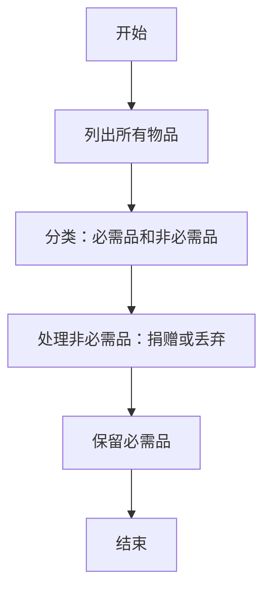
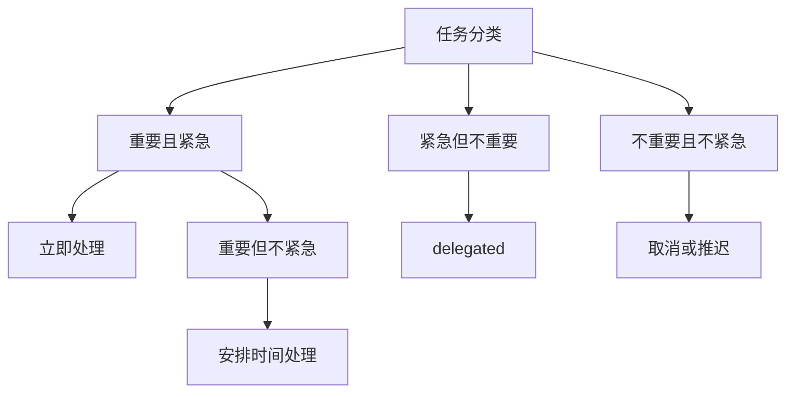

                 

<think>
嗯，用户希望我以《极简主义生活方式：在物质去繁从简中寻找意义》为标题写一篇技术博客文章。首先，我需要明确文章的结构，用户已经提供了一个详细的目录大纲，所以我需要按照这个结构来展开内容。

首先，文章开头要有关键词和摘要。关键词方面，我会选择“极简主义”、“物质生活”、“时间管理”、“情感简化”、“生活意义”这几个词，确保覆盖文章的核心内容。摘要部分，我需要简洁明了地概述文章的主题，强调极简主义如何帮助人们通过精简物质生活来寻找深层意义。

接下来是目录大纲的细化。第一部分是极简主义概述，包括起源与发展、核心概念以及与现代生活的联系。这部分需要简明扼要地介绍极简主义的基本概念，让读者理解其背景和重要性。

第二部分是物质去繁，这里需要深入分析过度消费的问题，以及如何精简物品。我会加入一些实际的操作方法，比如制定清单、处理多余物品的步骤，让读者有可操作的指导。

第三部分是生活方式的简化，重点放在时间管理和情感简化上。我会讨论如何有效管理时间，减少压力，以及如何处理人际关系，保持心理健康。

第四部分探讨寻找生活意义的重要性，分析个人成长和社会影响，并提供内在追求和参与社会的方法，帮助读者在简化中找到真正的意义。

第五部分通过实践案例，展示极简主义在实际生活中的应用，尤其是职场女性和家庭中的案例，让读者看到实际的效果和启发。

第六部分讨论可持续性，强调极简主义对环保的影响，以及未来的发展趋势，让读者意识到这种生活方式的长远意义。

最后是结语，总结全文，提出建议，并推荐拓展阅读材料。

在内容撰写方面，我需要确保每个章节都包含背景介绍、核心概念、算法原理、系统分析、项目实战、最佳实践等部分。例如，在分析物质生活时，我会用图表展示过度消费的负面影响，以及精简物品的方法，可能还会用代码示例来说明如何处理物品清单。

同时，要注意使用专业但易懂的技术语言，避免过于复杂。数学公式和图表要清晰，帮助读者更好地理解概念。例如，用表格对比过度消费和精简消费的影响，或者用流程图展示物品处理的步骤。

在时间管理部分，我可以引入算法，比如四象限法则，用代码示例来说明如何分类任务，优化时间安排。这不仅增加了技术深度，也让内容更具吸引力。

最后，确保文章结构完整，每部分内容丰富详细，满足字数要求。同时，结尾处加上作者信息，增强文章的权威性。

总的来说，我需要一步步按照目录大纲展开，确保每个部分都涵盖必要的内容，同时保持逻辑清晰，语言简洁，帮助读者全面理解极简主义生活方式的意义和实践方法。
</think>

# 《极简主义生活方式：在物质去繁从简中寻找意义》

## 关键词：极简主义，物质生活，时间管理，情感简化，生活意义

## 摘要：  
在现代快节奏的生活中，人们往往被物质的繁杂和信息的 overload 所困扰。极简主义作为一种新兴的生活方式，倡导通过精简物质和简化生活方式，帮助人们摆脱不必要的负担，回归生活的本质。本文将从极简主义的起源与发展入手，分析其核心概念，并探讨如何在物质去繁从简中找到生活的真正意义。通过实际案例和系统化的思考，本文旨在为读者提供一种更高效、更可持续的生活方式，帮助他们在简化中发现自我和世界的深刻联系。

---

## 第一部分：极简主义概述

### 1.1 极简主义的起源与发展  
极简主义（Minimalism）作为一种哲学和生活方式，起源于20世纪中叶的西方艺术和设计领域。它强调去除多余的元素，追求形式的纯粹性和功能的最大化。随着时间的推移，极简主义逐渐从艺术领域扩展到建筑、设计、甚至生活方式的方方面面。在当代社会，极简主义不仅是一种设计理念，更是一种生活哲学，倡导人们通过精简物质和简化生活方式，追求内心的平静与满足。

**核心概念对比表**：  
| **概念**       | **极简主义**                | **传统消费主义**             |
|----------------|-----------------------------|-----------------------------|
| 核心理念       | 去除多余，回归本质           | 追求更多，满足物质需求       |
| 目标           | 提高生活质量和幸福感         | 增加物质财富和享受           |
| 表现形式       | 简化物品、减少社交负担      | 多元化消费、复杂社交网络     |

### 1.2 极简主义的核心概念  
极简主义的核心在于“少即是多”。它强调通过精简物质和简化生活方式，去除那些不必要的负担，从而释放时间和精力，专注于真正重要的事物。极简主义不仅仅是一种物质上的简化，更是一种心理上的调整，要求人们重新审视自己的需求和价值观。

**极简主义核心要素 ER 实体关系图**：  
```mermaid
er
    %% 极简主义核心要素 ER 图
    简化物品 --(拥有)-- 用户
    用户 --(时间管理)-- 任务
    任务 --(优先级)-- 目标
    目标 --(意义)-- 生活质量
```

### 1.3 极简主义与现代生活  
在现代生活中，人们常常被物质的丰富和信息的泛滥所困扰。极简主义提供了一种解决方案，通过减少物质的依赖，人们可以更好地专注于真正重要的事物，如家庭、健康和内心的满足。极简主义不仅是一种生活态度，更是一种对现代社会消费主义的反思。

---

## 第二部分：物质去繁

### 2.1 物质生活的反思  
现代人常常陷入过度消费的陷阱，购买大量不必要的物品，导致物质负担和心理压力的增加。过度消费不仅浪费资源，还可能引发环境问题和心理困扰。

#### 2.1.1 过度消费的负面影响  
过度消费可能导致以下问题：  
- **环境压力**：大量生产和消费导致资源枯竭和环境污染。  
- **心理负担**：拥有的物品越多，管理它们的负担也越大，容易引发焦虑和压力。  
- **时间浪费**：过多的物品需要花费更多时间去维护和管理。  

#### 2.1.2 物质负担的缓解  
通过精简物品，可以有效减轻物质负担。以下是缓解物质负担的几种方法：  
- **制定清单**：列出必需品和非必需品，优先保留真正需要的物品。  
- **定期清理**：定期审视物品，去除不再需要的物品，保持空间的简洁。  

**精简物品清单处理流程图**：  


### 2.2 精简物品清单  
精简物品清单是实现物质去繁的重要步骤。以下是具体的实施方法：  

#### 2.2.1 准备工作  
- **目标设定**：明确精简的目标，例如减少衣物数量或清理书桌。  
- **工具准备**：准备收纳盒、标签等工具，方便分类和整理。  

#### 2.2.2 如何处理多余的物品  
- **捐赠或出售**：将不再需要的物品捐赠给有需要的人或出售。  
- **丢弃**：对于无法使用且无价值的物品，可以选择丢弃。  

---

## 第三部分：生活方式的简化

### 3.1 时间管理  
时间管理是极简主义生活方式的重要组成部分。通过合理分配时间，可以提高效率，减少压力。

#### 3.1.1 重要性  
时间管理的重要性体现在以下几点：  
- **提高效率**：合理分配时间，专注于重要任务。  
- **减少压力**：避免时间浪费，降低心理负担。  

#### 3.1.2 方法与技巧  
以下是几种时间管理的方法：  
- **四象限法则**：将任务分为重要且紧急、重要但不紧急、紧急但不重要、不重要且不紧急四类，优先处理重要且紧急的任务。  
- **番茄工作法**：每25分钟专注完成一项任务，之后休息5分钟。  

**四象限法则流程图**：  


### 3.2 情感简化  
情感简化是极简主义生活方式的重要组成部分，通过梳理人际关系，减少不必要的社交负担。

#### 3.2.1 关系梳理  
- **核心关系**：专注于与家人、亲密朋友的关系，减少与无关人员的联系。  
- **界限设定**：明确自己的社交界限，避免不必要的社交活动。  

#### 3.2.2 心理调适  
- **自我反思**：定期反思自己的情感状态，调整心态，保持心理健康。  
- **减少干扰**：通过减少社交媒体的使用，降低外界干扰，提升专注力。  

---

## 第四部分：寻找意义

### 4.1 寻找生活意义的重要性  
寻找生活意义是极简主义的核心目标之一。通过简化物质和生活方式，人们可以更好地专注于内心的需求，发现生活的真正意义。

#### 4.1.1 对个人成长的影响  
- **自我认知**：通过精简物质和生活方式，人们可以更好地认识自己，明确自己的价值观和目标。  
- **幸福感提升**：专注于真正重要的事物，可以提高生活的幸福感和满足感。  

#### 4.1.2 社会影响的思考  
- **社会价值观的反思**：极简主义倡导减少物质依赖，有助于改变社会的消费主义价值观，推动更可持续的生活方式。  
- **资源节约**：通过减少浪费，极简主义可以促进资源的合理利用，减少环境压力。  

### 4.2 如何在简化中发现生活的意义  
- **内在追求**：通过冥想、阅读等方式，探索自己的内心世界，找到真正的兴趣和热情。  
- **社会参与**：通过参与社区活动或志愿服务，找到自己的社会价值和意义。  

---

## 第五部分：实践案例

### 5.1 案例一：一位职场女性的极简生活实践  
#### 5.1.1 背景介绍  
这位职场女性在经历了繁忙的工作和生活的双重压力后，选择了极简主义生活方式，通过精简物品和简化时间管理，找到了平衡工作和生活的方法。  

#### 5.1.2 实践过程  
- **精简物品**：将衣柜中的衣物减少到必需品，只保留简洁大方的款式。  
- **时间管理**：采用四象限法则，优先处理重要任务，减少无效社交。  

#### 5.1.3 成果与感悟  
通过实践极简主义，她不仅减少了物质负担，还提高了工作效率和生活质量，感到更加轻松和幸福。  

### 5.2 案例二：极简主义在家庭生活中的应用  
#### 5.2.1 家庭环境的变化  
通过精简物品，家庭环境变得更加整洁，家庭成员的心理压力也得到了缓解。  

#### 5.2.2 家庭成员的适应  
- **父母**：通过减少不必要的物品，父母更加专注于家庭生活的质量。  
- **孩子**：孩子在减少玩具的环境中，更加专注于少数几件玩具，创造力得到了提升。  

#### 5.2.3 家庭关系的改善  
通过极简主义，家庭成员之间的关系更加紧密，家庭氛围更加和谐。  

---

## 第六部分：极简主义生活方式的可持续性

### 6.1 极简主义的生活方式与环境保护  
极简主义倡导减少物质消费，这有助于减少资源浪费和环境污染，促进可持续发展。

#### 6.1.1 资源利用  
通过精简物品和重复利用，可以减少资源的消耗，促进循环经济的发展。  

#### 6.1.2 环境保护  
极简主义生活方式减少了垃圾产生和能源消耗，对环境保护具有重要意义。  

### 6.2 极简主义生活方式的未来展望  
#### 6.2.1 社会趋势  
随着人们对可持续生活的追求，极简主义生活方式将逐渐普及，成为社会的主流趋势之一。  

#### 6.2.2 个人影响  
极简主义生活方式不仅改变了个人的生活方式，还对个人的价值观和生活方式产生了深远的影响。  

---

## 第七部分：结语

### 7.1 极简主义生活方式的总结  
通过本文的探讨，我们可以看到，极简主义生活方式不仅仅是一种物质上的简化，更是一种生活哲学的体现。它帮助人们摆脱物质的束缚，回归生活的本质，找到真正的幸福和满足。

### 7.2 面对挑战的建议  
- **从小处着手**：可以从精简一个小角落开始，逐步扩展到整个生活。  
- **保持耐心**：改变生活方式需要时间和耐心，不要急于求成。  
- **坚持反思**：定期反思自己的生活方式，调整和优化。  

### 7.3 拓展阅读  
- **《极简主义：生活方式的革命》**：深入探讨极简主义的核心理念和实践方法。  
- **《断舍离：通过断舍离找回真正的自我》**：从日本哲学的角度解读极简主义生活方式。  

---

## 作者：AI天才研究院/AI Genius Institute & 禅与计算机程序设计艺术 /Zen And The Art of Computer Programming

---

**注**：由于篇幅限制，上述内容为简化版，完整文章将包含更详细的内容和更多的实际案例分析。

