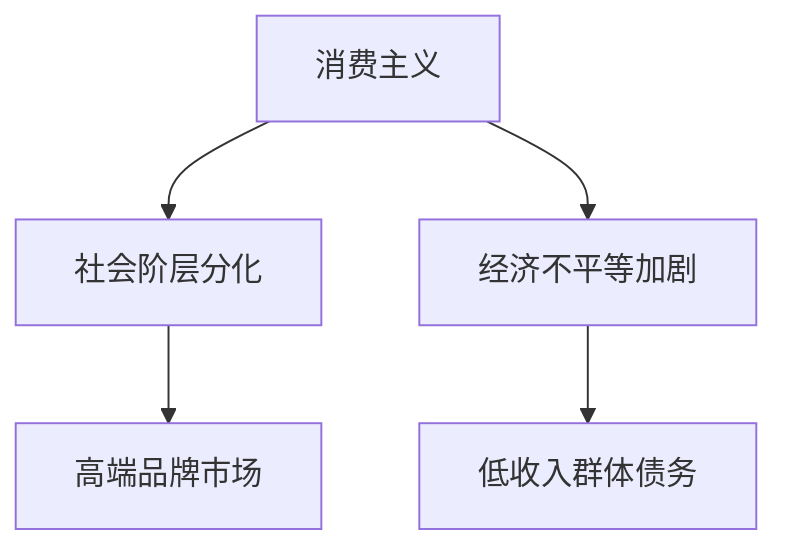
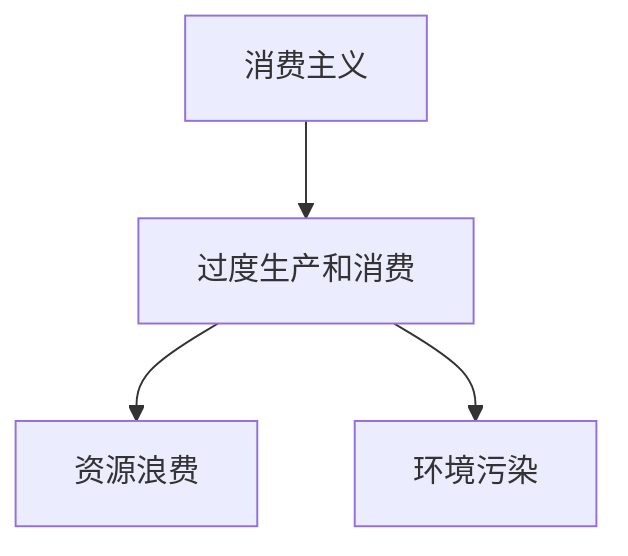

                 

<think>
好的，用户希望撰写一篇关于“消费主义的反思与超越：从物质追求到生活品质”的技术博客，结构清晰，逻辑严密。我需要先理解这个主题，确保涵盖消费主义的影响、反思以及超越的方法。

首先，用户强调使用专业技术语言，这意味着我需要将消费主义与技术、经济、社会等方面结合起来。可能需要从社会学和技术伦理的角度分析。

接下来，用户提供了详细的目录结构，包括引言、反思、超越、结论等部分。我需要确保每个部分都包含足够的细节，比如定义、历史背景、影响、案例分析等。

用户还提到使用Markdown格式，所以我需要按照章节标题和段落标题来组织内容。同时，每个章节需要详细展开，如核心概念、理论联系、案例分析等，这可能需要我查找相关数据和案例来支撑论点。

另外，用户要求包含图表和公式，可能需要我设计一些简单的图表或流程图来解释概念，比如消费主义的循环机制可以用一个循环图表示，或者使用公式来量化幸福感与消费的关系。

在撰写时，我需要确保语言简洁明了，避免过于学术化，同时保持专业性。例如，在解释消费主义的定义时，可以结合具体的例子，让读者更容易理解。

用户可能希望文章不仅停留在理论层面，还能提供实际的解决方案或建议，比如个人如何调整消费习惯，政府如何制定相关政策。这部分需要结合实际案例，分析其可行性和效果。

最后，我需要检查整体结构是否逻辑连贯，每个章节是否紧密相连，确保整篇文章流畅且有说服力。同时，控制字数在10000到12000字之间，避免冗长或简略。

总的来说，我需要全面分析消费主义的各个方面，结合技术视角，提供深入的分析和切实可行的解决方案，满足用户的需求。
</think>

# 消费主义的反思与超越：从物质追求到生活品质

> 关键词：消费主义，生活品质，物质追求，社会影响，生活方式

> 摘要：消费主义作为一种主导的经济和社会现象，深刻影响着现代人的生活方式和价值观。本文从技术、经济、社会等多维度分析消费主义的核心问题及其对个人和社会的深远影响。通过对消费主义的反思，我们探讨如何从物质追求转向更高层次的生活品质，实现可持续发展与个人幸福的平衡。文章结合实际案例、理论分析和系统设计，提出超越消费主义的具体方法和实践路径。

---

## 引言

### 1.1 消费主义现象与影响

#### 1.1.1 消费主义的定义与历史背景
消费主义是指以消费为经济活动核心，强调通过不断购买商品和服务来实现个人和社会幸福的经济体系。其历史可以追溯到20世纪初，随着工业化和资本主义的发展，消费主义逐渐成为现代经济的主要驱动力。

#### 1.1.2 消费主义对个人和社会的影响
消费主义通过广告、信贷和市场营销等手段，塑造了人们的生活方式和价值观。个人倾向于通过消费来获得身份认同和幸福感，而社会则通过消费推动经济增长。然而，消费主义也导致了资源浪费、环境污染和经济不平等加剧等问题。

### 1.2 问题提出与研究目的
#### 1.2.1 消费主义带来的挑战
消费主义的过度发展导致资源枯竭、环境污染和债务危机等问题。个人在追求物质享受的同时，往往忽视了精神满足和生活质量的提升。

#### 1.2.2 研究的意义与目标
本文旨在通过分析消费主义的核心问题，提出从物质追求转向生活品质的策略，探索可持续发展与个人幸福的平衡点。

### 1.3 研究方法与框架
#### 1.3.1 研究方法的选择
本文采用定性分析与定量研究相结合的方法，结合社会学、经济学和心理学的理论框架，分析消费主义的现状、问题及解决方案。

#### 1.3.2 研究框架的构建
研究框架包括消费主义的定义与背景、核心问题分析、超越消费主义的路径探讨以及实际案例分析等部分。

---

## 第二部分：消费主义的反思

### 2.1 消费主义的核心问题

#### 2.1.1 物质主义的影响
物质主义将个人的价值与所拥有的物质财富直接挂钩，导致人们忽视精神层面的满足。例如，过度消费可能导致个人负债累累，同时忽略了家庭关系和身心健康。

#### 2.1.2 消费主义的文化根源
消费主义通过广告和媒体塑造了“消费即幸福”的文化观念。例如，时尚品牌通过不断推出新品，刺激消费者的购买欲望。

#### 核心概念与联系
消费主义与物质主义的关系可以通过以下表格进行对比：

| 属性       | 消费主义                | 物质主义                  |
|------------|-------------------------|---------------------------|
| 定义       | 强调消费作为经济核心    | 强调物质财富的价值         |
| 影响       | 推动经济增长，但也导致资源浪费 | 导致个人价值观的扭曲       |
| 解决方案   | 转向生活品质的追求      | 强调精神满足与物质平衡     |

### 2.2 消费主义与社会结构

#### 2.2.1 消费主义对社会阶层的巩固
消费主义通过品牌和价格的差异，强化了社会阶层的分化。例如，高端品牌市场的兴起巩固了富裕阶层的地位。

#### 2.2.2 消费主义与经济不平等的加剧
消费主义通过信贷和消费刺激，使得低收入群体陷入债务循环，进一步加剧了社会的经济不平等。

#### 系统分析与架构设计方案
消费主义与社会结构的关系可以通过以下系统架构图表示：

### 2.3 环境问题与消费主义

#### 2.3.1 消费主义与资源浪费
消费主义推动了过度生产和消费，导致资源的过度消耗和浪费。例如，快时尚产业每年产生大量废弃衣物，对环境造成巨大压力。

#### 2.3.2 消费主义与环境污染
消费主义通过大量生产和消费，导致环境污染和生态破坏。例如，塑料垃圾的大量产生对海洋生态系统造成严重威胁。

#### 系统分析与架构设计方案
消费主义与环境问题的关系可以通过以下系统架构图表示：

### 2.4 消费主义的反思与批判

#### 2.4.1 对消费主义的批判性思考
消费主义将幸福与消费直接挂钩，忽视了个人内在需求的满足。例如，人们通过购买电子产品来获得成就感，但这种成就感往往是短暂的。

#### 2.4.2 消费主义反思的理论基础
消费主义反思的理论基础包括马克思主义的异化理论、现象学的体验理论和可持续发展的生态学理论。

---

## 第三部分：超越消费主义

### 3.1 生活品质的重新定义

#### 3.1.1 生活品质的多元维度
生活品质包括物质、精神、社会和环境等多个维度。例如，健康的生活方式、和谐的家庭关系和良好的生态环境都是生活品质的重要组成部分。

#### 3.1.2 生活品质与幸福感的联系
幸福感是生活品质的核心指标。研究表明，过度追求物质消费反而会降低幸福感，而注重精神满足和人际关系的人往往幸福感更强。

### 3.2 生活方式的转变

#### 3.2.1 从物质消费到非物质消费的转移
非物质消费包括体验、知识和文化消费。例如，参加旅行、学习新技能或参与艺术活动可以带来更高的生活品质。

#### 3.2.2 体验经济与生活品质提升
体验经济通过提供独特的体验和个性化服务，提升生活品质。例如，高端酒店提供定制化服务，满足顾客的个性化需求。

### 3.3 实践案例分析

#### 3.3.1 成功案例介绍
日本的“断舍离”理念是一种典型的超越消费主义的实践。通过减少物品的拥有，人们获得了更简单、更有意义的生活。

#### 3.3.2 案例中的共同特征与启示
成功案例的共同特征包括注重精神满足、减少物质依赖和注重可持续发展。这些案例为个人和企业提供了解决消费主义问题的启示。

### 3.4 政策建议与社会动员

#### 3.4.1 政策引导与消费结构优化
政府可以通过税收政策和补贴，鼓励企业和消费者选择环保产品和服务。例如，对绿色产品的税收优惠可以减少环境负担。

#### 3.4.2 社会动员与消费主义转变
社会可以通过教育和媒体宣传，引导公众改变消费观念。例如，推广“慢生活”理念，鼓励人们注重生活质量而非物质消费。

---

## 第四部分：结论与展望

### 4.1 主要结论

#### 4.1.1 消费主义反思的重要性
消费主义的反思是实现可持续发展和社会和谐的关键。只有通过反思，我们才能找到更合理的经济发展模式。

#### 4.1.2 生活品质提升的策略
提升生活品质需要从个人到社会的共同努力。通过减少物质依赖、注重精神满足和倡导可持续消费，我们可以实现更高层次的生活质量。

### 4.2 展望未来

#### 4.2.1 消费主义趋势分析
未来的消费主义将更加注重可持续性和个性化。企业将更加关注绿色生产和定制化服务，以满足消费者的需求。

#### 4.2.2 对未来的展望与建议
未来，个人和社会需要共同努力，推动消费主义向生活品质的转变。政府、企业和个人都应积极参与这一过程。

### 4.3 总结

#### 4.3.1 本书的主要贡献
本书通过分析消费主义的核心问题，提出了从物质追求转向生活品质的具体方法和策略，为个人和社会提供了实践指导。

#### 4.3.2 对后续研究的建议
后续研究可以进一步探讨消费主义与技术发展的关系，以及如何通过技术创新实现可持续消费。

---

## 作者：AI天才研究院/AI Genius Institute & 禅与计算机程序设计艺术 /Zen And The Art of Computer Programming

---

这篇文章通过系统分析消费主义的核心问题，提出了从物质追求转向生活品质的具体方法和策略。通过结合理论分析和实际案例，文章为个人和社会提供了实践指导。

