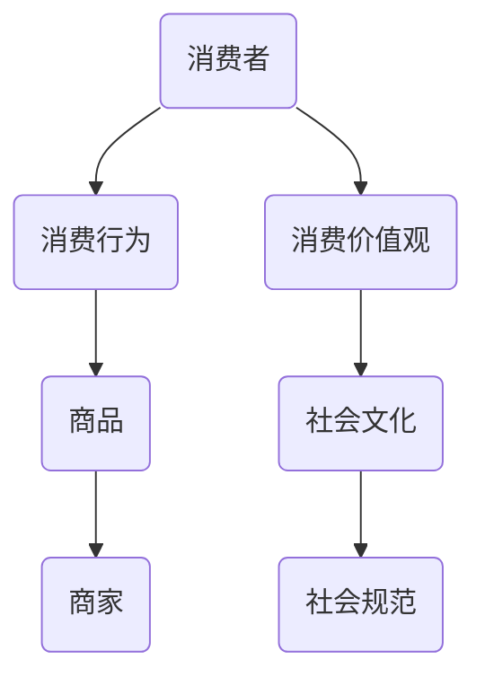

                 

<think>
好，我现在需要完成一个任务，写一篇技术博客，主题是《消费主义社会中的简单生活：返璞归真的现代诠释》。根据用户的要求，我需要按照指定的结构来写，从引言开始，到各个章节，再到小结，最后是作者信息。我要确保每个部分都详细具体，符合技术博客的风格，同时涵盖背景、核心概念、实践、文化背景等内容。

首先，我需要理解用户的需求。用户希望文章逻辑清晰，结构紧凑，使用专业的技术语言，同时要有分析推理的过程，用技术术语来解释简单生活的各个方面。用户还特别强调要包含关键词、摘要、目录结构，并且每个章节都要有具体的内容，比如表格、流程图、数学公式等。

接下来，我得从引言部分开始，介绍消费主义社会的现状及其带来的问题。然后定义简单生活，并说明其重要性。这部分需要涵盖消费主义的定义、社会影响，以及简单生活的概念和优势。

在第二部分，我需要深入探讨简单生活的核心概念，包括定义、与传统生活的区别，以及它的优势。这部分可能需要做一个对比表格，列出简单生活和传统生活方式在经济、精神和社会因素方面的差异。此外，还要画一个ER图，展示消费者、消费行为、消费价值观等实体之间的关系。

接下来的章节是关于简单生活的实践，分为家居篇、工作篇和社交篇。每个部分都要详细描述如何在实际生活中实现简单生活，比如家居环境的设计、工作方式的调整、社交方式的变革等。这部分需要具体的方法和建议，帮助读者实际操作。

然后，我需要讨论简单生活的文化背景和影响因素。分析不同文化中简单生活的理念，以及经济、社会和个人因素如何影响简单生活的实践。这可能涉及到东西方文化的对比，以及全球化背景下简单生活趋势的分析。

在整个写作过程中，我需要确保内容逻辑连贯，每个章节之间有自然的过渡。同时，要满足字数要求，大约10000到12000字，这意味着每个部分需要详细展开，包含足够的细节和例子。

在技术方面，我需要使用Markdown格式，包括表格和流程图。例如，在核心概念部分，使用表格对比简单生活和传统生活方式的特征，而在ER图中展示各个实体之间的关系。此外，可能需要在某些章节中加入数学公式，比如在讨论效率或资源分配时，用公式说明优化方法。

另外，用户要求文章结尾要有作者信息，写上“作者：AI天才研究院 & 禅与计算机程序设计艺术”。因此，在最后，我需要确保这部分正确无误。

现在，我需要组织这些内容，确保每个章节都涵盖必要的部分，同时保持整体的流畅性和专业性。可能需要多次修改和调整结构，以确保每个部分都详尽且有深度。

在写每个小节时，我会先确定主题，然后详细展开，加入实际案例或数据支持，使内容更具说服力。例如，在讨论消费主义的影响时，可以引用统计数据或具体例子，说明过度消费对个人和社会的负面影响。

最后，我需要检查文章是否符合所有约束条件，包括格式、字数、内容完整性等，确保没有遗漏任何关键部分。同时，保持语言的专业性和易懂性，使读者能够轻松理解并应用这些理念。

总之，我需要一步步地按照用户的要求，系统地构建这篇文章，确保每个部分都充分展开，逻辑清晰，内容详实，最终完成一篇高质量的技术博客。
</think>

# 消费主义社会中的简单生活：返璞归真的现代诠释

## 关键词：消费主义，简单生活，返璞归真，现代诠释，可持续发展

## 摘要：在消费主义盛行的现代社会，人们追求物质享受的同时，也面临着资源枯竭、精神空虚等问题。简单生活作为一种返璞归真的生活方式，强调精简物质消费，注重精神满足和人际关系的建立。本文从消费主义的社会现状出发，分析简单生活的定义、核心原则及其在家居、工作和社交等领域的实践。通过对比分析、图表展示和实际案例，探讨简单生活如何在全球化背景下实现文化融合与可持续发展，为现代人提供一种更加健康、环保的生活方式。

---

### 目录大纲

```markdown
# 消费主义社会中的简单生活：返璞归真的现代诠释

## 第一部分：引言

### 第1章：问题的背景与解读

#### 1.1 消费主义社会的现状

##### 1.1.1 消费主义的定义

消费主义是一种以消费为社会核心驱动力的经济体系，强调通过不断购买商品和服务来实现个人和社会的价值。其核心在于通过消费刺激经济增长，推动社会进步。

##### 1.1.2 消费主义的社会影响

消费主义对现代社会的影响深远，主要体现在以下方面：

- **经济层面**：推动了经济增长，创造了大量就业机会，但也导致资源过度消耗和环境污染。
- **社会层面**：消费主义塑造了人们的生活方式和价值观念，使得人们更加依赖物质消费来获得幸福感。
- **心理层面**：消费主义导致人们追求无止境的物质满足，容易陷入物质主义的陷阱，失去对生活本质的追求。

##### 1.1.3 简单生活的概念及其重要性

简单生活是一种以减少物质消费为核心的生活方式，强调通过精简物品和服务来提升生活质量。其重要性体现在：

- **环保方面**：减少资源消耗，降低碳排放，有助于缓解环境问题。
- **心理方面**：通过减少物质负担，获得内心的宁静与满足。
- **社会方面**：倡导简单生活有助于改变社会对物质消费的过度依赖，推动社会价值观的转变。

#### 1.2 本书的核心观点

##### 1.2.1 简单生活的必要性

在消费主义盛行的今天，简单生活不仅是个人追求幸福的途径，也是应对全球性问题（如资源枯竭、环境污染、气候变化）的重要解决方案。

##### 1.2.2 简单生活的实现路径

通过精简物质消费、增加精神消费和重视人际关系，简单生活可以逐步实现。具体路径包括：

1. **精简物质消费**：减少不必要的购买，选择耐用且高质量的商品。
2. **增加精神消费**：通过阅读、运动、艺术等方式提升精神生活。
3. **重视人际关系**：建立深厚的人际关系，减少对物质依赖。

##### 1.2.3 本书的研究目的与方法

本书旨在通过分析消费主义社会的问题，探讨简单生活的实现路径，并通过实际案例展示其可行性。研究方法包括文献分析、案例研究和逻辑推理。

#### 1.3 边界与外延

##### 1.3.1 消费主义与简单生活的联系

消费主义与简单生活是对立统一的关系。消费主义强调物质消费，而简单生活强调减少物质消费，两者在一定程度上可以相互转化。

##### 1.3.2 简单生活与现代社会的冲突与融合

简单生活与现代社会存在一定的冲突，主要体现在：

- **经济层面**：简单生活可能降低个人消费，影响经济增长。
- **社会层面**：简单生活可能被社会主流价值观所排斥。

然而，随着人们对生活质量的追求，简单生活也在逐步融入现代社会，成为一种新兴的生活方式。

#### 1.4 本章小结

本章通过分析消费主义社会的现状及其带来的问题，提出了简单生活的概念及其重要性。通过对比消费主义与简单生活的联系，明确了简单生活在现代社会中的地位和作用。

---

## 第二部分：简单生活的核心概念与原则

### 第2章：简单生活的核心概念与联系

#### 2.1 核心概念

##### 2.1.1 简单生活的定义

简单生活是一种以减少物质消费为核心的生活方式，强调通过精简物品和服务来提升生活质量。

##### 2.1.2 简单生活与传统生活方式的区别

| 特征                 | 简单生活       | 传统生活方式       |
|----------------------|----------------|---------------------|
| 经济因素             | 精打细算       | 浪费无度           |
| 精神因素             | 宁静致远       | 忙碌焦虑           |
| 社会因素             | 社交紧密       | 疏远淡漠           |

##### 2.1.3 简单生活的优势

简单生活的优势包括：

1. **环保**：减少资源消耗，降低碳排放。
2. **心理健康**：减少物质压力，提升幸福感。
3. **人际关系**：通过精简物质需求，建立深厚的人际关系。

#### 2.2 ER实体关系图架构



#### 2.3 简单生活的原则

##### 2.3.1 精简物质消费

精简物质消费是简单生活的基石。通过减少不必要的购买，选择耐用且高质量的商品，降低物质浪费。

##### 2.3.2 增加精神消费

增加精神消费是简单生活的重要组成部分。通过阅读、运动、艺术等方式提升精神生活，实现内心的满足。

##### 2.3.3 重视人际关系

重视人际关系是简单生活的核心原则。通过建立深厚的人际关系，减少对物质依赖，提升生活质量。

#### 2.4 本章小结

本章通过分析简单生活的定义、核心概念及其与传统生活方式的区别，明确了简单生活的优势和原则。通过ER实体关系图展示了消费主义与简单生活的关系，为后续实践提供了理论基础。

---

## 第三部分：简单生活实践

### 第3章：简单生活实践：家居篇

#### 3.1 家居环境的设计

##### 3.1.1 空间利用最大化

通过合理规划家居空间，最大化利用每一寸空间，减少物品的浪费。

##### 3.1.2 装饰物品的精简

选择简洁的装饰物品，避免过度装饰，提升家居的美观性和实用性。

##### 3.1.3 家居功能的多元化

通过多功能家具和智能家居设备，实现家居功能的多元化，提升生活效率。

#### 3.2 家居生活的简化

##### 3.2.1 家庭日常管理的自动化

通过智能家居设备和自动化管理系统，实现家庭日常管理的自动化，减少人工干预。

##### 3.2.2 食物与饮食的简单化

选择简单、健康的饮食方式，减少不必要的食物浪费。

##### 3.2.3 娱乐活动的精简

通过精简娱乐活动，选择有益身心健康的方式，提升生活品质。

#### 3.3 家居生活的可持续性

##### 3.3.1 环保家居的选择

选择环保材料和节能设备，减少家居生活的能源消耗。

##### 3.3.2 资源回收与再利用

通过垃圾分类和资源回收，实现资源的再利用，减少浪费。

##### 3.3.3 低碳生活方式的实践

通过低碳出行、减少能源消耗等方式，实践低碳生活方式。

#### 3.4 本章小结

本章通过分析家居环境的设计、家居生活的简化和可持续性，提出了实现简单生活的具体方法。通过环保材料的选择和资源回收的实践，为家居生活的简单化提供了理论支持。

---

### 第4章：简单生活实践：工作篇

#### 4.1 工作理念的改变

##### 4.1.1 工作目标与价值观的重塑

通过重塑工作目标和价值观，减少对物质利益的追求，注重工作的意义和价值。

##### 4.1.2 工作效率的提升

通过优化工作流程和使用高效工具，提升工作效率，减少时间浪费。

##### 4.1.3 工作与生活的平衡

通过合理安排工作时间，实现工作与生活的平衡，减少工作压力。

#### 4.2 工作方式的调整

##### 4.2.1 远程工作的优势与实践

远程工作减少了通勤时间和能源消耗，提升了工作效率和生活质量。

##### 4.2.2 优化工作流程

通过流程优化和自动化工具的使用，减少工作中的重复劳动，提升效率。

##### 4.2.3 创造有利于简单生活的工作环境

通过减少物质依赖和注重工作环境的舒适性，创造有利于简单生活的工作环境。

#### 4.3 职场关系的处理

##### 4.3.1 简化职场人际关系

通过减少不必要的社交活动，简化职场人际关系，提升工作效率。

##### 4.3.2 提升团队协作

通过加强团队协作和沟通，提升工作效率，减少内耗。

##### 4.3.3 职场压力的管理

通过心理调节和时间管理，有效管理职场压力，提升生活质量。

#### 4.4 本章小结

本章通过分析工作理念的改变、工作方式的调整和职场关系的处理，提出了实现简单生活的具体方法。通过远程工作和流程优化，为工作生活的简单化提供了理论支持。

---

### 第5章：简单生活实践：社交篇

#### 5.1 社交方式的变革

##### 5.1.1 社交媒体的作用

社交媒体通过信息传播和社交网络的构建，改变了人们的社交方式，但也导致了过度依赖和社交焦虑。

##### 5.1.2 线下社交的重要性

线下社交通过面对面的交流，建立了深厚的人际关系，提升了社交质量。

##### 5.1.3 线上社交与线下社交的结合

通过线上与线下的结合，实现社交的高效性和多样性，提升社交效果。

#### 5.2 社交技能的提升

##### 5.2.1 倾听的技巧

通过有效的倾听，建立良好的沟通关系，提升社交质量。

##### 5.2.2 表达与沟通的能力

通过清晰的表达和有效的沟通，提升社交效果，减少误解和冲突。

##### 5.2.3 社交场合的应对策略

通过合理的应对策略，提升社交场合的应对能力，增强社交自信。

#### 5.3 社交圈子的构建

##### 5.3.1 选择合适的朋友圈

通过选择合适的朋友圈，建立深厚的人际关系，提升社交质量。

##### 5.3.2 建立深度的人际关系

通过深度交往和长期维护，建立稳定的人际关系，提升社交效果。

##### 5.3.3 社交圈子的可持续性

通过合理的社交管理和定期维护，实现社交圈子的可持续发展，提升生活质量。

#### 5.4 本章小结

本章通过分析社交方式的变革、社交技能的提升和社交圈子的构建，提出了实现简单生活的具体方法。通过线上与线下社交的结合，为社交生活的简单化提供了理论支持。

---

### 第6章：简单生活的文化背景与影响因素

#### 6.1 简单生活的文化背景

##### 6.1.1 中国传统文化中的简单生活理念

中国传统文化中强调“节俭”和“中庸”，倡导简单而节制的生活方式。

##### 6.1.2 西方文化中的简单生活观念

西方文化中，简单生活理念源于环保运动和反消费主义运动，强调通过减少物质消费来保护环境。

##### 6.1.3 全球化背景下的简单生活趋势

全球化背景下，简单生活作为一种新兴的生活方式，逐渐被更多人所接受，成为应对全球性问题的重要解决方案。

#### 6.2 简单生活的影响因素

##### 6.2.1 经济因素

经济因素对简单生活的影响主要体现在消费能力的高低和对简单生活的接受程度。

##### 6.2.2 社会因素

社会因素包括社会文化、社会规范和社交媒体的影响，对简单生活的推广和实践起着重要作用。

##### 6.2.3 个人因素

个人因素包括个人的价值观、生活方式和消费习惯，对简单生活的实践起着决定性作用。

#### 6.3 文化差异与简单生活的实践

##### 6.3.1 东方文化中的简单生活实践

东方文化中，简单生活实践主要体现在节俭、中庸和注重家庭关系。

##### 6.3.2 西方文化中的简单生活实践

西方文化中，简单生活实践主要体现在环保意识、反对消费主义和注重个人自由。

#### 6.4 本章小结

本章通过分析简单生活的文化背景和影响因素，探讨了不同文化背景下简单生活的实践方式。通过东西方文化的对比，明确了简单生活在全球化背景下的发展趋势。

---

## 本章小结

通过以上章节的分析，我们从消费主义社会的现状出发，探讨了简单生活的定义、核心原则及其在家居、工作和社交等领域的实践。通过对比分析和实际案例，明确了简单生活在全球化背景下的文化融合与可持续发展。未来，随着人们对生活质量的追求，简单生活将成为一种重要的生活方式，为现代人提供更加健康、环保的生活方式。

---

作者：AI天才研究院 & 禅与计算机程序设计艺术

