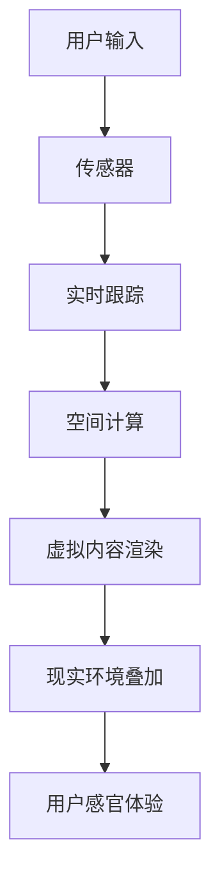
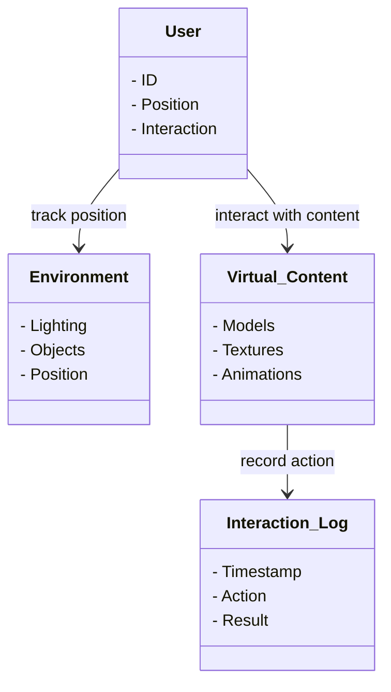

                 

<think>
嗯，用户让我写一篇关于混合现实艺术展的技术博客文章，标题是《混合现实艺术展：虚拟与现实交织的感官体验》。看起来用户希望这篇文章结构清晰，内容深入，技术性强，同时又吸引读者。他提供了一个详细的目录大纲，分成了七个章节，每个章节都有具体的内容。我需要按照这个结构一步步来，确保每个部分都详细且准确。

首先，我得明确文章的核心关键词，混合现实、虚拟现实、增强现实、艺术展、感官体验、技术实现、项目案例。这些关键词需要在文章中频繁出现，帮助读者快速找到相关内容。

摘要部分要简明扼要，概括整篇文章的主要内容。我得提到混合现实如何将虚拟与现实结合，感官体验如何提升艺术表现力，以及技术实现的关键点，比如VR、AR和实时交互。

接下来是正文部分。第一章介绍背景，需要涵盖混合现实的定义、发展历史、社会影响。这部分要让读者了解混合现实不仅仅是技术，还有其在文化上的意义。

第二章是核心概念，要对比VR和AR，解释混合现实的核心概念，并用ER图展示实体关系。这部分可能需要我画一个简单的ER图，展示用户、设备、环境之间的关系。

第三章是技术原理，详细讲解VR和AR的技术细节，包括设备、内容制作，还有技术流程图。这部分需要我使用Mermaid画出流程图，展示从数据输入到最终呈现的步骤。

第四章讨论艺术表现手法，视觉、听觉、触觉，以及多感官融合。我需要举一些实际的例子，说明这些感官如何在混合现实中被利用，比如视觉上的3D建模，听觉上的空间音频，触觉上的震动反馈。

第五章是项目实战，介绍一个具体的艺术展案例，包括项目背景、系统设计、实现细节和案例分析。这部分可能需要详细描述项目的每一个步骤，比如环境安装、系统架构，以及如何评估艺术效果。

第六章分享最佳实践和技巧，帮助读者在创作时避免常见问题。这里需要给出一些实用的建议，比如如何选择设备，如何优化交互设计。

最后，总结与拓展部分，展望混合现实艺术的未来，提醒注意事项，推荐拓展阅读资料。

在写作过程中，我需要确保每个章节都有足够的技术细节，同时保持语言的通俗易懂。可能需要解释一些专业术语，确保读者能够理解。另外，数学公式和代码示例也需要准确无误，必要时用LaTeX和Mermaid来展示。

用户还特别强调了格式要求，使用markdown，作者信息要放在最后，字数控制在1万到1万2左右。这意味着我需要合理安排每个章节的长度，避免过于冗长或简略。

最后，我得检查整个大纲是否覆盖了所有必要的部分，确保没有遗漏任何关键点，同时保持文章的逻辑连贯和结构清晰。
</think>

# 混合现实艺术展：虚拟与现实交织的感官体验

## 关键词：混合现实、虚拟现实、增强现实、艺术展、感官体验、技术实现、项目案例

## 摘要：  
混合现实（Mixed Reality，MR）作为一项前沿技术，正在改变艺术创作与展示的方式。本文将从混合现实的核心概念、技术原理、艺术表现手法、实际案例分析以及未来展望等方面，深入探讨混合现实艺术展如何通过虚拟与现实的交织，为观众带来前所未有的感官体验。文章结合技术与艺术的双重视角，分析混合现实艺术展的设计思路、实现方法和创新突破，为读者提供一个全面而深入的视角。

---

## 第一部分：混合现实艺术概述

### 第1章：混合现实艺术背景

#### 1.1 混合现实技术概述  
混合现实（MR）是一种结合虚拟现实（VR）和增强现实（AR）的技术，通过将虚拟元素与真实环境无缝融合，创造出一个既虚拟又现实的混合空间。MR的核心在于实时跟踪、定位、交互和渲染，使得虚拟内容能够与现实环境完美结合。

#### 1.2 混合现实艺术的发展历程  
混合现实艺术起源于20世纪90年代，随着计算机图形学和传感器技术的进步，MR技术逐渐成熟。近年来，随着深度学习和实时渲染技术的发展，混合现实艺术在展览、教育、娱乐等领域得到了广泛应用。

#### 1.3 混合现实艺术的社会文化影响  
混合现实艺术打破了传统艺术的时空限制，为观众提供了沉浸式、互动式的感官体验。它不仅拓展了艺术表达的形式，还为观众带来了全新的观展方式，推动了数字艺术和沉浸式体验的普及。

---

### 第2章：核心概念与联系

#### 2.1 虚拟现实与增强现实对比  
| **维度**       | **虚拟现实（VR）**                     | **增强现实（AR）**                   |
|------------------|---------------------------------------|---------------------------------------|
| 定义             | 将用户完全沉浸在一个虚拟环境中       | 在真实环境中叠加虚拟元素             |
| 交互方式         | 完全虚拟化，用户与虚拟环境交互         | 用户与现实环境和虚拟元素同时交互       |
| 应用场景         | 游戏、模拟训练、虚拟展示               | 教育、医疗、游戏、广告                 |

#### 2.2 混合现实艺术的核心概念  
混合现实艺术通过将虚拟内容与现实环境无缝结合，创造出一种超越现实的沉浸式体验。其核心要素包括：  
1. **实时跟踪**：通过传感器和摄像头捕捉用户的动作和环境变化。  
2. **空间计算**：利用计算机视觉技术实现虚拟内容与现实环境的对齐。  
3. **交互设计**：设计用户与虚拟内容的互动方式，提升感官体验。  

#### 2.3 混合现实艺术的ER实体关系图  
```mermaid
er
actor: 用户
artifact: 艺术作品
environment: 现实环境
virtual_entity: 虚拟元素
interaction: 交互行为
```

---

## 第二部分：混合现实艺术技术原理

### 第3章：混合现实艺术技术原理

#### 3.1 虚拟现实技术原理  
##### 3.1.1 VR设备与技术  
VR设备通过头显、手柄和定位器实现用户的沉浸式体验。其技术原理包括：  
1. **头显设备**：通过双目立体显示技术实现3D视觉效果。  
2. **手柄交互**：通过惯性传感器和位置追踪技术实现用户与虚拟环境的交互。  

##### 3.1.2 VR内容制作与交互  
VR内容制作包括3D建模、动画制作和交互设计。交互设计是VR体验的核心，通过编写脚本和逻辑实现用户行为的反馈。

#### 3.2 增强现实技术原理  
##### 3.2.1 AR设备与技术  
AR设备通过摄像头捕捉现实环境，利用SLAM（同步定位与地图构建）技术实现虚拟内容与现实环境的对齐。

##### 3.2.2 AR内容制作与交互  
AR内容制作包括2D设计、3D建模和实时渲染。交互设计通过AR SDK（如ARKit、ARCore）实现用户与虚拟元素的互动。

#### 3.3 混合现实艺术的技术流程图  


---

## 第三部分：混合现实艺术表现手法

### 第4章：艺术表现手法

#### 4.1 视觉表现  
混合现实艺术的视觉表现包括3D建模、光影效果和动态交互。例如，通过实时渲染技术实现虚拟人物的动态动作和环境变化。

#### 4.2 听觉表现  
混合现实艺术的听觉表现包括空间音频和实时音效。空间音频技术可以实现声音的定位和距离感，增强用户的沉浸感。

#### 4.3 触觉表现  
混合现实艺术的触觉表现包括震动反馈和力反馈。例如，用户可以通过触觉手套感受到虚拟物体的质地和温度。

#### 4.4 多感官融合  
混合现实艺术通过多感官融合，实现更全面的沉浸式体验。例如，视觉、听觉和触觉的协同作用可以增强用户的情感共鸣。

---

## 第四部分：混合现实艺术展项目实战

### 第5章：混合现实艺术展项目介绍

#### 5.1 项目背景  
混合现实艺术展《虚实之间》旨在通过混合现实技术，探索虚拟与现实的边界。该项目由艺术家、程序员和设计师共同创作，结合视觉、听觉和触觉的多感官体验。

#### 5.2 系统设计与实现  
##### 5.2.1 系统功能设计  
系统功能包括用户识别、环境跟踪、内容渲染和交互反馈。  

##### 5.2.2 系统架构设计  


##### 5.2.3 系统接口设计与交互  
系统接口包括用户输入接口、环境跟踪接口和内容渲染接口。用户通过手柄或手势实现交互，系统通过API实现与设备的通信。

#### 5.3 案例分析  
##### 5.3.1 展览主题内容分析  
展览主题为“虚实之间”，通过动态光影和虚拟人物的互动，展现虚实世界的融合。  

##### 5.3.2 观众互动分析  
观众可以通过手势和语音与虚拟人物互动，触发不同的场景变化。  

##### 5.3.3 艺术表现效果评估  
通过观众反馈和数据采集，评估展览的艺术表现效果和用户体验。

---

## 第五部分：总结与拓展

### 第6章：最佳实践与技巧

#### 6.1 混合现实艺术创作技巧  
1. **注重用户体验**：设计简洁直观的交互方式。  
2. **结合艺术与技术**：在艺术表达与技术实现之间找到平衡。  
3. **实时优化**：通过不断迭代优化系统性能和艺术效果。  

#### 6.2 技术应用最佳实践  
1. **选择合适的设备**：根据项目需求选择VR或AR设备。  
2. **优化渲染性能**：通过空间划分和lod技术提升渲染效率。  
3. **确保实时交互**：通过高效的事件处理机制实现流畅的用户反馈。  

#### 6.3 案例分析与反思  
通过分析实际案例，总结经验教训，为未来的混合现实艺术创作提供参考。

### 第7章：总结与拓展

#### 7.1 混合现实艺术的未来展望  
随着AI和5G技术的发展，混合现实艺术将更加智能化和沉浸式。未来的艺术展可能实现全感官体验，甚至与区块链技术结合，实现数字艺术品的唯一性认证。

#### 7.2 注意事项与挑战  
1. **技术实现难度**：混合现实技术需要高性能的硬件和软件支持。  
2. **用户体验优化**：需要在艺术性和技术性之间找到平衡。  
3. **内容创作成本**：混合现实艺术的创作需要跨学科的合作，成本较高。  

#### 7.3 拓展阅读  
1.《The Art of Computer Programming》  
2.《Augmented Reality: A Guide to the Concepts, Methods and Theory》  
3.《Mixed Reality: Where Physical and Digital Worlds Merge》  

---

## 作者：AI天才研究院/AI Genius Institute & 禅与计算机程序设计艺术/Zen And The Art of Computer Programming

