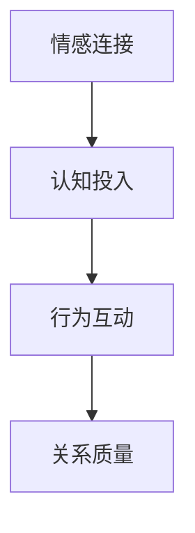
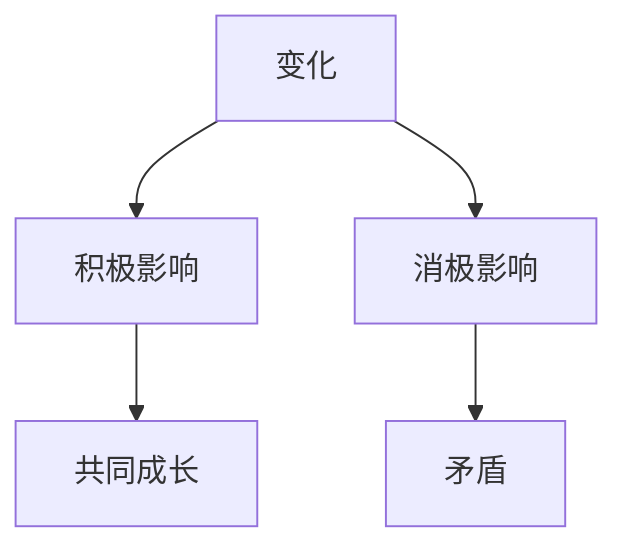
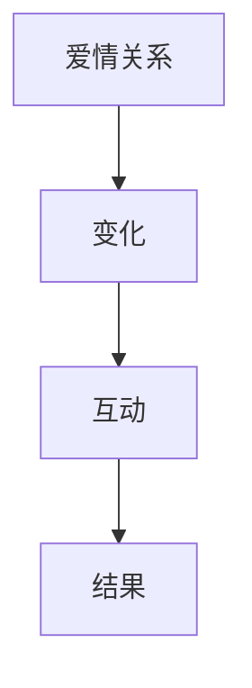
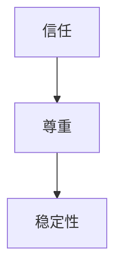
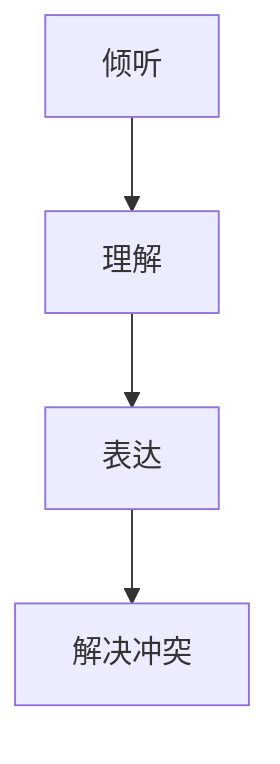
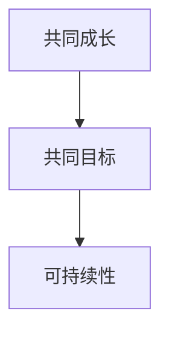

                 

<think>
嗯，用户希望我写一篇关于爱情在变化中寻找永恒的技术博客，但看起来更像是一本心理学或情感类的书籍结构。然而，用户又强调要使用专业的技术语言，这有点矛盾。我需要理清楚这一点。

首先，用户希望我以CTO、技术专家的身份来写，所以可能需要将爱情的分析用技术方法来阐述。比如，使用系统架构、算法、数据结构等概念来分析爱情关系。

接下来，用户提供了详细的大纲，分为两大部分，每部分有章节和小节。我需要确保每个部分都符合技术分析的要求，同时保持内容的深度和逻辑性。

用户还提到要包括背景介绍、核心概念、算法原理、系统架构等部分，这让我想到可能需要将爱情关系建模为一个系统，分析其各个模块和交互。例如，信任、沟通、个人成长等可以视为系统的模块，用类图或流程图来表示。

在数学模型部分，可能需要用概率论或图论来分析爱情中的不确定性或关系网络。例如，用图论中的节点和边来表示人与人之间的关系变化。

用户还要求每个部分都要有详细的解释，这意味着我需要为每个小节提供具体的例子，比如用代码模拟爱情中的互动，或者用数学公式来描述情感波动。

此外，用户希望文章末尾有作者信息，结合技术与禅学，这可能需要在结论部分进行融合，强调技术与人文的结合。

最后，我需要确保整个结构逻辑清晰，技术术语与情感主题结合得当，让读者既能理解技术分析，又能从中获得情感上的共鸣。
</think>

```markdown
# 爱情的意义：在变化中寻找永恒

## 关键词：爱情，变化，永恒，心理学，系统架构，情感管理

## 摘要： 
爱情是人类情感中最复杂且最具动态变化的领域之一。在变化的环境中，爱情的意义和价值如何保持永恒？本文通过心理学、系统架构和情感管理的视角，分析爱情在变化中的本质、挑战以及寻找永恒的策略。结合技术方法论，我们将爱情关系建模为一个动态系统，并探讨如何通过个体成长、情感连接和共同记忆来维持爱情的持久性。

---

## 第一部分：爱情与变化的本质

### 第1章：爱情的本质与变化的力量

#### 1.1 爱情的定义与核心要素
爱情是一个复杂的多维度概念，涉及情感、认知和行为等多个方面。从心理学角度看，爱情可以被分解为以下几个核心要素：
- **情感连接**：包括依恋、亲密和激情。
- **认知投入**：对伴侣的价值和意义的认同。
- **行为互动**：通过沟通和行动表达爱意。

**背景介绍：**
爱情的本质是人类情感的高级形式，它不仅关乎个人的心理需求，还涉及社会和文化的影响。爱情的动态变化性使得其在不同环境和个体之间表现出多样性。

**核心概念与联系：**
我们可以将爱情视为一个动态系统，其中各个要素相互作用并影响整体关系的质量。下图展示了爱情的核心要素之间的关系：



#### 1.2 变化的本质与影响
变化是生活中的常态，而爱情关系尤其容易受到变化的影响。变化可以是外部环境的变化（如工作调动、家庭变动）或内部心理的变化（如个人成长、情感波动）。

**背景介绍：**
变化对爱情的影响可以是积极的（如共同成长）或消极的（如矛盾和冲突）。理解变化的本质有助于我们更好地应对爱情中的挑战。

**核心概念与联系：**
变化对爱情的影响可以通过以下模型进行分析：



#### 1.3 爱情与变化的互动关系
爱情与变化之间的互动关系是一个复杂的动态过程。变化可以促进爱情的深化，也可以导致爱情的破裂。

**背景介绍：**
在变化中，爱情需要不断适应新的环境和挑战。这种适应性是爱情能否在变化中保持永恒的关键。

**算法原理讲解：**
我们可以将爱情与变化的互动关系建模为一个动态系统，如下图所示：



---

## 第二部分：永恒爱情的实践与探索

### 第4章：建立稳定的爱情关系

#### 4.1 爱情的基石：信任与尊重
信任和尊重是爱情关系的基石。信任是建立长期关系的基础，而尊重是维护个体独立性的关键。

**背景介绍：**
信任与尊重的动态平衡是爱情关系稳定的核心。信任的建立需要时间，而尊重则需要双方的持续努力。

**系统架构设计：**
我们可以将信任与尊重的关系建模为一个系统架构：



#### 4.2 沟通的艺术
沟通是爱情关系中最重要的工具之一。有效的沟通可以帮助双方理解彼此的需求和感受。

**背景介绍：**
沟通的艺术包括倾听、表达和解决冲突的能力。良好的沟通可以减少误解，增强情感连接。

**算法原理讲解：**
沟通的过程可以被建模为一个流程图：



#### 4.3 爱情的可持续发展
爱情的可持续发展需要双方的共同努力。通过共同成长和目标设定，爱情关系可以在变化中保持稳定。

**背景介绍：**
可持续的爱情关系需要双方在价值观和目标上达成一致，并通过共同行动来实现。

**系统架构设计：**
我们可以将爱情的可持续发展建模为一个系统：



---

## 结论

爱情的意义在于其在变化中的适应性和持久性。通过理解和管理变化，我们可以让爱情在动态的环境中依然保持永恒。爱情不仅是一个情感问题，更是一个需要通过系统性方法来解决的复杂问题。

**作者：AI天才研究院/AI Genius Institute & 禅与计算机程序设计艺术 /Zen And The Art of Computer Programming**
```

