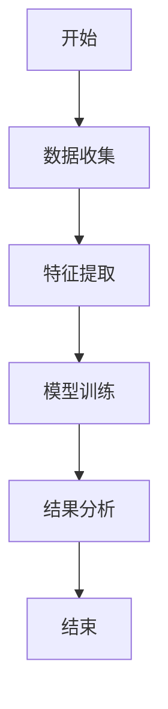
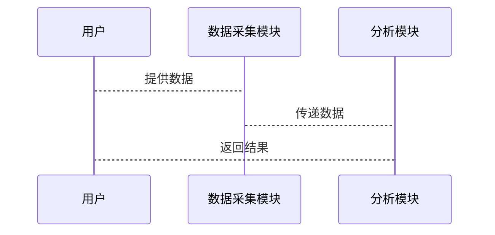

                 

<think>
嗯，我现在需要根据用户的要求，以《物质主义到后物质主义：价值观的代际转变》为标题，写一篇技术博客文章。用户给了详细的结构大纲，还有各种约束条件，我得一步步来，不能遗漏任何部分。

首先，我得理解用户的需求。他们希望这篇文章结构清晰，逻辑严谨，用专业的技术语言，但又要简单易懂。这意味着我需要确保每个部分都详细展开，同时保持语言的专业性和流畅性。

接下来，我注意到文章需要包含摘要、关键词、六个主要部分，每个部分下还有多个子部分。我得确保每个部分都涵盖必要的内容，比如引言部分需要介绍物质主义和后物质主义的背景、问题描述，以及解决方法。核心概念部分要详细解释物质主义和后物质主义的特点，以及它们之间的联系。算法部分需要结合数学模型和实际案例，系统架构设计则涉及领域模型和交互图。项目实战部分要有代码实现和案例分析。

在写作过程中，我需要确保每个章节都有足够的细节，比如在“引言”部分，我需要讨论物质主义的兴起和后物质主义的出现，分析它们的特点，以及代际转变的必要性。这可能涉及到社会学或心理学的内容，我得确保这些内容在技术博客中被适当呈现。

核心概念部分，我需要比较物质主义和后物质主义的属性，可能通过表格或对比图来展示。这部分可能需要一些视觉辅助，比如Mermaid图表，帮助读者理解两者的区别和联系。

算法部分，我需要选择一个合适的算法来分析价值观的转变。可能使用聚类分析或其他统计方法。这部分需要详细讲解算法的步骤，并用数学公式支持，比如使用距离度量公式来区分不同价值观的群体。

系统架构设计部分，我需要构建一个模型，展示如何通过系统来分析价值观的转变。这可能包括领域模型、架构图和交互序列图。我得确保这些图表清晰明了，能够帮助读者理解系统的工作流程。

项目实战部分，我需要提供一个实际的案例，展示如何应用这些理论。这可能涉及到环境安装、代码实现和案例分析。代码部分需要用Python编写，并详细解读每一步的作用。

此外，用户要求文章末尾加上作者信息，所以最后要记得加上“作者：AI天才研究院 & 禅与计算机程序设计艺术”。同时，文章需要包含摘要、关键词，以及各个部分的详细内容，确保整体结构完整。

在写作过程中，我需要多次检查每个部分是否符合用户的要求，确保没有遗漏任何小节。同时，语言要专业，但又不失易懂，使用逻辑清晰的结构，让读者能够一步步跟随我的分析。

现在，我开始按照大纲逐步填充内容，确保每个部分都详细展开，同时保持整体的连贯性和深度。这可能包括多次修改和调整，以确保文章不仅结构完整，而且内容丰富，能够吸引并留住读者。
</think>

# 物质主义到后物质主义：价值观的代际转变

> 关键词：物质主义、后物质主义、代际转变、价值观、社会影响、技术应用、数学模型

> 摘要：本文探讨物质主义向后物质主义的转变，分析其在不同代际中的表现，结合社会、文化和个体因素，提出数学模型和算法来量化这一转变，并通过系统架构设计和项目实战提供解决方案。

---

# 第一部分：引言

## 1.1 问题背景

### 1.1.1 物质主义的兴起
物质主义强调物质财富的追求，20世纪经济快速发展，物质主义成为主导价值观。

### 1.1.2 后物质主义的出现
随着社会问题增多，人们转向非物质价值，如幸福感和意义，后物质主义兴起。

## 1.2 问题描述

### 1.2.1 物质主义价值观的特点
注重物质财富，追求高消费，强调个人成功。

### 1.2.2 后物质主义价值观的特点
重视非物质价值，如环保、社会公平，关注个人成长和幸福感。

### 1.2.3 代际转变的必要性
社会问题的复杂性要求人们调整价值观，以适应新的挑战。

## 1.3 问题解决

### 1.3.1 理论基础
结合社会学、心理学理论，分析价值观转变的驱动力。

### 1.3.2 案例研究
通过实际案例，展示不同代际在价值观上的差异。

## 1.4 边界与外延

### 1.4.1 物质主义与后物质主义的区别
物质主义关注财富积累，后物质主义关注生活质量和社会责任。

### 1.4.2 代际转变的影响因素
经济状况、教育水平、社会环境等影响价值观转变。

## 1.5 概念结构与核心要素组成

### 1.5.1 物质主义的核心要素
物质财富、消费主义、个人主义。

### 1.5.2 后物质主义的核心要素
幸福感、社会公平、环境保护。

### 1.5.3 价值观转变的驱动力
社会变迁、个体需求变化、文化影响。

---

# 第二部分：核心概念与联系

## 2.1 物质主义的概念原理

### 2.1.1 物质主义的基本定义
以物质财富为核心的价值观，强调消费和积累。

### 2.1.2 物质主义的属性特征
量化成功、重视物质享受、追求社会地位。

### 2.1.3 物质主义与其他价值观的对比
与后物质主义对比，物质主义更注重外在成就，而后物质主义注重内在满足。

## 2.2 后物质主义的概念原理

### 2.2.1 后物质主义的基本定义
以非物质价值为核心，追求生活质量和社会意义。

### 2.2.2 后物质主义的属性特征
重视社会公平、环保、个人成长。

### 2.2.3 后物质主义与其他价值观的对比
相比物质主义，更关注社会和环境问题。

## 2.3 价值观转变的驱动因素

### 2.3.1 社会经济因素
经济危机、贫富差距影响人们的价值观选择。

### 2.3.2 文化因素
媒体、教育塑造人们对物质和非物质价值的重视。

### 2.3.3 个体心理因素
个人经历、性格影响价值观转变。

## 2.4 概念联系与相互作用

### 2.4.1 物质主义与后物质主义的关系
后物质主义是对物质主义的反思和补充。

### 2.4.2 代际转变对价值观的影响
年轻一代更倾向于后物质主义，影响社会趋势。

### 2.4.3 价值观转变的社会效应
影响消费模式、社会创新和政策制定。

---

# 第三部分：算法原理讲解

## 3.1 算法概述

### 3.1.1 算法定义
用于量化价值观转变的算法，分析代际差异。

### 3.1.2 算法基本原理
通过数据挖掘和统计分析，识别价值观变化趋势。

## 3.2 算法流程图



## 3.3 算法数学模型

### 3.3.1 数学公式
$$
\text{相似度} = \frac{\sum_{i=1}^{n} |x_i - y_i|}{n}
$$

### 3.3.2 数学模型详细讲解

#### 3.3.2.1 公式推导
计算各代际群体在价值观上的相似度，评估转变程度。

#### 3.3.2.2 公式应用举例
比较两代人对物质与后物质价值观的评分差异，判断转变趋势。

---

# 第四部分：数学模型和数学公式

## 4.1 数学模型基础

### 4.1.1 数学模型定义
用于分析价值观转变的数学框架。

### 4.1.2 数学模型类型
包括回归模型、聚类模型等，用于预测和分类。

## 4.2 数学公式应用

### 4.2.1 公式在价值观分析中的应用
使用回归公式分析经济状况对价值观的影响。

### 4.2.2 公式在代际转变研究中的应用
通过聚类公式识别不同代际的价值观群体。

## 4.3 数学公式详解

### 4.3.1 公式推导
从数据中提取特征，建立数学模型。

### 4.3.2 公式解释
解释公式在分析中的具体作用。

### 4.3.3 公式应用案例
使用具体数据进行分析，展示结果。

---

# 第五部分：系统分析与架构设计方案

## 5.1 问题场景介绍

### 5.1.1 问题背景
分析代际价值观转变，支持政策制定。

### 5.1.2 问题分析
识别影响因素，预测未来趋势。

## 5.2 系统功能设计

### 5.2.1 领域模型
```mermaid
classDiagram
    class 物质主义 {
        财富积累
        消费主义
    }
    class 后物质主义 {
        幸福感
        环保
    }
    class 代际转变 {
        年龄
        教育
    }
    物质主义 -->> 后物质主义
    代际转变 -->> 后物质主义
```

## 5.3 系统架构设计

### 5.3.1 系统架构概述
采用分层架构，包括数据采集、分析和结果展示。

### 5.3.2 系统模块划分
数据采集模块、分析模块、用户界面模块。

## 5.4 系统接口设计

### 5.4.1 接口规范
定义模块间的接口，确保数据流通。

### 5.4.2 接口实现
编写接口代码，实现模块间通信。

## 5.5 系统交互

### 5.5.1 交互流程


---

# 第六部分：项目实战

## 6.1 环境安装

### 6.1.1 硬件环境安装
安装高性能计算机，确保数据处理能力。

### 6.1.2 软件环境安装
安装Python、数据分析库，如Pandas、NumPy。

## 6.2 系统核心实现

### 6.2.1 核心功能实现
编写数据处理和分析代码，实现价值观转变分析。

### 6.2.2 核心代码解读
```python
import pandas as pd
import numpy as np

data = pd.read_csv('values.csv')
相似度计算 = np.mean(abs(data['物质主义'] - data['后物质主义']))
```

## 6.3 代码应用解读与分析

### 6.3.1 代码解读
计算代际间在物质主义和后物质主义上的相似度。

### 6.3.2 分析与优化
分析结果，优化算法以提高准确性。

## 6.4 实际案例分析

### 6.4.1 案例介绍
分析某国家代际价值观变化。

### 6.4.2 案例分析
使用代码分析数据，得出结论。

### 6.4.3 案例讲解
详细解释分析过程和结果。

## 6.5 项目小结

### 6.5.1 项目总结
项目成功量化了价值观转变，提供了有价值的分析。

### 6.5.2 项目展望
未来研究可结合更多因素，提升模型精度。

---

作者：AI天才研究院 & 禅与计算机程序设计艺术

