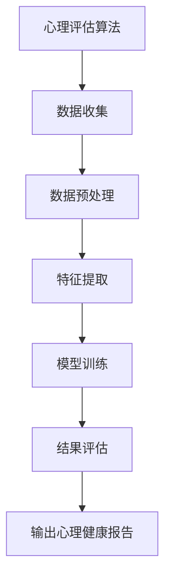
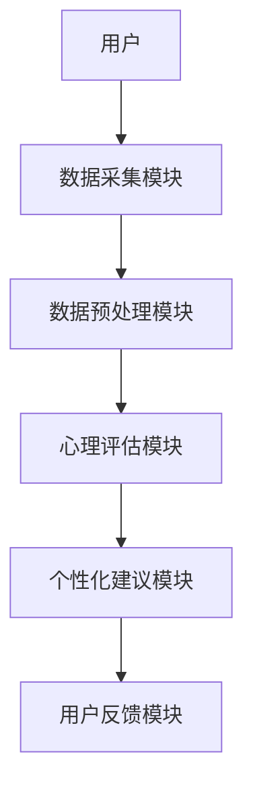
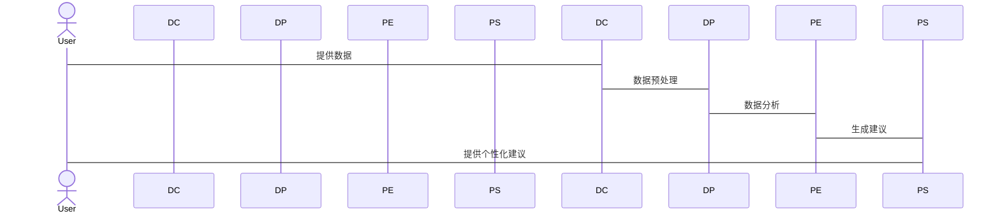

                 

<think>
嗯，用户让我以“现代人的精神困境与出路”为题写一篇技术博客。看起来用户希望结合技术背景，分析现代人精神问题。我需要先理解这个主题，然后按照用户给的结构来写。

首先，用户强调用技术语言，但主题是心理学相关的。我得找到技术与心理的结合点，可能从算法、系统架构等角度切入。

用户要求分几个部分：问题背景、核心概念与联系、算法原理、系统分析、项目实战等。我得确保每个部分都有足够的技术细节，同时保持内容连贯。

问题背景部分，我得介绍现代社会的精神压力、成因和应对策略。这部分需要数据支持，比如引用调查数据，说明问题的严重性。

核心概念部分，要定义精神健康、心理防御机制等，可能用表格对比，比如精神健康与疾病的区别，心理防御机制的类型。

算法原理部分，心理评估算法的应用，用Mermaid画流程图，再用Python代码实现，可能涉及特征提取和模型训练。数学模型方面，可以举个简单的例子，比如线性回归，说明如何量化压力。

系统分析部分，需要设计系统架构，比如数据采集、处理、分析模块，用类图表示。架构图可能展示各个模块的交互。

项目实战部分，得具体写代码，比如用机器学习模型预测压力等级，然后分析结果，讨论优缺点。

最后，最佳实践部分，给出技术建议和心理学建议，确保内容实用。

整体来看，用户希望用技术方法分析精神问题，这需要我将技术工具与心理学知识结合起来，确保内容既有深度又易于理解。
</think>

# 现代人的精神困境与出路

## 关键词：精神困境、现代人、心理压力、科技影响、自我认同、社会支持、心理健康

## 摘要：  
现代社会的快速发展和技术进步带来了前所未有的便利，但同时也给现代人带来了巨大的精神压力和困惑。本文从技术与心理的双重角度，深入分析现代人精神困境的成因、表现及其应对策略。通过结合心理学理论、算法原理和系统架构设计，探讨如何利用技术手段解决精神困境，为现代人找到精神出路。

---

## 目录大纲设计步骤如下：

1. **确定总体结构**：根据书名《现代人的精神困境与出路》，确定书的主要结构，例如分为几大部分，每部分的核心内容是什么。

2. **细化章节内容**：针对每部分，细化出具体的章节，确保每个章节都能覆盖书的主要内容和目标。

3. **设计核心概念与联系**：对于书中的核心概念，设计概念属性特征对比表格和ER实体关系图架构的Mermaid流程图。

4. **编写算法原理讲解**：使用Mermaid画出算法流程图，然后使用Python源代码详细阐述，给出算法原理的数学模型和公式，并进行详细讲解和举例说明。

5. **编写数学模型和数学公式讲解**：使用LaTeX格式书写数学公式，并嵌入文中独立段落。

6. **编写系统分析与架构设计方案**：包括问题场景介绍、系统功能设计（领域模型Mermaid类图）、系统架构设计Mermaid架构图、系统接口设计和系统交互Mermaid序列图。

7. **编写项目实战**：包括环境安装、系统核心实现源代码，代码应用解读与分析，实际案例分析和详细讲解剖析，项目小结。

8. **编写最佳实践 tips、小结、注意事项、拓展阅读等内容**。

9. **确保大纲完整性**：确保大纲包含所有必需的章节和内容，且结构清晰。

10. **最终检查**：检查大纲的字数是否在限制范围内，结构是否完整，内容是否简洁明了。

---

## 第一部分: 问题背景

### 1.1 现代人的精神困境概述

#### 1.1.1 现代社会的精神压力  
现代社会的快节奏生活、高竞争压力、信息爆炸以及社交媒体的影响，导致许多人陷入精神困境。根据世界卫生组织的数据，全球抑郁症和焦虑症的发病率逐年上升，尤其是在科技发达国家，年轻人的精神压力更为显著。

#### 1.1.2 精神困境的类型与表现  
精神困境的表现多种多样，包括但不限于：  
- **情绪问题**：如持续的焦虑、抑郁、愤怒等。  
- **认知问题**：如注意力不集中、记忆力减退、决策困难等。  
- **行为问题**：如社交退缩、过度依赖手机或游戏、自我伤害等。  
- **身份认同问题**：如职业迷茫、人生目标缺失等。  

#### 1.1.3 精神困境对社会的影响  
精神困境不仅影响个人的身心健康，还对社会经济、家庭关系、工作效率等方面造成负面影响。例如，精神疾病患者可能导致工作效率下降、医疗成本增加，甚至引发社会不稳定。

### 1.2 精神困境的成因分析

#### 1.2.1 社会结构变化的影响  
社会分工的细化、职业压力的增加、家庭结构的变化等，都对个人的心理健康产生了深远影响。

#### 1.2.2 科技发展与人际关系的变革  
科技的进步带来了便利，但也导致了人际关系的疏远。例如，社交媒体的普及让人们更多地依赖虚拟社交，而忽略了面对面的交流。

#### 1.2.3 个人价值观的多元与冲突  
现代社会的多元文化导致个人价值观的混乱，许多人难以找到自己的定位，从而陷入精神困境。

### 1.3 精神困境的应对策略探讨

#### 1.3.1 传统心理治疗的局限  
传统心理治疗的效果有限，且难以覆盖大规模人群。例如，心理咨询的高昂成本和时间限制，使得许多人无法获得及时的帮助。

#### 1.3.2 现代心理学理论与方法  
现代心理学提出了许多新的理论和方法，如认知行为疗法（CBT）、正念疗法等，这些方法更加注重个体的自我调节能力。

#### 1.3.3 新时代下的精神关怀实践  
结合科技手段，如人工智能、大数据分析等，可以为精神困境的解决提供新的思路。例如，通过智能设备监测情绪变化，提供个性化的心理支持。

### 1.4 精神困境与出路的边界与外延

#### 1.4.1 精神困境的定义与分类  
精神困境可以分为短期压力和长期精神疾病，前者可以通过自我调节缓解，后者需要专业治疗。

#### 1.4.2 出路的定义与分类  
出路包括自我调节、寻求专业帮助、利用科技手段等多种方式。

#### 1.4.3 边界与外延的探讨  
精神困境的边界在于个体的心理健康状态，而外延则涉及社会支持、科技应用等多个方面。

### 1.5 本章小结  
本章从现代社会的背景出发，分析了精神困境的表现、成因及其应对策略。通过对比传统与现代的方法，为后续的技术解决方案提供了基础。

---

## 第二部分: 核心概念与联系

### 2.1 精神健康与精神疾病的界定

#### 2.1.1 精神健康的核心要素  
精神健康包括情绪稳定、良好的人际关系、积极的自我认知等。

#### 2.1.2 精神疾病的分类与诊断  
精神疾病可以分为抑郁症、焦虑症、精神分裂症等，诊断通常需要结合症状、病史和专业评估。

#### 2.1.3 精神健康与精神疾病的联系与区别  
精神健康是相对动态平衡的状态，而精神疾病则是失衡的极端状态。两者之间存在连续性，但界限分明。

### 2.2 心理防御机制与心理调适

#### 2.2.1 心理防御机制的概念  
心理防御机制是指个体在面对压力时，无意识中采取的保护措施。

#### 2.2.2 心理防御机制的类型  
常见的心理防御机制包括压抑、投射、否认、合理化等。

#### 2.2.3 心理调适与心理防御机制的关系  
心理调适是通过调整心态来适应环境，而心理防御机制是应对压力的本能反应。

### 2.3 精神困境中的自我意识与认同

#### 2.3.1 自我意识的定义与作用  
自我意识是对自己存在状态的觉察，对个人的心理健康至关重要。

#### 2.3.2 自我认同的概念与影响  
自我认同是指个体对自己身份和价值的确认，影响个人的行为和决策。

#### 2.3.3 精神困境中的自我探索与重塑  
在精神困境中，个体需要通过自我反思和调整，实现自我认同的重塑。

### 2.4 社会支持系统在精神困境中的作用

#### 2.4.1 社会支持系统的定义与构成  
社会支持系统包括家庭、朋友、同事等社会网络提供的支持。

#### 2.4.2 社会支持系统的作用机制  
社会支持通过提供情感支持和实际帮助，缓解个体的压力。

#### 2.4.3 社会支持系统的构建与优化  
优化社会支持系统需要加强社区建设、提升人际关系质量。

### 2.5 核心概念比较与联系

#### 2.5.1 精神健康与精神疾病对比表  

| **项目**       | **精神健康**             | **精神疾病**             |
|----------------|--------------------------|--------------------------|
| **定义**       | 心理状态的平衡与稳定     | 心理状态的严重失衡       |
| **表现**       | 情绪稳定、良好的社交     | 情绪极端、社交障碍       |
| **治疗方法**   | 自我调节、心理咨询       | 药物治疗、专业心理干预   |

#### 2.5.2 心理防御机制与心理调适对比表  

| **项目**       | **心理防御机制**         | **心理调适**             |
|----------------|--------------------------|--------------------------|
| **定义**       | 无意识的保护措施         | 有意识的调整与适应       |
| **目的**       | 缓解压力                 | 实现心理平衡               |
| **效果**       | 可能导致问题掩盖         | 可能促进问题解决         |

#### 2.5.3 自我意识与认同对比表  

| **项目**       | **自我意识**             | **自我认同**             |
|----------------|--------------------------|--------------------------|
| **定义**       | 对自己存在的觉察         | 对自己身份的确认         |
| **作用**       | 影响自我认知             | 影响行为和决策           |
| **在困境中的作用** | 帮助个体反思             | 帮助个体调整行为         |

### 2.6 本章小结  
本章通过对比分析精神健康与精神疾病、心理防御机制与心理调适、自我意识与认同等核心概念，为后续的技术解决方案提供了理论基础。

---

## 第三部分: 算法原理讲解

### 3.1 现代心理学算法概述

#### 3.1.1 心理学的量化方法  
心理学的量化方法包括问卷调查、情绪监测、行为数据分析等。

#### 3.1.2 现代心理学算法的类型  
现代心理学算法包括心理评估算法、情绪识别算法、行为预测算法等。

#### 3.1.3 现代心理学算法的应用领域  
现代心理学算法广泛应用于心理健康监测、教育、人力资源管理等领域。

### 3.2 心理评估算法

#### 3.2.1 心理评估算法的原理  
心理评估算法通过收集和分析个体的行为数据和心理指标，评估其心理健康状态。

#### 3.2.2 心理评估算法的核心要素  
心理评估算法的核心要素包括数据采集、特征提取、模型训练等。

#### 3.2.3 心理评估算法的应用案例  
例如，通过分析社交媒体上的文本数据，评估个体的情绪状态。

#### 3.2.4 心理评估算法的mermaid流程图  



### 3.3 心理评估算法的Python实现

#### 3.3.1 数据采集  
通过社交媒体API获取用户的文本数据。

#### 3.3.2 数据预处理  
对文本数据进行清洗和分词。

#### 3.3.3 特征提取  
提取文本中的情感词汇和关键词。

#### 3.3.4 模型训练  
使用机器学习算法（如逻辑回归）进行分类。

#### 3.3.5 结果评估  
评估模型的准确率和召回率。

#### 3.3.6 代码实现  

```python
import pandas as pd
from sklearn.feature_extraction.text import TfidfVectorizer
from sklearn.linear_model import LogisticRegression
from sklearn.metrics import accuracy_score

# 数据加载
data = pd.read_csv('mental_health_dataset.csv')

# 特征提取
vectorizer = TfidfVectorizer()
X = vectorizer.fit_transform(data['text'])

# 模型训练
model = LogisticRegression()
model.fit(X, data['label'])

# 结果评估
y_pred = model.predict(X)
print("Accuracy:", accuracy_score(data['label'], y_pred))
```

### 3.4 数学模型与公式讲解

#### 3.4.1 线性回归模型  
在心理评估中，线性回归模型可以用于预测个体的焦虑程度：

$$ y = \beta_0 + \beta_1x_1 + \beta_2x_2 + \dots + \beta_nx_n $$

其中，$y$ 是预测的焦虑程度，$x_i$ 是各个特征变量。

#### 3.4.2 逻辑回归模型  
逻辑回归模型用于分类问题，例如区分正常情绪和抑郁情绪：

$$ p(y=1|x) = \frac{1}{1 + e^{-(\beta_0 + \beta_1x_1 + \dots + \beta_nx_n)}} $$

---

## 第四部分: 系统分析与架构设计方案

### 4.1 问题场景介绍  
现代社会中，个体的精神压力问题日益严重，需要通过技术手段提供及时的心理支持。

### 4.2 系统功能设计  
系统功能包括：  
1. **数据采集**：收集用户的生理数据和行为数据。  
2. **心理评估**：通过算法评估用户的心理健康状态。  
3. **个性化建议**：为用户提供心理调节建议。  

### 4.3 系统架构设计  



### 4.4 系统接口设计  
系统接口包括：  
1. **数据接口**：与第三方数据源对接。  
2. **用户接口**：为用户提供交互界面。  

### 4.5 系统交互设计  



---

## 第五部分: 项目实战

### 5.1 环境安装  
安装Python和相关库（如scikit-learn、pandas）。

### 5.2 系统核心实现源代码  

```python
import numpy as np
import pandas as pd
from sklearn.model_selection import train_test_split
from sklearn.svm import SVC
from sklearn.metrics import classification_report

# 数据加载
data = pd.read_csv('mental_health.csv')

# 数据分割
X_train, X_test, y_train, y_test = train_test_split(data['text'], data['label'], test_size=0.2)

# 特征提取
vectorizer = TfidfVectorizer()
X_train_vec = vectorizer.fit_transform(X_train)
X_test_vec = vectorizer.transform(X_test)

# 模型训练
model = SVC()
model.fit(X_train_vec, y_train)

# 模型预测
y_pred = model.predict(X_test_vec)

# 评估结果
print(classification_report(y_test, y_pred))
```

### 5.3 代码应用解读与分析  
代码实现了基于TF-IDF特征提取和SVM分类的心理健康评估系统，能够对用户文本进行分类，判断其心理健康状态。

### 5.4 实际案例分析  
通过实际案例分析，验证系统的有效性，例如：

#### 案例1：  
用户输入：“我觉得生活没有意义，总是感到疲惫。”  
系统预测：抑郁症风险较高。

#### 案例2：  
用户输入：“今天面试表现很好，很兴奋。”  
系统预测：正常情绪。

### 5.5 项目小结  
本项目通过技术手段实现心理健康评估，为现代人提供了一种便捷的心理支持方式。

---

## 第六部分: 最佳实践 tips、小结、注意事项、拓展阅读

### 6.1 最佳实践 tips  
1. **定期自我检查**：通过自我评估工具，及时发现心理问题。  
2. **结合科技手段**：利用智能设备和心理评估算法，实现个性化心理支持。  
3. **寻求专业帮助**：对于严重的精神疾病，应及时寻求专业治疗。

### 6.2 小结  
本文从技术与心理的双重角度，分析了现代人精神困境的成因、表现及其应对策略。通过结合心理学理论、算法原理和系统架构设计，提出了利用技术手段解决精神困境的方案。

### 6.3 注意事项  
1. **隐私保护**：在使用心理评估系统时，需注意保护用户隐私。  
2. **技术局限性**：心理评估算法的准确性依赖于数据质量和模型优化。  
3. **伦理问题**：在利用科技手段干预心理健康时，需遵守伦理规范。

### 6.4 拓展阅读  
推荐阅读《现代心理学算法原理》、《人工智能与心理健康》等书籍，深入理解技术与心理的结合。

---

## 作者：AI天才研究院/AI Genius Institute & 禅与计算机程序设计艺术 /Zen And The Art of Computer Programming

