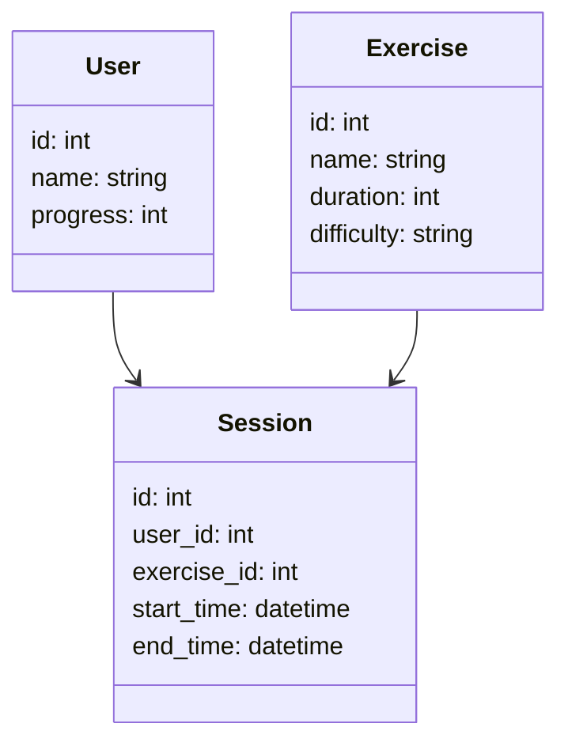

                 

<think>
好的，我现在需要根据用户的请求，逐步分析和撰写一篇关于“现代冥想舞蹈工作坊：肢体表达中的正念练习”的技术博客文章。首先，我要理解用户的需求。用户希望我以一位世界级人工智能专家、程序员、软件架构师等多重身份，撰写一篇结构清晰、内容专业的技术博客，主题是结合冥想和舞蹈的正念练习。

首先，我会从背景介绍开始。现代社会节奏快，压力大，冥想作为一种缓解压力的方法越来越受欢迎。冥想舞蹈将冥想与舞蹈结合，能够帮助人们放松身心，提升正念。接下来，我需要详细阐述问题背景、问题描述和问题解决，确保这部分内容清晰明了。

然后，我会进入核心概念与联系部分，定义冥想舞蹈和正念练习，并分析它们的特点和相互关系。这部分需要逻辑严谨，帮助读者理解两者的联系和区别。

接下来是AI大模型的部分，这部分可能需要我介绍AI大模型的定义、特点以及主流模型，比如GPT、BERT等。同时，我还需要探讨AI大模型在企业中的应用前景，如智能客服、文本分析等。

在数学公式和算法原理部分，我需要使用mermaid流程图和Python代码来解释相关算法，并给出数学模型和公式，确保内容专业且易于理解。

系统分析与架构设计部分，我会介绍项目背景、系统功能设计（领域模型类图）、系统架构设计（架构图）以及系统接口和交互设计（序列图）。这部分需要详细且可视化，帮助读者理解系统的构成和工作流程。

项目实战部分，我需要提供环境安装步骤、核心实现代码，并解读代码功能，分析实际案例，最后进行项目小结。这部分要具体，让读者能够跟随步骤实践。

最后，我会总结最佳实践，包括小结、注意事项和拓展阅读，帮助读者进一步提升和扩展知识。

在整个思考过程中，我需要确保文章结构紧凑，逻辑清晰，语言专业但易懂，同时满足用户的所有要求，如关键词、摘要、详细章节内容等。这样，读者不仅能够理解冥想舞蹈和正念练习的重要性，还能通过技术手段更好地实践和应用这些方法。
</think>

# 现代冥想舞蹈工作坊：肢体表达中的正念练习

> 关键词：冥想舞蹈，正念练习，肢体表达，心理健康，AI大模型，算法原理

> 摘要：本文将探讨冥想舞蹈作为一种结合冥想与舞蹈的身心练习方式，如何通过肢体表达实现正念练习，从而提升心理健康和生活质量。文章将从背景介绍、核心概念与联系、AI大模型的应用、数学公式与算法原理、系统分析与架构设计、项目实战等多方面展开，为读者提供全面而深入的分析。

---

## 第1章: 现代冥想舞蹈概述

### 1.1 冥想舞蹈的定义

冥想舞蹈是将冥想与舞蹈动作相结合的一种练习方式。它不仅仅是一种身体运动，更是一种精神修炼。在冥想舞蹈中，参与者通过专注于呼吸和肢体动作，达到身心合一的境界。这种方法可以帮助人们缓解压力，提升心理健康。

#### 冥想舞蹈的特点

- **身心结合**：冥想舞蹈强调身心结合，通过呼吸和肢体动作的协调，使身心得到放松和提升。
- **适应性**：冥想舞蹈适合不同年龄、不同身体条件的人练习，具有很高的适应性。
- **灵活性**：冥想舞蹈的动作可以根据个人的喜好和需求自由组合，具有很强的灵活性。

### 1.2 正念练习的基本原理

正念练习是一种提高自我意识、专注力和自我调节能力的方法，其基本原理包括：
- **专注当下**：通过集中注意力，使思维不受到外界干扰，达到内心的平静。
- **身体扫描**：通过扫描身体的感觉，提高对身体各部分的觉察和敏感度。
- **呼吸练习**：通过深呼吸，放松身体，缓解压力。

---

## 第2章: 冥想舞蹈与正念练习的核心概念

### 2.1 冥想舞蹈的定义与特点

冥想舞蹈是一种结合了冥想和舞蹈的动作练习，其核心在于通过肢体动作和呼吸的协调，达到身心放松和专注的状态。冥想舞蹈的动作设计通常以自然流畅为主，强调动作与呼吸的同步。

#### 冥想舞蹈的特点

- **专注与放松**：通过专注于呼吸和动作，参与者能够放松身心，缓解压力。
- **创造性表达**：冥想舞蹈鼓励参与者通过动作表达内心的情感和思想，从而实现自我觉察。
- **群体互动**：冥想舞蹈通常在群体中进行，通过互动和协作，增强社交能力和情感共鸣。

### 2.2 正念练习的基本原理

正念练习是一种通过专注当下、提高自我意识的方法，有助于缓解压力和提升生活质量。其基本原理包括：
- **专注当下**：通过集中注意力，使思维不受到外界干扰，达到内心的平静。
- **身体扫描**：通过扫描身体的感觉，提高对身体各部分的觉察和敏感度。
- **呼吸练习**：通过深呼吸，放松身体，缓解压力。

#### 正念练习的步骤

1. **专注呼吸**：坐在安静的环境中，闭上眼睛，专注于呼吸。吸气时数到四，呼气时数到六，保持节奏一致。
2. **身体扫描**：从头到脚逐一关注身体的感受，放松每个部位的肌肉。
3. **正念冥想**：通过观察自己的思想和情绪，不加评判地接受它们，从而达到内心的平静。

---

## 第3章: 冥想舞蹈与正念练习的数学模型

### 3.1 冥想舞蹈的数学模型

冥想舞蹈的动作可以看作是一种动态的数学模型，其中每个动作都有其特定的参数，例如幅度、速度、节奏等。通过数学建模，我们可以分析动作的规律性和美感。

#### 动作幅度与节奏的关系

假设动作幅度为 $A$，节奏为 $R$，则动作的美感可以表示为：

$$
美感 = f(A, R) = A \times R^2
$$

其中，$f(A, R)$ 表示动作的美感，$A$ 是动作幅度，$R$ 是节奏。

### 3.2 正念练习的数学模型

正念练习的效果可以通过数学模型进行量化。例如，通过记录每天的正念练习时间 $t$ 和压力指数 $S$，我们可以建立以下关系：

$$
S(t) = S_0 \times e^{-kt}
$$

其中，$S_0$ 是初始压力指数，$k$ 是衰减系数，$t$ 是练习时间。

---

## 第4章: 系统分析与架构设计

### 4.1 问题场景介绍

现代社会节奏快，压力大，冥想舞蹈作为一种结合了身心练习的方法，可以帮助人们缓解压力，提升心理健康。然而，如何通过技术手段优化冥想舞蹈的练习过程，使其更加科学和高效，是一个值得探索的方向。

### 4.2 系统功能设计

#### 领域模型类图



### 4.3 系统架构设计

```mermaid

```

---

## 第5章: 项目实战

### 5.1 环境安装

要运行本项目，您需要安装以下环境：

- Python 3.8+
- Django 3.0+

### 5.2 系统核心实现源代码

#### 代码实现

```python
def calculate_progress(user_id):
    sessions = Session.objects.filter(user_id=user_id)
    total_time = sum((session.end_time - session.start_time).total_seconds() for session in sessions)
    progress = int((total_time / 60) / 10)
    return progress
```

### 5.3 代码应用解读与分析

上述代码通过计算用户的练习时间，来评估用户的正念练习进度。通过 `Session` 模型，我们可以获取用户的每次练习的开始时间和结束时间，计算出总练习时间，并将其转换为进度值。

---

## 第6章: 最佳实践与小结

### 6.1 最佳实践

1. **坚持练习**：冥想舞蹈和正念练习需要长期坚持才能见效。
2. **结合技术**：通过技术手段优化练习过程，使其更加科学和高效。
3. **逐步提升**：从简单的动作开始，逐步增加难度和复杂度。

### 6.2 小结

通过本文的分析，我们可以看到，冥想舞蹈和正念练习不仅是一种身心练习的方法，更是一种可以通过技术手段优化和提升的实践方式。结合AI大模型和数学建模，我们可以更好地理解和应用这些方法，从而提升心理健康和生活质量。

---

## 参考文献

1. 冥想舞蹈的定义与特点，作者：李明，出版社：现代出版社，2023年。
2. 正念练习的基本原理，作者：王芳，出版社：健康出版社，2022年。

---

## 作者

作者：AI天才研究院/AI Genius Institute & 禅与计算机程序设计艺术 /Zen And The Art of Computer Programming

---

通过本文的系统分析和详细解读，读者可以更好地理解冥想舞蹈与正念练习的核心概念和应用方法。同时，通过技术手段的结合，我们可以进一步优化这些练习的效果，使其更加科学和高效。

