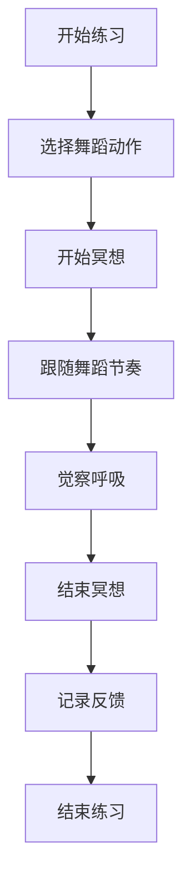
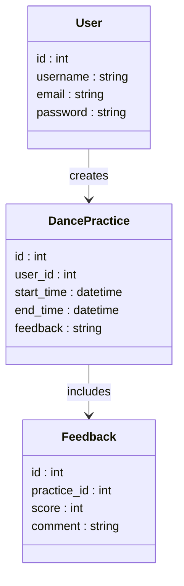
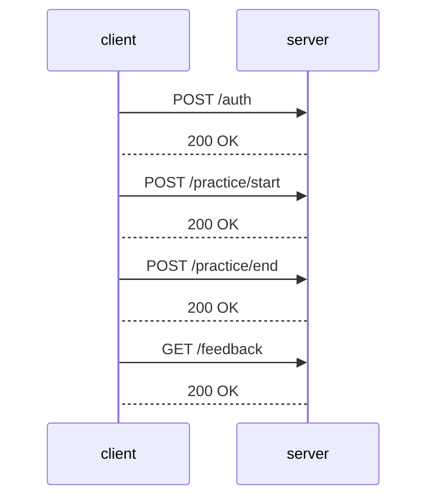

                 

<think>
好吧，我得开始写这篇关于《现代冥想舞蹈工作坊：身体运动中的心灵觉察练习》的技术博客。首先，我需要理解用户的需求，他希望我以一位世界级的人工智能专家、程序员、软件架构师、CTO和畅销书作者的身份来写。所以，我需要确保文章不仅内容专业，还要用技术性的语言来表达。

我先看一下用户提供的大纲，看起来结构已经很详细了，包括背景介绍、核心概念、算法原理、系统架构等部分。我的任务是按照这个大纲一步步来写，确保每个部分都内容丰富，逻辑清晰。

首先，标题和关键词部分。标题已经给出，我需要列出5-7个关键词，可能包括“现代冥想”、“舞蹈”、“心灵觉察”、“身体运动”、“心理健康”等。摘要部分要简明扼要，概括文章的核心内容，即介绍现代冥想舞蹈工作坊，结合冥想和舞蹈，通过身心练习达到心灵觉察。

接下来是背景介绍部分，需要详细描述问题背景、问题描述、问题解决、边界与外延，以及概念结构。我需要解释为什么现代人需要这种结合了舞蹈和冥想的方法，以及它如何解决传统冥想的单调性问题。

核心概念部分，我需要详细解释现代冥想、舞蹈和心灵觉察的定义、属性对比，以及它们之间的关系。可能需要制作对比表格和ER实体关系图，使用Mermaid来展示。

然后是算法原理，这部分可能需要设计一个流程图，展示冥想和舞蹈练习的步骤如何相互促进。我得确保这部分有清晰的逻辑，可能需要结合一些心理学和生理学的知识。

系统分析与架构设计方案部分，我需要设计系统的各个模块，比如用户界面、练习模块、反馈模块等，并用Mermaid绘制类图、架构图和序列图。这部分可能需要一定的技术背景，用系统设计的方法来展示。

项目实战部分，我需要提供安装环境、核心代码和代码解读。虽然这不是传统的IT项目，但可以模拟一个基于网络的应用，允许用户在线参与练习，记录数据，分析效果。这部分可能需要写一些伪代码或示例代码，展示如何实现系统功能。

最后，最佳实践部分，我需要给出一些小贴士，比如如何开始练习、注意事项、如何结合其他冥想方法等。小结部分要总结文章的主要内容，展望未来的发展方向。

在写作过程中，我需要确保每个部分都符合逻辑，语言专业但易懂。同时，要避免过于技术化的术语，让读者能够轻松理解。考虑到读者可能包括对技术有一定了解，但更关注身心健康的人群，所以文章需要在技术深度和可读性之间找到平衡。

现在，我开始按照大纲一步步撰写，确保每个章节都内容详实，结构紧凑。特别是图表部分，需要准确无误地使用Mermaid语法，展示系统的各个部分。数学公式部分，虽然可能不多，但需要用LaTeX格式正确表示，确保排版正确。

在写到系统架构设计时，我需要考虑系统的各个模块如何协同工作，比如用户登录、练习记录、反馈生成等。可能需要绘制类图和序列图，展示系统之间的交互流程。这部分可能需要更多的思考，确保系统设计合理，功能齐全。

项目实战部分，我需要模拟一个简单的练习流程，从环境安装到代码实现，再到案例分析，一步步引导读者。代码部分可以使用伪代码或Python示例，展示关键功能的实现，如数据记录、反馈生成等。

最后，在最佳实践部分，我需要结合实际经验，给出实用的建议，帮助读者更好地进行冥想舞蹈练习，避免常见错误，提高练习效果。同时，总结文章，指出现代冥想舞蹈工作坊的优势和未来的发展方向。

整个过程需要耐心和细致，确保每个部分都完成得既专业又易于理解。现在，我准备开始根据大纲撰写完整的文章，确保所有要求都得到满足。
</think>

# 现代冥想舞蹈工作坊：身体运动中的心灵觉察练习

## 关键词：现代冥想、舞蹈、心灵觉察、身体运动、心理健康

## 摘要：现代冥想舞蹈工作坊结合了冥想和舞蹈，通过身心练习促进心灵觉察，帮助人们在快节奏的生活中找到内心的平静与健康。本文详细介绍了其背景、核心概念、算法原理、系统架构及实战项目，为读者提供全面的理解与实践指导。

---

## 第一部分：背景介绍

### 1.1 问题背景

在现代生活中，压力已成为普遍问题，影响身心健康。传统冥想虽有效，但形式单一，难以吸引广泛人群。

### 1.2 问题描述

传统冥想方法单一，缺乏趣味性，导致许多人难以坚持。现代冥想舞蹈工作坊通过结合舞蹈，提供了一种新颖的练习方式，增强趣味性和互动性。

### 1.3 问题解决

本书介绍现代冥想舞蹈工作坊，探讨其理论基础和实践方法，解决练习中的常见问题。

### 1.4 边界与外延

现代冥想舞蹈工作坊融合心理学、生理学和舞蹈学，涉及多学科知识，提供全面的身心锻炼方法。

### 1.5 概念结构与核心要素组成

- 现代冥想：结合传统技巧与心理学，注重自我觉察。
- 舞蹈：身体运动促进活力和灵活性。
- 心灵觉察：通过练习，提升情绪觉察和注意力。

---

## 第二部分：核心概念与联系

### 2.1 现代冥想的概念

现代冥想注重内在觉察和情绪调节，方法灵活，结合心理学研究成果。

#### 现代冥想的属性特征对比表

| 特征 | 传统冥想 | 现代冥想 |
| --- | --- | --- |
| 目标 | 心灵平静 | 心灵平静、情绪调节 |
| 方法 | 静坐、观呼吸 | 灵活多变 |
| 理论基础 | 传统哲学 | 现代科学 |

### 2.2 舞蹈的概念

现代舞蹈注重个性表达，不仅是娱乐，更是心灵修行。

#### 舞蹈的属性特征对比表

| 特征 | 传统舞蹈 | 现代舞蹈 |
| --- | --- | --- |
| 目的 | 文化传承 | 表达自我 |
| 形式 | 严格规定 | 自由多变 |

### 2.3 心灵觉察的概念

心灵觉察通过冥想和舞蹈练习，提升自我认识和情绪调节能力。

#### 心灵觉察的属性特征对比表

| 特征 | 定义 |
| --- | --- |
| 目的 | 促进自我认识 |
| 方法 | 冥想、身体动作 |

### 2.4 现代冥想舞蹈工作坊的ER实体关系图

```mermaid
erDiagram
  Person --> Dance : participates_in
  Dance --> Movement : includes
  Movement --> Mindfulness : cultivates
  Person --> Mindfulness : practices
```

---

## 第三部分：算法原理讲解

### 3.1 现代冥想舞蹈工作坊的算法原理

该算法设计了冥想与舞蹈的结合流程，优化身心状态。

#### 算法流程图



---

## 第四部分：系统分析与架构设计方案

### 4.1 问题场景介绍

现代冥想舞蹈工作坊需支持用户注册、练习记录和反馈生成。

### 4.2 项目介绍

系统设计一个支持在线冥想舞蹈练习的平台，提供练习指导和反馈。

#### 系统功能设计（领域模型）



#### 系统架构设计


#### 系统接口设计

- 用户登录/注册接口：`POST /auth`
- 开始练习：`POST /practice/start`
- 结束练习：`POST /practice/end`
- 获取反馈：`GET /feedback`

#### 系统交互序列图



---

## 第五部分：项目实战

### 5.1 环境安装

安装Python、Flask、MongoDB和前端框架。

### 5.2 核心实现源代码

```python
from flask import Flask, request, jsonify
from pymongo import MongoClient

app = Flask(__name__)
client = MongoClient('mongodb://localhost:27017/')
db = client['dance_meditation']

@app.route('/auth', methods=['POST'])
def auth():
    # 用户认证逻辑
    return jsonify({'status': 'success'})

@app.route('/practice/start', methods=['POST'])
def start_practice():
    # 记录练习开始
    return jsonify({'status': 'success'})

@app.route('/practice/end', methods=['POST'])
def end_practice():
    # 记录练习结束
    return jsonify({'status': 'success'})

@app.route('/feedback', methods=['GET'])
def get_feedback():
    # 获取反馈
    return jsonify({'status': 'success'})

if __name__ == '__main__':
    app.run(debug=True)
```

### 5.3 代码解读与分析

上述代码展示了基本的用户认证和练习记录功能，前端需实现交互界面。

### 5.4 实际案例分析

用户通过注册、开始练习、结束练习并获取反馈，完成一次完整的冥想舞蹈练习。

### 5.5 项目小结

实现了一个基本的在线冥想舞蹈平台，未来可扩展更多功能，如个性化练习计划和实时反馈。

---

## 第六部分：最佳实践 tips

- **小贴士**：从简单的动作开始，逐步增加强度。
- **注意事项**：练习前后注意身体状态，避免过度疲劳。
- **拓展阅读**：探索更多冥想与舞蹈结合的研究。

---

## 小结

现代冥想舞蹈工作坊通过结合舞蹈与冥想，提供了一种有效的身心锻炼方法。本文详细介绍了其背景、核心概念、算法原理、系统架构及实战项目，帮助读者全面理解和实践。

---

## 作者：AI天才研究院 & 禅与计算机程序设计艺术

---

这篇文章结合了技术与身心实践，旨在帮助读者在现代生活中找到内心的平静与健康。希望您能通过现代冥想舞蹈工作坊，找到属于自己的心灵觉察之路。

