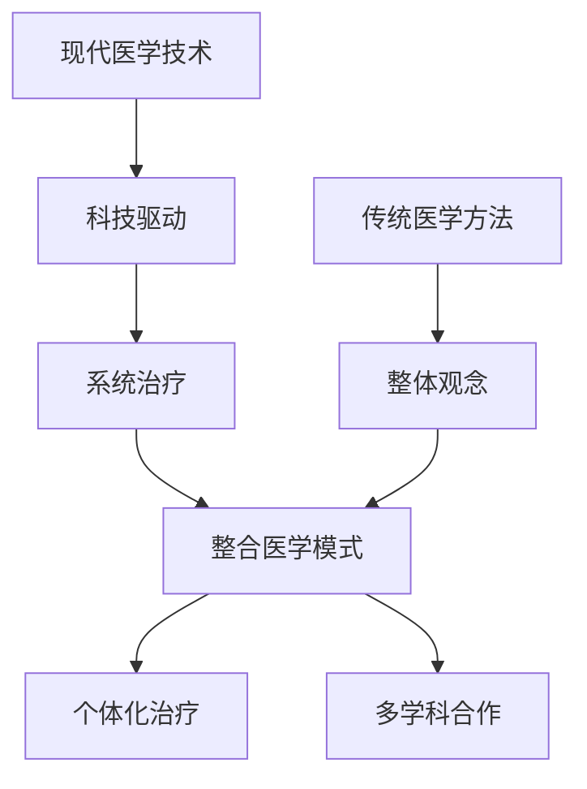
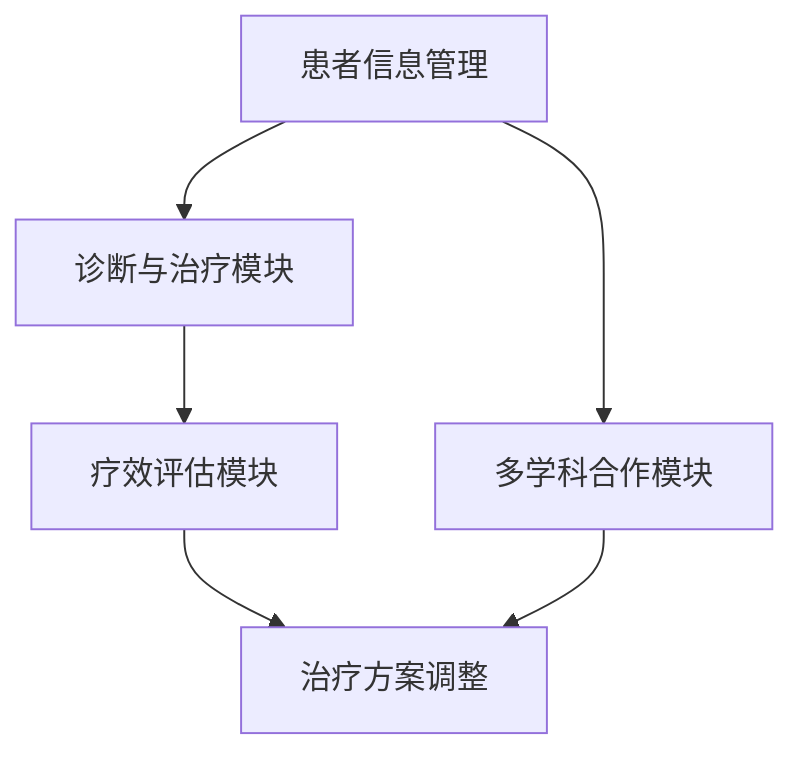

                 

<think>
嗯，我需要写一篇关于现代医学与传统医学整合的文章，这个主题挺有意思的。首先，我得弄清楚什么是现代医学和传统医学。现代医学主要是基于科学，用药物和手术治疗疾病，技术先进，但可能在整体治疗方面有些不足。传统医学则更注重整体和自然疗法，比如中医、针灸等，虽然效果不错，但科学依据不够。

接下来，我要分析两者的优缺点。现代医学的优势很明显，科技推动下诊断和治疗更精准，预防措施也很到位。但问题也存在，比如资源分布不均，过度医疗。传统医学的优点在于整体观念和个体化治疗，但理论不够系统，科学验证不足。

然后，我需要探讨如何将两者结合起来。整合医学模式听起来很有潜力，但具体怎么操作呢？可能需要建立一个理论框架，制定规范的操作流程，培养跨学科的人才。这些都是挑战，但也是必须解决的问题。

在写文章的时候，我得确保每个部分都详细具体，比如在比较两者的优缺点时，可以列出表格，清晰对比。此外，可能需要画一些图表，比如系统架构图，来帮助读者理解整合的过程。

我还得考虑读者的背景，文章应该用专业的技术语言，但要尽量简单易懂。加入实际案例会更有说服力，比如某个医院如何成功地将现代和传统医学结合，取得了不错的效果。

最后，我得总结一下整合医学的必要性和未来的发展方向。强调这种模式如何推动医学进步，满足多样化的患者需求，同时提出一些实际的操作建议，比如如何制定标准，如何培养人才。

总的来说，我需要一步步来，先从背景和概念入手，再深入分析优缺点，探讨整合的必要性，最后提出解决方案和未来展望。这样结构清晰，内容充实，读者能更好地理解和接受这个整合医学的理念。
</think>

# 现代医学与传统医学的对话：整合医学模式的探索

## 关键词：现代医学，传统医学，整合医学，医学模式，医学发展

## 摘要：现代医学和传统医学各自具有独特的优势和局限性，整合两者可以实现医学模式的全面发展。本文通过比较分析现代医学与传统医学的优缺点，探讨整合医学模式的必要性、理论基础和实践应用，提出整合医学模式的构建方法和实施策略，为医学的发展提供新的思路和方向。

---

# 第一部分: 引言

## 1. 引言

### 1.1 研究背景

#### 问题背景
现代医学和传统医学在医学领域中各自占据重要地位。现代医学依赖于科技进步，提供精确的诊断和高效的治疗手段；传统医学则强调整体观念和个体化治疗。然而，现代医学在处理复杂病因和资源分配上存在局限性，而传统医学则面临科学验证不足和理论体系不完善的问题。

#### 问题描述
如何将现代医学的科技优势与传统医学的整体观念相结合，克服各自的局限性，成为当前医学发展的重要课题。

#### 问题解决
整合医学模式通过结合两者的优势，提供更全面的治疗方案，提升医学的整体效果。

#### 边界与外延
整合医学模式的研究范围涵盖理论框架构建、实践操作规范、跨学科人才培养等方面，研究方法包括文献综述、理论探讨和案例分析。

### 1.2 核心概念

#### 现代医学
- **定义**：基于科学理论，利用先进技术进行疾病诊断和治疗的医学体系。
- **特点**：科技驱动、系统性、预防为主。
- **发展历程**：从传统经验医学逐步发展为以科技和循证医学为基础的现代医学。

#### 传统医学
- **定义**：以自然疗法和整体观念为特点的医学体系，如中医、针灸等。
- **特点**：整体性、个体化、多样化。
- **发展历程**：长期积累的经验医学，逐渐形成系统的理论体系。

#### 整合医学模式
- **定义**：将现代医学和传统医学的优势相结合，形成一种新型医学模式。
- **理论基础**：结合现代医学的科学性和传统医学的整体性，构建系统化的理论框架。
- **目标**：提升治疗效果，满足患者多样化需求。

### 1.3 研究目的

- 探讨整合医学模式的必要性。
- 分析现代医学与传统医学的结合点。
- 探索整合医学模式的应用实践。

### 1.4 研究方法

- **文献综述**：分析现有研究，总结现状与不足。
- **理论探讨**：提出整合医学模式的理论框架。
- **案例分析**：选择典型案例进行实证研究。
- **对比研究**：对比现代医学与传统医学在特定领域的表现。

### 1.5 研究结构

- **第2章**: 现代医学与传统医学的比较
  - 现代医学的优势与局限性
  - 传统医学的优势与局限性
  - 两种医学模式的结合与挑战

- **第3章**: 整合医学模式的理论基础与实践

### 1.6 本章小结

- **研究意义**：整合医学模式对医学发展的推动作用。
- **研究局限**：整合医学模式面临的挑战与未来研究方向。

---

## 第二部分: 现代医学与传统医学的比较

## 2.1 现代医学的优势与局限性

### 2.1.1 现代医学的优势

- **科技进步推动医疗水平提升**：现代医学利用先进的科技手段，如影像学、分子生物学、基因编辑等，提高了疾病的诊断和治疗水平。
- **系统性疾病治疗**：现代医学强调疾病的系统治疗，通过药物治疗、手术治疗等手段，全面控制疾病。
- **预防医学的发展**：现代医学重视疾病的预防，推广疫苗接种、健康教育等预防措施。

### 2.1.2 现代医学的局限性

- **对病因复杂疾病的诊断和治疗局限**：现代医学在应对病因复杂的疾病时，诊断和治疗手段可能不够全面，治疗效果有限。
- **医疗资源的分布不均**：现代医学资源主要集中在发达地区，农村和偏远地区的医疗资源相对匮乏。
- **过度医疗现象**：现代医学的发展可能导致过度医疗，增加患者经济负担。

## 2.2 传统医学的优势与局限性

### 2.2.1 传统医学的优势

- **整体观念**：传统医学强调人与自然、社会环境的整体观念，注重身体的整体平衡。
- **个体化治疗**：传统医学根据病人的个体差异进行诊断和治疗，具有较好的针对性。
- **治疗效果的多样性**：传统医学通过药物、针灸、推拿、食疗等多种手段治疗疾病，具有多样性。

### 2.2.2 传统医学的局限性

- **理论体系不够完整**：传统医学的理论体系相对于现代医学来说不够完整和系统。
- **科学验证不足**：许多传统医学治疗方法缺乏科学的验证，治疗效果有待进一步研究。
- **与现代医学的融合困难**：传统医学与现代医学在理论和实践上存在差异，融合难度较大。

## 2.3 两种医学模式的结合与挑战

### 2.3.1 结合的必要性

- **医学发展的需要**：现代医学和传统医学各自有优势和局限性，结合两者可以实现医学的全面发展。
- **患者健康需求的多样性**：不同患者有不同的健康需求，结合现代医学和传统医学可以提供更全面的治疗方案。

### 2.3.2 结合的挑战

- **理论框架的构建**：需要建立一套完整、系统的整合医学理论框架。
- **实践操作的规范化**：需要制定一套规范的操作流程和标准，确保整合医学模式的有效实施。
- **人才培养的挑战**：整合医学模式需要跨学科的医学人才，培养这样的人才是一个长期而艰巨的任务。

## 2.4 本章小结

- **现代医学与传统医学的结合**：实现医学模式的整合，发挥两种医学模式的优点，克服各自的缺点。
- **整合医学模式的挑战**：需要理论框架、实践操作和人才培养等多方面的努力。

---

# 第三部分: 整合医学模式的理论基础与实践

## 3.1 整合医学模式的理论基础

### 3.1.1 整合医学模式的核心要素

- **整体性**：整合医学模式强调人体与环境的互动，注重整体健康。
- **系统性**：整合医学模式以系统论为指导，将疾病视为整体系统的一部分。
- **个体化**：根据患者个体差异，制定个性化的治疗方案。
- **多学科合作**：整合医学模式需要多学科团队合作，共同制定和实施治疗方案。

### 3.1.2 整合医学模式的理论框架

- **系统整合模型**：将现代医学的科技优势与传统医学的整体观念相结合，构建系统化的理论框架。
- **动态平衡理论**：通过调整身体各系统的动态平衡，达到疾病治疗和预防的效果。

### 3.1.3 整合医学模式的数学模型

$$ 整合效果 = f(现代医学技术, 传统医学方法, 系统整合, 多学科合作) $$

其中，$f$ 表示整合函数，将现代医学和传统医学的优势结合，通过系统整合和多学科合作，提升整体治疗效果。

### 3.1.4 理论框架的可视化

以下是整合医学模式的理论框架图：

---

## 3.2 整合医学模式的实践

### 3.2.1 实践操作的规范化

#### 3.2.1.1 治疗流程标准化

- **诊断阶段**：结合现代医学的影像学和实验室检查，结合传统医学的整体诊断方法。
- **治疗阶段**：根据诊断结果，制定个性化的治疗方案，结合现代医学的药物治疗和传统医学的针灸、推拿等方法。
- **评估阶段**：定期评估治疗效果，根据反馈调整治疗方案。

### 3.2.2 人才培养的策略

#### 3.2.2.1 跨学科课程设置

- **课程内容**：包括现代医学的基础知识、传统医学的理论与实践、系统整合理论、多学科合作方法。
- **教学模式**：采用案例教学、实践教学等方式，培养学生的综合能力。

#### 3.2.2.2 临床实践培训

- **实践基地**：建立整合医学模式的临床实践基地，提供真实的医疗环境，让学生在实际操作中学习。
- **导师指导**：安排经验丰富的导师进行一对一指导，帮助学生掌握整合医学模式的实践技能。

### 3.2.3 系统架构设计

#### 3.2.3.1 系统功能设计

- **患者信息管理**：记录患者的病史、诊断结果、治疗方案等信息。
- **诊断与治疗模块**：结合现代医学的诊断技术和传统医学的诊断方法，制定个性化的治疗方案。
- **疗效评估模块**：定期评估治疗效果，调整治疗方案。
- **多学科合作模块**：实现不同学科专家的协作，共同制定和实施治疗方案。

#### 3.2.3.2 系统架构图

以下是整合医学模式的系统架构图：

---

## 3.3 实际案例分析

### 3.3.1 案例背景

- **患者情况**：一名患有慢性疼痛的中年患者，长期受腰痛困扰，尝试多种现代医学治疗无效。
- **治疗方案**：结合现代医学的诊断技术（如MRI检查）和传统医学的针灸治疗，制定个性化的治疗方案。

### 3.3.2 治疗过程

1. **诊断阶段**：
   - 现代医学诊断：通过MRI检查确定腰椎间盘突出。
   - 传统医学诊断：通过中医辨证论治，确定患者属于肝气郁结、气血不足。

2. **治疗阶段**：
   - 现代医学治疗：建议进行物理治疗和药物治疗。
   - 传统医学治疗：采用针灸和中药调理，缓解疼痛和改善患者体质。

3. **评估阶段**：
   - 定期评估治疗效果，根据反馈调整治疗方案，最终实现患者的疼痛缓解和身体康复。

### 3.3.3 案例总结

通过整合现代医学和传统医学的优势，制定个性化的治疗方案，患者最终取得了良好的治疗效果。这表明整合医学模式在实际应用中具有显著的优势。

---

## 3.4 本章小结

整合医学模式通过理论框架的构建、实践操作的规范化和跨学科人才的培养，克服了现代医学和传统医学各自的局限性，为医学的发展提供了新的思路和方向。

---

# 第四部分: 结论与展望

## 4.1 结论

整合医学模式通过结合现代医学和传统医学的优势，克服了两者的局限性，为医学的发展提供了新的可能性。通过系统整合和多学科合作，整合医学模式能够提供更全面的治疗方案，满足患者多样化的健康需求。

## 4.2 展望

未来，整合医学模式的研究将更加深入，包括：

- **理论体系的完善**：进一步优化整合医学的理论框架，使其更加系统和完整。
- **技术手段的创新**：结合人工智能、大数据等新技术，提升整合医学模式的智能化水平。
- **实践应用的推广**：在更多医疗领域推广整合医学模式，积累更多的实践经验。

---

## 参考文献

（此处应列出相关文献，由于篇幅限制，此处略去）

---

## 作者

作者：AI天才研究院/AI Genius Institute & 禅与计算机程序设计艺术 /Zen And The Art of Computer Programming

---

以上为文章的完整结构和内容，按照逻辑清晰、结构紧凑、简单易懂的原则，对现代医学与传统医学的整合进行了系统的分析和探讨。

