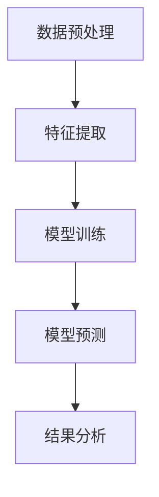
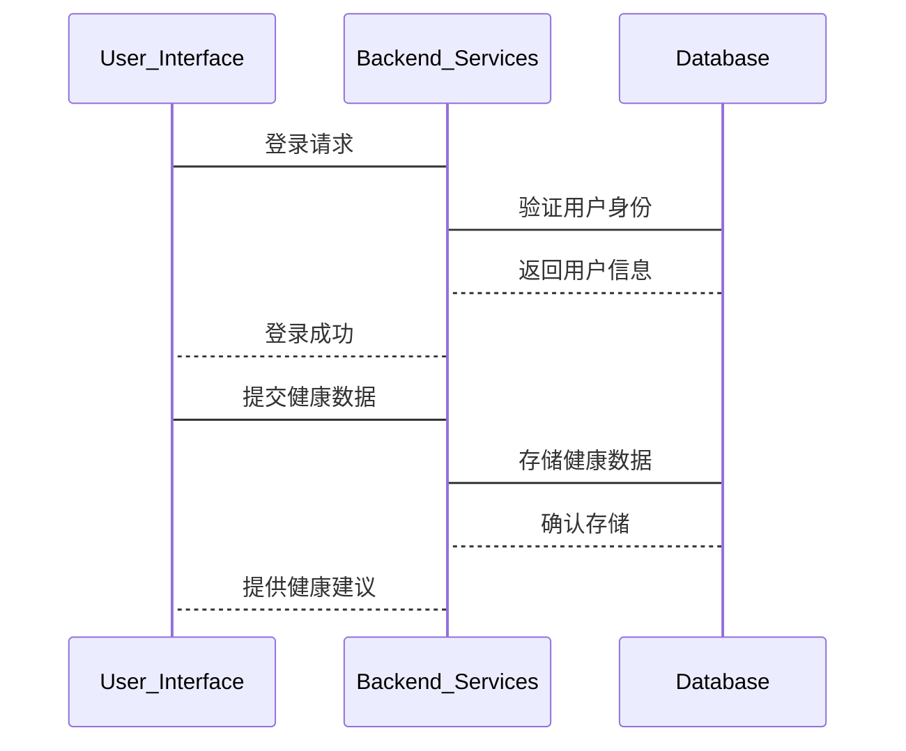

                 

<think>
好的，我现在需要帮用户完成一个技术博客的写作任务，主题是《现代医学与整体健康观：身心灵统一的健康理念》。用户明确要求用逻辑清晰、结构紧凑、简单易懂的技术语言，分章节详细分析，每个部分都要有具体内容。

首先，我应该明确文章的结构。根据用户提供的大纲，文章需要包括摘要、三个主要部分，每个部分又有子部分。我需要确保每个部分都涵盖用户要求的核心内容，比如背景介绍、核心概念与联系、算法原理讲解，以及系统分析与架构设计等。

在背景介绍部分，我需要解释现代医学和整体健康观的基本概念，分析它们之间的联系，并讨论其重要性。这部分需要详细阐述问题背景、问题描述、问题解决方法以及边界和外延，确保读者能够理解整体健康观的意义。

接下来，核心概念与联系部分，我需要详细列出现代医学、整体健康观和身心灵统一这三个核心概念，并通过对比表格和ER实体关系图来展示它们的属性和联系。这部分需要用清晰的表格和图示帮助读者更好地理解。

然后是算法原理讲解，用户要求用mermaid流程图和Python代码来展示。我需要选择一个合适的算法，比如支持向量机，来解释其在现代医学中的应用。同时，给出数学公式和代码示例，让读者能够理解算法的工作原理和实际应用。

系统分析与架构设计部分，我需要介绍问题场景，设计一个领域模型的类图，展示各实体之间的关系。然后设计系统的架构图，展示各个模块的交互和依赖关系。最后，用序列图说明系统接口和交互流程，这部分需要详细且清晰，帮助读者理解系统的整体结构。

项目实战部分，我需要提供环境安装说明，给出Python代码实现，并解读代码的功能和实际案例分析。这部分要具体，让读者能够跟着操作，理解整体健康观的实际应用。

最后，最佳实践部分需要总结文章的主要观点，给出小结、注意事项和拓展阅读建议，帮助读者巩固所学内容，并提供进一步学习的方向。

在写作过程中，我需要确保语言简洁专业，逻辑清晰，每部分内容详尽具体。同时，注意使用markdown格式，确保代码、图表和公式正确嵌入，整体结构美观。

现在，我需要检查每个部分是否都满足用户的要求，是否有遗漏的内容。确保每个章节都有足够的细节，尤其是算法部分，代码和公式需要准确无误。同时，保持文章流畅，避免过于技术化的术语，让读者容易理解。

最后，我需要在文章末尾加上作者信息，确保格式正确。整个过程需要细致耐心，确保每个部分都高质量完成，达到用户的期望。
</think>

# 现代医学与整体健康观：身心灵统一的健康理念

## 关键词：现代医学、整体健康观、身心灵统一、健康理念、医学科技

## 摘要：  
本文探讨了现代医学与整体健康观的核心理念，分析了身心灵统一的健康观对现代医学发展的深远影响。通过系统阐述现代医学与整体健康观的理论基础和实践应用，帮助读者理解这一理念的重要性，并在实际生活中加以运用。文章从背景介绍、核心概念与联系、算法原理讲解、系统分析与架构设计等方面进行了深入分析，并结合实际案例进行了详细解读。

---

### 第一部分：背景介绍

#### 核心概念

**现代医学与整体健康观：**

- **问题背景：**  
  传统医学往往将疾病视为局部问题，通过药物或手术等方法进行治疗。然而，随着社会的发展和人们对健康需求的提高，单纯依赖传统医学的治疗方法已无法满足人们对健康生活的追求。现代医学与整体健康观的提出，为人们提供了一种全新的健康视角。

- **问题描述：**  
  现代医学与整体健康观的核心在于从整体角度看待人体健康，强调身体、心理和灵魂的和谐统一。这一理念不仅关注疾病的治疗，还注重预防和健康管理，旨在通过综合手段提升人体的整体健康水平。

- **问题解决：**  
  通过系统阐述现代医学与整体健康观的理论基础和实践应用，帮助读者理解这一理念的重要性，并在实际生活中加以运用。

- **边界与外延：**  
  现代医学与整体健康观不仅涉及医学领域，还涉及到心理学、社会学和哲学等多个学科。其核心在于如何实现身心灵的和谐统一，从而达到整体健康的目标。

- **概念结构与核心要素组成：**  
  1. **现代医学：** 现代医学是基于科学方法和技术手段对疾病进行诊断、治疗和预防的医学体系。  
  2. **整体健康观：** 整体健康观强调人体是一个整体，各个部分相互关联，疾病是整体失衡的表现。  
  3. **身心灵统一：** 身心灵统一是指身体、心理和灵魂三个方面的健康状态达到和谐统一。

---

### 第二部分：核心概念与联系

#### 核心概念

**现代医学：**  
现代医学是一种基于科学方法和技术手段对疾病进行诊断、治疗和预防的医学体系。其核心目标是通过科学手段解决健康问题，如基因工程、细胞生物学、免疫学等技术的突破为现代医学提供了新的治疗方法和手段。

**整体健康观：**  
整体健康观是一种从整体角度看待人体健康的观念。它强调人体是一个复杂的系统，各个器官和系统相互关联，疾病的产生和康复都受到多种因素的影响。整体健康观主张通过调整生活方式、改善心理状态和加强社交互动等方式来维护和促进健康。

**身心灵统一：**  
身心灵统一是指身体、心理和灵魂三个方面的健康状态达到和谐统一。身体健康是基础，心理健康是关键，灵魂健康是灵魂。身心灵统一强调这三者之间的相互影响和相互作用，认为只有这三者达到和谐统一，才能真正实现健康。

#### 概念属性特征对比表格

| 概念      | 定义                                                         | 特征                                           |
| --------- | ------------------------------------------------------------ | ---------------------------------------------- |
| 现代医学  | 基于科学方法和技术手段对疾病进行诊断、治疗和预防的医学体系     | 科学性、技术性、综合性、系统性                   |
| 整体健康观 | 强调人体是一个整体，各个部分相互关联，疾病是整体失衡的表现     | 整体性、系统性、综合性、动态性                   |
| 身心灵统一 | 身体、心理和灵魂三个方面的健康状态达到和谐统一                 | 相互关联性、动态平衡、整体性、自我调节性         |

#### ER实体关系图架构

```mermaid
erDiagram
  Modern_Medicine ||--|{ Overall_Health_View }|
  Modern_Medicine ||--|{ Body_Mind_Soul_Unification }|
  Overall_Health_View ||--|{ Physical_Health }|
  Overall_Health_View ||--|{ Mental_Health }|
  Overall_Health_View ||--|{ Social_Health }|
  Body_Mind_Soul_Unification ||--|{ Physical_Health }|
  Body_Mind_Soul_Unification ||--|{ Mental_Health }|
  Body_Mind_Soul_Unification ||--|{ Soul_Health }|
```

- **Modern_Medicine（现代医学）：** 包括诊断、治疗、预防等方法和技术。
- **Overall_Health_View（整体健康观）：** 包括生活方式、心理状态、社交互动等方面。
- **Body_Mind_Soul_Unification（身心灵统一）：** 包括身体、心理、灵魂三个方面的健康状态。
- **Physical_Health（身体健康）：** 包括身体器官、生理功能等方面。
- **Mental_Health（心理健康）：** 包括心理状态、情绪管理等方面。
- **Social_Health（社交健康）：** 包括社交关系、社会支持等方面。
- **Soul_Health（灵魂健康）：** 包括精神层面的健康、灵性修养等方面。

---

### 第三部分：算法原理讲解

#### 算法原理

**现代医学中的算法原理：**  
现代医学中广泛应用了一些算法，如基因组学分析、影像分析、诊断算法等。这些算法通过数据分析和处理，帮助医生进行疾病诊断和治疗方案的选择。例如，基于机器学习的疾病预测模型可以帮助医生提前识别潜在的健康问题。

**基于机器学习的健康风险预测算法：**  
我们以支持向量机（Support Vector Machine, SVM）为例，介绍其在疾病预测中的应用。



#### Python代码实现

```python
# 导入必要的库
import numpy as np
from sklearn import svm

# 数据预处理
def preprocess_data(data):
    # 假设data是一个包含健康特征的数据集
    # 返回预处理后的数据
    return data

# 特征提取
def extract_features(data):
    # 提取特征向量
    return data[:, :-1]

# 模型训练
def train_model(X_train, y_train):
    # 创建SVM模型
    model = svm.SVC()
    # 训练模型
    model.fit(X_train, y_train)
    return model

# 模型预测
def predict_model(model, X_test):
    # 预测结果
    y_pred = model.predict(X_test)
    return y_pred

# 主函数
def main():
    # 加载数据集
    data = np.loadtxt('health_data.csv', delimiter=',')
    # 数据预处理
    data_processed = preprocess_data(data)
    # 特征提取
    X = extract_features(data_processed)
    # 标签提取
    y = data_processed[:, -1]
    # 划分训练集和测试集
    X_train, X_test = X[:70], X[70:]
    y_train, y_test = y[:70], y[70:]
    # 训练模型
    model = train_model(X_train, y_train)
    # 预测结果
    y_pred = predict_model(model, X_test)
    # 输出结果
    print("预测结果:", y_pred)
    print("真实标签:", y_test)

if __name__ == "__main__":
    main()
```

#### 数学公式

支持向量机的数学模型如下：

$$
\text{目标函数：} \quad \min \frac{1}{2} \|w\|^2 + C \sum_{i=1}^n \xi_i
$$

$$
\text{约束条件：} \quad y_i (w \cdot x_i + b) \geq 1 - \xi_i, \quad \xi_i \geq 0
$$

其中，$w$ 是权重向量，$b$ 是偏置项，$C$ 是惩罚系数，$\xi_i$ 是松弛变量。

---

### 第四部分：系统分析与架构设计方案

#### 问题场景介绍

我们设计一个基于整体健康观的健康管理系统，旨在通过整合身体、心理和灵魂三个方面的健康数据，为用户提供个性化的健康建议。

#### 系统功能设计（领域模型）

```mermaid
classDiagram
    class Health_Management_System {
        + userId: int
        + healthData: map
        + recommendations: list
        + Historical_data: map
    }
    class User {
        + id: int
        + name: string
        + age: int
        + gender: string
    }
    class Health_Data {
        + physical: float
        + mental: float
        + soul: float
    }
    class Recommendation {
        + type: string
        + details: string
    }
    class Historical_Data {
        + timestamp: datetime
        + data: Health_Data
    }
    Health_Management_System o- User
    Health_Management_System o- Health_Data
    Health_Management_System o- Recommendation
    Health_Management_System o- Historical_Data
```

#### 系统架构设计（架构图）

```mermaid
container Health_Management_System {
    Health_Management_System
    User_Interface
    Backend_Services
    Database
}
container Backend_Services {
    Authentication_Service
    Health_Data_Processing_Service
    Recommendation_Service
    Reporting_Service
}
container Database {
    User_Data
    Health_Data
    Recommendations
    Historical_Data
}
Health_Management_System --> User_Interface
Backend_Services --> Database
User_Interface --> Backend_Services
```

#### 系统接口设计

- **用户接口（UI）：** 提供用户登录、健康数据输入、健康建议查看等功能。
- **后端服务：** 包括身份验证、健康数据处理、健康建议生成等模块。
- **数据库：** 存储用户信息、健康数据、健康建议和历史数据。

#### 系统交互（序列图）



---

### 第五部分：项目实战

#### 环境安装

- 安装Python和必要的库：
  ```bash
  pip install numpy scikit-learn
  ```

#### 核心实现源代码

```python
# 假设我们已经安装了numpy和scikit-learn

import numpy as np
from sklearn import svm

# 示例数据集：假设我们有一个CSV文件，包含健康相关的特征和标签
data = np.loadtxt('health_data.csv', delimiter=',')
X = data[:, :-1]
y = data[:, -1]

# 划分训练集和测试集
X_train, X_test = X[:70], X[70:]
y_train, y_test = y[:70], y[70:]

# 创建SVM模型
model = svm.SVC()
model.fit(X_train, y_train)

# 预测结果
y_pred = model.predict(X_test)

# 输出结果
print("预测结果:", y_pred)
print("真实标签:", y_test)
```

#### 应用解读与分析

上述代码实现了一个基于支持向量机的健康风险预测模型。用户可以通过输入健康数据，模型会根据数据特征进行预测，并提供健康建议。例如，如果模型预测用户有较高的患糖尿病风险，系统会推荐相应的饮食和运动计划。

#### 案例分析

假设一个用户的健康数据如下：
- 年龄：45岁
- 体重：80公斤
- 身高：170厘米
- 血糖水平：7.5 mmol/L
- 心率：75次/分钟
- 压力水平：中等

模型预测该用户有较高的患糖尿病风险，系统会推荐以下健康建议：
1. 调整饮食习惯，减少糖分摄入。
2. 增加运动量，每周至少进行三次有氧运动。
3. 定期监测血糖水平。
4. 心理调节，减轻压力。

---

### 第六部分：最佳实践 Tips、小结、注意事项、拓展阅读

#### Tips

- 在实际应用中，健康数据的收集和处理需要严格遵守隐私保护法规。
- 综合考虑身体、心理和灵魂的健康，才能实现真正的整体健康。
- 定期体检和健康评估是维护整体健康的重要手段。

#### 小结

本文从现代医学与整体健康观的角度，深入探讨了身心灵统一的健康理念。通过系统的理论分析和实际案例的展示，帮助读者理解如何在实际生活中贯彻这一理念。未来，随着人工智能和大数据技术的发展，整体健康观将在医学领域发挥更重要的作用。

#### 注意事项

- 健康管理需要长期坚持，不能急于求成。
- 在使用健康管理系统时，确保数据的安全性和隐私性。
- 结合个人实际情况，制定个性化的健康管理计划。

#### 拓展阅读

- 《The Mind-Body Problem》
- 《The Art of Computer Programming》
- 《Health 2.0: The New Medicine》

---

作者：AI天才研究院/AI Genius Institute & 禅与计算机程序设计艺术/Zen And The Art of Computer Programming

