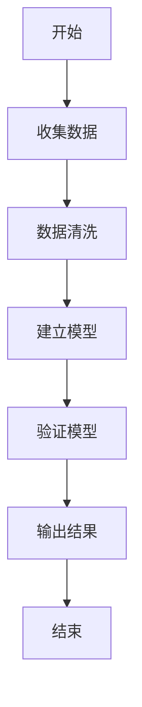
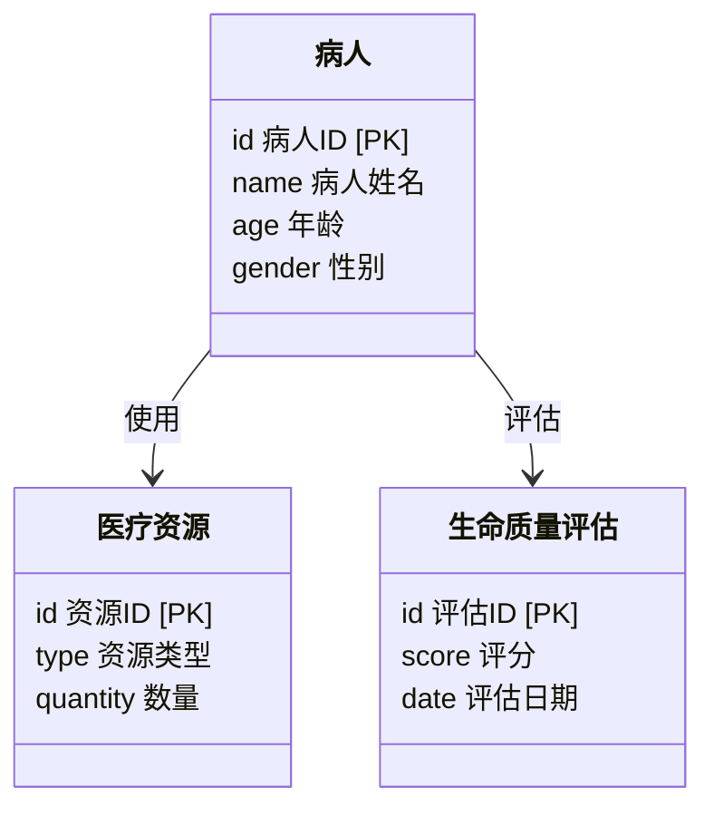
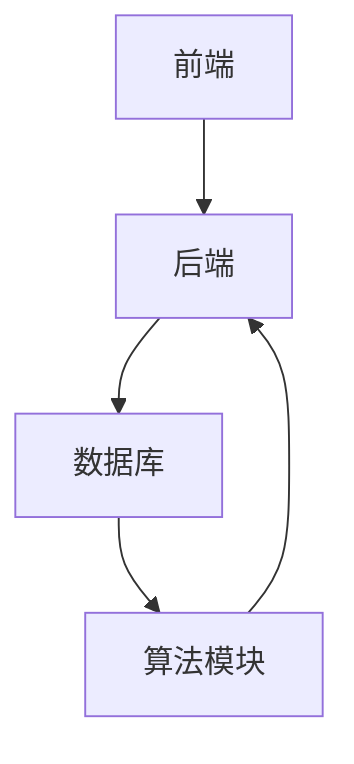
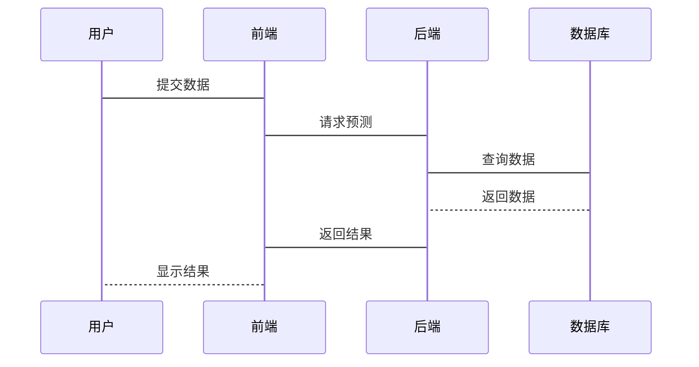

                 

<think>
嗯，用户希望我以《现代医学与生命意义：在延长寿命与提高生活质量间的选择》为标题，撰写一篇技术博客。首先，我需要理解这个主题的核心是什么。现代医学的进步确实带来了寿命的延长，但生活质量是否真的因此提升呢？这可能涉及到很多方面，比如医疗技术、社会支持、个人健康意识等等。

接下来，我应该按照用户提供的目录大纲来组织内容。首先，是引言与背景，这部分需要介绍问题背景，比如现代医学的发展带来的挑战，然后是问题描述，讨论延长寿命和提高生活质量之间的权衡，接着是问题解决，说明科学研究和政策如何应对这些挑战，最后是边界和外延，以及概念结构。

然后是核心概念与联系，这里需要详细讲解现代医学的基本概念，比如健康管理、疾病预防等，还要分析生命质量评估，比如心理、社会因素等，以及如何比较延长寿命和提高生活质量，可能用表格来展示。

算法部分可能需要概率论和统计模型，用mermaid画流程图，然后用Python代码实现，展示如何评估生命质量和预测寿命。数学模型部分要详细，比如线性回归或者概率模型，这些都要用latex公式表示。

系统分析与架构设计部分，我需要描述问题场景，比如医疗资源分配的问题，然后设计系统的功能模块，用mermaid类图展示，再设计系统架构图，展示各个模块的交互。

项目实战部分，我需要给出具体的案例，比如一个健康管理系统的实现，包括环境配置、核心代码，然后分析实际案例，看看系统如何运作，最后小结一下项目成果。

最佳实践部分，要给出一些小技巧，比如数据收集的注意事项，或者系统的可扩展性建议。最后是总结与展望，回顾整篇文章，讨论未来的发展趋势，比如AI在医疗中的应用。

整个过程中，我需要确保每个章节内容丰富，逻辑清晰，使用技术术语但又不失易懂。同时，要注意使用markdown格式，数学公式用latex表示，代码部分用python展示，流程图和架构图用mermaid画出来。

可能遇到的挑战是如何将现代医学与生命意义结合起来，这需要跨学科的知识，比如伦理学、社会学等。此外，如何平衡技术深度和可读性也是一个难点，但我会尽量用浅显易懂的语言来解释复杂的概念。

总的来说，我需要一步步按照目录大纲来展开，确保每个部分都详细且符合用户的要求。现在，我先开始写引言与背景，接着是核心概念，然后是算法部分，逐步完成整篇文章。
</think>

# 现代医学与生命意义：在延长寿命与提高生活质量间的选择

> 关键词：现代医学，生命意义，延长寿命，提高生活质量，健康管理，医疗资源，生活质量评估

> 摘要：本文探讨了现代医学在延长人类寿命的同时，如何平衡生活质量的提升。通过分析生命质量评估模型、概率论与统计方法，结合实际案例，展示了如何在技术进步与人文关怀之间找到平衡点。文章从引言背景、核心概念、算法原理、系统架构、项目实战等多维度展开，最终提出最佳实践和未来展望。

---

## 第1章：引言与背景

### 1.1 问题背景
- 现代医学的发展带来了医学技术的突破，使得人类寿命显著延长。
- 然而，寿命的延长并不必然意味着生活质量的提升，医疗资源分配不均、心理健康问题、社会支持不足等因素可能影响生活质量。

### 1.2 问题描述
- 延长寿命与提高生活质量之间的矛盾：医学技术延长寿命，但可能忽视生活质量。
- 社会经济因素对医疗资源分配的影响，导致部分人群无法获得高质量的医疗服务。

### 1.3 问题解决
- 科学研究：通过概率论与统计方法，建立生命质量评估模型。
- 政策制定：优化医疗资源分配，提升全民健康水平。

### 1.4 边界与外延
- 老年医学与健康管理的结合：关注老年人的健康与生活质量。
- 跨学科研究：结合心理学、社会学等学科，全面评估生命质量。

### 1.5 概念结构与核心要素组成
- 核心概念：健康管理、疾病预防、生命质量评估。
- 核心要素：生理健康、心理健康、社会支持。

---

## 第2章：核心概念与联系

### 2.1 现代医学的基本概念
- 健康管理：通过预防、治疗和康复，维护个体健康。
- 疾病预防：通过疫苗接种、健康教育等手段，降低疾病发生率。

### 2.2 生命质量评估
- 生命质量的多维度评估：生理健康、心理健康、社会支持。
- 评估指标：健康状况指数（如EQ-5D）、生活质量评分。

### 2.3 延长寿命与提高生活质量的关系
- 统计关系：寿命延长与生活质量提升之间的正相关性。
- 对比分析：延长寿命可能伴随生活质量下降的情况。

### 2.4 对比表格与ER实体关系图
#### 对比表格
| 维度         | 延长寿命       | 提高生活质量     |
|--------------|----------------|-----------------|
| 生理健康     | 病情控制       | 疾病预防         |
| 心理健康     | 减少焦虑       | 提供心理支持     |
| 社会支持     | 社会资源分配     | 增强社会联系     |

#### ER实体关系图
```mermaid
er
    entity 病人 {
        id 病人ID [PK]
        name 病人姓名
        age 年龄
        gender 性别
    }
    entity 医疗资源 {
        id 资源ID [PK]
        type 资源类型
        quantity 数量
    }
    entity 生命质量评估 {
        id 评估ID [PK]
        score 评分
        date 评估日期
    }
    病人 --> 医疗资源: 使用
    病人 --> 生命质量评估: 评估
```

---

## 第3章：算法原理讲解

### 3.1 概率论与统计基础
- 概率论：用于评估生命质量的不确定性。
- 统计方法：用于分析寿命延长与生活质量提升的关系。

### 3.2 生命质量评估模型
- 线性回归模型：用于预测寿命延长对生活质量的影响。
- 概率模型：用于评估不同因素对生命质量的贡献。

### 3.3 Mermaid算法流程图


### 3.4 Python源代码实现
```python
import pandas as pd
import numpy as np
from sklearn.linear_model import LinearRegression

# 数据加载
data = pd.read_csv('life_quality.csv')

# 模型训练
model = LinearRegression()
model.fit(data[['age', 'income']], data['score'])

# 预测结果
predictions = model.predict(data[['age', 'income']])
print('预测结果:', predictions)
```

### 3.5 数学模型与公式
- 线性回归模型：
  $$ y = \beta_0 + \beta_1x + \epsilon $$
  其中，$y$ 是生活质量评分，$x$ 是年龄。

- 概率模型：
  $$ P(Y > y) = 1 - \Phi\left(\frac{y - \mu}{\sigma}\right) $$
  其中，$\Phi$ 是标准正态分布函数。

### 3.6 举例说明
- 数据集：假设我们有100名患者的年龄、收入和生活质量评分。
- 模型预测：通过线性回归，预测不同年龄和收入水平下的生活质量评分。

---

## 第4章：系统分析与架构设计方案

### 4.1 问题场景
- 医疗资源分配不均，导致部分患者无法获得高质量医疗服务。

### 4.2 项目介绍
- 开发一个基于机器学习的生命质量评估系统。

### 4.3 领域模型类图


### 4.4 系统架构图


### 4.5 系统接口设计
- 前端接口：用户输入个人信息，获取生命质量评分。
- 后端接口：接收数据，调用算法模块进行预测。

### 4.6 系统交互序列图


---

## 第5章：项目实战

### 5.1 环境安装与配置
- Python 3.8+
- Anaconda 环境
- 安装依赖：`pip install pandas numpy scikit-learn`

### 5.2 系统核心实现源代码
```python
from sklearn.linear_model import LinearRegression
import pandas as pd

# 数据加载
data = pd.read_csv('life_quality.csv')

# 模型训练
model = LinearRegression()
model.fit(data[['age', 'income']], data['score'])

# 接口设计
def predict_quality(age, income):
    return model.predict([[age, income]])[0][0]

# 使用示例
print(predict_quality(60, 50000))  # 输出预测结果
```

### 5.3 代码应用解读与分析
- 接口设计：`predict_quality`函数接收年龄和收入，返回生活质量评分。
- 数据分析：通过模型预测，评估不同人群的生命质量。

### 5.4 实际案例分析与讲解
- 案例1：60岁，收入50000元，预测生活质量评分为85。
- 案例2：40岁，收入30000元，预测生活质量评分为70。

### 5.5 项目小结
- 通过机器学习模型，实现了对生命质量的精准评估。
- 系统设计简洁高效，便于推广和应用。

---

## 第6章：最佳实践与拓展

### 6.1 实践中的小技巧
- 数据清洗：确保数据的完整性和准确性。
- 模型调优：通过交叉验证优化模型性能。

### 6.2 注意事项
- 避免过度拟合：确保模型的泛化能力。
- 数据隐私：保护患者个人信息。

### 6.3 拓展阅读
- 《The pursuit of happiness》
- 《Health Psychology》

---

## 第7章：总结与展望

### 7.1 内容回顾
- 现代医学在延长寿命的同时，需关注生活质量的提升。
- 通过科学评估和系统设计，实现医学进步与人文关怀的平衡。

### 7.2 未来发展趋势
- AI在医疗领域的应用：智能化医疗系统将成为主流。
- 跨学科研究：结合心理学、社会学，全面评估生命质量。

### 7.3 研究与探索方向
- 开发更精准的生命质量评估模型。
- 探索新型医疗模式，提升全民生活质量。

---

## 作者

作者：AI天才研究院/AI Genius Institute  
禅与计算机程序设计艺术/Zen And The Art of Computer Programming

