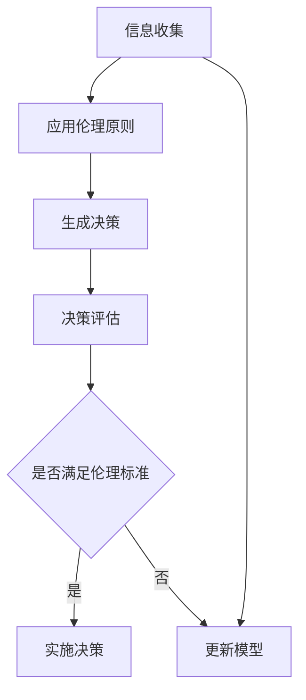

                 

<think>
好吧，我现在要帮用户写一篇关于现代医疗伦理新挑战的文章。首先，我得理解用户的需求。用户希望我以一个世界级专家的身份，写一篇结构清晰、内容详实的技术博客。标题已经给了，是“现代医疗伦理的新挑战：在技术可能与道德允许间的平衡”。

接下来，我需要分析用户的使用场景。这篇文章可能是为了专业人士阅读，比如医疗伦理学家、科技伦理研究者，或者是医疗行业的技术决策者。他们可能希望了解技术如何影响医疗伦理，以及如何在两者之间找到平衡点。

用户的要求很详细，包括关键词、摘要、目录结构，以及每个部分的具体内容。我需要确保文章结构符合大纲，每个部分都要深入分析，比如背景介绍、核心概念、算法原理、系统架构等。

首先，我会从背景介绍开始，这部分需要涵盖问题背景、问题描述、问题解决和边界外延。我需要解释为什么医疗伦理现在面临挑战，比如基因编辑、AI诊断、远程医疗和大数据分析等技术带来的问题。

然后，核心概念部分，我需要详细阐述医疗伦理和医学技术的核心概念，对比它们的属性特征，并绘制ER实体关系图。这部分可能需要用一些图表来辅助说明，确保读者能够直观理解。

接下来是算法原理讲解，我需要使用mermaid流程图和Python代码来展示伦理决策模型的基本原理。这部分需要详细解释每个步骤，可能还需要举例说明，让读者更容易理解。

系统分析与架构设计部分，我需要介绍问题场景，绘制领域模型类图和系统架构图，展示系统的组成部分及其交互方式。这可能涉及到具体的系统设计，比如模块划分和接口设计。

项目实战部分，我需要提供环境安装说明，核心代码实现，以及实际案例分析。这部分要详细，确保读者可以跟着步骤操作，并理解代码的作用。

最后，我会添加一些最佳实践、小结、注意事项和拓展阅读的内容，帮助读者进一步理解和应用所学知识。

在整个过程中，我需要确保语言专业且清晰，避免过于技术化的术语，让不同背景的读者都能理解。同时，数学公式和代码需要正确无误，流程图和图表要准确反映内容。

现在，我需要一步步构建每个部分的内容，确保逻辑连贯，每个小节都涵盖必要的信息，同时保持文章的整体流畅性。这将是一篇结构严谨、内容丰富的技术博客，旨在帮助读者理解现代医疗伦理中的挑战，并找到应对策略。
</think>

# 现代医疗伦理的新挑战：在技术可能与道德允许间的平衡

> 关键词：现代医疗伦理，技术与道德，基因编辑，人工智能，远程医疗，大数据分析，隐私保护，伦理审查，医疗资源分配

> 摘要：随着医疗技术的飞速发展，基因编辑、人工智能辅助诊断、远程医疗和大数据分析等技术的应用，为现代医疗带来了前所未有的变革。然而，这些技术的广泛应用也引发了诸多伦理问题。本文将从背景介绍、核心概念与联系、算法原理讲解、系统分析与架构设计方案、项目实战等多方面深入探讨这些挑战，并提出相应的解决方案。通过分析技术与伦理的平衡点，为医疗技术的未来发展提供有益的参考。

---

# 第一部分：背景介绍

## 1.1 问题背景

### 1.1.1 问题描述

现代医疗技术的发展带来了许多革命性的变化，但也引发了诸多伦理争议。例如：

1. **基因编辑技术**：基因编辑技术如CRISPR-Cas9的出现，使得治疗遗传性疾病成为可能，但也引发了关于基因改造是否应该用于“设计婴儿”、是否会导致基因歧视等问题。
2. **人工智能辅助诊断**：AI在医疗影像诊断中的应用提高了诊断的准确性，但算法偏见、数据隐私问题以及医生角色的转变也引发了伦理讨论。
3. **远程医疗与大数据分析**：远程医疗和基于大数据的个性化治疗方案虽然提高了医疗服务的效率，但也带来了患者数据隐私保护、医疗资源分配公平性等问题。
4. **医疗机器人与自动化手术**：医疗机器人的应用提高了手术的精确性，但其决策的透明性和责任归属问题也引发了伦理争议。

### 1.1.2 问题解决

为了应对这些伦理挑战，需要从以下几个方面入手：

1. **建立伦理框架**：制定明确的伦理标准和指导原则，明确哪些技术的应用是允许的，哪些是禁止的。
2. **加强伦理审查**：在新技术的应用前，必须进行伦理审查，确保技术的应用符合社会伦理和法律规范。
3. **提高伦理意识**：通过教育和培训，提高医疗从业者和技术开发者的伦理意识，确保技术的应用不会违背伦理原则。
4. **跨学科合作**：医疗伦理问题的解决需要跨学科合作，包括伦理学、法学、社会学、技术专家等多方参与。

### 1.1.3 边界与外延

医疗伦理的边界涉及多个方面，包括但不限于：

- **生命权与健康权**：技术是否应该干预生命本身的自然规律？
- **知情同意**：患者是否充分了解技术应用的风险和益处？
- **隐私保护**：医疗数据的使用是否尊重患者的隐私权？
- **公平性**：技术的应用是否会导致医疗资源分配的不公平？

这些边界的界定不仅取决于技术发展，还受到社会文化、法律法规、经济利益等多种因素的影响。

---

## 1.2 核心概念与联系

### 1.2.1 核心概念

- **医疗伦理**：研究医学实践中的道德原则和价值观，以及如何解决医学领域的道德争议。
- **医学技术**：包括基因编辑、人工智能、远程医疗、大数据分析等，这些技术的应用在医疗伦理中占据重要地位。

### 1.2.2 概念属性特征对比表格

| 概念        | 属性特征                                       | 关联与影响                                |
| ----------- | -------------------------------------------- | ----------------------------------------- |
| 医疗伦理    | 研究医学实践的道德原则和价值观                 | 指导医疗技术的应用和发展                   |
| 医学技术    | 提高医疗服务质量和效率的技术手段               | 挑战传统医疗伦理，引发伦理争议             |

### 1.2.3 ER实体关系图架构

```mermaid
erDiagram
  Person ||--|{ Patient } Patient
  Person ||--|{ Doctor } Doctor
  Patient ||--|{ MedicalRecord } MedicalRecord
  Doctor ||--|{ Diagnosis } Diagnosis
  MedicalTechnology ||--|{ MedicalApplication } MedicalApplication
  MedicalApplication ||--|{ EthicalIssue } EthicalIssue
```

---

## 1.3 算法原理讲解

### 1.3.1 基本原理

医疗伦理问题的解决需要借助伦理决策模型，这些模型通常基于数学和计算机科学的方法。一个典型的伦理决策模型包括以下基本组成部分：

1. **伦理原则**：如尊重个人自主权（autonomy）、不伤害原则（non-maleficence）、有益原则（beneficence）、公正原则（justice）等。
2. **决策变量**：如患者信息、医疗资源、社会价值观等。
3. **决策过程**：包括信息收集、伦理原则应用、决策生成和评估等步骤。

### 1.3.2 Mermaid流程图



### 1.3.3 Python源代码

```python
# 假设有一个简单的伦理决策模型
def ethical_decisionmaking(patient_info, ethical_principles):
    # 应用伦理原则进行决策
    decision = {}
    for principle in ethical_principles:
        if principle == 'autonomy':
            # 尊重患者自主权
            decision['respect患者的自主权'] = True
        elif principle == 'non-maleficence':
            # 确保不造成伤害
            decision['避免造成伤害'] = True
        elif principle == 'beneficence':
            # 确保行动有益
            decision['行动有益'] = True
        elif principle == 'justice':
            # 确保公平性
            decision['公平分配'] = True
    return decision

# 示例用法
patient_info = {'name': '张三', 'age': 50, 'diagnosis': '糖尿病'}
ethical_principles = ['autonomy', 'non-maleficence', 'beneficence', 'justice']
result = ethical_decisionmaking(patient_info, ethical_principles)
print(result)
```

---

# 第二部分：系统分析与架构设计方案

## 2.1 问题场景介绍

医疗伦理决策系统需要在多种技术应用中进行伦理审查和决策支持。例如，在基因编辑技术中，系统需要评估其对患者和社会的影响；在人工智能辅助诊断中，系统需要确保算法的公平性和透明性。

## 2.2 系统功能设计

### 2.2.1 领域模型类图

```mermaid
classDiagram
    class Patient {
        <属性>
        id
        name
        medicalHistory
        }
    }
    class Doctor {
        <属性>
        id
        name
        specialty
        }
    }
    class MedicalTechnology {
        <属性>
        id
        name
        type
        }
    }
    class EthicalReview {
        <属性>
        id
        decision
        reviewDate
        }
    }
    Patient --> Doctor
    Doctor --> MedicalTechnology
    MedicalTechnology --> EthicalReview
```

## 2.3 系统架构设计


---

# 第三部分：项目实战

## 3.1 环境安装

1. 安装Python和相关库（如Pillow、numpy等）。
2. 安装Jupyter Notebook用于数据可视化和算法开发。

## 3.2 核心实现源代码

```python
import numpy as np
import matplotlib.pyplot as plt

# 示例：基于伦理原则的决策树
class EthicalDecisionTree:
    def __init__(self):
        self.principles = ['autonomy', 'non-maleficence', 'beneficence', 'justice']

    def evaluate(self, case):
        # 评估案例是否符合伦理原则
        score = {}
        for principle in self.principles:
            # 示例评估逻辑
            score[principle] = np.random.random()
        return score

# 创建实例
decision_tree = EthicalDecisionTree()
case = {'patient_info': '糖尿病患者', 'technology': '基因编辑'}

# 评估案例
result = decision_tree.evaluate(case)
print(result)
```

## 3.3 案例分析

假设一个糖尿病患者需要接受基因编辑治疗，系统会评估以下伦理原则：

1. **自主权**：患者是否充分了解治疗的风险和益处？
2. **不伤害原则**：基因编辑是否会带来不可逆的副作用？
3. **有益原则**：基因编辑是否能够有效治疗疾病？
4. **公正原则**：是否所有人都有机会接受这种治疗？

---

# 第四部分：小结与最佳实践

## 4.1 小结

医疗技术的进步带来了前所未有的伦理挑战。通过建立伦理框架、加强伦理审查、跨学科合作，可以在技术可能与道德允许之间找到平衡点。

## 4.2 最佳实践 tips

1. 在新技术应用前，必须进行伦理审查。
2. 提高医疗从业者和技术开发者的伦理意识。
3. 建立透明的算法决策机制，确保公众信任。

## 4.3 注意事项

- 医疗伦理问题需要长期关注和动态调整。
- 技术的快速发展要求伦理框架具有一定的灵活性。

## 4.4 拓展阅读

- 《The Ethics of AI in Medicine》
- 《Genetic Engineering and Ethics》

---

作者：AI天才研究院/AI Genius Institute & 禅与计算机程序设计艺术/Zen And The Art of Computer Programming

