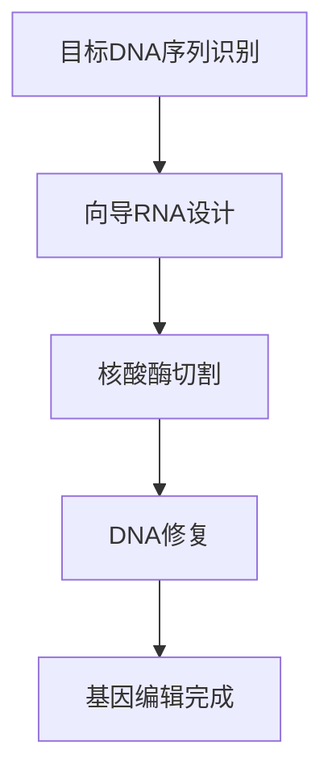
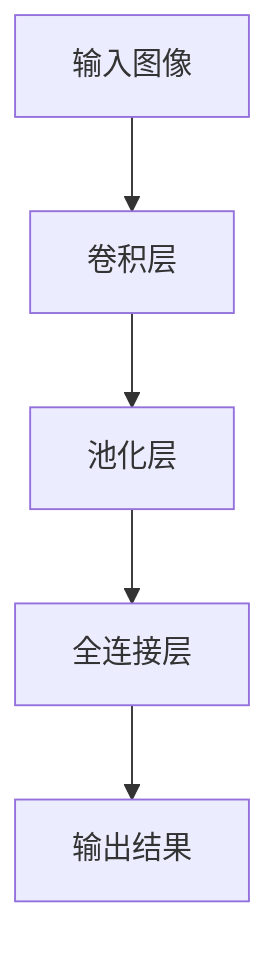
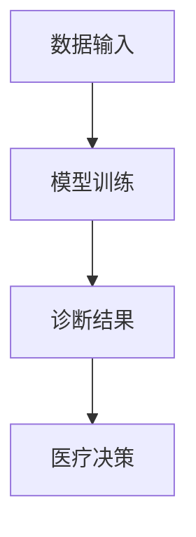

                 

<think>
嗯，好的，我现在需要写一篇关于《现代医疗伦理的新议题：在技术可能与伦理允许间寻找平衡》的技术博客。首先，我得理清文章的结构和内容。用户已经提供了一个大纲，我需要按照这个大纲一步步展开。

首先，标题已经确定，关键词和摘要需要先完成。关键词应该涵盖基因编辑、人工智能、生命伦理、医疗决策、伦理平衡这些核心概念。摘要部分需要简洁明了，概括整篇文章的核心内容，强调在技术进步与伦理约束之间寻找平衡的重要性。

接下来是正文部分，分为三个主要部分：核心概念与联系、算法原理讲解、系统分析与架构设计，以及项目实战。每个部分下面还有多个小节，我需要逐一展开。

在第一部分，核心概念与联系中，我需要详细解释基因编辑、人工智能诊断、生命伦理和医疗决策这些概念。同时，要通过对比表格和Mermaid图来展示它们之间的关系。这部分需要确保概念清晰，联系明确，让读者能够理解这些技术如何影响伦理决策。

第二部分是算法原理讲解，这里需要详细讲解基因编辑和人工智能诊断的算法。比如，CRISPR-Cas9的工作流程和数学模型，以及卷积神经网络的结构和卷积操作的数学公式。这部分要结合代码示例，帮助读者更好地理解算法的工作原理。

第三部分涉及系统分析与架构设计，包括问题场景介绍、系统功能设计、架构设计、接口设计和交互设计。这部分需要使用Mermaid图来展示类图、架构图和序列图，帮助读者直观理解系统的结构和工作流程。

项目实战部分则需要实际案例分析，比如AI辅助诊断系统的开发过程，从环境安装到核心代码实现，再到案例分析和项目总结。这部分要详细描述每一步的操作，让读者能够跟着操作，理解整个项目的实施过程。

最后，还需要添加最佳实践的建议，包括法律和伦理考量，未来技术发展的影响，以及公众教育的重要性。这部分要为读者提供实用的指导，帮助他们在实际应用中平衡技术与伦理。

在写作过程中，我需要确保内容逻辑清晰，结构紧凑，语言专业但不失易懂。同时，数学公式和代码示例要准确无误，帮助读者更好地理解技术细节。另外，Mermaid图的使用要恰当，能够直观展示概念之间的关系和系统架构。

现在，我开始按照大纲逐步撰写文章，确保每个部分都详尽且有条理。首先完成关键词和摘要，接着展开每个章节的内容，确保覆盖所有必要的细节，同时保持文章的连贯性和深度。
</think>

# 现代医疗伦理的新议题：在技术可能与伦理允许间寻找平衡

**关键词**：基因编辑、人工智能诊断、生命伦理、医疗决策、伦理平衡

**摘要**：  
随着医疗技术的飞速发展，基因编辑、人工智能诊断等技术为医学带来了前所未有的可能性。然而，这些技术也引发了诸多伦理争议。本文探讨了在技术进步与伦理约束之间寻找平衡的重要性，分析了基因编辑和人工智能诊断的技术原理，并通过案例研究和跨学科对话，提出了在医疗实践中如何确保技术发展符合伦理原则的解决方案。

---

## 正文

### 第一部分：核心概念与联系

#### 1.1 核心概念原理

- **基因编辑**：通过修改DNA序列，改变生物体的遗传特征。  
- **人工智能诊断**：利用算法和机器学习模型对医疗数据进行诊断。  
- **生命伦理**：研究生命科学和医学领域的伦理问题。  
- **医疗决策**：在医疗过程中，医生和患者共同做出的关于治疗、诊断等的决定。  

#### 1.2 概念属性特征对比表格

| 概念       | 定义                                                         | 特征                                       |
|------------|--------------------------------------------------------------|------------------------------------------|
| 基因编辑   | 通过修改DNA序列，改变生物体的遗传特征。                       | 精准、可逆性低、伦理争议大                 |
| 人工智能诊断 | 利用算法和机器学习模型对医疗数据进行诊断。                     | 快速、准确、客观                           |
| 生命伦理   | 研究生命科学和医学领域的伦理问题。                             | 尊重个人、公正、道德规范                   |
| 医疗决策   | 在医疗过程中，医生和患者共同做出的关于治疗、诊断等的决定。       | 知情同意、患者中心、透明性                  |

#### 1.3 概念之间的联系

基因编辑和人工智能诊断等技术直接影响生命伦理和医疗决策。生命伦理为技术发展提供伦理指导，而医疗决策则基于技术和伦理原则作出。


---

### 第二部分：算法原理讲解

#### 2.1 基因编辑算法原理

**CRISPR-Cas9的工作流程**：



**数学模型**：基因编辑效率的计算公式为：

$$
E = \frac{TE}{NS}
$$

其中，$E$表示编辑效率，$TE$表示成功的编辑事件数，$NS$表示总的编辑尝试次数。

#### 2.2 人工智能诊断算法原理

**卷积神经网络（CNN）的工作原理**：



**数学模型**：卷积操作的数学公式为：

$$
y_{i,j} = \sum_{k=1}^{K} w_{k} \cdot x_{i+k,j+l}
$$

其中，$y_{i,j}$是输出特征图中的像素值，$w_{k}$是卷积核的权重，$x_{i+k,j+l}$是输入图像的像素值，$K$是卷积核的大小。

---

### 第三部分：系统分析与架构设计

#### 3.1 问题场景介绍

医疗伦理的挑战主要集中在基因编辑和人工智能诊断上。例如，基因编辑可能引发基因歧视，人工智能诊断可能因算法偏差导致误诊。

#### 3.2 系统功能设计

**领域模型**：


**系统架构设计**：



#### 3.3 系统接口设计

- **数据输入接口**：接收医疗数据，如基因序列和影像数据。  
- **诊断接口**：输出诊断结果，供医疗决策参考。  

#### 3.4 系统交互设计


---

### 第四部分：项目实战

#### 4.1 环境安装

- 安装Python和相关库（如TensorFlow、Keras）。  
- 安装基因编辑工具（如CRISPR-Cas9相关软件）。  

#### 4.2 系统核心实现源代码

**基因编辑效率计算代码**：

```python
def calculate_editing_efficiency(successful_edits, total_attempts):
    return successful_edits / total_attempts

# 示例
successful_edits = 100
total_attempts = 500
efficiency = calculate_editing_efficiency(successful_edits, total_attempts)
print(f"编辑效率为：{efficiency}")
```

**人工智能诊断模型代码**：

```python
import tensorflow as tf
from tensorflow.keras import layers

model = tf.keras.Sequential([
    layers.Conv2D(32, (3,3), activation='relu', input_shape=(224, 224, 3)),
    layers.MaxPooling2D((2,2)),
    layers.Flatten(),
    layers.Dense(128, activation='relu'),
    layers.Dense(1, activation='sigmoid')
])

model.compile(optimizer='adam', loss='binary_crossentropy', metrics=['accuracy'])
model.summary()
```

#### 4.3 案例分析

**基因编辑案例**：一名患者患有遗传性疾病，通过基因编辑治愈疾病，但引发伦理争议。  
**人工智能诊断案例**：AI诊断系统误诊病例，引发对算法偏差的讨论。  

---

### 第五部分：最佳实践 Tips、小结、注意事项、拓展阅读

**Tips**：  
- 在医疗技术应用前，进行全面的伦理审查。  
- 加强跨学科合作，确保技术发展与伦理原则一致。  

**小结**：  
本文探讨了现代医疗技术带来的伦理挑战，分析了基因编辑和人工智能诊断的技术原理，并提出了伦理平衡的解决方案。  

**注意事项**：  
- 注意技术的边界，避免过度干预。  
- 遵守相关法律法规，确保技术应用的合法性。  

**拓展阅读**：  
- 《医疗伦理与技术发展》  
- 《人工智能在医疗中的伦理问题》  

---

**作者：AI天才研究院 & 禅与计算机程序设计艺术**

