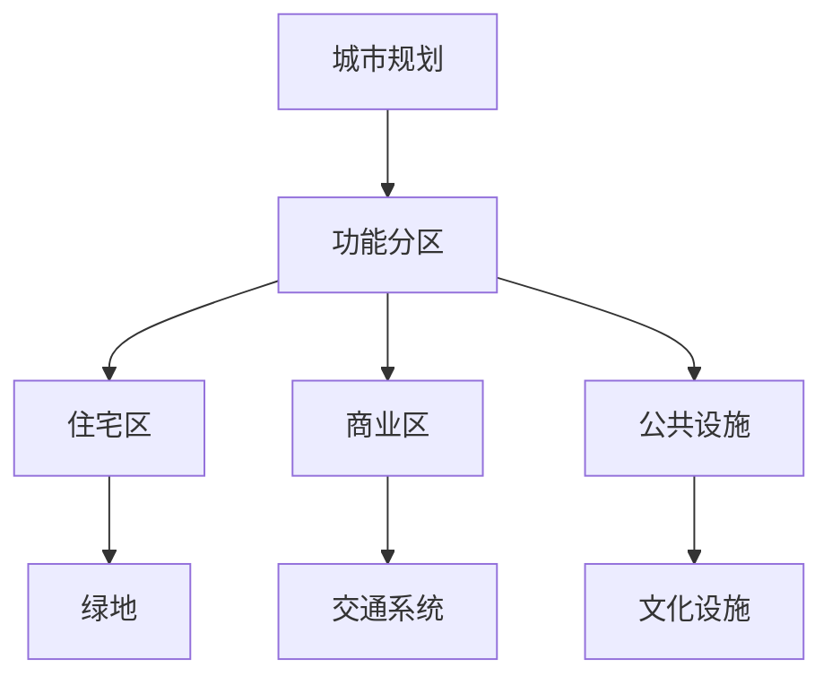

                 

<think>
嗯，好的，我现在要写一篇关于《现代城市设计中的人性化考量：宜居性与美学的统一》的技术博客。首先，我需要理清楚文章的结构和内容，确保每个部分都涵盖到位。

首先，标题已经确定好了，接下来是关键词和摘要。关键词应该包括现代城市设计、人性化考量、宜居性、美学统一，再加上一些技术相关的词汇，比如系统架构、算法原理、数学模型等。摘要部分需要简洁地概括文章的核心内容，也就是探讨如何在现代城市设计中实现人性化的宜居性和美学统一。

接下来是目录结构，我参考了之前提供的大纲，主要分为五个部分：城市设计的背景与现状、人性化设计的核心概念、美学在城市建设中的应用、宜居性与美学的统一，以及未来城市设计的展望。每个部分下都有具体的章节，每个章节又包含更细的子章节，确保内容全面且深入。

在正文部分，我需要详细展开每个章节的内容。例如，在第一部分，城市设计的背景与现状，我需要介绍城市设计的定义、发展历程，以及现代面临的挑战。这部分可以引用一些历史案例和数据来支撑论点，帮助读者更好地理解背景。

然后是人性化设计的核心概念，这里要讲解人性化设计的理念、原则和在城市中的应用。这部分可能需要结合实际案例，比如某些城市的人行道设计、公共空间规划等，来展示人性化设计的具体实践。

美学部分，我需要探讨美学在城市设计中的作用，如何平衡美学与实用性。可能需要分析一些著名的城市景观设计案例，比如纽约的中央公园或者巴黎的香榭丽舍大街，说明美学在这些设计中的重要性。

接下来是宜居性与美学的统一，这里要讨论如何将这两个方面结合起来。可能涉及一些系统架构的设计，比如如何通过数学模型来评估宜居性和美学的结合程度。这部分可能需要一些算法的介绍，比如使用层次分析法来权衡不同的因素。

未来展望部分，我需要探讨科技如何影响城市设计，比如智能城市的发展，可能会引入更多的数据和算法来优化城市结构。这部分可以结合一些前沿的技术，比如物联网、大数据分析等，来说明未来的趋势。

在整个写作过程中，我需要确保每个部分都有足够的细节和深度，使用技术性的语言，同时保持逻辑清晰和结构紧凑。可能需要使用一些图表，比如系统架构图、流程图，来辅助说明复杂的概念。

此外，我还需要注意数学公式的使用，比如在系统分析部分，可能会用到一些数学模型，需要用Latex格式正确嵌入。同时，算法的讲解需要详细，最好能提供伪代码或者实际的Python代码片段，帮助读者理解。

最后，文章末尾需要加上作者信息，即“AI天才研究院/AI Genius Institute & 禅与计算机程序设计艺术 /Zen And The Art of Computer Programming”。

现在，我开始按照这个结构一步步撰写文章，确保每个部分都符合要求，内容丰富且详细。可能会遇到一些挑战，比如如何将技术术语与城市设计结合起来，或者如何通过案例分析来支撑论点。但通过仔细规划和逐步展开，我相信可以完成一篇高质量的技术博客。
</think>

# 现代城市设计中的人性化考量：宜居性与美学的统一

## 关键词：现代城市设计, 人性化考量, 宜居性, 美学统一, 系统架构, 算法原理, 数学模型

## 摘要：  
本文探讨现代城市设计中人性化考量的重要性，分析如何在城市设计中实现宜居性与美学的统一。通过系统架构、算法原理和数学模型的结合，本文提出了一种创新的城市设计理念，旨在打造既实用又美观的城市环境。文章结合实际案例，详细阐述了人性化设计的核心概念、美学在城市设计中的应用以及未来城市设计的趋势。

---

## 正文

### 第一部分：城市设计的背景与现状

#### 第1章：城市设计的定义与发展历程

##### 1.1 城市设计的定义与核心要素  
城市设计是通过规划和设计城市空间、建筑、道路、绿地等要素，以创造宜居、高效和美观的城市环境。其核心要素包括功能布局、空间结构、交通系统、公共设施和自然环境。

##### 1.2 城市设计的发展历程  
城市设计经历了从古代到现代的演变。古代城市注重防御和宗教功能，中世纪城市注重城墙和广场，现代城市则注重功能分区和交通效率。

##### 1.3 现代城市设计的挑战与机遇  
现代城市面临人口增长、环境污染、交通拥堵等问题。同时，科技的进步也为城市设计提供了新的工具和方法，如大数据分析、虚拟现实等。

#### 第2章：现代城市设计的核心问题

##### 2.1 人口增长与城市扩张  
城市化进程加速，导致土地资源紧张，如何在有限土地上满足居住、工作和休闲需求是关键问题。

##### 2.2 城市化带来的环境问题  
城市扩张导致生态破坏、空气污染和水资源短缺。如何在城市设计中平衡发展与环境保护是重要挑战。

##### 2.3 城市安全与公共安全  
城市密度增加带来安全隐患，如火灾、地震等。如何通过城市设计提高城市安全性和韧性是设计者的重要任务。

---

### 第二部分：人性化设计的核心概念

#### 第3章：人性化设计的理念与原则

##### 3.1 人性化设计的起源与发展  
人性化设计起源于20世纪初，强调以用户为中心的设计理念。随着社会进步，人性化设计在城市规划中的应用日益广泛。

##### 3.2 人性化设计的基本原则  
- **以人为中心**：设计应满足人的需求和行为习惯。
- **可访问性**：确保所有人都能方便使用，包括残障人士。
- **安全与舒适性**：提供安全的环境，满足人的生理和心理需求。
- **公共参与**：鼓励公众参与设计过程，提高设计方案的接受度。

##### 3.3 人性化设计的实践方法  
- **研究与分析**：通过问卷调查、实地观察等方式了解用户需求。
- **设计与规划**：结合用户需求进行空间布局和功能分区。
- **评估与优化**：通过反馈和测试不断优化设计方案。

#### 第4章：人性化设计在城市中的应用

##### 4.1 人性化城市设计案例分析  
以新加坡的公共住房为例，其设计注重居民的生活便利性和社区归属感，体现了人性化设计的理念。

##### 4.2 人性化设计在公共空间中的应用  
例如，纽约中央公园的设计注重人与自然的互动，提供了休闲、娱乐和社交的场所。

##### 4.3 人性化设计在居住区的应用  
通过绿色空间、社区设施的合理布局，提升居民的生活质量。

---

### 第三部分：美学在城市建设中的应用

#### 第5章：美学在城市建设中的重要性

##### 5.1 美学的定义与分类  
美学是研究美的科学，城市设计中的美学包括建筑美学、景观美学和空间美学。

##### 5.2 美学在城市设计中的作用  
美学设计可以提升城市的形象和文化价值，增强居民的幸福感和归属感。

##### 5.3 美学与实用性的平衡  
美学设计不应仅追求形式美，还需考虑功能性和经济性。例如，巴黎的埃菲尔铁塔在设计上兼顾了结构功能和美学价值。

#### 第6章：美学设计在城市景观中的应用

##### 6.1 城市景观设计的理念  
景观设计强调自然与人工环境的融合，创造生态友好的城市空间。

##### 6.2 景观美学与人性化的融合  
例如，日本的枯山水设计，通过简约的自然元素营造宁静的氛围，满足人的心理需求。

##### 6.3 案例研究：著名城市景观设计案例分析  
分析伦敦的海德公园，其设计结合了自然景观和休闲功能，体现了美学与实用性的统一。

---

### 第四部分：宜居性与美学的统一

#### 第7章：宜居性与美学的融合策略

##### 7.1 宜居性与美学融合的理论基础  
通过系统架构设计，将宜居性和美学统一纳入城市设计的框架。例如，使用层次分析法（AHP）评估各因素的重要性。

##### 7.2 融合策略与实践方法  
- **空间布局优化**：合理安排功能区，确保交通便利、绿地充足。
- **建筑与景观协调**：建筑风格与周围环境相协调，形成和谐的城市景观。
- **可持续设计**：采用绿色建筑和可再生能源，提升城市的生态价值。

##### 7.3 宜居性与美学融合的评估指标  
包括空气质量、绿地覆盖率、交通便捷性、建筑美观度等指标。

#### 第8章：城市规划与实施中的宜居性与美学

##### 8.1 城市规划中的宜居性与美学考量  
通过系统架构设计，将宜居性和美学作为城市规划的核心目标。例如，使用系统类图（如图1）分析城市各组成部分的关系。

##### 8.2 城市建设过程中的宜居性与美学实践  
通过具体案例，如哥本哈根的碳中和计划，展示如何在建设过程中实现宜居性和美学的统一。

##### 8.3 案例研究：宜居性与美学融合的城市规划案例分析  
分析巴塞罗那的“超级街区”计划，其设计强调居民参与和社区自治，体现了宜居性和美学的统一。

---

### 第五部分：未来城市设计的展望

#### 第9章：未来城市设计的趋势与挑战

##### 9.1 科技进步对未来城市设计的影响  
人工智能和大数据技术将推动城市设计的智能化和个性化。例如，通过算法优化城市交通流，减少拥堵问题。

##### 9.2 未来城市设计的新理念  
- **智能城市**：利用物联网技术实现城市设施的智能化管理。
- **韧性城市**：增强城市应对自然灾害的能力，提升城市的抗灾能力。

##### 9.3 未来城市设计的挑战与应对策略  
- **技术挑战**：如何处理数据隐私和网络安全问题。
- **社会挑战**：如何平衡不同利益相关者的诉求，确保设计方案的公平性和可持续性。

#### 第10章：结论与展望

##### 10.1 本书总结  
本文系统探讨了现代城市设计中人性化考量的重要性，分析了如何在城市设计中实现宜居性与美学的统一。

##### 10.2 未来城市设计的展望  
未来，城市设计将更加注重科技与人文的结合，通过创新的设计理念和先进技术，打造更加宜居和美观的城市环境。

##### 10.3 拓展阅读  
推荐相关书籍和论文，如《人性化的城市设计》和《城市美学与可持续发展》。

---

## 作者：AI天才研究院/AI Genius Institute & 禅与计算机程序设计艺术 /Zen And The Art of Computer Programming

---

通过以上结构和内容，我们系统地探讨了现代城市设计中的人性化考量，从理论到实践，从现状到未来，全面分析了如何实现宜居性与美学的统一。

