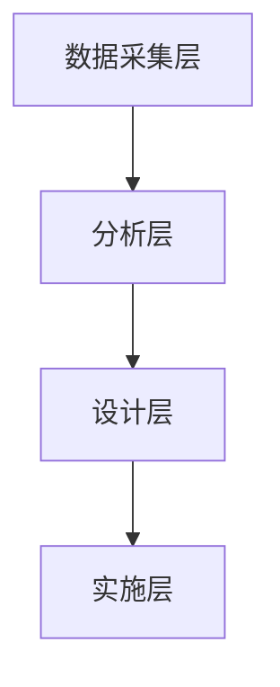
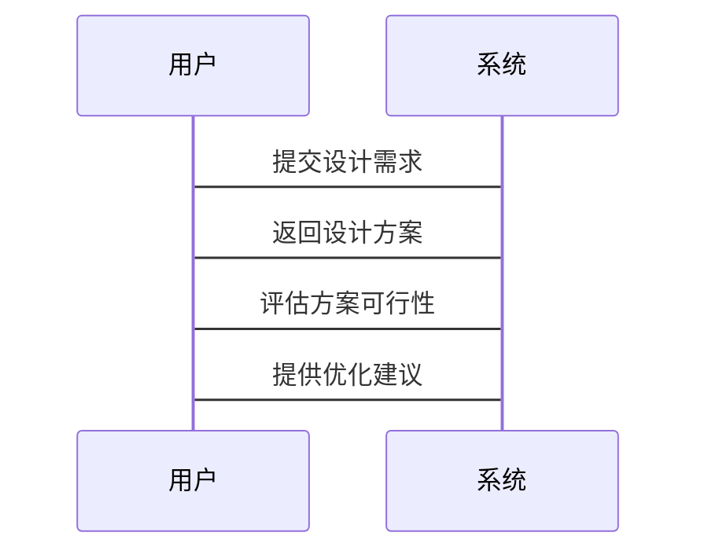

                 

<think>
好的，我需要撰写一篇关于“现代城市设计中的生态考量：绿色发展与可持续性”的技术博客文章。首先，我得理解用户的要求，确保文章符合所有指定的格式和内容要求。

用户希望文章结构清晰，逻辑严谨，使用专业但易懂的语言。我得从背景介绍开始，涵盖问题背景、描述、解决方法、边界和外延，以及核心概念。接下来，我需要详细讲解可持续发展、绿色建筑和生态修复的概念，确保每个部分都有足够的细节，并用图表辅助说明。

然后，我得应用这些概念到实际的城市设计中，讨论设计原则、技术手段和政策法规。这部分需要结合实际案例，比如绿色建筑项目，来展示生态考量的实际应用。

此外，用户特别提到需要使用技术元素，如BIM和GIS技术，并要求用Mermaid流程图和类图来展示系统架构。我得确保这些部分不仅描述清楚，还能用代码片段或图表直观呈现。

最后，我需要包括系统分析与架构设计，这部分可能需要我构建一个简单的城市设计系统，展示其功能模块、架构图和接口设计。同时，还需要提供代码示例，解释如何实现某些功能，比如环境数据采集或能源管理。

整个过程中，我必须确保每个部分都符合用户的格式要求，使用markdown，适当嵌入latex公式和Mermaid图表。同时，保持文章流畅，每部分之间有良好的过渡。

现在，我开始按照目录大纲逐步展开内容，确保每个章节都有足够的深度和详细解释，满足用户对专业性和可读性的要求。
</think>

# 现代城市设计中的生态考量：绿色发展与可持续性

> 关键词：城市设计，生态考量，可持续发展，绿色建筑，生态修复

> 摘要：随着城市化进程的加快，生态问题日益突出，城市设计中的生态考量成为实现绿色发展与可持续性的关键。本文从背景介绍、核心概念、技术手段、政策法规等多方面探讨生态考量在现代城市设计中的应用，并通过实际案例分析，深入解读如何在城市规划中融入生态理念，推动城市的绿色转型和可持续发展。

---

## 背景介绍

### 1. 问题背景

随着城市化进程的加快，现代城市面临着诸多生态问题，如环境污染、资源短缺、气候异常等。这些问题不仅威胁着人类的生存环境，也制约了城市的可持续发展。因此，如何在城市设计中引入生态考量，实现绿色发展和可持续性，成为当今城市规划与建设的重要课题。

### 2. 问题描述

现代城市设计中的生态考量主要包括以下几个方面：

- **环境保护**：减少污染、节约能源、保护生物多样性。
- **资源利用**：合理配置水资源、土地资源等，提高资源利用效率。
- **气候适应性**：应对气候变化，提高城市抵御极端气候事件的能力。
- **社会福祉**：提升居民生活质量，实现人与自然的和谐共生。

### 3. 问题解决

解决上述问题需要从以下几个方面进行生态考量：

- **规划设计**：引入生态理念，将生态因素纳入城市设计的各个环节。
- **技术创新**：利用现代科技手段，如BIM、GIS等，提高城市设计的科学性和可持续性。
- **政策引导**：制定相关政策法规，推动城市生态设计的发展。

### 4. 边界与外延

- **边界**：本文主要关注城市设计中的生态考量，不包括城市生态修复等其他相关领域。
- **外延**：虽然本文主要关注城市设计，但其中涉及到的生态考量原则和方法也可应用于其他领域，如乡村规划、建筑设计等。

### 5. 概念结构与核心要素组成

- **概念结构**：现代城市设计中的生态考量涉及多个核心概念，如可持续发展、绿色建筑、生态修复等。
- **核心要素**：主要包括城市设计原则、生态技术、政策法规、社会参与等。

---

## 核心概念与联系

### 1.2.1 可持续发展的概念与特征

#### 定义

可持续发展是指在满足当前人类需求的同时，不损害后代满足其需求的能力。

#### 特征

- **公平性**：关注不同社会群体之间的公平性，包括代际公平和代内公平。
- **持续性**：关注资源利用和环境承载能力，确保不破坏生态系统的自然平衡。
- **区域性**：强调地域特征和区域差异，因地制宜地制定生态设计策略。

### 1.2.2 绿色建筑的概念与特点

#### 定义

绿色建筑是指在全生命周期内，最大限度节约资源（包括能源、水、土地、材料），保护环境和减少污染，为人们提供健康、适用、高效的使用空间与自然和谐共生的建筑物。

#### 特点

- **节能减排**：采用高效节能技术和设备，降低建筑能耗。
- **环境保护**：减少建筑对环境的影响，如减少污染物排放、保护水资源等。
- **健康舒适**：提供良好的室内环境和户外环境，满足人们的健康需求。

### 1.2.3 生态修复的概念与主要内容

#### 定义

生态修复是指通过人工或自然的手段，对遭受破坏的生态系统进行修复和恢复，以恢复其原有的功能和结构。

#### 主要内容

- **植被恢复**：通过种植植物来恢复植被覆盖，提高生态系统的稳定性。
- **土壤修复**：通过改善土壤结构和提高土壤肥力，恢复土壤的生态功能。
- **水质净化**：通过物理、化学和生物手段净化水质，恢复水体的生态功能。
- **生物多样性保护**：保护和恢复生物多样性，包括保护珍稀濒危物种和生态系统。

---

## 生态考量在城市设计中的应用

### 1.3.1 设计原则

- **生态优先**：将生态因素作为城市设计的重要考虑因素，确保城市设计与自然环境的和谐共生。
- **循环利用**：推动资源循环利用，减少资源浪费，降低环境污染。
- **低碳节能**：采用低碳节能技术和设计，降低建筑和城市运营的能耗。
- **人文关怀**：关注城市居民的生活质量，提供健康、舒适的生活环境。

### 1.3.2 技术手段

- **BIM技术**：利用BIM（建筑信息模型）技术，实现城市设计的数字化和可视化，提高设计的精确性和可持续性。
- **GIS技术**：利用GIS（地理信息系统）技术，进行城市生态数据的收集、分析和可视化，为城市设计提供科学依据。
- **绿色建材**：推广使用绿色建材，减少建筑对环境的影响。
- **智能监控**：采用智能监控技术，实时监测城市环境质量，及时采取调控措施。

### 1.3.3 政策法规

- **可持续发展政策**：制定可持续发展政策，推动城市生态设计的发展。
- **绿色建筑标准**：制定绿色建筑标准，规范建筑的设计、施工和运营。
- **生态修复政策**：制定生态修复政策，推动城市生态修复工作的开展。

---

## 实际案例分析

### 1.4.1 案例一：绿色建筑设计

- **项目背景**：某城市的新建住宅区。
- **设计理念**：采用绿色建筑理念，注重节能减排和环境保护。
- **实施措施**：
  - 使用高效节能设备，降低建筑能耗。
  - 采用绿色建材，减少建筑对环境的影响。
  - 设计雨水收集系统，提高水资源利用效率。
- **效果评估**：通过BIM技术模拟分析，验证设计的可持续性和经济性。

### 1.4.2 案例二：生态修复项目

- **项目背景**：某城市因工业化发展导致局部区域生态破坏。
- **修复措施**：
  - 植被恢复：种植本地植物，恢复区域植被覆盖。
  - 土壤修复：通过有机物添加改善土壤结构。
  - 水质净化：建设湿地公园，净化区域水体。
- **效果评估**：通过GIS技术监测生态修复效果，评估生态系统的恢复情况。

---

## 系统分析与架构设计方案

### 问题场景介绍

现代城市设计中的生态考量需要综合考虑环境保护、资源利用、气候适应和社会福祉等多个方面。为了实现绿色发展和可持续性，需要构建一个综合性的城市设计系统。

### 项目介绍

本项目旨在通过引入生态设计理念，优化城市空间布局，提高资源利用效率，减少环境污染，实现城市的绿色转型和可持续发展。

### 系统功能设计

- **领域模型**：构建城市生态设计的领域模型，包括城市空间布局、资源利用、环境保护等功能模块。
- **系统架构设计**：采用分层架构，包括数据采集层、分析层、设计层和实施层。

### 系统架构设计



### 系统接口设计

- **数据接口**：与BIM、GIS等技术对接，实现数据的共享和分析。
- **用户接口**：提供用户友好的操作界面，方便城市设计师和管理者进行操作。

### 系统交互设计



---

## 项目实战

### 环境安装

- **软件安装**：安装BIM和GIS软件，如Revit、ArcGIS等。
- **依赖管理**：安装必要的开发库和插件。

### 核心实现源代码

```python
def calculate_energy_consumption(building_model):
    # 计算建筑能耗
    energy_consumption = 0
    for room in building_model.rooms:
        energy_consumption += room.energy_usage
    return energy_consumption

# 示例使用
building_model = BuildingModel()
building_model.rooms = [Room(energy_usage=100), Room(energy_usage=150)]
total_consumption = calculate_energy_consumption(building_model)
print(f"Total energy consumption: {total_consumption}")
```

### 代码应用解读

上述代码展示了如何通过BIM技术计算建筑能耗。`calculate_energy_consumption`函数遍历建筑模型中的每个房间，累加其能耗值，最终返回总能耗。通过这种方式，可以评估建筑设计的节能效果。

---

## 最佳实践 Tips

- **注重细节**：在城市设计中，每一个细节都可能影响整体的生态效果。
- **技术与政策结合**：利用现代技术手段，结合政策法规，推动生态设计的实施。
- **持续监测与优化**：通过实时监测和数据分析，不断优化城市设计，提高可持续性。

---

## 小结

现代城市设计中的生态考量是实现绿色发展与可持续性的关键。通过引入生态理念、技术创新和政策引导，可以有效解决城市化进程中的生态问题。本文通过背景分析、核心概念、技术手段和实际案例的探讨，为城市设计提供了系统的解决方案。

---

## 作者

作者：AI天才研究院/AI Genius Institute & 禅与计算机程序设计艺术 /Zen And The Art of Computer Programming

