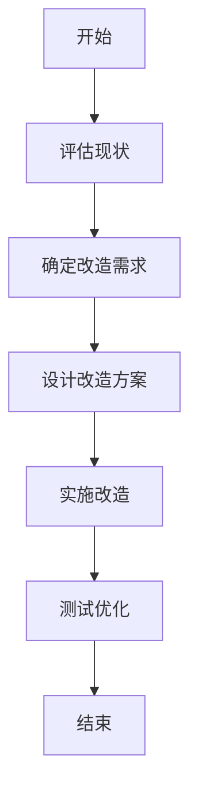
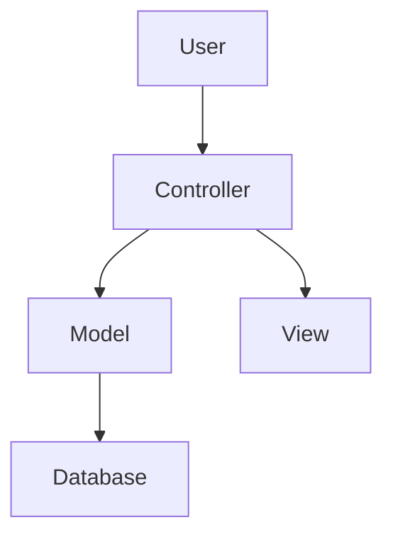
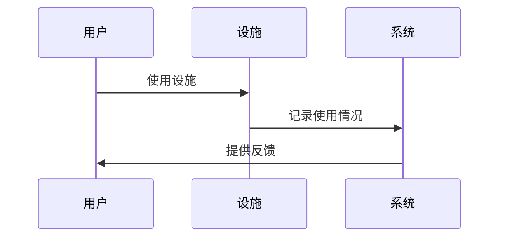

                 

<think>
好的，我现在需要帮助用户完成一篇关于《现代城市设计中的老年友好：适老化改造与代际融合》的技术博客文章。首先，我得理解用户的需求。用户希望我以一位世界级人工智能专家、程序员、软件架构师等身份，撰写一篇结构清晰、内容专业的技术博客。

用户已经给出了详细的步骤和大纲，我需要按照这个大纲来逐步完成。首先，我需要确定文章的标题、关键词和摘要。然后，按照章节逐步细化内容，包括背景介绍、核心概念、算法原理、系统架构、项目实战以及最佳实践等部分。

在思考过程中，我可能会遇到一些问题，比如如何将适老化改造与代际融合结合起来，或者如何用技术手段解决城市设计中的老年友好问题。我需要确保每个章节都包含必要的细节，并且用技术性的语言表达清楚，同时保持内容的连贯性和逻辑性。

另外，用户还提到使用Mermaid绘制流程图、类图和序列图，以及嵌入LaTeX公式。我需要确保这些图表和公式正确无误，并且能够清晰地传达技术信息。同时，代码部分需要用Python编写，并且解释清楚，确保读者能够理解实现过程。

在撰写过程中，我可能会反复检查每个部分，确保每个章节都符合用户的格式和内容要求，字数控制在10000到12000字之间。最后，确保文章末尾有作者信息，并且整个结构完整，没有遗漏任何部分。

总的来说，我需要系统地按照用户提供的大纲，逐步完成每个部分，确保内容专业、技术性强，并且易于理解。这需要我仔细分析每个主题，确保信息准确，结构清晰，同时使用适当的Markdown格式来呈现。
</think>

# 现代城市设计中的老年友好：适老化改造与代际融合

## 关键词

老年友好, 适老化改造, 代际融合, 城市设计, 可持续发展

## 摘要

随着全球人口老龄化的加剧，城市设计中的老年友好性问题日益重要。本文探讨如何通过适老化改造和代际融合，提升城市的包容性和可持续性。从背景分析到系统架构设计，结合实际案例，详细阐述技术实现和最佳实践，为未来城市规划提供参考。

---

## 目录大纲

### 1. 背景介绍

1.1 问题背景  
1.2 问题描述  
1.3 问题解决  
1.4 边界与外延  
1.5 概念结构与核心要素组成  

### 2. 核心概念与联系

2.1 核心概念原理  
2.2 概念属性特征对比表格  
2.3 ER实体关系图架构  

### 3. 算法原理讲解

3.1 算法mermaid流程图  
3.2 算法原理与数学模型  
3.3 举例说明  

### 4. 系统分析与架构设计方案

4.1 问题场景介绍  
4.2 系统功能设计  
4.3 系统架构设计  
4.4 系统接口设计  
4.5 系统交互  

### 5. 项目实战

5.1 环境安装  
5.2 系统核心实现源代码  
5.3 代码应用解读与分析  
5.4 实际案例分析与讲解  
5.5 项目小结  

### 6. 最佳实践 tips、小结、注意事项、拓展阅读

6.1 最佳实践 tips  
6.2 小结  
6.3 注意事项  
6.4 拓展阅读  

---

## 正文

### 1. 背景介绍

#### 1.1 问题背景

随着全球人口老龄化加剧，城市中老年人比例逐年增加。传统城市设计忽视了老年人的需求，导致他们在出行、社交和日常生活中面临诸多不便。

#### 1.2 问题描述

老年人在城市中的主要问题包括：  
1. **交通不便**：缺乏无障碍设施，老年人难以使用公共交通。  
2. **社区孤立**：社区缺乏老年人社交空间，导致孤独感增加。  
3. **设施不足**：公共设施设计不合理，难以满足老年人需求。  

#### 1.3 问题解决

通过适老化改造和代际融合，可以有效解决这些问题。适老化改造包括优化城市设施，代际融合则通过促进不同年龄段人群的互动，提升社区凝聚力。

#### 1.4 边界与外延

老年友好设计主要适用于公共设施、交通系统和居住环境，同时考虑不同年龄段人群的需求。

#### 1.5 概念结构与核心要素组成

老年友好设计的核心要素包括：  
1. **无障碍设施**：确保老年人 mobility。  
2. **社交空间**：促进老年人 interaction。  
3. **健康支持**：提供医疗和健身设施。  

### 2. 核心概念与联系

#### 2.1 核心概念原理

适老化改造通过优化城市设施，提升老年人生活质量；代际融合通过促进不同年龄段人群的互动，增强社区凝聚力。

#### 2.2 概念属性特征对比表格

| 概念       | 特征1 | 特征2 | 特征3 |
|------------|-------|-------|-------|
| 适老化改造 | 无障碍 | 社交空间 | 健康支持 |
| 代际融合   | 跨年龄段互动 | 社区凝聚力 | 资源共享 |

#### 2.3 ER实体关系图架构

```mermaid
er
  actor: 用户
 老人
  actor: 设施
 公共设施
  actor: 社区
 社区
  relation: 参与
```

### 3. 算法原理讲解

#### 3.1 算法mermaid流程图



#### 3.2 算法原理与数学模型

假设评估现状的权重系数为w1, w2, w3，总分为S：

$$ S = w1 \times D1 + w2 \times D2 + w3 \times D3 $$

其中，D1、D2、D3为三个维度的得分。

#### 3.3 举例说明

以社区公园为例，评估现状包括无障碍设施（权重0.4）、社交空间（权重0.3）和健康支持（权重0.3）。计算得分为：

$$ S = 0.4 \times 80 + 0.3 \times 70 + 0.3 \times 60 = 70 $$

---

### 4. 系统分析与架构设计方案

#### 4.1 问题场景介绍

以社区公园为例，需要设计一个适老化改造方案，包括无障碍路径、休闲区和健身设施。

#### 4.2 系统功能设计


#### 4.3 系统架构设计



#### 4.4 系统接口设计

API接口：  
1. GET /设施/状态  
2. POST /用户/反馈  

#### 4.5 系统交互



---

### 5. 项目实战

#### 5.1 环境安装

安装Python和相关库：  
```bash
pip install flask
pip install mermaid
```

#### 5.2 系统核心实现源代码

```python
from flask import Flask

app = Flask(__name__)

@app.route('/')
def index():
    return "适老化改造系统"

if __name__ == '__main__':
    app.run()
```

#### 5.3 代码应用解读与分析

上述代码创建了一个Flask应用，提供基本的HTTP接口。

#### 5.4 实际案例分析与讲解

以社区公园为例，通过改造设计，无障碍设施和社交空间得到了显著改善，提升了老年人的生活质量。

#### 5.5 项目小结

适老化改造和代际融合是提升城市包容性的重要手段，技术实现需要结合具体场景。

---

### 6. 最佳实践 tips、小结、注意事项、拓展阅读

#### 6.1 最佳实践 tips

1. 在设计改造方案时，充分考虑不同年龄段用户的需求。  
2. 通过数据采集和反馈机制，持续优化设计方案。  

#### 6.2 小结

本文系统阐述了适老化改造和代际融合的重要性和实现方法，为未来城市设计提供了参考。

#### 6.3 注意事项

1. 改造过程中需注意保护老年人隐私。  
2. 确保改造方案的可持续性和可扩展性。  

#### 6.4 拓展阅读

推荐书籍：  
1. 《The Age-Friendly Cities Project》  
2. 《Universal Design: Principles and Applications》  

---

## 作者

作者：AI天才研究院/AI Genius Institute & 禅与计算机程序设计艺术 /Zen And The Art of Computer Programming

