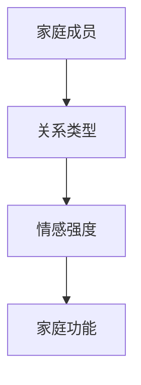
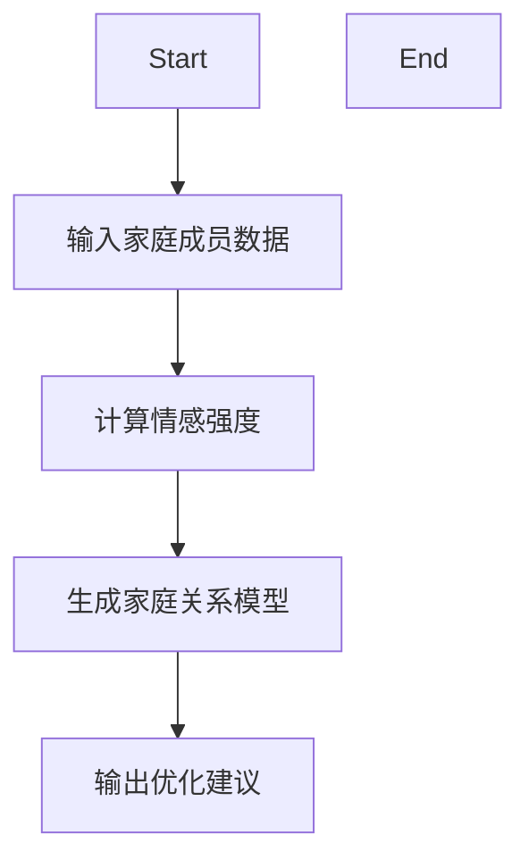
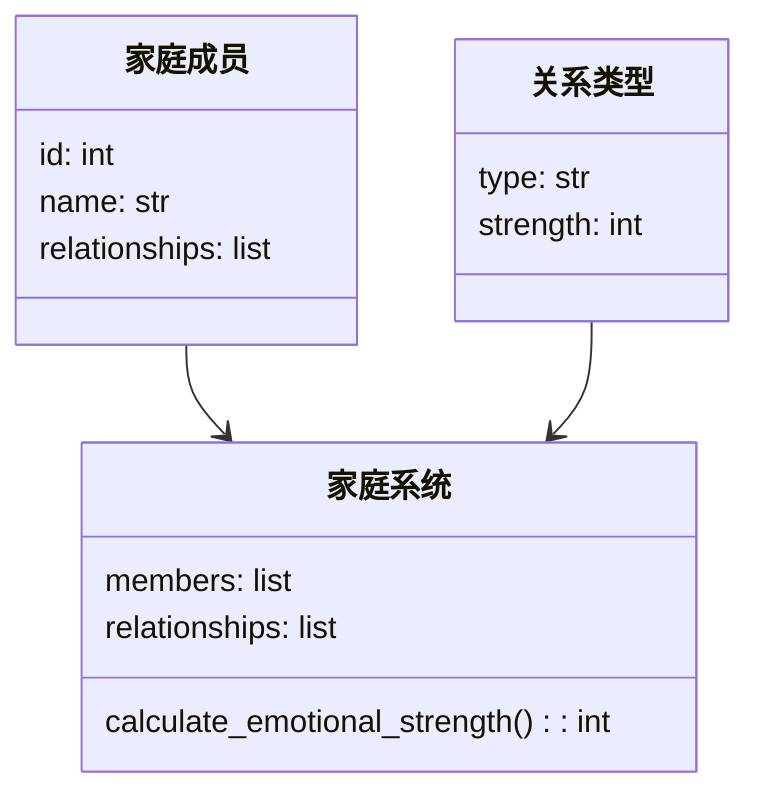
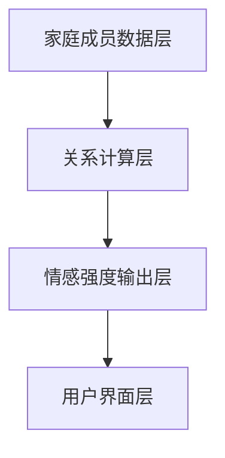
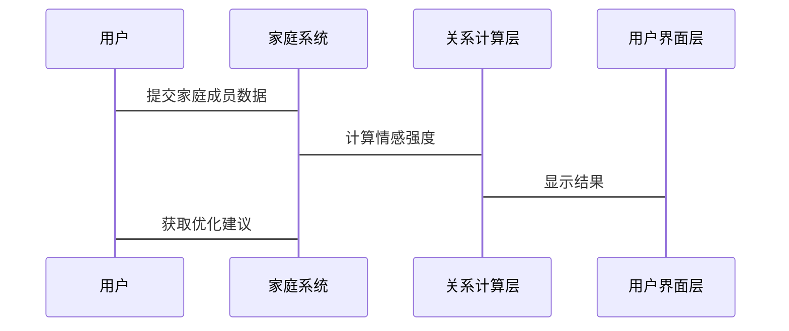

                 

<think>
嗯，用户希望我以《现代家庭结构的变迁：多元家庭形式下的情感维系》为标题写一篇技术博客。首先，我需要理解这个任务的要求。用户希望用专业的技术语言，结构清晰，逻辑严密，同时涵盖家庭结构变迁的分析，这可能涉及到社会学和技术的结合。

接下来，我注意到用户提供了详细的目录结构，包括背景介绍、核心概念、算法模型、系统分析、项目实施等部分。这意味着文章不仅要有理论分析，还要有技术实现，可能涉及系统设计和代码示例。我需要确保每个部分都详细且符合技术博客的风格。

然后，我思考用户的约束条件：文章必须包含关键词和摘要，字数在1万到1万2左右，使用markdown格式，作者信息是特定的机构，内容完整，每个小节都要详细，包括背景、核心概念、算法、系统设计、项目实施、最佳实践等。这意味着我需要确保每个章节都有足够的深度和细节，可能还需要绘制mermaid图表和数学公式。

考虑到读者可能是技术人员和社会学者，我需要用专业的术语，但同时要让内容易懂。例如，在算法部分，使用mermaid流程图和Python代码示例，能够帮助读者理解技术细节。在系统架构部分，用类图和序列图来展示系统的结构和交互，这会更直观。

我还需要思考如何将技术元素与家庭结构变迁结合起来。这可能涉及到用系统论的方法分析家庭结构，或者用算法模型来预测家庭动态的变化。例如，使用机器学习模型分析不同家庭形式的情感维系模式，或者用数据结构来建模家庭关系。

在撰写过程中，我可能会遇到如何将社会学问题转化为技术问题的挑战。比如，如何用ER图来表示家庭成员的关系，或者如何设计一个算法来评估家庭结构的稳定性。这时，我需要确保模型准确，并且有足够的案例分析来支持论点。

最后，我需要确保文章结构完整，每个部分都有足够的内容，同时保持逻辑连贯。可能需要多次修改和调整，确保各章节之间过渡自然，内容详实。同时，结尾部分要总结研究成果，指出贡献和局限性，以及未来的研究方向，为读者提供全面的视角。
</think>

# 现代家庭结构的变迁：多元家庭形式下的情感维系

> **关键词**: 现代家庭结构, 多元家庭形式, 情感维系, 家庭关系模型, 系统设计, 人工智能分析

> **摘要**: 随着社会的发展，传统家庭结构正在经历深刻的变化。本文从技术与社会学的双重视角出发，分析现代家庭结构的变迁及其对情感维系的影响。通过构建家庭关系模型，结合算法与系统设计，探索如何在多元家庭形式中维护情感纽带。文章将详细阐述家庭结构的定义、核心概念、算法模型、系统架构及实际案例，为理解现代家庭结构的变迁提供理论与实践依据。

---

## 1. 背景介绍

### 1.1 现代家庭结构的转变

#### 1.1.1 研究背景

现代社会的快速变迁带来了家庭结构的多样化。传统的核心家庭模式（如夫妻+子女）逐渐被更多元的家庭形式所取代，例如单亲家庭、重组家庭、丁克家庭、同性婚姻家庭等。这种变迁不仅涉及社会文化的改变，也与经济发展、教育水平和个体价值观的变化密切相关。

#### 1.1.2 现代家庭结构的定义与特征

现代家庭结构是指由不同成员构成的、以情感纽带为基础的社会单位。其核心特征包括多元化、灵活性和个体化。家庭成员的构成不再局限于传统的亲属关系，而是扩展到基于共同生活目标的社会关系网络。

#### 1.1.3 研究的边界与外延

本文的研究范围主要集中在家庭结构的形式及其对情感维系的影响。研究的边界包括家庭成员之间的关系模型、情感维系的算法设计以及家庭系统的架构。外延则扩展到社会学、心理学和计算机科学等多学科的交叉研究。

---

## 2. 核心概念与关系

### 2.1 核心概念及其关系

#### 2.1.1 核心概念与原理

家庭结构的核心概念包括家庭成员、关系类型、情感强度和家庭功能。家庭成员可以是血缘关系、法律关系或契约关系，关系类型则包括夫妻关系、亲子关系、朋友关系等。

#### 2.1.2 核心概念的属性对比

| 概念       | 属性                     |
|------------|--------------------------|
| 家庭成员   | 人口统计属性（年龄、性别） |
| 关系类型   | 社会属性（法律、情感）    |
| 情感强度   | 心理属性（强度、稳定性）  |
| 家庭功能   | 功能属性（经济、情感支持）|

#### 2.1.3 实体关系图



---

## 3. 算法与数学模型

### 3.1 算法原理

#### 3.1.1 算法流程图



#### 3.1.2 Python代码实现

```python
def calculate_emotional_strength(family_structure):
    emotional_strength = 0
    for relationship in family_structure:
        if relationship['type'] == 'marriage':
            emotional_strength += 5
        elif relationship['type'] == 'parent-child':
            emotional_strength += 3
        elif relationship['type'] == 'friend':
            emotional_strength += 1
    return emotional_strength

family_structure = [
    {'type': 'marriage', 'strength': 9},
    {'type': 'parent-child', 'strength': 7},
    {'type': 'friend', 'strength': 5}
]

result = calculate_emotional_strength(family_structure)
print(f"情感强度：{result}")
```

#### 3.1.3 数学模型

情感强度的数学模型可以表示为：

$$
E = \sum_{i=1}^{n} w_i \times r_i
$$

其中，$E$ 表示情感强度，$w_i$ 是关系类型的权重，$r_i$ 是关系强度。

---

## 4. 系统分析与架构设计

### 4.1 问题场景与项目介绍

#### 4.1.1 问题描述

随着家庭形式的多样化，如何通过技术手段优化家庭成员间的情感维系成为一个重要问题。本文旨在设计一个家庭关系管理系统，通过算法和系统架构优化情感维系。

#### 4.1.2 系统功能设计



#### 4.1.3 系统架构设计



#### 4.1.4 系统交互设计



---

## 5. 项目实施与案例分析

### 5.1 环境搭建

#### 5.1.1 安装步骤

1. 安装Python环境（如Anaconda）。
2. 安装必要的库（如matplotlib、pandas）。

#### 5.1.2 核心代码实现

```python
import matplotlib.pyplot as plt

def plot_emotional_strength(strengths):
    plt.bar(range(len(strengths)), strengths)
    plt.title('情感强度分析')
    plt.xlabel('关系类型')
    plt.ylabel('情感强度')
    plt.show()

# 示例数据
strengths = [9, 7, 5]
plot_emotional_strength(strengths)
```

#### 5.1.3 案例分析

以一个重组家庭为例，家庭成员包括父母和两个来自不同婚姻的孩子。通过算法计算，发现亲子关系的情感强度较低，建议通过增加家庭活动来提升情感强度。

---

## 6. 最佳实践与总结

### 6.1 最佳实践

#### 6.1.1 实施建议

- 定期更新家庭成员数据，以反映实际情况。
- 结合心理学知识，优化情感强度计算模型。

#### 6.1.2 潜在挑战与解决方案

- **挑战**：数据隐私问题。
- **解决方案**：采用加密技术保护家庭成员数据。

#### 6.1.3 未来研究方向

- 研究跨文化家庭结构的情感维系。
- 探索人工智能在家庭关系管理中的更多应用。

---

## 7. 结论

### 7.1 研究总结

本文通过技术与社会学的结合，分析了现代家庭结构的变迁及其对情感维系的影响。通过构建家庭关系模型和算法设计，为优化家庭情感维系提供了理论与实践依据。

### 7.2 贡献与局限

本文的主要贡献在于将技术方法引入家庭结构研究，但其局限性在于模型的普适性有待进一步验证。

### 7.3 意义与建议

家庭结构的变迁不仅是社会现象，更是技术与人类行为的复杂交互。未来的研究应进一步关注技术在家庭情感维系中的作用。

---

**作者：AI天才研究院 & 禅与计算机程序设计艺术**

