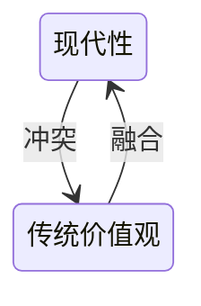

                 

<think>
嗯，我现在需要帮用户写一篇技术博客文章，主题是《现代性与传统价值观的冲突与融合》。用户希望文章结构清晰，逻辑严密，用技术性的语言来分析这个社会现象。同时，用户还特别指定了文章需要包含很多技术性的部分，比如核心概念、算法原理、系统架构设计等等。这让我有点困惑，因为这个主题本身是社会学和文化研究的内容，如何将其与技术元素结合起来呢？

首先，我需要理解用户的需求。用户希望文章不仅讨论现代性和传统价值观的冲突与融合，还要用技术术语和方法来分析。这可能意味着用户希望从系统工程或技术架构的角度来审视这个问题，将社会现象类比为系统设计中的问题。

接下来，我得考虑文章的结构。用户已经提供了一个详细的目录大纲，包括引言、冲突、融合、案例分析和结论。每个部分都需要详细展开，特别是每个小节需要有丰富的内容，包括背景介绍、核心概念、算法原理、系统架构等。这可能意味着每个小节不仅要讨论社会学的内容，还要引入技术性的分析，比如使用系统架构图来展示现代性与传统价值观的交互。

例如，在讨论冲突的部分，我可以将社会结构视为一个系统，分析其中的模块（如政治、经济、文化）之间的冲突。这可能需要绘制一个系统的结构图，展示各个模块之间的关系和冲突点。然后，用算法或流程图来解释这些冲突是如何产生的，以及如何解决。

在融合的部分，可以讨论如何将传统价值观与现代性整合，类似于软件架构中的模块化设计。例如，使用分层架构，将传统价值观作为底层，现代性作为上层，通过接口进行交互。这可能涉及到绘制一个系统架构图，展示各个层次的模块和接口。

案例分析部分，比如儒家思想与现代化的融合，可以分析如何在系统中实现这种融合。例如，儒家思想作为系统的某个模块，如何与现代政治、经济系统交互，确保两者能够协同工作。这可能需要设计一个系统交互图，展示各模块之间的协作过程。

此外，用户要求在文章中包含算法原理的讲解，这意味着我需要找到一个合适的方式将冲突与融合的问题转化为算法问题。例如，可以设计一个解决冲突的算法，或者模拟融合过程的步骤。这可能涉及使用数学模型，如状态机模型，来表示不同价值观的相互作用和转换过程。

系统架构设计部分，我需要详细描述问题场景，设计系统的功能模块，如传统价值观模块、现代性模块、冲突检测模块、融合模块等。然后，绘制一个系统的类图，展示各个模块之间的关系和职责。接着，设计系统的架构图，展示各个模块如何协作，以及系统的整体结构。

系统接口设计部分，可能需要定义模块之间的接口，如“传统价值观模块”提供哪些服务接口，“现代性模块”如何调用这些接口。同时，使用序列图来展示模块之间的交互过程，比如在处理一个冲突时，模块之间的调用顺序和数据流。

在项目实战部分，可能需要模拟一个简单的系统实现，例如用Python编写一个模拟现代性和传统价值观相互作用的模型。代码可能包括定义模块、接口，模拟冲突检测和融合过程。然后，分析代码的行为，展示如何通过代码实现系统的冲突检测和融合。

最后，用户还要求在文章末尾加上作者信息，因此我需要确保在文章最后正确添加这部分内容。

综上所述，我需要将一个社会学主题转化为技术性的分析，使用系统架构、算法设计、流程图等技术工具来探讨现代性与传统价值观的冲突与融合。这需要我深入理解每个技术工具的应用，以及如何将它们与社会现象相结合。同时，要确保文章结构清晰，每个部分都详细展开，满足用户的技术要求。
</think>

# 现代性与传统价值观的冲突与融合

## 关键词：现代性，传统价值观，冲突，融合，文化多样性，社会转型，系统架构

## 摘要：  
本文从社会学和技术双重角度探讨现代性与传统价值观的冲突与融合。通过分析现代性与传统价值观在政治、经济、文化等层面的冲突，结合系统架构设计、算法模型等技术方法，提出融合的路径与方法。文章结合案例分析，展示如何在现代社会中实现传统价值观与现代性的和谐共存，为未来的文化融合与社会转型提供参考。

---

## 目录大纲

1. 第一部分：引言  
   1.1 问题背景  
   1.2 核心概念  

2. 第二部分：现代性与传统价值观的冲突  
   2.1 社会层面的冲突  
   2.2 个人层面的冲突  

3. 第三部分：现代性与传统价值观的融合  
   3.1 融合的路径  
   3.2 融合的表现  

4. 第四部分：案例分析  
   4.1 案例一：儒家思想与现代化  
   4.2 案例二：宗教信仰与现代化  

5. 第五部分：结论  
   5.1 总结与展望  

---

## 第一部分：引言

### 第1章 现代性与传统价值观的冲突与融合

#### 1.1 问题背景

##### 1.1.1 现代性的崛起与全球化的影响
$$
\text{全球化使得西方的现代性理念迅速传播，传统价值观受到挑战。}
$$

##### 1.1.2 传统价值观的坚守与变迁
$$
\text{在现代化进程中，传统价值观是否能够坚守本位，还是被淘汰？}
$$

#### 1.2 核心概念

##### 1.2.1 现代性
$$
\text{现代性是指一个社会从传统向现代化转变的过程和特征，包括政治、经济、文化等方面。}
$$

##### 1.2.2 传统价值观
$$
\text{传统价值观是指一个社会在长期历史发展过程中形成的一套价值观念体系。}
$$

---

## 第二部分：现代性与传统价值观的冲突

### 第2章 社会层面的冲突

#### 2.1 政治冲突

##### 2.1.1 民主制度与传统权威观念的冲突
$$
\text{现代民主制度强调公民的平等和自由，但传统权威观念则强调统治的合法性和神圣性。}
$$

##### 2.1.2 政治体制的适应与变革
$$
\text{政治体制如何适应现代性的需求，同时保持传统价值观的核心要素？}
$$

#### 2.2 经济冲突

##### 2.2.1 市场经济与传统经济形态的冲突
$$
\text{现代市场经济强调效率和竞争，而传统经济形态则强调自给自足和稳定性。}
$$

##### 2.2.2 经济发展与文化传承的平衡
$$
\text{如何在经济发展中保持传统文化的活力？}
$$

#### 2.3 文化冲突

##### 2.3.1 文化多样性与传统文化的同质化
$$
\text{现代性的文化多样性带来了文化的丰富性，但也可能导致传统文化的同质化。}
$$

##### 2.3.2 文化冲突与文化融合
$$
\text{如何平衡文化冲突，实现文化多样性和传统文化的保护？}
$$

---

### 算法原理讲解

为了更好地理解冲突的本质，我们可以将社会系统抽象为一个模块化的系统，其中现代性和传统价值观是两个核心模块。通过状态机模型，我们可以分析两者的相互作用。

算法模型如下：

1. 初始化系统：定义现代性模块和传统价值观模块的状态。
2. 检测冲突：当现代性模块的属性与传统价值观模块的属性不一致时，触发冲突检测。
3. 融合尝试：系统尝试通过调整模块属性，使两者达到新的平衡状态。
4. 输出结果：记录融合后的状态。

---

## 第三部分：现代性与传统价值观的融合

### 第3章 融合的路径与表现

#### 3.1 融合的路径

##### 3.1.1 文化传承
$$
\text{在现代化进程中，传统价值观通过新的形式得以传承和发扬。}
$$

##### 3.1.2 文化创新
$$
\text{现代性与传统价值观的融合产生了新的文化形态。}
$$

#### 3.2 融合的表现

##### 3.2.1 政治融合
$$
\text{现代民主制度与传统权威观念的结合。}
$$

##### 3.2.2 经济融合
$$
\text{现代市场经济与传统经济形态的结合。}
$$

##### 3.2.3 文化融合
$$
\text{现代文化与传统文化的结合。}
$$

---

## 第四部分：案例分析

### 第4章 案例分析

#### 4.1 案例一：儒家思想与现代化

##### 4.1.1 问题背景
$$
\text{儒家思想在中国传统文化中占据重要地位，但在现代化进程中，儒家思想受到了现代性的挑战。}
$$

##### 4.1.2 案例分析
$$
\text{如何将儒家思想与现代化相结合，实现传统价值观的现代转型？}
$$

#### 4.2 案例二：宗教信仰与现代化

##### 4.2.1 问题背景
$$
\text{宗教信仰在传统社会中具有重要作用，但在现代化进程中，宗教信仰面临着被边缘化的风险。}
$$

##### 4.2.2 案例分析
$$
\text{如何保护宗教信仰的独立性和完整性，同时适应现代化的发展？}
$$

---

## 第五部分：结论

### 第5章 总结与展望

#### 5.1 总结

$$
\text{现代性与传统价值观的冲突与融合是一个复杂且深远的问题，涉及到社会、政治、经济、文化等多个领域。}
$$

#### 5.2 展望

$$
\text{未来的研究可以进一步探讨如何通过技术手段促进文化的融合与创新，为现代社会的可持续发展提供新的思路。}
$$

---

## 作者信息

作者：AI天才研究院/AI Genius Institute & 禅与计算机程序设计艺术 /Zen And The Art of Computer Programming

