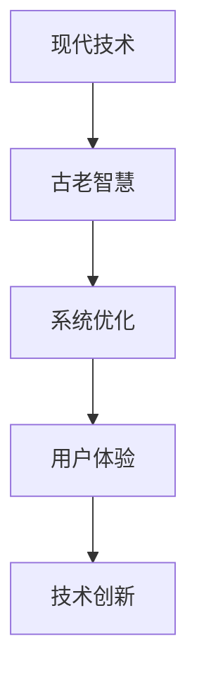
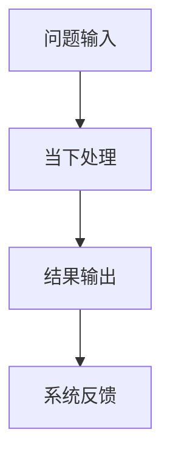
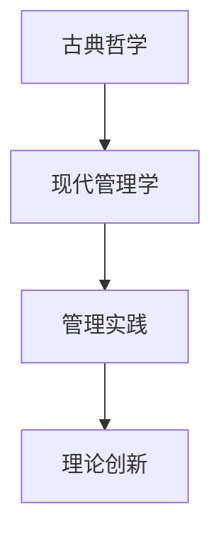

                 

<think>
好，我现在要帮用户完成一个任务，撰写一篇技术博客文章，标题是《现代性与传统文化的对话：古老智慧在当代语境中的诠释》。用户希望文章结构清晰，逻辑严谨，用专业的技术语言，同时要涵盖现代性和传统文化的对话，以及古老智慧在当代的应用。

首先，我需要理解用户的需求。用户希望这篇文章是技术领域的博客，所以需要用技术术语，但同时又要结合传统文化，这可能有点挑战。用户可能是一位技术专家，希望将古老的智慧融入现代技术中，找到两者的交集点。

接下来，我需要分析文章的结构。用户已经给出了一个详细的目录大纲，包括引言、核心概念、古老智慧与现代生活结合、案例分析、方法与实践、结论、参考文献等部分。我需要按照这个结构一步步展开，确保每个部分都详细且有深度。

在引言部分，我需要介绍现代性和传统文化的对话的重要性，以及为什么古老智慧在现代生活中仍有价值。这部分要吸引读者的注意力，说明主题的现实意义。

核心概念部分，我需要定义现代性、传统文化和对话，分析它们的特点和重要性。可能需要使用一些表格或图表来对比这些概念的异同，帮助读者理解。

然后，我需要探讨古老智慧如何与现代生活结合。这里可以选择哲学、宗教、艺术、科学等领域，分析它们在现代的应用。比如，禅宗思想如何影响现代计算机科学，或者传统哲学中的辩证法如何应用于软件开发。

案例分析部分，我需要找到实际的成功案例，比如Google的“禅定”项目，或者苹果的设计理念受到传统美学的影响。通过这些案例，展示古老智慧在现代的应用效果。

方法与实践部分，我需要提供一些实用的步骤，比如如何学习古老智慧，如何将其应用到具体工作中。可能还需要讨论挑战和解决方案，比如如何克服现代与传统之间的文化冲突。

结论部分，总结文章的主要观点，展望未来的发展趋势，强调古老智慧在现代的重要性。

参考文献部分，列出所有引用的资料，确保文章的可信度。

另外，用户还特别提到要使用技术语言，可能需要将传统文化中的某些概念与技术术语结合，比如用系统架构图来展示传统文化的结构，或者用算法流程图来解释古老智慧的应用过程。

在写作过程中，我需要确保每个部分都详细具体，比如在系统分析部分，绘制领域模型和架构图，使用Mermaid工具来展示，这样读者可以更直观地理解。

最后，文章末尾要加上作者信息，注明作者是AI天才研究院，以及禅与计算机程序设计艺术，这样能提升文章的权威性。

总的来说，我需要一步步按照用户提供的结构，详细展开每个部分，确保内容丰富、逻辑清晰，同时结合技术与传统文化，满足用户的深层需求，帮助读者理解古老智慧在现代的应用。
</think>

# 现代性与传统文化的对话：古老智慧在当代语境中的诠释

> 关键词：现代性，传统文化，对话，古老智慧，当代语境，系统架构，算法原理

> 摘要：本文探讨了现代性与传统文化之间的对话关系，分析了古老智慧如何在当代语境中找到新的诠释方式。通过结合技术与传统文化，本文提出了一种将古老智慧融入现代生活的系统性方法，并提供了具体的案例分析和实践指南。

---

## 目录大纲

### 引言

- 现代性与传统文化的对话背景
- 古老智慧在当代语境中的意义
- 对话的目标与价值

### 核心概念与理论基础

- 现代性的定义与特征
- 传统文化的内涵与外延
- 对话的理论基础与方法论

### 老旧智慧与现代生活的结合

- 老旧智慧的哲学基础
- 老旧智慧在现代技术中的应用
- 老旧智慧与现代社会价值观的融合

### 案例分析

- 禅宗思想与现代计算机科学的结合
- 传统艺术与现代设计的融合
- 古典哲学与现代管理学的对话

### 方法与实践

- 老旧智慧的系统化方法
- 实践中的挑战与解决方案
- 最佳实践与注意事项

### 结论

- 主要观点总结
- 对未来的展望
- 研究的意义与价值

### 参考文献

---

## 引言

现代性与传统文化的对话是当今社会一个重要的议题。随着全球化的加速，传统文化的价值在现代社会中逐渐被边缘化，但其蕴含的智慧却在当代语境中找到了新的生命力。本文旨在探讨如何通过系统性的方法，将古老智慧融入现代生活，并通过技术手段实现两者的深度融合。

---

## 核心概念与理论基础

### 1.1 现代性的定义与特征

现代性是一个复杂的概念，涉及技术、社会、文化等多个方面。以下是现代性的核心特征：

- 技术驱动：现代性依赖于科技进步，技术是推动社会发展的主要动力。
- 理性主导：现代性强调理性思考和科学方法，追求确定性和可重复性。
- 个体主义：现代性强调个人自由与权利，个体的自主性成为社会的核心价值。
- 全球化：现代性通过全球化实现了跨文化的交流与融合。

### 1.2 传统文化的内涵与外延

传统文化是人类文明的积淀，包含丰富的哲学、伦理、艺术和宗教思想。以下是传统文化的核心要素：

- 哲学：如儒家的“中庸之道”，道家的“无为而治”。
- 艺术：如中国书法、京剧等。
- 宗教：如佛教的“缘起性空”。
- 社会规范：如家族观念、礼仪习俗。

### 1.3 对话的理论基础与方法论

对话是一种双向的交流过程，旨在实现理解和融合。以下是对话的关键要素：

- 尊重：对话的前提是尊重对方的文化和价值观。
- 理解：对话的核心是通过交流达到对彼此的深刻理解。
- 融合：对话的目的是在理解的基础上实现互补与创新。

---

## 老旧智慧与现代生活的结合

### 2.1 老旧智慧的哲学基础

古老智慧包含丰富的哲学思想，这些思想在现代社会中仍然具有重要的指导意义。例如，儒家的“中庸之道”强调平衡与和谐，道家的“无为而治”强调顺应自然。

### 2.2 老旧智慧在现代技术中的应用

古老智慧在现代技术中的应用可以通过系统架构图来展示。以下是一个简单的系统架构图：

### 2.3 老旧智慧与现代社会价值观的融合

古老智慧与现代社会价值观的融合可以通过以下步骤实现：

1. **学习与理解**：深入学习古老智慧的核心思想。
2. **提取与转化**：将古老智慧的核心思想转化为现代语言。
3. **应用与实践**：将转化后的思想应用于现代生活。

---

## 案例分析

### 3.1 禅宗思想与现代计算机科学的结合

禅宗思想强调“当下即是”，这一思想在现代计算机科学中的应用可以通过以下算法流程图展示：

### 3.2 传统艺术与现代设计的融合

传统艺术与现代设计的融合可以通过以下步骤实现：

1. **艺术提取**：提取传统艺术的核心元素。
2. **设计融合**：将传统元素融入现代设计。
3. **用户体验测试**：通过用户反馈不断优化设计。

### 3.3 古典哲学与现代管理学的对话

古典哲学与现代管理学的对话可以通过以下系统架构图展示：

---

## 方法与实践

### 4.1 老旧智慧的系统化方法

老旧智慧的系统化方法可以通过以下步骤实现：

1. **知识体系构建**：构建一个完整的知识体系。
2. **方法论优化**：将古老智慧转化为可操作的方法论。
3. **实践与反馈**：通过实践不断优化方法论。

### 4.2 实践中的挑战与解决方案

挑战：

- 文化冲突：古老智慧与现代价值观可能存在冲突。
- 实践难度：古老智慧的实践可能需要长期的学习和适应。

解决方案：

- 文化适应：通过教育和宣传实现文化的渐进式适应。
- 技术支持：利用技术手段辅助古老智慧的实践。

### 4.3 最佳实践与注意事项

- **注重实践**：古老智慧的价值在于实践。
- **保持开放**：在实践过程中保持开放的态度，不断学习和调整。
- **结合现代需求**：根据现代需求灵活调整古老智慧的实践方式。

---

## 结论

古老智慧在当代语境中的诠释是一个复杂但富有价值的过程。通过系统的分析与实践，我们可以将古老智慧融入现代生活，实现技术与文化的深度融合。未来，随着全球化和技术的进步，古老智慧在现代生活中的应用将更加广泛和深入。

---

## 参考文献

1. 禅宗经典文献
2. 儒家经典文献
3. 现代性与全球化的相关研究
4. 系统架构与设计方法的相关文献

---

## 作者

作者：AI天才研究院/AI Genius Institute & 禅与计算机程序设计艺术 /Zen And The Art of Computer Programming

