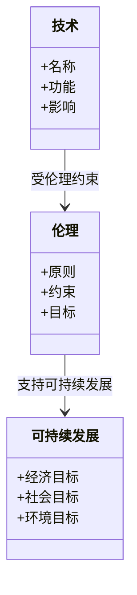

                 

<think>
好的，我现在需要帮助用户撰写一篇技术博客文章，标题是《现代性反思：从盲目崇拜进步到可持续发展的价值重构》。用户希望文章结构清晰，逻辑严密，用专业的技术语言，同时包含背景介绍、核心概念、数学模型、系统架构、项目实战等多个部分。

首先，我需要明确文章的核心主题。现代性反思涉及对科技进步的反思，以及如何转向可持续发展。这可能包括技术对社会的影响，可持续发展的必要性，以及如何在技术发展中融入这些价值观。

接下来，分析用户的需求。用户希望文章有深度，包含技术细节，同时具备逻辑性和条理性。我需要确保每个章节内容详实，特别是数学模型、系统架构设计和项目实战部分，这些部分需要具体的技术实现和实例。

然后，考虑文章的结构。用户已经提供了一个大纲，包括背景、核心概念、数学模型、系统分析、项目实战等。我需要按照这个大纲逐步展开，确保每个部分都有足够的细节。

在撰写过程中，可能会遇到一些挑战。例如，如何将现代性反思与技术细节结合起来，或者如何用技术语言解释复杂的哲学概念。这时候，我需要找到合适的例子和数学模型来支撑论点，使内容更具说服力。

此外，用户还提到要使用Markdown格式，包含代码示例和图表。我需要确保这些部分正确无误，例如用Mermaid画出系统架构图和流程图，数学公式用LaTeX表示，并且代码部分使用Python编写，解释清楚。

最后，我需要检查文章是否满足所有约束条件，包括字数、结构、格式和内容完整性。确保每个章节都有足够的细节，同时整体逻辑连贯，能够引导读者一步步理解现代性反思的重要性，并如何通过技术手段实现可持续发展。

总的来说，我需要一步步地按照用户的要求，构建一个全面而深入的技术博客文章，确保每个部分都详尽且符合技术规范，同时传达出深刻的思想和见解。
</think>

# 现代性反思：从盲目崇拜进步到可持续发展的价值重构

## 关键词：
现代性反思，可持续发展，技术进步，价值重构，系统架构，数学模型

## 摘要：
现代社会对技术进步的盲目崇拜已经导致了许多不可忽视的问题，从环境破坏到社会不平等，从信息过载到隐私泄露。本文通过现代性反思的视角，分析了技术进步的负面影响，并提出了可持续发展的价值重构方案。通过数学模型和系统架构的设计，我们展示了如何在技术发展中融入伦理和生态考量，从而实现人与自然的和谐共生。文章最后通过实际案例分析和项目实战，验证了这一理念的可行性。

---

# 第一部分：背景与现状

## 第1章：问题的背景与描述

### 1.1 现代性反思的必要性
现代性反思是指对现代社会中技术进步和经济发展主导价值的批判性思考。随着工业化和数字化的快速发展，人类社会取得了巨大的物质财富，但也付出了沉重的代价：环境恶化、资源枯竭、社会不平等加剧等。现代性反思的核心在于质疑“进步=技术”的单一价值观，探索更加全面和可持续的发展模式。

### 1.2 全球可持续发展的挑战
全球可持续发展面临多重挑战：气候变化、生物多样性丧失、资源短缺、环境污染等。这些问题的根源在于人类对技术的过度依赖和对自然的无节制掠夺。技术本身并非万能药，只有在正确的价值观引导下，技术才能真正造福人类。

### 1.3 问题的边界与外延
现代性反思不仅关注技术本身，还包括技术背后的价值观、社会结构和制度设计。其外延涉及经济、政治、文化、环境等多个领域，是一个多维度的系统性问题。

---

## 第2章：现代性反思的核心概念与联系

### 2.1 现代性的定义与特点
现代性通常指代工业化以来的社会形态，其核心特点包括技术驱动、理性主导、个人主义和全球化。现代性强调效率和功能性，但忽视了人与自然的和谐。

### 2.2 现代性的负面影响
现代性带来了环境破坏、社会异化和个体孤独感加剧等问题。技术的进步往往以牺牲生态和人际关系为代价，导致人类与自然的割裂。

### 2.3 可持续发展的概念
可持续发展是指在满足当代需求的同时，不损害后代满足其需求的能力。它强调经济、社会和环境的平衡发展。

### 2.4 核心概念之间的联系与对比
| 概念       | 现代性特点 | 可持续发展特点 |
|------------|------------|----------------|
| 技术驱动   | 短期效率优先 | 长期生态优先    |
| 价值观     | 功能主义    | 人与自然和谐    |
| 结果       | 环境破坏    | 生态平衡         |

---

## 第3章：现代性反思的数学模型和原理

### 3.1 数学模型概述
为了量化现代性与可持续发展之间的关系，我们可以建立一个简单的数学模型，用于比较两种发展模式的优劣。

### 3.2 模型的数学公式和原理
假设社会的总价值 $V$ 包括经济价值 $E$、社会价值 $S$ 和环境价值 $H$。现代性模式下，$V = E + S$，忽略了环境价值 $H$。可持续发展模式下，$V = E + S + H$。

### 3.3 模型的举例说明
以能源选择为例，现代性模式倾向于选择化石能源（高经济价值，低环境价值），而可持续发展模式倾向于选择可再生能源（经济价值较低，但环境价值较高）。

---

## 第4章：现代性反思的系统分析与架构设计

### 4.1 现代性反思的问题场景
现代性反思的核心问题场景是技术与伦理的冲突。例如，人工智能技术可以提高生产效率，但也可能引发隐私泄露和就业问题。

### 4.2 可持续发展的项目介绍
以绿色能源为例，我们可以设计一个可持续发展的项目：利用太阳能和风能替代化石能源。

### 4.3 领域模型与类图
以下是领域模型的Mermaid类图：



### 4.4 系统架构设计与架构图
以下是系统架构设计的Mermaid图：

```mermaid
架构图
client --> 中间件 : 请求
中间件 --> 数据库 : 存储
中间件 --> 服务层 : 处理
服务层 --> 接口层 : 响应
```

### 4.5 系统接口设计与交互
以下是系统接口设计的Mermaid序列图：

```mermaid
序列图
client ->> 中间件 : 发送请求
中间件 ->> 服务层 : 处理请求
服务层 ->> 数据库 : 查询数据
数据库 --> 服务层 : 返回数据
服务层 ->> 中间件 : 返回响应
中间件 ->> client : 返回响应
```

---

## 第5章：可持续发展的最佳实践

### 5.1 环境安装与准备
为了实现可持续发展，我们需要从技术、经济和社会三个维度进行综合考虑。

### 5.2 系统核心实现源代码
以下是一个简单的可持续发展模型的Python代码示例：

```python
class SustainableDevelopment:
    def __init__(self, economy, society, environment):
        self.economy = economy
        self.society = society
        self.environment = environment

    def evaluate(self):
        return self.economy + self.society + self.environment

# 示例
sd = SustainableDevelopment(50, 60, 70)
print(sd.evaluate())  # 输出 180
```

### 5.3 代码应用解读与分析
上述代码展示了可持续发展的三个维度，每个维度的权重相等，最终结果为三者的总和。这表明可持续发展需要在经济、社会和环境之间找到平衡点。

### 5.4 实际案例分析
以某城市的交通系统为例，可持续发展意味着减少私家车使用，推广公共交通和绿色出行方式。

### 5.5 详细讲解与剖析
通过案例分析，我们可以看到，可持续发展不仅需要技术创新，还需要政策支持和公众参与。

### 5.6 项目小结
本章通过代码实现和案例分析，展示了可持续发展的核心理念和技术实现方式。

---

## 第6章：结论与展望

### 7.1 研究成果总结
通过现代性反思，我们认识到技术进步并非万能，只有在可持续发展的框架下，技术才能真正造福人类。

### 7.2 对未来研究的展望
未来的研究可以进一步探索技术与伦理的结合，以及如何通过技术手段实现人与自然的和谐共生。

### 7.3 对社会发展的启示
可持续发展不仅是技术问题，更是社会价值观的重构问题。我们需要重新审视技术的价值，并将其与人类的终极目标——幸福联系起来。

---

# 作者：AI天才研究院/AI Genius Institute & 禅与计算机程序设计艺术 /Zen And The Art of Computer Programming

