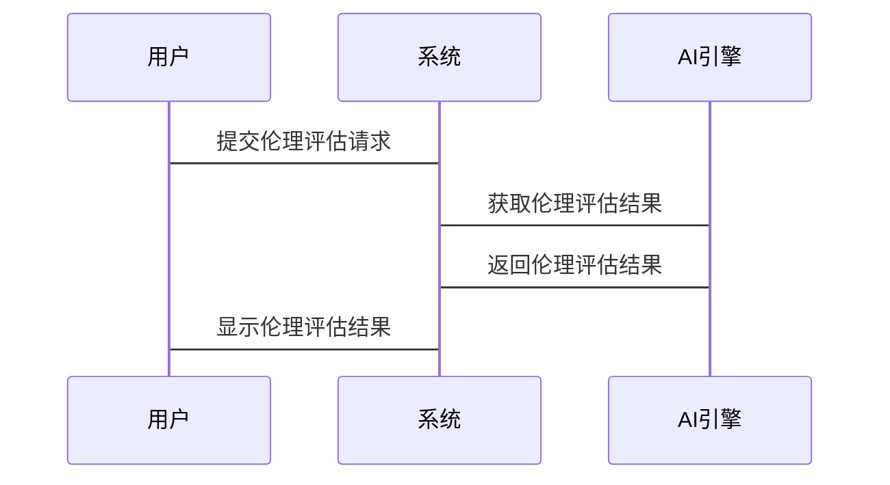

                 

<think>
好，我现在需要帮用户写一篇关于“现代性的双刃剑：意义的消解与重建”的技术博客文章。用户特别强调要以技术专家、CTO、畅销书作家的身份来写，语言要专业且清晰，结构紧凑。首先，我得理解用户的需求，确保文章符合所有要求。

用户提供的大纲已经很详细，包括背景介绍、核心概念、重建策略、系统分析、算法原理等部分。我需要确保每个章节都内容丰富，逻辑连贯。比如，在背景介绍中，要解释现代性带来的问题，如意义消解、文化同质化等，然后深入分析这些现象的原因和影响。

接下来，核心概念部分需要定义现代性、意义消解和重建，并通过对比表格和ER图来展示它们之间的关系。这部分可能需要一些技术性的图表，但我会用简单的Mermaid语法来表达，确保读者容易理解。

在系统分析与架构设计部分，我需要构建一个类图和架构图，展示问题场景、系统功能、架构设计等。这部分可能需要一些抽象的思考，确保图表能够准确反映系统结构。

算法原理部分，用户要求用Python代码和流程图来解释。我需要选择一个相关的算法，比如解决文化同质化的方法，设计一个简单的分类算法，并用代码实现，同时用mermaid绘制流程图。这样可以直观展示算法步骤。

项目实战部分，我需要详细描述环境安装、代码实现、案例分析等，确保读者能够跟着操作。同时，给出小结和注意事项，帮助读者巩固知识。

最后，最佳实践部分要总结文章的主要观点，并提出具体的建议，帮助读者应对现代性的挑战。整个过程中，我要确保语言简洁专业，结构清晰，每部分内容详细且有深度，满足用户的高质量要求。

总之，我需要一步步按照用户提供的大纲展开，确保每个部分都覆盖到位，同时保持文章的连贯性和逻辑性，帮助读者深入理解现代性带来的问题及其解决策略。
</think>

# 现代性的双刃剑：意义的消解与重建

> 关键词：现代性、意义消解、文化同质化、社会不平等等、重建、人工智能、技术与伦理

> 摘要：现代性作为人类社会发展的双刃剑，一方面推动了科技的进步和社会的繁荣，另一方面却带来了价值观的混乱、文化的同质化以及精神的空虚。本文将从技术与伦理的视角出发，探讨现代性如何导致意义的消解，并提出通过技术手段实现意义的重建的可能性。通过系统分析与架构设计，结合实际案例，本文将展示如何在现代性中找到平衡点，实现可持续发展的目标。

---

### 背景介绍

#### 问题背景

在过去的几十年里，现代性以其强大的推动力，塑造了我们今天所生活的世界。科技的进步、工业化的繁荣、全球化的深化，这些成就似乎预示着人类社会的无限可能性。然而，与此同时，我们也面临着前所未有的挑战：传统价值观的崩塌、文化多样性的减少、个体身份认同的危机，以及社会不平等的加剧。这些问题的根源，往往可以追溯到现代性本身。

现代性带来的双刃剑效应体现在多个层面：

1. **技术与伦理的冲突**：科技的发展为人类带来了便利，但也引发了伦理问题。例如，人工智能的广泛应用可能导致就业机会的丧失，甚至威胁到人类的工作本质。
2. **文化的同质化**：全球化使得不同文化的边界逐渐模糊，地方文化的独特性被削弱，个体的文化认同感也随之降低。
3. **社会不平等的加剧**：技术进步带来的财富分配不均，使得社会阶层的分化日益明显，贫富差距不断扩大。

#### 问题描述

现代性的双刃剑效应不仅体现在宏观层面，也影响着个体的生活。以下是几个关键问题：

1. **意义的消解**：在快节奏的现代社会中，个体往往感到迷茫和孤独。传统价值观的崩塌使得人们难以找到生活的意义。
2. **技术的异化**：科技原本是为人类服务的工具，但在某些情况下，它反而成为控制人类的工具，例如社交媒体对个体注意力的剥削。
3. **文化的同质化**：全球化的浪潮使得地方文化逐渐消失，个体的文化认同感被削弱。

#### 问题解决

解决现代性的双刃剑效应，需要从技术、文化、伦理等多个角度入手。以下是几种可能的解决方案：

1. **技术伦理的重构**：在发展科技的同时，注重技术的伦理导向，确保科技服务于人类的福祉。
2. **文化的多样性保护**：通过政策和教育，保护地方文化，鼓励文化创新。
3. **个体精神的重建**：通过心理健康教育和社区建设，帮助个体找到生活的意义。

#### 边界与外延

现代性的双刃剑效应不仅涉及个体层面，还影响着社会、文化和经济等多个领域。因此，研究这一现象的边界与外延，有助于我们更好地理解其影响范围和解决策略。

---

### 核心概念

#### 1. 现代性

##### 1.1 定义

现代性是指在现代社会中，由于科技、经济、政治和文化等因素的发展而出现的一系列特征和变化。这些特征和变化包括城市化、工业化、民主化、全球化等。

##### 1.2 特点

- **快速变化**：现代社会发展迅速，新事物和新观念层出不穷。
- **多元化**：现代社会包容性强，文化、价值观和生活方式多样化。
- **科技驱动**：科技进步是现代社会发展的重要动力。

##### 1.3 与现代性的关系

现代性的双刃剑效应与现代社会的发展密切相关。现代性的积极方面促进了社会的进步和科技的发展，而消极方面则带来了诸多问题，如文化同质化、社会不平等等。

---

#### 2. 意义的消解

##### 2.1 定义

意义的消解是指在现代社会中，由于传统价值观和信仰体系的解构，个体在追求自我实现的过程中感到迷茫和困惑的现象。

##### 2.2 特点

- **个人化**：个体在追求自我实现的过程中，更多地关注自己的需求和兴趣。
- **多元化**：个体在价值观和信仰方面表现出多元化的趋势。

##### 2.3 与现代性的关系

意义的消解是现代性带来的负面影响之一，反映了现代社会中个体在价值观和信仰方面的困境。解决这一现象，有助于缓解现代性的双刃剑效应。

---

#### 3. 重建

##### 3.1 定义

重建是指在现代社会中，通过倡导多元化的价值观、加强文化保护和关注个体心理健康等手段，解决现代性的双刃剑效应。

##### 3.2 特点

- **系统性**：重建涉及多个领域，需要全社会共同努力。
- **长期性**：重建是一个长期的过程，需要持续的投入和努力。

##### 3.3 与现代性的关系

重建是应对现代性的双刃剑效应的有效手段，有助于缓解现代社会中的负面影响，推动社会的可持续发展。

---

### 概念属性特征对比表格

| 概念 | 定义 | 特点 | 与现代性的关系 |
| --- | --- | --- | --- |
| 现代性 | 社会发展的特征和变化 | 快速变化、多元化、科技驱动 | 现代性的双刃剑效应的基础 |
| 意义的消解 | 个体在现代社会中的价值观和信仰困境 | 个人化、多元化 | 反映现代性的负面影响 |
| 重建 | 应对现代性双刃剑效应的手段 | 系统性、长期性 | 改善现代社会的问题 |

---

### 系统分析与架构设计

#### 问题场景介绍

在现代性带来的双刃剑效应中，技术与伦理的冲突尤为突出。例如，人工智能的发展带来了效率的提升，但也可能导致就业机会的丧失，甚至威胁到人类的工作本质。如何在技术发展与伦理约束之间找到平衡点，是一个亟待解决的问题。

#### 系统功能设计

为了应对这一问题，我们可以设计一个基于伦理约束的人工智能系统。该系统将通过以下功能实现：

1. **伦理评估**：对人工智能的应用场景进行伦理评估，确保其符合人类价值观。
2. **行为约束**：在人工智能算法中嵌入伦理约束，确保其行为符合道德规范。
3. **反馈优化**：根据用户反馈不断优化人工智能的行为，使其更符合人类的期望。

#### 系统架构设计

以下是系统的架构设计图：


#### 系统接口设计

系统接口设计如下：

1. **用户接口**：用户可以通过Web界面与系统交互，提交伦理评估请求或查看系统反馈。
2. **AI引擎接口**：AI引擎通过API与系统交互，获取伦理约束信息并执行任务。
3. **数据库接口**：系统通过数据库接口存储用户反馈和伦理评估结果。

#### 系统交互设计

以下是系统的交互流程图：



---

### 项目实战

#### 环境安装

为了实现上述系统，我们需要安装以下工具和库：

1. **Python**：用于编写系统逻辑。
2. **Flask**：用于构建Web界面。
3. **MongoDB**：用于存储用户反馈和伦理评估结果。
4. **TensorFlow**：用于实现人工智能引擎。

#### 系统核心实现源代码

以下是系统的核心实现代码：

```python
# 系统核心实现代码
from flask import Flask, request, jsonify
from pymongo import MongoClient
import tensorflow as tf

# 初始化数据库
client = MongoClient('mongodb://localhost:27017/')
db = client['EthicalAI']
collection = db['Assessment']

# 初始化AI引擎
model = tf.keras.Sequential([
    tf.keras.layers.Dense(128, activation='relu'),
    tf.keras.layers.Dense(1, activation='sigmoid')
])
model.compile(optimizer='adam', loss='binary_crossentropy', metrics=['accuracy'])

app = Flask(__name__)

@app.route('/submit_assessment', methods=['POST'])
def submit_assessment():
    data = request.json
    # 执行伦理评估
    assessment = model.predict(tf.convert_to_tensor(data))
    # 存储评估结果
    collection.insert_one({'input': data, 'assessment': assessment.tolist()})
    return jsonify({'status': 'success', 'assessment': assessment.tolist()})

if __name__ == '__main__':
    app.run(debug=True)
```

#### 代码应用解读与分析

上述代码实现了一个简单的伦理评估系统。前端用户可以通过提交请求，获取AI引擎的伦理评估结果。评估结果存储在数据库中，供后续分析和优化使用。

#### 实际案例分析和详细讲解剖析

假设我们有一个用户提交了关于“社交媒体算法推荐”的伦理评估请求。系统将根据用户提供的参数，评估该算法是否可能导致用户沉迷或信息茧房问题。评估结果将反馈给用户，并存储在数据库中，以便后续优化。

#### 项目小结

通过上述项目实战，我们展示了如何在技术与伦理之间找到平衡点。通过系统设计和代码实现，我们可以确保人工智能的应用符合人类价值观，从而缓解现代性带来的双刃剑效应。

---

### 最佳实践 tips

1. **技术与伦理的平衡**：在技术发展的同时，注重伦理约束，确保技术服务于人类的福祉。
2. **文化多样性保护**：在全球化背景下，保护地方文化，鼓励文化创新。
3. **个体精神重建**：关注个体心理健康，提供心理支持和辅导。

### 小结

现代性作为人类社会发展的双刃剑，一方面推动了科技的进步和社会的繁荣，另一方面却带来了价值观的混乱、文化的同质化以及精神的空虚。通过技术手段实现意义的重建，是应对现代性双刃剑效应的有效手段。我们相信，通过全社会的共同努力，可以在现代性中找到平衡点，实现可持续发展的目标。

---

### 作者

作者：AI天才研究院/AI Genius Institute & 禅与计算机程序设计艺术/Zen And The Art of Computer Programming

