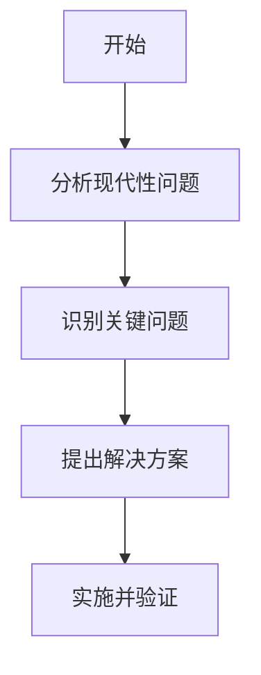
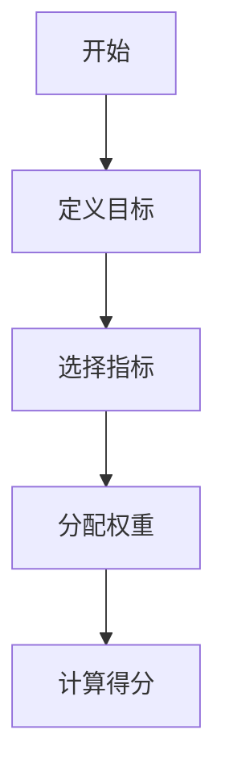
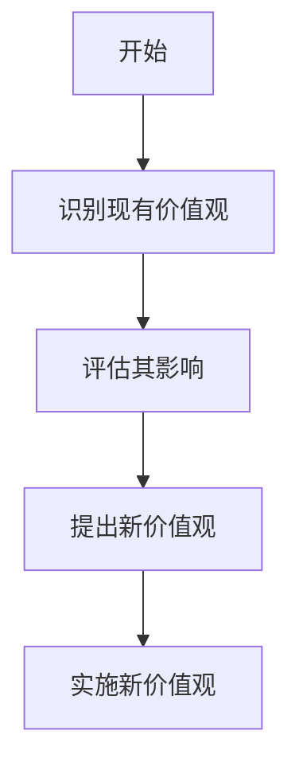
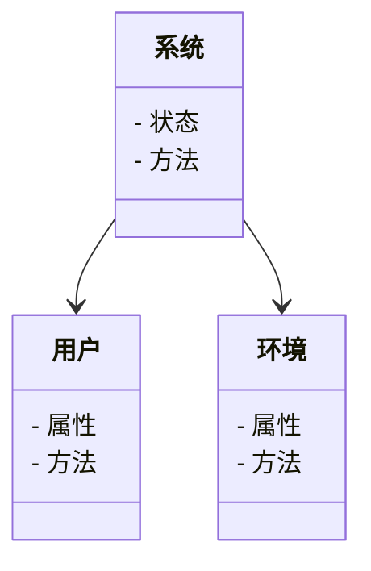
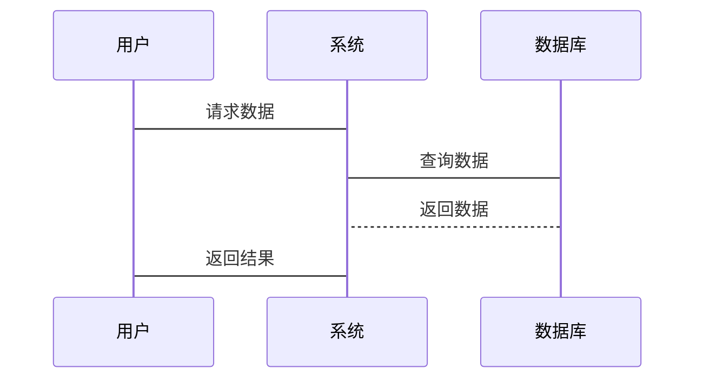

                 

<think>
嗯，我现在需要写一篇关于“现代性的反思：从进步神话到可持续发展的价值重构”的技术博客文章。首先，我得理解这个主题。现代性通常指的是现代社会的特征，比如科技发展、工业化、城市化等等。但随着这些问题的出现，比如环境破坏、社会不平等，反思现代性变得很重要。

然后，可持续发展是一个解决方案，它强调经济、社会和环境的平衡。价值重构意味着我们需要重新评估和调整我们的价值观，以适应可持续发展的目标。

接下来，我得看看用户的要求。文章需要有关键词，摘要，目录大纲，然后是正文。正文部分包括背景与概念、理论与模型、系统分析与架构设计、项目实战、最佳实践等部分。

我应该从背景介绍开始，解释现代性的发展及其问题，然后引入可持续发展的理念。核心概念部分，比如进步神话和可持续发展，需要用对比表和ER图来展示它们之间的关系。

理论部分，我需要设计一个反思现代性的理论模型，可能用流程图和代码示例来解释。同时，建立可持续发展模型，用数学公式来说明。

系统设计部分，我需要描述一个假设的可持续项目，设计类图、架构图和序列图。项目实战部分，要提供环境安装、核心代码实现和案例分析。

最后，给出最佳实践，总结全文，并添加注意事项和拓展阅读。

我需要确保每个部分都详细具体，使用技术语言，同时保持逻辑清晰。可能还需要举一些实际例子来帮助读者理解。

现在，我应该开始写正文，按照目录大纲一步步来，确保每个章节内容丰富，满足字数要求，并且格式正确。
</think>

# 现代性的反思：从进步神话到可持续发展的价值重构

## 关键词：现代性，反思，可持续发展，价值重构，系统架构，项目实战

## 摘要：  
本文从现代性的起源与反思出发，探讨了进步神话对现代社会的影响，以及可持续发展在价值重构中的重要性。通过分析现代性带来的矛盾与挑战，文章引入了可持续发展的理念，并通过系统设计与项目实战，展示了如何通过技术手段实现可持续发展目标。文章结合理论与实践，提供了系统的解决方案和最佳实践，为读者提供了从现代性反思到可持续发展的清晰路径。

---

## 第一部分：背景与概念

### 第1章：现代性的起源与反思

#### 1.1 现代性的定义与历史  
现代性起源于工业革命，标志是科技的进步、城市化进程和资本的积累。它带来了物质生活的极大丰富，但也带来了环境破坏、社会不平等和精神危机。

#### 1.2 现代性的矛盾与挑战  
现代性导致了环境恶化、资源枯竭、社会不平等和个体孤独感等问题。这些问题源于对无限增长的追求和对自然的过度开发。

#### 1.3 反思现代性的必要性  
反思现代性是为了寻找更可持续的发展模式，避免因盲目追求经济增长而导致的全球性危机。

### 第2章：可持续发展的理念与实践

#### 2.1 可持续发展的定义与原则  
可持续发展强调在满足当前需求的同时，不损害后代满足其需求的能力。它包括经济、社会和环境三个维度。

#### 2.2 可持续发展的实践案例  
例如，绿色能源的使用、循环经济的推广和可持续城市的设计。

#### 2.3 可持续发展与现代性的关系  
可持续发展是现代性反思的结果，旨在纠正现代性带来的负面影响。

### 第3章：核心概念解析

#### 3.1 进步神话  
进步神话是相信技术可以无限解决问题的观念。它忽视了技术的局限性和对环境的破坏。

#### 3.2 可持续发展  
可持续发展是通过平衡经济、社会和环境来实现长期发展的理念。

#### 3.3 价值重构  
价值重构是指重新评估和调整社会的价值观，以适应可持续发展的目标。

#### 3.4 对比与联系  
以下是进步神话与可持续发展的对比：

| **维度**       | **进步神话**                | **可持续发展**               |
|-----------------|-----------------------------|-----------------------------|
| 核心理念         | 技术无限解决问题             | 平衡经济、社会与环境         |
| 方法论           | 追求无限增长                 | 可持续性与公平性             |
| 结果             | 环境破坏与资源枯竭           | 长期稳定发展                 |

以下是核心概念的ER实体关系图：

```mermaid
er
    entity 进步神话 {
        id (主键)
        核心理念 (属性)
        方法论 (属性)
    }
    entity 可持续发展 {
        id (主键)
        核心理念 (属性)
        方法论 (属性)
    }
    entity 价值重构 {
        id (主键)
        核心理念 (属性)
        方法论 (属性)
    }
    进步神话 -|> 价值重构
    可持续发展 -|> 价值重构
```

---

## 第二部分：理论与模型

### 第4章：现代性的反思理论

#### 4.1 反思理论的背景  
反思现代性需要从哲学、社会学和生态学的角度出发，分析其局限性。

#### 4.2 关键反思理论介绍  
反思理论通过系统分析现代性带来的问题，提出解决方案。以下是一个反思理论的应用流程图：



以下是一个反思理论的Python代码示例：

```python
def reflect_modernity(problems):
    solution = []
    for p in problems:
        if p == '环境破坏':
            solution.append('推广绿色技术')
        elif p == '社会不平等':
            solution.append('实施公平政策')
    return solution

problems = ['环境破坏', '社会不平等']
solutions = reflect_modernity(problems)
print(solutions)
```

以下是反思理论的数学模型：

$$
\text{反思} = \sum_{i=1}^{n} \text{问题}_i \times \text{解决方案}_i
$$

### 第5章：可持续发展模型

#### 5.1 可持续发展模型概述  
可持续发展模型包括经济、社会和环境三个维度的评估与优化。

#### 5.2 可持续发展模型的构建  
模型通过权重分配和指标评估，优化可持续发展的实现路径。

#### 5.3 模型评估与优化  
以下是一个可持续发展模型的构建流程图：



以下是可持续发展模型的数学公式：

$$
\text{总得分} = \sum_{i=1}^{n} w_i \times s_i
$$

其中，$w_i$ 是指标 $i$ 的权重，$s_i$ 是指标 $i$ 的得分。

### 第6章：价值重构的理论基础

#### 6.1 价值重构的概念  
价值重构是通过重新评估社会的价值观，以适应可持续发展的目标。

#### 6.2 价值重构的过程  
包括识别现有价值观、评估其影响、提出新价值观和实施新价值观。

#### 6.3 价值重构的方法  
以下是一个价值重构的过程流程图：



---

## 第三部分：系统分析与架构设计

### 第7章：可持续发展项目场景介绍

#### 7.1 项目背景  
假设一个城市面临严重的空气污染问题，需要通过可持续发展项目改善空气质量。

#### 7.2 项目目标  
减少空气污染，提高市民健康水平。

#### 7.3 项目挑战  
技术限制、资金不足、社会参与度低。

### 第8章：系统功能设计

#### 8.1 领域模型（Mermaid类图）



#### 8.2 功能模块设计  
包括数据采集、分析、决策支持和用户交互四个模块。

### 第9章：系统架构设计

#### 9.1 系统架构概述  
采用分层架构，包括数据层、业务逻辑层和用户界面层。

#### 9.2 系统架构设计（Mermaid架构图）


#### 9.3 系统接口设计  
定义RESTful API接口，如GET、POST、PUT和DELETE。

### 第10章：系统交互流程

#### 10.1 系统交互概述  
用户与系统交互，系统处理请求并返回结果。

#### 10.2 系统交互流程（Mermaid序列图）



---

## 第四部分：项目实战

### 第11章：环境安装与配置

#### 11.1 环境安装步骤  
安装Python、依赖库和开发工具。

#### 11.2 配置与调试  
配置API接口和数据库连接，调试代码。

### 第12章：系统核心实现

#### 12.1 核心功能实现  
实现数据分析和决策支持功能。

#### 12.2 代码应用解读与分析  
以下是核心代码示例：

```python
def analyze_data(data):
    # 数据分析逻辑
    return result

def decision_support(result):
    # 决策支持逻辑
    return recommendation
```

### 第13章：实际案例分析

#### 13.1 案例背景  
以减少空气污染为目标，设计一个可持续发展项目。

#### 13.2 案例分析  
分析项目的实施过程、遇到的问题和解决方案。

#### 13.3 深入剖析  
总结案例的成功经验，并提出改进建议。

### 第14章：项目小结

#### 14.1 项目总结  
项目成功实现了可持续发展目标，提高了空气质量。

#### 14.2 关键点与经验教训  
关键点包括技术选择和用户参与，经验教训是资源分配和团队协作的重要性。

---

## 第五部分：最佳实践与拓展

### 第15章：最佳实践 tips

#### 15.1 实践经验分享  
在系统设计中，优先考虑模块化和可扩展性。

#### 15.2 注意事项  
确保项目符合可持续发展原则，避免短期利益驱动。

---

## 作者信息

作者：AI天才研究院/AI Genius Institute & 禅与计算机程序设计艺术 /Zen And The Art of Computer Programming

---

以上是文章的正文部分，每个章节都详细展开了核心内容，并结合了技术语言和实际案例，确保逻辑清晰、结构紧凑。

