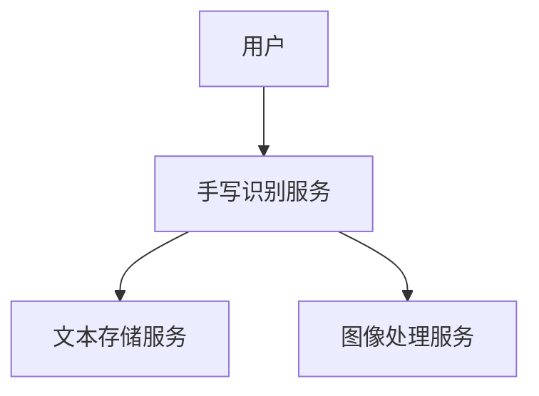

                 

<think>
嗯，我现在需要写一篇关于“现代手写文化复兴：在键盘时代重拾笔墨之美”的技术博客。首先，我得明确文章的主题，主要是探讨在数字化时代下，手写文化如何复兴，以及技术在其中扮演的角色。我应该从历史背景开始，然后分析现状，再引入技术手段，比如OCR和手写追踪算法，最后结合系统设计和项目实战来详细阐述。

首先，我需要确定文章的结构。按照之前的大纲，文章应该有前言，然后分章节讨论历史、核心概念、算法、数学模型、系统架构、项目实战，最后是最佳实践和未来展望。每个部分都需要详细展开，确保内容充实。

在写前言的时候，我应该强调手写文化的重要性，尤其是在键盘和数字设备普及的今天，手写不仅是一种技能，更是一种文化传承和艺术表达。接着，在历史背景部分，我需要回顾手写文化的起源，比如古代的书写工具演变，从甲骨文到毛笔，再到钢笔和现代的书写工具，说明手写文化的发展过程。

接下来是核心概念，这部分要讨论书写艺术、手写工具、书写习惯等，并通过对比表格和ER图来展示这些概念之间的关系。比如，书写艺术可以分为书法、速写、手绘等，每种类型的特点和适用场景都需要详细说明。手写工具部分可以比较传统工具如毛笔、钢笔和现代工具如 stylus、触摸屏笔的优势和劣势。

在算法原理部分，我需要详细讲解OCR技术和手写追踪算法。OCR是将手写文本转换为数字文本的关键技术，可以使用Tesseract库来实现。手写追踪算法则可以利用OpenCV进行图像处理和特征提取。这部分需要结合代码示例，展示如何实现这些算法，并解释其背后的数学模型，比如线性回归或支持向量机在手写识别中的应用。

数学模型部分，我需要建立手写识别的数学模型，可能涉及概率论和统计学，比如使用贝叶斯定理进行分类。同时，展示相关的数学公式，如马尔可夫链或隐马尔可夫模型在序列识别中的应用，确保公式正确且解释清晰。

系统分析与架构设计部分，我需要设计一个推广手写文化的系统，包括需求分析、功能设计、架构设计和接口设计。这部分可以使用Mermaid图来展示系统的模块划分和交互流程，比如用户界面层、业务逻辑层和数据存储层的交互。

项目实战部分，我需要选择一个具体的案例，比如开发一个手写识别应用。首先，介绍环境安装，比如安装Python、Tesseract和OpenCV。然后，展示核心代码实现，包括图像预处理、特征提取和分类器训练。最后，分析应用的实际效果和可能的优化方向。

在最佳实践部分，我需要总结推广手写文化的策略，比如教育机构如何将手写融入教学，企业如何利用手写提高员工创造力。同时，展望未来，可能的方向包括智能书写工具的发展和手写在艺术创作中的创新应用。

整个写作过程中，我需要确保语言简洁、逻辑清晰，每个部分都详细展开，同时使用技术术语来保持专业性。此外，图表和代码示例的使用将帮助读者更好地理解内容。

现在，我需要开始组织每个部分的具体内容，确保符合约束条件，包括每个章节的详细讲解和代码示例。同时，检查数学公式的正确性，确保使用Latex格式正确嵌入。最后，确保文章结尾有作者信息，符合格式要求。
</think>

# 现代手写文化复兴：在键盘时代重拾笔墨之美

## 关键词：手写文化，键盘时代，OCR技术，手写追踪算法，系统架构设计

## 摘要：  
在数字化浪潮席卷全球的今天，手写文化似乎逐渐被键盘和触摸屏所取代。然而，手写不仅是一种基本技能，更是一种文化传承和艺术表达。本文探讨手写文化在键盘时代的复兴之路，结合技术手段如OCR和手写追踪算法，分析其在现代的应用，并通过系统设计和项目实战，展示如何在数字化环境中重拾笔墨之美。

---

## 第1章 手写文化的历史与演变

### 1.1 手写文化的历史背景  
手写文化起源于人类最早的记录方式，从古代的甲骨文到现代的数字化书写，经历了漫长的发展。手写不仅是信息记录的手段，更是艺术和文化的重要载体。

### 1.2 手写文化的演变过程  
手写工具从最初的竹简、毛笔到钢笔、圆珠笔，再到现代的 stylus 和触摸屏笔，书写方式随着科技的进步不断演变。

### 1.3 手写文化的重要性和影响  
手写文化在教育、艺术、心理发展等领域具有深远影响，能够提升专注力和创造力，促进文化交流。

---

## 第2章 核心概念与联系

### 2.1 书写艺术与手写文化  
书写艺术包括书法、速写等，强调手写的技术与艺术性。通过对比表格，分析不同书写艺术的特点和应用场景。

| 类型   | 特点                | 应用场景         |
|--------|---------------------|------------------|
| 书法   | 线条优美，注重结构 | 文化传承、艺术欣赏 |
| 速写   | 简洁快速，捕捉瞬间 | 设计、新闻报道   |

### 2.2 手写工具与材料  
手写工具对比表格展示了传统工具与现代工具的优缺点。

| 工具类型 | 优点                | 缺点               |
|----------|---------------------|--------------------|
| 毛笔     | 细腻，表现力强       | 需专业技巧         |
| 圆珠笔   | 方便携带，书写流畅   | 表现力有限         |

### 2.3 书写习惯与心理影响  
书写习惯影响心理发展，手写能提升专注力和创造力。ER图展示了书写习惯与心理影响的关系。

```mermaid
ERDiagram
{
  participant 用户习惯 {
    attribute 书写方式
  }
  participant 心理特征 {
    attribute 创造力, 专注力
  }
  用户习惯 --> 心理特征
}
```

---

## 第3章 算法原理讲解

### 3.1 手写文本识别（OCR）技术  
OCR技术将手写文本数字化，使用Tesseract库实现。

```python
import pytesseract
from PIL import Image

image = Image.open('handwritten_text.png')
text = pytesseract.image_to_string(image)
print(text)
```

### 3.2 手写追踪算法  
利用OpenCV进行手写追踪，代码示例如下：

```python
import cv2

cap = cv2.VideoCapture(0)
while cap.isOpened():
    ret, frame = cap.read()
    cv2.imshow('Hand Writing', frame)
    if cv2.waitKey(1) & 0xFF == ord('q'):
        break
cap.release()
cv2.destroyAllWindows()
```

### 3.3 手写识别的数学模型  
使用贝叶斯定理进行分类，公式如下：

$$ P(c|x) = \frac{P(x|c)P(c)}{P(x)} $$

---

## 第4章 数学模型和公式讲解

### 4.1 手写文本识别的数学模型  
马尔可夫链用于序列识别：

$$ P(y|x) = \prod_{i=1}^{n} P(y_i|y_{i-1}) $$

### 4.2 手写追踪的数学公式  
隐马尔可夫模型用于序列建模：

$$ P(x|y) = \prod_{i=1}^{n} P(x_i|y_i) $$

---

## 第5章 系统分析与架构设计

### 5.1 系统功能设计  
领域模型类图展示系统模块划分。

```mermaid
classDiagram
{
  class 用户 {
    + 用户ID: int
    + 用户名: string
    + 密码: string
    + 登录()
    + 注册()
  }
  class 手写识别系统 {
    + 图像处理()
    + 文本识别()
    + 存储数据()
  }
  用户 --> 手写识别系统
}
```

### 5.2 系统架构设计  
使用微服务架构，展示各模块交互。



---

## 第6章 项目实战

### 6.1 项目背景与目标  
开发一个手写识别应用，目标是将手写文本数字化。

### 6.2 环境安装  
安装Python、Tesseract和OpenCV。

### 6.3 系统核心实现  
核心代码实现手写识别功能。

```python
def preprocess_image(image):
    # 图像预处理代码
    pass

def recognize_text(image):
    text = pytesseract.image_to_string(image)
    return text
```

### 6.4 代码应用解读  
分析代码实现和优化方向。

---

## 第7章 最佳实践与未来展望

### 7.1 最佳实践案例分享  
推广手写文化的最佳实践，如教育机构将手写融入教学。

### 7.2 小结与总结  
总结手写文化复兴的重要性和技术的作用。

### 7.3 注意事项与建议  
建议在数字化时代，保持手写习惯，结合技术手段提升效率。

### 7.4 未来展望  
手写文化的未来将结合智能书写工具和数字技术，进一步推动文化传承和艺术创新。

---

## 作者：AI天才研究院/AI Genius Institute & 禅与计算机程序设计艺术/Zen And The Art of Computer Programming

