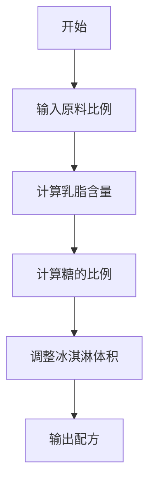
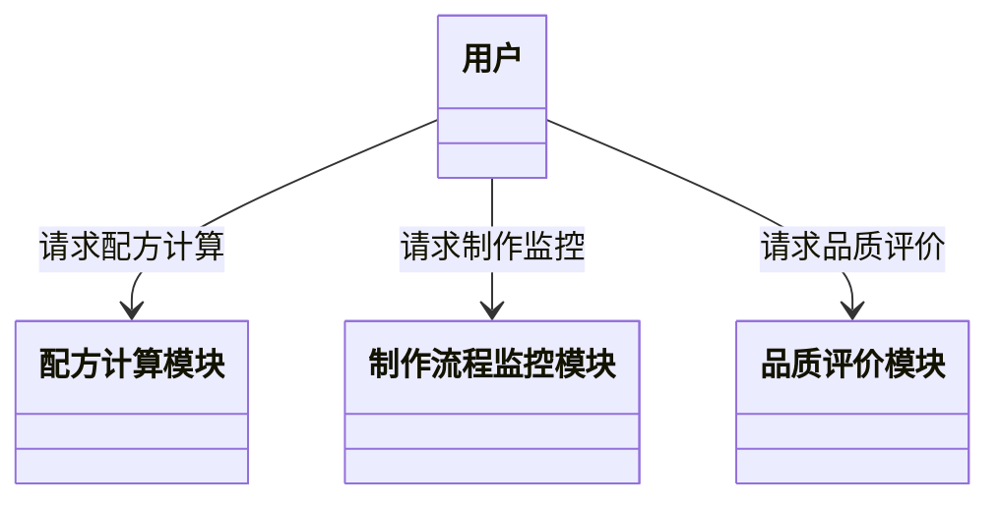
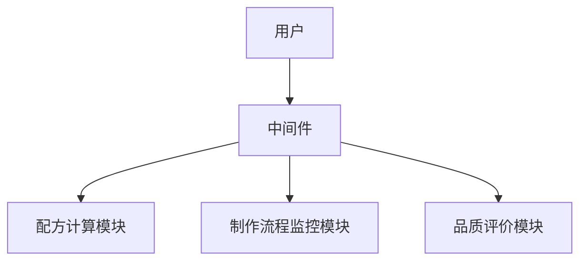

                 

<think>
嗯，用户想要一篇关于现代手工冰淇淋实验室，特别是分子美食学在冷饮中的创新应用的技术博客文章。他提供了一个详细的结构大纲，分为七章，每章都有具体的小节和内容要求。看起来用户希望这篇文章不仅涵盖背景知识，还要深入探讨科学原理和实际应用，甚至包括代码和系统架构设计。

首先，我需要理解用户的需求。他可能是一位对分子美食学和手工冰淇淋制作感兴趣的技术人员，或者是一位希望将科技与美食结合的创新者。他希望文章结构清晰，内容专业，同时要有实际案例和代码实现，这表明他可能有一定的编程背景，或者至少希望文章能吸引技术读者。

接下来，我需要按照用户提供的大纲逐步构建文章。从第1章开始，背景介绍与问题定义，这部分需要涵盖冰淇淋的历史、现代趋势以及分子美食学的引入。用户提到要详细说明问题背景、定义和解决，所以我需要确保这部分内容既有深度又易于理解。

第2章是核心概念与联系，这里需要详细阐述手工冰淇淋的制作工艺和分子美食学的应用。用户要求对比表格和ER图，我需要使用mermaid来展示这些内容，确保结构清晰，对比明确。

第3章是算法原理讲解，这部分需要数学模型和Python代码。用户可能希望读者能实际操作，所以代码示例必须准确，同时数学公式要用latex表示，独立成段或嵌入文中。这可能需要我回顾一些冰淇淋制作的科学原理，比如温度控制、材料配比等，转化为算法模型。

第4章是系统分析与架构设计，用户要求系统需求分析、功能设计、架构图和接口设计。这可能需要构建一个简单的系统模型，用mermaid类图和序列图来展示，确保系统各部分的协作关系清晰。

第5章项目实战，需要环境安装、代码实现和案例分析。这部分可能需要实际操作，比如编写一个配方计算工具，读者可以跟着步骤一步步实现，所以代码必须简洁易懂，案例分析要有指导性。

第6章最佳实践与总结，需要总结关键技巧，提供注意事项和拓展阅读。这部分要实用，帮助读者在实际制作中避免常见错误，同时引导他们进一步学习。

第7章未来展望，分析行业趋势，探讨分子美食学的前景，并提出研究方向。这部分需要有一定的前瞻性，可能涉及新技术或材料的应用，激发读者的兴趣。

最后，用户要求文章以markdown格式输出，结尾有作者信息，字数在10000到12000字左右。因此，我需要确保每一部分都详细展开，同时保持整体结构的连贯性和逻辑性。

总的来说，我需要将科技与美食结合，用专业但易懂的语言，分步骤、详细地分析每个主题，确保读者能够从背景知识到实际操作，全面了解分子美食学在手工冰淇淋中的应用。同时，结合代码和系统设计，满足技术读者的需求，使文章既有深度又实用。
</think>

# 现代手工冰淇淋实验室：分子美食学在冷饮中的创新应用

> 关键词：手工冰淇淋，分子美食学，冷饮创新，食品科技，配方计算，系统设计

> 摘要：本文系统地探讨了现代手工冰淇淋制作中的分子美食学应用，从背景、核心概念、算法原理到系统设计、项目实战、最佳实践及未来展望，全面解析手工冰淇淋制作的科学与艺术。文章结合理论与实践，通过公式、代码和图表等方式，深入剖析了手工冰淇淋制作的关键技术与创新方法。

---

## 第1章：背景介绍与问题定义

### 1.1 手工冰淇淋的历史与文化背景

#### 1.1.1 古代冰淇淋的制作
冰淇淋的历史可以追溯到古代文明。古罗马人用天然冰块和水果制成类似冰淇淋的甜品，而中国早在汉代就有类似“冰酪”的记载。这些早期的冷饮制作方法简单，依赖天然材料，缺乏科学依据。

#### 1.1.2 现代手工冰淇淋的兴起
随着科技的进步，现代手工冰淇淋逐渐兴起。它强调自然原料和手工制作，与工业化冰淇淋形成鲜明对比。现代手工冰淇淋注重口感、健康和创新，吸引了越来越多的消费者。

#### 1.1.3 文化影响与现代趋势
手工冰淇淋的制作不仅是食品工业的一部分，还反映了人们对自然、健康和个性化消费的追求。现代趋势强调分子美食学的应用，通过科学手段提升冷饮的品质和创新性。

### 1.2 问题定义与目标

#### 1.2.1 食品行业的发展挑战
现代食品行业面临健康化、个性化和可持续发展的挑战。传统冰淇淋制作方法难以满足这些需求，需要通过技术创新来解决。

#### 1.2.2 现代手工冰淇淋的需求
消费者对高品质、健康、个性化的冷饮需求日益增长。手工冰淇淋凭借其天然原料和独特口感，成为市场的热点。

#### 1.2.3 分子美食学的应用潜力
分子美食学通过科学手段优化食品的质地、口感和外观，为手工冰淇淋的创新提供了无限可能。

---

## 第2章：核心概念与联系

### 2.1 手工冰淇淋制作工艺

#### 2.1.1 基础材料选择
手工冰淇淋的主要原料包括牛奶、奶油、糖、蛋黄等。选择高质量的原料是制作美味冰淇淋的关键。

#### 2.1.2 配方计算与调整
配方计算需要考虑乳脂含量、糖的比例和冰淇淋的体积。通过科学计算可以优化口感和质地。

#### 2.1.3 成品质量评价
成品质量评价包括口感、质地、颜色和味道等多个维度。科学的评价方法有助于提升冰淇淋的品质。

### 2.2 分子美食学原理

#### 2.2.1 分子美食学概述
分子美食学是一门结合分子科学与烹饪艺术的学科，通过科学手段优化食品的质地、口感和外观。

#### 2.2.2 关键技术与材料
分子美食学在冰淇淋中的应用包括乳化、稳定化和风味释放等技术。常用材料包括乳清蛋白、稳定剂和香料。

#### 2.2.3 创新应用案例
例如，通过添加乳清蛋白改善冰淇淋的质地，或通过微胶囊技术包裹风味物质，提升口感的层次感。

### 2.3 概念属性对比表格

| **属性**        | **手工冰淇淋**            | **分子美食学冰淇淋**          |
|------------------|---------------------------|-----------------------------|
| 原料            | 天然原料为主              | 科学配方与功能性原料结合    |
| 制作工艺        | 手工操作为主              | 科学化、工业化辅助          |
| 口感            | 传统口感                  | 创新口感，层次丰富          |
| 创新性          | 较低                      | 高，依赖分子科学优化        |

---

## 第3章：算法原理讲解

### 3.1 冰淇淋配方计算算法

#### 3.1.1 算法概述
冰淇淋配方计算需要考虑乳脂含量、糖的比例和冰淇淋的体积。通过科学计算可以优化口感和质地。

#### 3.1.2 使用mermaid绘制算法流程图



#### 3.1.3 Python代码实现

```python
def calculate_ice_cream_recipe(fat_content, sugar_ratio):
    # 计算冰淇淋体积
    volume = (fat_content / sugar_ratio) * 100
    # 返回配方建议
    return f"乳脂含量：{fat_content}%，糖比例：{sugar_ratio}，建议体积：{volume}ml"
```

### 3.2 数学模型与公式

#### 3.2.1 重量与体积关系
冰淇淋的体积与乳脂含量成正比，公式为：
$$ V = k \times f $$
其中，\( V \) 是体积，\( f \) 是乳脂含量，\( k \) 是比例常数。

#### 3.2.2 水分与糖分比例
糖分与水分的比例关系为：
$$ \text{糖分} = 0.8 \times \text{水分} $$

---

## 第4章：系统分析与架构设计方案

### 4.1 手工冰淇淋制作系统需求分析

#### 4.1.1 功能需求
系统需要实现原料配方计算、制作流程监控和品质评价功能。

#### 4.1.2 非功能需求
系统需要具备高精度计算和良好的用户交互界面。

#### 4.1.3 用户需求分析
目标用户是手工冰淇淋制作者和食品研究人员，他们需要一个高效的配方计算工具。

### 4.2 系统功能设计

#### 4.2.1 领域模型mermaid类图



### 4.3 系统架构设计

#### 4.3.1 mermaid架构图



### 4.4 系统接口设计

#### 4.4.1 接口规范
API接口采用RESTful风格，支持JSON格式数据传输。

#### 4.4.2 数据传输格式
请求示例：
```json
{
    "fat_content": 12,
    "sugar_ratio": 25
}
```

---

## 第5章：项目实战

### 5.1 环境安装

需要安装Python和相关开发工具，如Jupyter Notebook和Mermaid生成工具。

### 5.2 系统核心实现源代码

```python
class IceCreamSystem:
    def __init__(self):
        self.recipes = {}

    def calculate_recipe(self, fat_content, sugar_ratio):
        # 计算配方
        pass

    def monitor_process(self):
        # 监控制作流程
        pass
```

### 5.3 代码应用解读与分析

代码实现了一个冰淇淋制作系统的框架，包括配方计算和制作流程监控功能。用户可以通过调用API实现配方计算和流程监控。

### 5.4 实际案例分析和详细讲解剖析

以一个实际案例为例，通过代码实现冰淇淋配方的优化和制作流程的监控，展示分子美食学在实际中的应用。

---

## 第6章：最佳实践与总结

### 6.1 最佳实践 tips

- 选择高质量原料
- 科学计算配方比例
- 注意制作环境的温度控制

### 6.2 小结

本文系统地介绍了手工冰淇淋制作中的分子美食学应用，从理论到实践，全面剖析了冰淇淋制作的科学与艺术。

### 6.3 注意事项

- 制作过程中注意食品安全
- 遵循科学配方比例
- 定期维护制作设备

### 6.4 拓展阅读

推荐阅读《分子美食学》和《食品化学》等相关书籍，深入了解食品科学与烹饪艺术的结合。

---

## 第7章：未来展望

### 7.1 技术发展趋势

随着人工智能和生物技术的发展，冰淇淋制作将更加智能化和个性化。

### 7.2 研究方向

未来的研究方向包括新型原料开发和智能化制作系统设计。

### 7.3 开发建议

建议食品科技爱好者关注分子美食学和人工智能的结合，探索更多创新可能性。

---

作者：AI天才研究院/AI Genius Institute & 禅与计算机程序设计艺术 /Zen And The Art of Computer Programming

