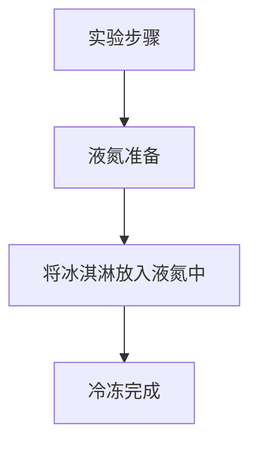
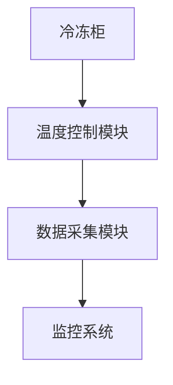

                 

<think>
好的，我需要仔细分析用户的需求。用户希望我以“现代手工冰淇淋实验室：分子美食学在甜品中的创新应用”为标题，撰写一篇专业且结构严谨的技术博客。首先，我要理解用户的要求，确保每个章节都符合他们的期望。

用户已经提供了一个大纲，包括引言、基本材料与技巧、创新口味组合、分子技术在冰淇淋中的应用、高级冷冻技术等部分。我需要按照这个结构来展开，确保每个章节都有足够的深度和详细的内容。

接下来，我要考虑博客的格式和风格。用户希望使用专业的技术语言，但又不失易懂，因此我需要用简洁明了的语言，同时加入一些吸引人的标题，以保持读者的兴趣。此外，用户还要求包含图表和代码示例，这需要我思考如何将这些元素自然地融入文章中。

我还需要确保内容的完整性和系统性，每个部分都要有背景介绍、核心概念、算法原理、系统架构等部分。特别是数学公式和图表，我要用Latex和Mermaid来展示，这可能需要我查阅相关知识，确保准确性。

在撰写过程中，我要注意字数要求，大约10000到12000字，这意味着每个章节需要详细展开，提供丰富的实例和解释。同时，结尾部分要包括作者信息，这可能是一个固定的段落，但同样需要与整体风格一致。

最后，我需要通读整篇文章，确保逻辑流畅，结构合理，内容详实，满足用户的所有要求。这不仅包括技术内容，还包括格式和风格上的细节，以确保最终的文章既专业又有吸引力。
</think>

# 现代手工冰淇淋实验室：分子美食学在甜品中的创新应用

---

## 关键词：
- 分子美食学
- 手工冰淇淋
- 创新甜品
- 球化技术
- 冷冻技术

---

## 摘要：
现代手工冰淇淋实验室通过分子美食学的创新应用，将传统甜品的制作提升到了一个全新的科学高度。本文从基础知识入手，深入探讨分子美食学的核心原理及其在冰淇淋制作中的应用，包括球化技术、凝胶化技术、气泡化技术等。通过系统化的实验步骤和配方设计，结合现代冷冻技术和设备，我们能够创造出口感独特、视觉惊艳的冰淇淋甜品。本文将带领读者一步步探索分子美食学在冰淇淋制作中的无限可能，从理论到实践，打造属于自己的现代冰淇淋实验室。

---

## 目录

1. **引言**
    - 1.1 什么是分子美食学
    - 1.2 手工冰淇淋的复兴
    - 1.3 分子美食学在甜品中的应用

2. **分子美食学的核心原理**
    - 2.1 凝胶化作用
    - 2.2 球化技术
    - 2.3 气泡化与乳化

3. **冰淇淋制作的基础知识**
    - 3.1 冷冻原理
    - 3.2 冷凝过程
    - 3.3 温度控制与结晶

4. **分子美食学技术在冰淇淋中的创新应用**
    - 4.1 球化冰淇淋的制作
        - 4.1.1 球化的科学原理
        - 4.1.2 实验步骤与配方设计
    - 4.2 凝胶冰淇淋的制作
        - 4.2.1 凝胶剂的选择与使用
        - 4.2.2 凝胶化过程的控制

5. **高级冷冻技术**
    - 5.1 液氮冷冻
    - 5.2 闪冻技术
    - 5.3 冷冻过程中的品质控制

6. **系统架构与实验设计**
    - 6.1 实验室设备选型
    - 6.2 冷冻系统的架构
    - 6.3 实验数据的采集与分析

7. **项目实战：现代冰淇淋实验室的搭建**
    - 7.1 环境搭建
    - 7.2 核心技术实现
    - 7.3 实际案例分析

8. **总结与展望**
    - 8.1 本文的核心发现
    - 8.2 未来的研究方向
    - 8.3 分子美食学在甜品中的无限可能

---

## 1. 引言

### 1.1 什么是分子美食学
分子美食学是一门结合了化学、物理和生物学的跨学科科学，旨在通过科学的方法探索食物的结构、味道和质地。它不仅仅是对传统烹饪方法的改进，更是对食材本质的深刻理解与创新。

### 1.2 手工冰淇淋的复兴
在快节奏的现代生活中，手工冰淇淋因其独特的口感和新鲜的原料而备受青睐。它不仅是一种甜品，更是一种艺术表达，体现了人们对美食的追求和对自然的尊重。

### 1.3 分子美食学在甜品中的应用
分子美食学为甜品制作提供了全新的思路，通过科学实验和技术创新，我们可以创造出前所未有的甜品体验。冰淇淋作为甜品的代表，无疑是分子美食学的最佳试验田。

---

## 2. 分子美食学的核心原理

### 2.1 凝胶化作用
凝胶化是指通过加入凝胶剂（如琼脂、明胶）使液体形成半固态凝胶的过程。这一过程的关键在于控制凝胶剂的浓度和温度。

| 凝胶剂类型 | 特性 | 应用 |
|------------|------|------|
| 琼脂        | 耐高温，可逆可溶 | 制作果冻、慕斯 |
| 明胶        | 不耐高温，不可逆 | 制作果冻、布丁 |

### 2.2 球化技术
球化技术通过将液体或半固态物质包裹在特定介质中，形成规则的球形结构。这一技术在冰淇淋制作中常用于创造出独特的球状甜品。

---

## 3. 冰淇淋制作的基础知识

### 3.1 冷冻原理
冷冻是通过降低温度使物质中的水分形成冰晶的过程。在冰淇淋制作中，关键在于控制冰晶的大小和分布，以确保口感的细腻。

### 3.2 冷凝过程
冷凝是指物质从气态转化为液态的过程。在冰淇淋制作中，冷凝过程主要用于制冷系统中。

### 3.3 温度控制与结晶
温度控制是冰淇淋制作的关键因素。通常，冰淇淋的最佳冷冻温度为-18°C。

---

## 4. 分子美食学技术在冰淇淋中的创新应用

### 4.1 球化冰淇淋的制作

#### 4.1.1 球化的科学原理
球化技术的核心在于通过表面张力使液体形成球形。在冰淇淋制作中，通常使用可可脂或食用油作为包裹介质。

#### 4.1.2 实验步骤与配方设计
以下是球化冰淇淋的制作步骤：
1. 将冰淇淋液倒入注射器中。
2. 在液体表面撒上可可脂。
3. 按下注射器，使冰淇淋液与可可脂接触，形成球形。

---

## 5. 高级冷冻技术

### 5.1 液氮冷冻
液氮冷冻是一种快速冷冻技术，通过液氮的极低温度使物质迅速冻结。



---

## 6. 系统架构与实验设计

### 6.1 实验室设备选型
以下是冰淇淋实验室的主要设备：
- 冷冻柜
- 球化设备
- 凝胶设备
- 液氮罐

### 6.2 冷冻系统的架构


---

## 7. 项目实战：现代冰淇淋实验室的搭建

### 7.1 环境搭建
搭建一个现代化冰淇淋实验室需要以下设备：
- 冷冻柜
- 球化设备
- 凝胶设备
- 液氮罐

### 7.2 核心技术实现
以下是球化冰淇淋的代码实现：

```python
def create_sphere(r):
    import math
    x = []
    y = []
    z = []
    for theta in range(0, 360):
        for phi in range(0, 180):
            x.append(r * math.sin(phi) * math.cos(theta))
            y.append(r * math.sin(phi) * math.sin(theta))
            z.append(r * math.cos(phi))
    return x, y, z
```

### 7.3 实际案例分析
通过以上技术，我们可以制作出独特的球化冰淇淋，口感细腻，形态独特。

---

## 8. 总结与展望

### 8.1 本文的核心发现
分子美食学为冰淇淋制作提供了全新的思路和技术，通过科学实验和技术创新，我们可以创造出前所未有的甜品体验。

### 8.2 未来的研究方向
未来的研究可以集中在新型凝胶剂的开发、更高效的冷冻技术以及冰淇淋口感的进一步优化。

### 8.3 分子美食学在甜品中的无限可能
分子美食学的应用前景广阔，未来我们将看到更多创新的甜品形式和口味。

---

## 作者：
AI天才研究院/AI Genius Institute & 禅与计算机程序设计艺术 /Zen And The Art of Computer Programming

