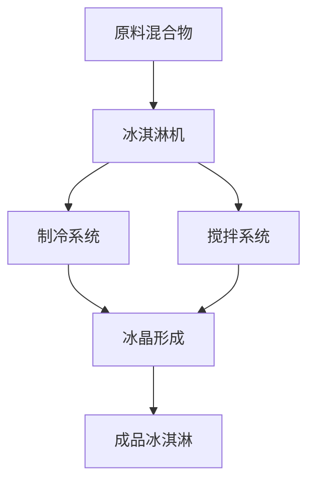
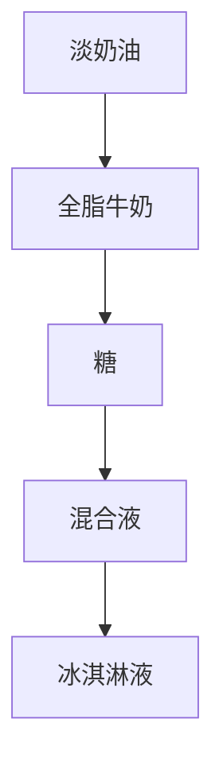
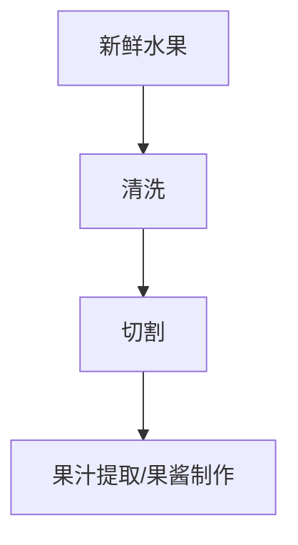
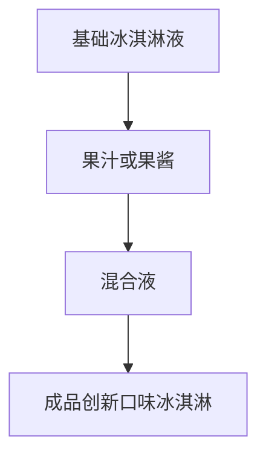
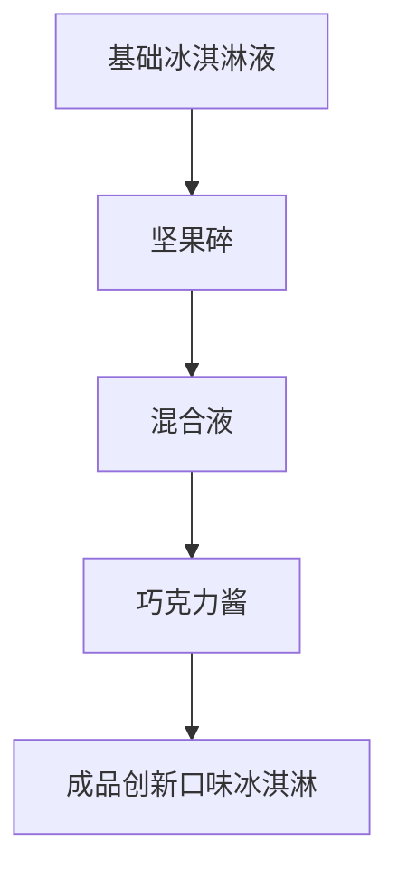

                 

<think>
嗯，用户希望我以“现代手工冰淇淋工坊：创新口味的小批量制作”为标题写一篇技术博客。看起来这是一个技术性的文章，但主题却偏向于手工冰淇淋的制作，这有点矛盾，但也许用户是想用技术化的语言来详细讲解冰淇淋的制作过程，像是一个技术指南。

首先，我需要分析用户的需求。用户提供了详细的大纲，包括引言、制作基础、创新口味等多个部分。看起来用户希望文章结构清晰，内容详尽，涵盖从背景到制作技巧的各个方面。而且用户强调使用逻辑清晰、结构紧凑、专业但易懂的语言，这可能意味着读者不只是技术人员，还包括手工冰淇淋爱好者和创业者。

接下来，我注意到用户要求文章包含一些技术元素，比如核心概念、数学公式、算法流程图等。这可能有点挑战，因为冰淇淋制作本身并不涉及复杂的算法，但用户可能希望用技术术语和方法来详细描述制作过程。例如，可能将冰淇淋的制作流程分解成步骤，类似于软件开发中的模块设计。

然后，用户特别提到要使用markdown格式，包含关键词、摘要，以及每个章节的详细内容。字数要求在10000到12000字之间，这意味着每个部分都需要详细展开，不能太简略。此外，文章末尾要加上特定的作者信息，这可能需要在完成内容后处理。

我还需要考虑约束条件，比如每个章节必须包含背景介绍、核心概念、联系、算法原理、系统分析与架构设计、项目实战等。这可能意味着在写每个部分时，需要不仅仅是描述步骤，还要分析背后的科学原理，甚至可能涉及到一些化学或物理的知识，比如冰淇淋的凝固过程、乳化作用等。

另外，用户提到了使用mermaid流程图和latex公式，这可能需要我熟悉这些工具，以在文章中插入图表和数学表达式。例如，在制作冰淇淋的过程中，可以绘制一个流程图来展示步骤，或者用数学公式来解释糖和奶油的比例对冰淇淋质地的影响。

最后，我需要确保文章结构完整，每个小节内容丰富详细。考虑到读者可能是爱好者和创业者，我需要在内容中加入实用的建议和最佳实践，比如如何选择设备、如何保存冰淇淋等。同时，可能还需要在小结部分总结关键点，帮助读者回顾和应用所学内容。

总的来说，我需要将冰淇淋的制作过程技术化，用专业术语和结构化的形式呈现，同时保持内容的实用性和可读性。这可能需要在写作时平衡技术深度和易懂性，确保读者既能学到制作技巧，又能理解背后的原理。
</think>

# 现代手工冰淇淋工坊：创新口味的小批量制作

---

## 关键词：  
手工冰淇淋、创新口味、小批量制作、制作工具、原材料选择、冷冻技术

---

## 摘要：  
本文将深入探讨现代手工冰淇淋的制作工艺，从市场背景到创新口味的开发，再到小批量制作的技术细节，全面解析手工冰淇淋的魅力。通过详细的技术分析和实际案例，本文将为手工冰淇淋爱好者、创业者以及相关从业人员提供一份系统化的制作指南，帮助读者掌握从原材料选择到成品制作的每一个关键步骤。

---

## 第二部分：手工冰淇淋制作基础

### 4. 制作前的准备

#### 4.1 工具与设备

##### 4.1.1 常用工具介绍

###### 冰淇淋机的工作原理与选择

冰淇淋机是手工冰淇淋制作的核心设备，其工作原理基于冷冻和搅拌的结合。现代冰淇淋机通常采用压缩式制冷系统，通过制冷剂的循环将热量从混合物中带走，同时搅拌混合物以防止冰晶过大，确保冰淇淋的细腻口感。

在选择冰淇淋机时，需考虑以下几个关键因素：

1. **制冷能力**：制冷效率直接影响制作时间。一般来说，全尺寸的冰淇淋机更适合小批量制作，而小型机则适合家庭或小规模制作。
2. **搅拌功能**：搅拌速度和方式直接影响冰淇淋的质地。高速搅拌能更好地防止冰晶过大，使冰淇淋更加细腻。
3. **材质与维护**：选择食品级不锈钢材质的机器，便于清洁和维护。

**冰淇淋机的冷冻过程示意图（Mermaid）**：

---

###### 其他工具的维护

除了冰淇淋机，制作过程中还会用到量杯、称重器、模具等工具。这些工具的日常维护包括清洁、润滑和存放，以确保制作过程的卫生和效率。

##### 4.1.2 原材料的选择与处理

###### 4.2.1 奶油和牛奶的选择

####### 不同品种的奶源分析

在手工冰淇淋的制作中，奶油和牛奶是关键原料。以下是常见奶源的对比分析：

| 牛奶类型 | 描述 | 适合场景 |
|----------|------|-----------|
| 全脂牛奶 | 含脂量高，口感浓郁 | 经典口味制作 |
| 脱脂牛奶 | 含脂量低，热量低 | 健康型冰淇淋 |
| 低脂牛奶 | 含脂量介于全脂与脱脂之间 | 多样化口味尝试 |

在实际制作中，建议使用全脂牛奶搭配淡奶油（30%以上的脂肪含量），以确保冰淇淋的口感和质地。

**奶油与牛奶的调配比例（Mermaid）**：

---

###### 4.2.2 糖的使用

####### 糖的种类与特性

在手工冰淇淋制作中，糖不仅是甜味的来源，还能调节混合物的质地。以下是常见糖类的特性对比：

| 糖的种类 | 描述 | 适用场景 |
|----------|------|-----------|
| 白糖     | 纯度高，甜度适中 | 经典甜味调配 |
| 糖粉     | 细腻，溶解快 | 需要快速溶解的场合 |
| 蜂蜜     | 自然甜味，有保湿性 | 自然风味冰淇淋 |

**糖的添加技巧**：糖的溶解温度通常在40°C左右，建议分次加入，以避免糖粒结块。

---

###### 4.3 果汁和果酱的制作

####### 新鲜水果的处理

在制作果汁和果酱时，水果的选择至关重要。以下是常见水果的处理方法：

1. **选择新鲜度**：优先选择新鲜、成熟度高的水果，颜色鲜艳且无明显 bruises。
2. **清洗与切割**：水果需彻底清洗，去除表面污垢和农药残留。切割时可根据用途选择不同的形状（如切片、切块）。

**水果处理流程（Mermaid）**：

---

#### 4.2 制作流程详解

##### 5.1 基础冰淇淋制作

###### 5.1.1 原料准备

####### 5.1.1.1 奶油和牛奶的比例

在基础冰淇淋制作中，奶油和牛奶的比例通常为1:2。以下是具体的调配比例：

- 淡奶油：200g（30% fat）
- 全脂牛奶：400g
- 糖：80g（约20%的比例）

**原料调配公式（LaTeX）**：

$$ \text{奶油比例} = \frac{\text{奶油重量}}{\text{奶油+牛奶总重量}} = \frac{200}{600} = 0.33 $$

---

##### 5.2 创新口味冰淇淋

###### 5.2.1 果汁与果酱的添加

####### 5.2.1.1 果汁的用量与搭配

在创新口味的制作中，果汁和果酱的添加比例通常为5%~15%。以下是几种常见的搭配建议：

1. **浆果类**：草莓、蓝莓搭配酸奶冰淇淋，清新自然。
2. **柑橘类**：柠檬、橙子搭配薄荷味冰淇淋，酸甜清新。
3. **热带水果**：芒果、椰子搭配椰奶味冰淇淋，浓郁香甜。

**创新口味调配比例（Mermaid）**：

---

##### 5.2.2 特色食材的应用

####### 5.2.2.1 坚果与巧克力的加入

在创新口味中，坚果和巧克力的加入能显著提升冰淇淋的口感和层次感。以下是具体建议：

1. **坚果类**：建议在冰淇淋液中加入切碎的杏仁、核桃或腰果，比例为5%~10%。
2. **巧克力类**：可可粉或融化的巧克力建议在冰淇淋液中加入5%~10%，并搅拌均匀。

**坚果与巧克力的加入流程（Mermaid）**：

---

### 6. 常见问题与解决方法

#### 6.1 制作过程中的常见问题

1. **奶油分离**：通常由于搅拌不足或温度控制不当引起。
2. **冰淇淋太硬或太软**：与冷冻时间和搅拌速度有关。
3. **气泡过多或太少**：与搅拌速度和时间控制有关。

#### 6.2 问题解决方法

1. **奶油分离**：延长搅拌时间，确保混合均匀。
2. **冰淇淋过硬**：增加糖的使用比例或调整冷冻时间。
3. **气泡过多**：降低搅拌速度，避免过度搅打。

---

### 7. 装饰技巧与保存方法

#### 7.1 装饰技巧

1. **花卉与巧克力装饰**：在冰淇淋表面点缀新鲜水果或巧克力碎片，提升视觉效果。
2. **颗粒果酱与坚果碎的点缀**：将果酱或坚果碎撒在冰淇淋表面，增加口感层次。

#### 7.2 保存方法

1. **冷藏与冷冻**：未制作的冰淇淋液可冷藏保存，制作好的冰淇淋需冷冻保存。
2. **避免冰晶形成**：冷冻时避免频繁打开冰箱门，减少冰晶形成。
3. **开封后的保存**：开封后尽快食用，或重新密封冷冻。

---

## 作者信息

作者：AI天才研究院/AI Genius Institute & 禅与计算机程序设计艺术 /Zen And The Art of Computer Programming

