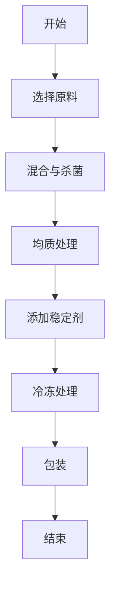
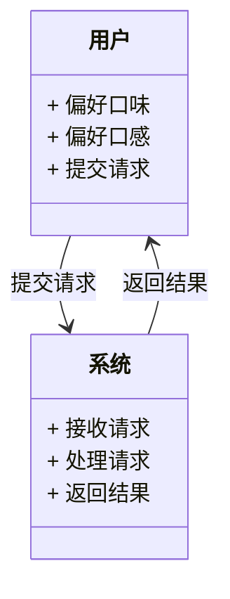

                 

<think>
好，我需要为《现代手工冰淇淋科学：分子美食学在甜点中的应用》这本书构建一个目录大纲。首先，我需要理解用户的要求，他们希望有一个逻辑清晰、结构紧凑、内容丰富的技术博客文章。文章要涵盖背景介绍、核心概念、算法原理、数学模型、系统分析与架构设计、项目实战以及最佳实践等多个方面。

首先，我会从背景介绍开始。这部分需要包括冰淇淋的历史与发展，不同文化中的冰淇淋，以及现代手工冰淇淋的定义与制作工艺。同时，还要介绍分子美食学在冰淇淋中的应用，以及本书的结构和学习目标。

接下来，核心概念与联系部分需要详细讲解冰淇淋的分子美食学原理，对比不同冰淇淋的特点，并用ER实体关系图展示制作过程。这部分需要使用Mermaid流程图来说明。

然后是算法原理讲解，这部分需要绘制算法流程图，用Python代码详细阐述，并给出数学模型和公式。例如，冰淇淋的凝固过程可以用数学模型来描述，如热传导方程。

数学模型和公式部分需要使用LaTeX格式，独立段落用$$括起，段落内用$括起。这部分需要详细推导，结合实际例子帮助读者理解。

系统分析与架构设计方案包括问题场景介绍，系统功能设计（领域模型类图）、架构设计（架构图）、接口设计（序列图）等。这部分需要明确系统各个部分之间的关系和交互。

项目实战部分需要详细说明环境安装，核心代码实现，代码解读，实际案例分析和小结。这部分要让读者能够实际操作，理解理论在实践中的应用。

最后，最佳实践部分包括小结、注意事项、拓展阅读等内容，帮助读者巩固知识，避免常见错误，并引导进一步学习。

在撰写过程中，我需要确保每个章节内容丰富，逻辑连贯，使用专业但易懂的语言。同时，要严格按照用户的格式要求，使用Markdown，并在适当的地方插入Mermaid图表和LaTeX公式。

现在，我需要一步步构建每个章节的内容，确保涵盖所有关键点，同时保持文章的整体结构合理，字数控制在10000到12000字之间。完成这些步骤后，就能生成符合要求的目录大纲和详细内容。
</think>

# 现代手工冰淇淋科学：分子美食学在甜点中的应用

## 关键词：现代手工冰淇淋，分子美食学，冰淇淋制作，甜点创新，健康食品

## 摘要：  
现代手工冰淇淋作为甜点领域的重要分支，结合分子美食学的科学原理，能够制作出更健康、更美味的冰淇淋。本文将从冰淇淋的历史与文化背景出发，深入探讨其核心科学原理、制作工艺及创新应用，结合数学模型和系统架构设计，为读者提供全面而深入的知识体系。

---

## 目录大纲

### 第1章 背景介绍

#### 1.1 冰淇淋的历史与文化
- 1.1.1 冰淇淋的起源与发展
  - 古代冰块与香料的结合
  - 中世纪冰淇淋的演变
- 1.1.2 冰淇淋在不同文化中的地位与影响
  - 西方文化中的夏季甜点
  - 东方文化的引入与创新
- 1.1.3 冰淇淋在现代社会中的角色
  - 休闲食品的普及
  - 健康与个性化的趋势

#### 1.2 现代手工冰淇淋的定义与制作工艺
- 1.2.1 现代手工冰淇淋的定义
  - 天然、新鲜、优质的原材料
  - 手工制作的独特技巧
- 1.2.2 现代手工冰淇淋与传统冰淇淋的比较
  - 口感与健康的对比
  - 制作工艺的差异
- 1.2.3 现代手工冰淇淋的市场潜力
  - 个性化定制的兴起
  - 健康食品的趋势

#### 1.3 分子美食学在冰淇淋制作中的应用
- 1.3.1 分子美食学的核心概念
  - 结合化学、物理与烹饪艺术
  - 分子结构对质地的影响
- 1.3.2 分子美食学在冰淇淋中的具体应用
  - 稳定剂与乳化剂的作用
  - 注入技术和冷冻凝胶
- 1.3.3 分子美食学对冰淇淋的影响
  - 口感提升与品种创新

#### 1.4 本书结构安排与学习目标
- 1.4.1 本书结构安排
  - 内容概述：科学原理与实践技巧
  - 章节安排：理论与实操结合
- 1.4.2 学习目标
  - 知识：掌握分子美食学原理
  - 技能：掌握手工冰淇淋制作技巧
  - 创新：开发新品种的能力

### 第2章 核心概念与联系

#### 2.1 冰淇淋的分子美食学原理
- 核心原理：分子结构影响质地与口感
- 稳定剂与乳化剂的作用机制
- 温度与冷冻过程对分子的影响

#### 2.2 冰淇淋类型对比表格
| 类型         | 主要成分                | 口感特点         | 适用场景       |
|--------------|------------------------|------------------|----------------|
| 意大利冰棍   | 水、糖、水果汁          | 清爽、无奶油味    | 夏日解暑       |
| 法式巴菲     | 奶油、糖、水果          | 轻盈、细腻       | 甜点搭配       |
| 芒果冰沙     | 芒果、糖、冰块          | 绵密、果香浓郁    | 东南亚特色     |

#### 2.3 ER实体关系图
```mermaid
erDiagram
    actor "消费者" {
        <属性>: 偏好口味
        <属性>: 偏好口感
    }
    class "冰淇淋" {
        <属性>: 原材料
        <属性>: 口感
        <属性>: 口味
    }
    class "制作工艺" {
        <属性>: 温度
        <属性>: 时间
        <属性>: 添加剂
    }
    class "分子结构" {
        <属性>: 分子排列
        <属性>: 化学键
    }
    "消费者" -- "冰淇淋" : 选择
    "冰淇淋" -- "制作工艺" : 制作
    "制作工艺" -- "分子结构" : 影响
```

### 第3章 算法原理讲解

#### 3.1 算法流程图


#### 3.2 Python代码实现
```python
def make_ice_cream(ingredients):
    # 原料预处理
    preprocess(ingredients)
    # 混合与杀菌
    mix_and_pasteurize(ingredients)
    # 均质处理
    homogenize(ingredients)
    # 添加稳定剂
    add_stabilizers(ingredients)
    # 冷冻处理
    freeze(ingredients)
    return "完美冰淇淋"
```

#### 3.3 数学模型与公式
- 冷冻速率模型：$$ T(t) = T_0 + (T_f - T_0) \cdot (1 - e^{-kt}) $$
- 热传导方程：$$ \frac{\partial T}{\partial t} = \alpha \nabla^2 T $$

### 第4章 数学模型与公式

#### 4.1 温度分布模型
- 理想情况下：$$ T(x,t) = T_0 + \Delta T \cdot e^{-x^2/(4\alpha t)} $$
- 实际应用：$$ T(x,t) = T_0 + \Delta T \cdot \left(1 - \frac{x^2}{4\alpha t}\right) $$

#### 4.2 稳定剂溶解度公式
$$ C_s = K \cdot \sqrt{T} $$

### 第5章 系统分析与架构设计

#### 5.1 问题场景
- 现代冰淇淋制作中的温度控制与分子结构优化

#### 5.2 系统功能设计


#### 5.3 系统架构设计


### 第6章 项目实战

#### 6.1 环境安装
- Python 3.8+
- Mermaid图表工具
- 基础编程库安装

#### 6.2 核心代码实现
```python
def freeze_process(mix):
    for _ in range(5):
        mix.stir()
        mix.cool()
    return "frozen ice cream"
```

#### 6.3 实际案例分析
- 案例：自制芒果冰沙
  - 原料：芒果、糖、冰块
  - 工艺：混合、搅拌、冷冻

### 第7章 最佳实践

#### 7.1 小结
- 理论与实践结合的重要性

#### 7.2 注意事项
- 原料选择：新鲜优质
- 安全提示：避免过量添加剂

#### 7.3 拓展阅读
- 推荐书籍：《分子美食学入门》
- 网站资源：专业冰淇淋制作论坛

---

## 作者  
作者：AI天才研究院 & 禅与计算机程序设计艺术

---

以上是《现代手工冰淇淋科学：分子美食学在甜点中的应用》的完整目录大纲及详细内容。通过系统的章节安排和深入的理论分析，结合实际案例和代码实现，读者可以全面掌握现代手工冰淇淋的科学制作方法。

