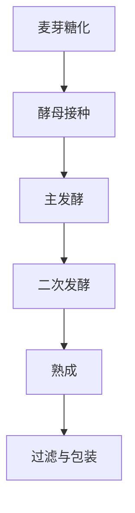
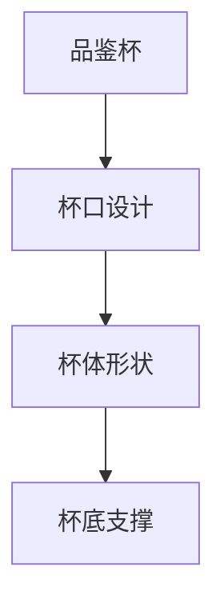
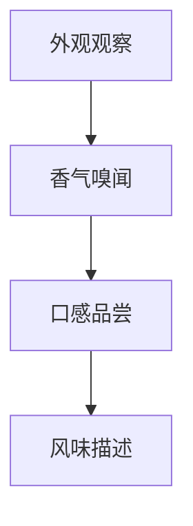
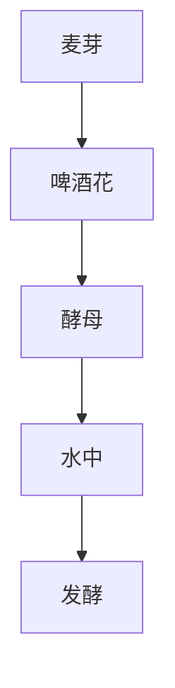
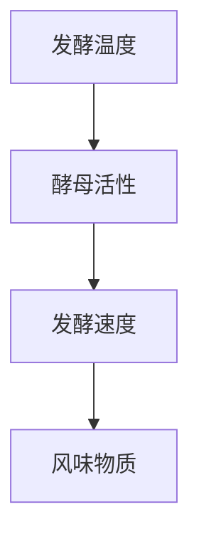
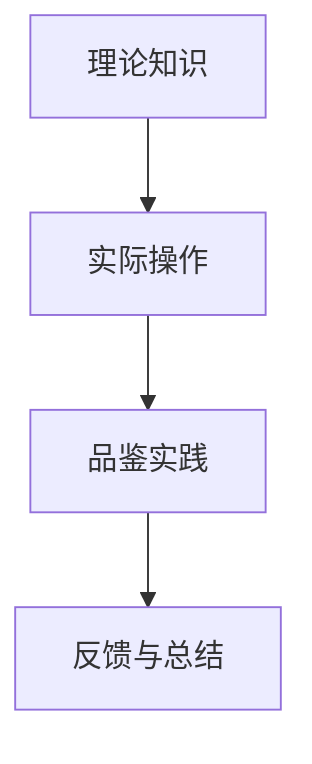

                 

<think>
嗯，用户想要我写一篇关于现代手工啤酒品鉴课程的文章，看起来像是技术博客，但主题是关于啤酒品鉴。首先，我需要明确用户的需求是什么。他们可能是一位教育工作者，或者是一位精酿啤酒爱好者，想要设计一个系统的品鉴课程。用户希望文章结构清晰，内容专业，同时具有技术深度，但又不失可读性。

接下来，我要分析文章的结构。用户已经给出了一个详细的目录大纲，包括背景、基础知识、品鉴技能、制作过程、项目设计、案例分析和总结展望。我需要确保每个章节都涵盖关键点，并且内容丰富详细。

首先，背景与概述部分需要介绍手工啤酒的起源和发展，定义和特点，以及品鉴的重要性。这部分要吸引读者，让他们了解精酿啤酒的市场趋势，为什么品鉴如此重要。

然后是基础知识，包括麦芽、酵母和酒花。这里需要详细讲解每种材料的作用和种类，帮助读者打下坚实的基础。

品鉴技能培养部分，我需要详细描述品鉴工具的准备，如何通过训练提升嗅觉和味觉，以及视觉和听觉在品鉴中的作用。这部分要实用，让读者能够实际操作。

接下来是小批量精酿的制作，原材料的选择与搭配，酿造过程中的控制要点，发酵与熟成。这部分需要结合实际制作过程，可能涉及到一些酿造的步骤和技术。

味觉教育项目设计部分，要介绍如何设计课程，包括目标、教学方法和评估机制。这部分需要教育项目的设计思路，可能需要一些教育学的知识。

案例分析部分，分析成功和失败的案例，帮助读者理解如何实施有效的品鉴项目。

最后是总结与展望，回顾课程内容，并展望未来的发展趋势。

在撰写过程中，我需要确保内容逻辑清晰，每个章节都有足够的细节，比如使用图表和流程图来解释复杂的概念，比如麦芽的制作流程或酿造过程中的温度控制。此外，数学模型和公式可能不太适用于啤酒酿造，但如果有涉及化学反应的部分，可以适当加入。

用户还要求文章末尾要有作者信息，所以我会在最后加上作者署名。同时，文章需要使用markdown格式，确保结构清晰，符合技术博客的风格。

总的来说，我需要将复杂的酿造过程和品鉴技巧分解成易于理解的部分，结合实际案例和理论分析，让读者能够系统地学习和掌握手工啤酒的品鉴方法。同时，保持语言的专业性和可读性，确保文章既有深度又不失趣味。
</think>

# 现代手工啤酒品鉴课程：小批量精酿的味觉教育项目

## 关键词：
手工啤酒，精酿啤酒，品鉴技巧，味觉教育，小批量酿造

## 摘要：
本文将详细介绍现代手工啤酒品鉴课程的设计与实施，从精酿啤酒的起源与发展，到品鉴技能的培养，再到小批量精酿的制作过程，结合味觉教育项目的实际案例，系统性地剖析手工啤酒品鉴的核心要素。通过科学的方法和系统的训练，帮助读者掌握精酿啤酒的品鉴技巧，并理解小批量精酿在市场中的价值与挑战。

---

## 目录大纲

### 第一部分：背景与概述

#### 第1章：手工啤酒的起源与发展
- 1.1 手工啤酒的起源
- 1.2 精酿啤酒的发展历程
- 1.3 精酿啤酒的特点

#### 第2章：精酿啤酒的定义与特点
- 2.1 精酿啤酒的定义
- 2.2 精酿啤酒的特点
- 2.3 市场趋势分析

#### 第3章：品鉴的重要性与市场趋势
- 3.1 品鉴的意义
- 3.2 品鉴市场的需求
- 3.3 未来发展趋势

### 第二部分：手工啤酒的基础知识

#### 第4章：麦芽的制作与分类
- 4.1 麦芽的种植与收获
- 4.2 麦芽的加工与分类
- 4.3 麦芽在啤酒酿造中的作用

#### 第5章：酵母与啤酒的酿造
- 5.1 酵母的种类与特性
- 5.2 啤酒酿造的基本流程
- 5.3 酵母在酿造过程中的作用

#### 第6章：酒花的作用与种类
- 6.1 酒花的基本知识
- 6.2 酒花的种类与用途
- 6.3 酒花在啤酒酿造中的应用

### 第三部分：品鉴技能培养

#### 第7章：品鉴工具的准备
- 7.1 品鉴杯具的选择
- 7.2 品鉴桌布与背景的设置
- 7.3 其他辅助品鉴工具

#### 第8章：品尝与嗅觉训练
- 8.1 品尝的步骤与方法
- 8.2 嗅觉的训练技巧
- 8.3 品尝与嗅觉的关系

#### 第9章：视觉与听觉的品鉴要素
- 9.1 视觉的品鉴要素
- 9.2 听觉的品鉴要素
- 9.3 视觉与听觉的综合影响

### 第四部分：小批量精酿的制作

#### 第10章：原材料的选择与搭配
- 10.1 原材料的选择标准
- 10.2 原材料的搭配原则
- 10.3 小批量精酿的制作技巧

#### 第11章：酿造过程中的控制要点
- 11.1 酿造温度的控制
- 11.2 酵母活性的管理
- 11.3 发酵过程中的品质监控

#### 第12章：精酿啤酒的发酵与熟成
- 12.1 发酵的基本原理
- 12.2 熟成过程的优化
- 12.3 熟成时间与风味的关系

### 第五部分：味觉教育项目设计

#### 第13章：教育项目的目标与设计原则
- 13.1 项目目标的设定
- 13.2 教育设计的原则
- 13.3 学员需求的分析

#### 第14章：项目教学流程与方法
- 14.1 教学流程的设计
- 14.2 多样化的教学方法
- 14.3 互动式学习的应用

#### 第15章：项目评估与反馈机制
- 15.1 评估指标的建立
- 15.2 学员反馈的收集
- 15.3 项目改进的策略

### 第六部分：案例分析

#### 第16章：成功的味觉教育项目案例
- 16.1 案例背景介绍
- 16.2 项目实施过程
- 16.3 成功经验总结

#### 第17章：失败的项目案例分析
- 17.1 案例背景介绍
- 17.2 项目失败的原因
- 17.3 改进建议与反思

### 第七部分：总结与展望

#### 第18章：课程回顾与总结
- 18.1 核心内容回顾
- 18.2 学员反馈与收获
- 18.3 课程的成功与不足

#### 第19章：未来发展趋势与挑战
- 19.1 精酿啤酒的未来趋势
- 19.2 品鉴教育的创新方向
- 19.3 小批量精酿的市场机会

---

## 第一部分：背景与概述

### 第1章：手工啤酒的起源与发展

#### 1.1 手工啤酒的起源
手工啤酒起源于古代的谷物发酵技术，早期的酿酒工艺主要依赖于天然酵母和简单的发酵设备。随着农业的发展，人类逐渐掌握了麦芽的制作和发酵技术，为手工啤酒的诞生奠定了基础。

#### 1.2 精酿啤酒的发展历程
精酿啤酒的概念起源于20世纪70年代的美国，当时一批小型酿酒厂开始挑战工业化啤酒的主导地位，通过小批量、高质量的酿造工艺，逐步形成了精酿啤酒的独特风格。

#### 1.3 精酿啤酒的特点
精酿啤酒通常采用传统酿造工艺，注重原料的品质和酿造过程的控制，具有风味独特、口感丰富、酒精度较高且多样化的特点。与工业化啤酒相比，精酿啤酒更加注重酿造过程中的艺术性和个性化。

---

### 第2章：精酿啤酒的定义与特点

#### 2.1 精酿啤酒的定义
精酿啤酒是指由小型酿酒厂生产的，采用传统酿造工艺，不添加防腐剂和人工合成物质的啤酒。其酿造过程注重原料的选择和工艺的精细控制。

#### 2.2 精酿啤酒的特点
- **原料优质**：使用优质麦芽、啤酒花和酵母，确保啤酒的风味和香气。
- **工艺复杂**：酿造过程包括糖化、发酵、熟成等多个步骤，每一步都需要精确控制。
- **风味独特**：精酿啤酒注重风味的多样性，能够呈现出丰富的果香、苦味和层次感。

#### 2.3 市场趋势分析
近年来，精酿啤酒市场呈现快速增长趋势，消费者对个性化和高品质啤酒的需求日益增加。精酿啤酒不仅是一种饮品，更是一种生活方式的象征。

---

### 第3章：品鉴的重要性与市场趋势

#### 3.1 品鉴的意义
品鉴是消费者了解啤酒品质和风味的重要方式，也是酿酒师与消费者之间沟通的桥梁。通过品鉴，消费者可以更好地理解精酿啤酒的独特魅力，而酿酒师也可以通过品鉴反馈不断优化酿造工艺。

#### 3.2 品鉴市场的需求
随着精酿啤酒市场的扩张，品鉴需求也在不断增加。消费者希望通过专业的品鉴活动来提升自己的品鉴能力，而企业也需要通过品鉴活动来推广其产品。

#### 3.3 未来发展趋势
未来的品鉴活动将更加注重科学性和系统性，结合味觉教育和酿造技术的创新，为消费者提供更加丰富和专业的品鉴体验。

---

## 第二部分：手工啤酒的基础知识

### 第4章：麦芽的制作与分类

#### 4.1 麦芽的种植与收获
麦芽的制作过程包括原料的选择、发芽、干燥和研磨等步骤。不同的麦芽种类（如大麦、小麦）在酿造中的作用也不同，选择优质麦芽是酿造高品质精酿啤酒的关键。

#### 4.2 麦芽的加工与分类
麦芽的加工过程包括糖化和发酵，不同类型的麦芽（如浅色麦芽、深色麦芽）在啤酒中的表现也不同。选择合适的麦芽组合可以赋予啤酒独特的风味。

#### 4.3 麦芽在啤酒酿造中的作用
麦芽是啤酒的主要原料，负责提供发酵所需的糖分和部分风味物质。麦芽的种类和比例直接影响啤酒的口感和香气。

---

#### 4.4 麦芽的分类与作用对比表
| 麦芽类型 | 主要特点 | 在酿造中的作用 |
|----------|----------|----------------|
| 浅色麦芽 | 颜色浅，糖分高 | 提供甜味和发酵基础 |
| 深色麦芽 | 颜色深，风味浓 | 赋予啤酒复杂风味 |
| 小麦芽   | 富含支链淀粉 | 增加酒体和甜度 |

---

### 第5章：酵母与啤酒的酿造

#### 5.1 酵母的种类与特性
酵母是啤酒发酵的核心，常见的酵母种类包括艾尔酵母（Ale Yeast）和拉格酵母（Lager Yeast）。不同酵母种类在发酵过程中表现出不同的特性，影响啤酒的风味和发酵速度。

#### 5.2 啤酒酿造的基本流程
啤酒的酿造过程包括糖化、发酵、熟成和过滤等步骤。糖化过程将麦芽转化为可发酵的糖分，发酵过程通过酵母的作用将糖分转化为酒精和二氧化碳，熟成过程则进一步优化啤酒的风味。

#### 5.3 酵母在酿造过程中的作用
酵母通过发酵作用将麦芽中的糖分转化为酒精和二氧化碳，同时释放出丰富的风味物质。酵母的选择和培养直接影响啤酒的风味和品质。

---

#### 5.4 酵母发酵过程的 mermaid 流程图

---

### 第6章：酒花的作用与种类

#### 6.1 酒花的基本知识
酒花是啤酒中重要的风味物质来源，具有天然的防腐作用，同时赋予啤酒清爽的苦味和丰富的香气。

#### 6.2 酒花的种类与用途
常见的酒花种类包括捷克啤酒花、德国啤酒花和美国啤酒花，每种酒花都有其独特的风味和香气特点。

#### 6.3 酒花在啤酒酿造中的应用
酒花通常在煮沸和发酵后期添加，以赋予啤酒苦味和香气。酒花的添加量和时间直接影响啤酒的风味。

---

#### 6.4 酒花种类与风味对比表
| 酒花种类 | 主要特点 | 常见风味 |
|----------|----------|----------|
| 捷克啤酒花 | 辛苦味强，香气复杂 | 苦味明显，带有花香 |
| 德国啤酒花 | 苦味柔和，香气清新 | 苦味适中，带有草香 |
| 美国啤酒花 | 苦味重，香气浓郁 | 苦味强烈，带有柑橘香 |

---

## 第三部分：品鉴技能培养

### 第7章：品鉴工具的准备

#### 7.1 品鉴杯具的选择
品鉴杯具的选择直接影响品鉴体验，常见的品鉴杯包括圆形杯、郁金香杯和浅碗杯。不同杯型适合不同类型的啤酒。

#### 7.2 品鉴桌布与背景的设置
品鉴环境的设置也非常重要，建议选择安静、光线柔和的环境，避免外部干扰。

#### 7.3 其他辅助品鉴工具
除了杯具外，品鉴过程中还可以使用酒温计、香气轮盘等工具来辅助品鉴。

---

#### 7.4 品鉴杯具的 mermaid 图

---

### 第8章：品尝与嗅觉训练

#### 8.1 品尝的步骤与方法
品鉴步骤通常包括外观观察、香气嗅闻、口感品尝和风味描述。每一步都需要细致入微的观察和分析。

#### 8.2 嗅觉的训练技巧
通过定期的嗅觉训练，可以提升品鉴师的香气识别能力。常用的方法包括盲测训练和香气轮盘识别。

#### 8.3 品尝与嗅觉的关系
嗅觉和味觉密切相关，嗅觉的感受直接影响味觉的体验。通过嗅觉训练可以显著提升品鉴的准确性。

---

#### 8.4 品尝步骤的 mermaid 图

---

### 第9章：视觉与听觉的品鉴要素

#### 9.1 视觉的品鉴要素
啤酒的颜色、泡沫和清澈度都是重要的品鉴指标。通过观察这些视觉特征可以初步判断啤酒的质量。

#### 9.2 听觉的品鉴要素
虽然听觉在品鉴中的作用较小，但啤酒的开瓶声和泡沫破裂声也可以提供一定的感官体验。

#### 9.3 视觉与听觉的综合影响
视觉和听觉的综合影响可以增强品鉴的体验，帮助品鉴师更好地感受啤酒的整体风味。

---

#### 9.4 啤酒视觉特征的对比表
| 特征 | 描述 | 优质啤酒的标准 |
|------|------|----------------|
| 颜色 | 透明或微浊 | 颜色均匀，无悬浮物 |
| 泡沫 | 细腻持久 | 泡沫细腻，挂杯时间长 |
| 清晰度 | 透光性好 | 具有良好的透光性 |

---

## 第四部分：小批量精酿的制作

### 第10章：原材料的选择与搭配

#### 10.1 原材料的选择标准
选择优质的麦芽、啤酒花和酵母是小批量精酿的关键。原材料的质量直接影响啤酒的风味和品质。

#### 10.2 原材料的搭配原则
不同原料的搭配需要根据啤酒的风格进行调整。例如，深色麦芽的比例增加可以增强啤酒的苦味和颜色。

#### 10.3 小批量精酿的制作技巧
小批量精酿需要更加精细的控制，尤其是在发酵和熟成过程中，需要密切监控温度和时间。

---

#### 10.4 原材料搭配的 mermaid 图

---

### 第11章：酿造过程中的控制要点

#### 11.1 酿造温度的控制
发酵温度是影响啤酒风味的重要因素。不同的酵母种类适合不同的发酵温度范围。

#### 11.2 酵母活性的管理
酵母活性的管理需要通过控制发酵条件（如温度、氧气供应）来实现。活性过低会导致发酵不完全，活性过高则可能影响风味。

#### 11.3 发酵过程中的品质监控
在发酵过程中需要定期检测pH值、酒精度和风味物质的含量，确保啤酒的质量和风味。

---

#### 11.4 发酵温度控制的 mermaid 图

---

### 第12章：精酿啤酒的发酵与熟成

#### 12.1 发酵的基本原理
发酵是将麦芽中的糖分转化为酒精和二氧化碳的过程。不同酵母种类的发酵特性决定了啤酒的风味。

#### 12.2 熟成过程的优化
熟成是发酵后的优化过程，通过延长发酵时间可以使风味物质更加复杂，提升啤酒的整体品质。

#### 12.3 熟成时间与风味的关系
熟成时间过短会导致风味单薄，而过长则可能导致风味物质的过度氧化。通常，精酿啤酒的熟成时间为2-4周。

---

#### 12.4 熟成时间与风味的对比表
| 熟成时间 | 描述 | 风味特点 |
|----------|------|----------|
| 2周      | 基础熟成 | 风味初步形成 |
| 3周      | 完成发酵 | 风味复杂 |
| 4周      | 深度熟成 | 风味达到最佳状态 |

---

## 第五部分：味觉教育项目设计

### 第13章：教育项目的目标与设计原则

#### 13.1 项目目标的设定
味觉教育项目的目标包括提升学员的品鉴能力、传播精酿啤酒文化以及培养潜在的酿酒师。

#### 13.2 教育设计的原则
教育项目的设计需要遵循科学性、系统性和趣味性原则，确保学员能够通过系统性学习掌握品鉴技巧。

#### 13.3 学员需求的分析
学员的需求包括基础的品鉴知识、实际操作经验以及个性化的学习体验。

---

### 第14章：项目教学流程与方法

#### 14.1 教学流程的设计
教学流程通常包括理论知识讲解、实际操作训练和品鉴实践。理论与实践相结合能够提升学员的学习效果。

#### 14.2 多样化的教学方法
教学方法包括讲授法、互动式学习和案例分析法，多样化的方法能够满足不同学员的学习需求。

#### 14.3 互动式学习的应用
通过互动式学习可以增强学员的参与感，帮助他们更好地理解和掌握品鉴技巧。

---

#### 14.4 教学流程的 mermaid 图

---

### 第15章：项目评估与反馈机制

#### 15.1 评估指标的建立
评估指标包括学员的品鉴能力、学习态度和反馈意见。通过多维度的评估可以全面了解学员的学习效果。

#### 15.2 学员反馈的收集
学员反馈可以通过问卷调查和座谈会的形式收集，帮助教育项目不断优化。

#### 15.3 项目改进的策略
根据学员反馈和评估结果，教育项目可以不断调整教学内容和方法，提升整体教学效果。

---

## 第六部分：案例分析

### 第16章：成功的味觉教育项目案例

#### 16.1 案例背景介绍
某精酿啤酒厂与当地教育机构合作，推出了为期一周的味觉教育项目，吸引了大量学员参与。

#### 16.2 项目实施过程
项目包括理论讲解、酿造体验和品鉴活动，学员通过系统性学习掌握了精酿啤酒的品鉴技巧。

#### 16.3 成功经验总结
项目的成功在于理论与实践的结合，以及互动式学习的运用。学员反馈表示通过该项目显著提升了品鉴能力。

---

### 第17章：失败的项目案例分析

#### 17.1 案例背景介绍
某精酿啤酒厂尝试推出线上味觉教育项目，但由于缺乏互动性和技术支持，项目效果不佳。

#### 17.2 项目失败的原因
项目的失败主要源于教学方法单一、缺乏技术支持以及学员参与度低。

#### 17.3 改进建议与反思
未来需要更加注重互动性和技术支持，同时结合线上线下资源，提升学员的参与度和学习效果。

---

## 第七部分：总结与展望

### 第18章：课程回顾与总结

#### 18.1 核心内容回顾
本文系统性地介绍了手工啤酒的起源与发展、基础知识点、品鉴技能培养、小批量精酿的制作以及味觉教育项目的实施。

#### 18.2 学员反馈与收获
学员普遍反映通过本课程掌握了精酿啤酒的品鉴技巧，提升了对啤酒的理解和鉴赏能力。

#### 18.3 课程的成功与不足
课程的成功在于理论与实践的结合，不足之处在于部分学员缺乏酿造经验，需要在后续课程中加强基础培训。

---

### 第19章：未来发展趋势与挑战

#### 19.1 精酿啤酒的未来趋势
精酿啤酒市场将继续保持增长趋势，消费者对个性化和高品质啤酒的需求将进一步增加。

#### 19.2 品鉴教育的创新方向
未来品鉴教育将更加注重科学性和创新性，结合新技术和新媒体，提升品鉴体验。

#### 19.3 小批量精酿的市场机会
小批量精酿啤酒在市场中具有较大的潜力，通过不断提升酿造技术和优化品鉴体验，可以进一步拓展市场。

---

## 作者：AI天才研究院/AI Genius Institute & 禅与计算机程序设计艺术/Zen And The Art of Computer Programming

---

本文通过系统性地介绍手工啤酒的品鉴课程和小批量精酿的制作过程，结合味觉教育项目的实际案例，深入剖析了手工啤酒品鉴的核心要素。通过科学的方法和系统的训练，帮助读者掌握精酿啤酒的品鉴技巧，并理解小批量精酿在市场中的价值与挑战。未来，随着精酿啤酒市场的不断发展，味觉教育项目将发挥更加重要的作用，为消费者和酿酒师搭建起沟通的桥梁。

