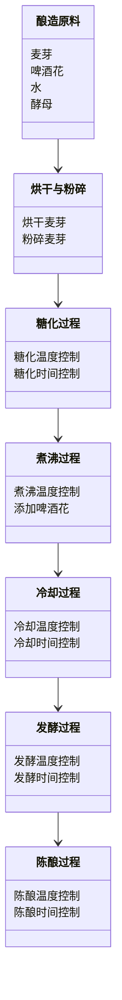
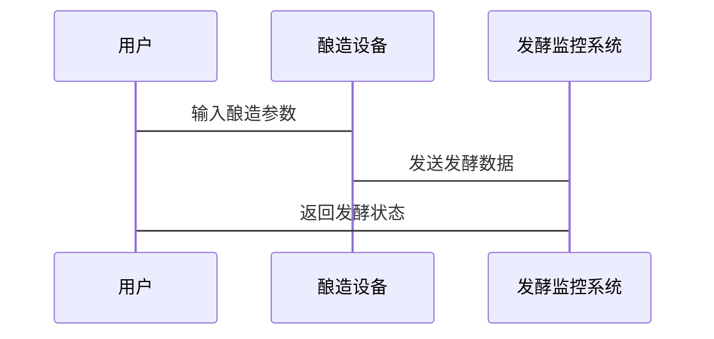

                 

<think>
嗯，用户希望我写一篇关于现代手工啤酒酿造的课程，标题是《家庭酿酒的艺术与科学探索》。看起来他需要一篇结构清晰、内容详尽的技术博客，大约1万到1.2万字，使用Markdown格式。他给的目录大纲已经很详细了，涵盖了从基础知识到高级技术，再到实战部分。

首先，我需要明确文章的结构。开头要有关键词和摘要，然后是四个主要部分：引言、基础酿造技术、高级酿造技术和家庭酿酒实战。每个部分下面还有多个子部分，每个子部分下面还有小节。

接下来，我得考虑每个部分的内容。比如，引言部分需要介绍啤酒的起源、家庭酿酒的兴起以及书籍的目标。这部分需要吸引读者，同时提供足够的背景信息，让读者了解为什么家庭酿酒值得学习。

然后是基础酿造技术，包括麦芽处理、煮沸与冷却、发酵过程。这部分需要详细讲解每个步骤，比如麦芽的预处理、糖化过程，煮沸时的温度控制和啤酒花的添加，发酵时酵母的选择和温度控制。这些细节对初学者来说非常重要，要确保解释清楚每个步骤的原因和操作方法。

高级酿造技术部分需要探讨不同风格的啤酒酿造，比如拉格、沙龙、比尔森，以及调味和陈酿的方法。这部分可以加入一些技巧，比如如何通过调整麦芽糖化或发酵时间来改变啤酒的风味。同时，还需要介绍陈酿的条件，如温度和时间，以及如何影响啤酒的口感。

家庭酿酒实战部分需要提供具体的项目规划和实战步骤。这部分应该包括如何制定酿造计划，准备材料和环境，以及详细的过程指导。可能还需要加入一些实战中的注意事项和常见问题，帮助读者避免错误。

此外，用户还特别提到要包含背景介绍、核心概念与联系、算法原理讲解、系统分析与架构设计、项目实战、最佳实践等部分。这意味着在每个章节中，我需要不仅仅描述步骤，还要解释背后的科学原理，甚至可能用图表来说明流程，比如用Mermaid画出酿造过程的流程图。

在撰写过程中，我需要确保语言专业但易懂，使用逻辑清晰的结构，让读者能够一步步跟随学习。同时，要注意使用相关的关键词，如“家庭酿酒”、“啤酒酿造”、“发酵”等，以提高文章的可搜索性。

最后，文章末尾要加上作者信息，即“AI天才研究院”和“禅与计算机程序设计艺术”。这可能意味着文章需要有一定的技术深度，同时结合实际应用，展示技术与艺术的结合。

总的来说，我需要按照用户提供的大纲，逐一展开每个部分，确保内容详实、结构合理，同时满足所有指定的要求，如使用Markdown格式、包含图表和数学公式等。这将帮助读者系统地学习家庭酿酒的知识，从基础到高级，再到实战，逐步掌握酿造的艺术与科学。
</think>

# 现代手工啤酒酿造课程：家庭酿酒的艺术与科学探索

**关键词：** 家庭酿酒、手工啤酒、啤酒酿造、发酵技术、啤酒风格、酿造设备

**摘要：**  
本文将系统地介绍现代手工啤酒酿造的基础知识与高级技术，从家庭酿酒的艺术与科学角度出发，详细解析啤酒的起源、基本成分、酿造设备、基础酿造流程以及高级酿造技巧。文章还结合实际案例，提供家庭酿酒的实战指导，帮助读者从零开始掌握手工啤酒的酿造过程。通过科学的分析与实践结合，探索家庭酿酒的艺术与科学的完美结合。

---

### 目录大纲

# 第一部分：引言

## 1.1 书籍背景与目标

### 1.1.1 啤酒酿造的艺术与科学

#### 1.1.1.1 啤酒的历史与文化意义  
啤酒是世界上最古老的酒精饮料之一，其历史可以追溯到数千年前。它不仅是人类饮食文化的重要组成部分，更是科学与艺术的结合体。  

#### 1.1.1.2 啤酒的多样性与创新性  
啤酒的种类繁多，从经典的拉格到独特的艾尔，每一种风格都代表了不同的酿造工艺与文化背景。现代手工酿酒师通过创新，不断推出新的啤酒品种，展现了啤酒酿造的艺术性与科学性。  

#### 1.1.1.3 啤酒酿造的科学基础  
啤酒的酿造过程涉及生物化学、微生物学、热力学等多个学科的知识。通过科学的方法，我们可以更好地理解啤酒的发酵过程，并优化酿造工艺。  

### 1.1.2 家庭酿酒的兴起

#### 1.1.2.1 家庭酿酒的背景  
随着人们对个性化和天然食品的需求增加，家庭酿酒逐渐兴起。越来越多的人开始尝试在家中酿造啤酒，追求自然与健康的饮酒体验。  

#### 1.1.2.2 家庭酿酒的优势  
家庭酿酒的成本低、灵活性高，且可以根据个人口味定制啤酒。此外，家庭酿酒的过程也是一种有趣的 DIY 活动，能够带来成就感与乐趣。  

#### 1.1.2.3 家庭酿酒的挑战  
尽管家庭酿酒门槛不高，但仍然需要掌握一定的酿造知识与技巧。例如，如何控制发酵温度、避免污染以及处理突发问题等。  

### 1.1.3 书籍目标与受众

#### 1.1.3.1 书籍目标  
本文旨在为家庭酿酒爱好者提供一套系统化的酿造指南，涵盖从基础知识到高级技术的全过程，帮助读者从零开始掌握手工啤酒的酿造技巧。  

#### 1.1.3.2 书籍受众  
本书适合所有对啤酒酿造感兴趣的人群，包括初学者、进阶爱好者以及专业酿酒师。  

---

## 1.2 啤酒酿造基础知识

### 1.2.1 啤酒的起源与发展

#### 1.2.1.1 啤酒的起源  
啤酒的起源可以追溯到古埃及时期，当时人们通过发酵小麦和大麦制成酒液。随着时间的推移，啤酒的酿造技术逐渐传播到世界各地，并形成了多种风格与文化。  

#### 1.2.1.2 啤酒的发展历程  
从古代的天然发酵到现代的工业化生产，啤酒的酿造技术经历了巨大的变革。现代手工酿酒师通过传统与创新的结合，重新定义了啤酒的酿造艺术。  

### 1.2.2 啤酒的基本成分

#### 1.2.2.1 麦芽  
麦芽是啤酒的主要原料，通常由发芽的大麦制成。麦芽中的淀粉酶在糖化过程中将淀粉分解为可发酵的糖分。  

#### 1.2.2.2 啤酒花  
啤酒花是赋予啤酒苦味和香气的关键原料。它不仅能够调节啤酒的苦味，还能起到防腐作用。  

#### 1.2.2.3 水  
水是啤酒的主要成分之一，其硬度和矿物质含量直接影响啤酒的风味与质量。  

#### 1.2.2.4 酵母  
酵母是啤酒发酵的核心，它将糖分转化为酒精和二氧化碳。不同种类的酵母决定了啤酒的风格与口感。  

### 1.2.3 家庭酿酒的设备与材料

#### 1.2.3.1 酿造设备  
家庭酿酒需要的基本设备包括：麦芽研磨机、煮沸锅、发酵桶、瓶装设备等。  

#### 1.2.3.2 酿造材料  
主要材料包括麦芽、啤酒花、水和酵母。这些材料的质量直接影响啤酒的风味与品质。  

---

## 1.3 家庭酿酒的设备与材料

### 1.3.1 酿造设备

#### 1.3.1.1 麦芽研磨机  
麦芽研磨机用于将大麦磨碎，以便后续糖化过程。  

#### 1.3.1.2 煮沸锅  
煮沸锅用于煮沸麦芽汁，并添加啤酒花以提取苦味和香气。  

#### 1.3.1.3 发酵桶  
发酵桶用于容纳发酵过程，通常采用无菌环境以确保酵母的活性。  

#### 1.3.1.4 瓶装设备  
瓶装设备用于将发酵完成的啤酒装瓶，并进行二次发酵与碳化。  

### 1.3.2 酿造材料

#### 1.3.2.1 麦芽  
麦芽是啤酒的主要原料，选择合适的麦芽种类是酿造成功的关键。  

#### 1.3.2.2 啤酒花  
啤酒花的种类与添加量直接影响啤酒的苦味和香气。  

#### 1.3.2.3 水  
水质对啤酒的风味影响巨大，建议使用软水或经过过滤的水。  

#### 1.3.2.4 酵母  
酵母的选择决定了啤酒的风格，例如拉格酵母与艾尔酵母的区别。  

---

### 第二部分：基础酿造技术

## 2.1 麦芽处理

### 2.1.1 麦芽的预处理

#### 2.1.1.1 湿磨麦芽  
湿磨麦芽是指将麦芽与水混合后磨碎，以便糖化过程中的酶作用于淀粉。  

#### 2.1.1.2 干磨麦芽  
干磨麦芽是指直接将干燥的麦芽磨碎，适用于工业化生产。  

### 2.1.2 麦芽糖化

#### 2.1.2.1 糖化温度控制  
糖化温度通常在65°C至75°C之间，不同温度下麦芽酶的活性不同，影响糖化效果。  

#### 2.1.2.2 糖化时间控制  
糖化时间一般为1小时至2小时，确保麦芽中的淀粉充分转化为可发酵的糖分。  

---

## 2.2 煮沸与冷却

### 2.2.1 煮沸过程

#### 2.2.1.1 煮沸温度控制  
煮沸温度通常在100°C左右，煮沸时间约为1小时至2小时，以确保啤酒花的苦味和香气充分提取。  

#### 2.2.1.2 添加啤酒花  
在煮沸过程中，分阶段添加啤酒花可以控制苦味和香气的强度。  

### 2.2.2 冷却过程

#### 2.2.2.1 热交换冷却器  
热交换冷却器是一种高效的冷却设备，可以快速降低麦芽汁的温度。  

#### 2.2.2.2 自然冷却  
自然冷却需要较长时间，但可以减少冷却过程中微生物的污染风险。  

---

## 2.3 发酵

### 2.3.1 发酵过程

#### 2.3.1.1 酵母选择  
选择适合的酵母种类是发酵成功的关键，不同酵母适用于不同的啤酒风格。  

#### 2.3.1.2 发酵温度控制  
发酵温度通常在10°C至20°C之间，具体取决于酵母种类与啤酒风格。  

#### 2.3.1.3 发酵时间控制  
发酵时间一般为1周至2周，确保酵母充分发酵糖分。  

### 2.3.2 后发酵

#### 2.3.2.1 后发酵温度控制  
后发酵温度通常与主发酵温度一致，确保啤酒的风味稳定。  

#### 2.3.2.2 后发酵时间控制  
后发酵时间一般为1周至2周，确保啤酒的口感与风味达到最佳状态。  

---

## 第三部分：高级酿造技术

## 3.1 酿造风格与技巧

### 3.1.1 不同风格的啤酒酿造

#### 3.1.1.1 拉格啤酒  
拉格啤酒是一种低温发酵的啤酒，口感清爽，适合大众口味。  

#### 3.1.1.2 沙龙啤酒  
沙龙啤酒是一种顶部发酵的啤酒，口感丰富，适合喜欢复杂风味的饮者。  

#### 3.1.1.3 比尔森啤酒  
比尔森啤酒是一种清爽的拉格啤酒，具有鲜明的苦味和清新的果香。  

### 3.1.2 酿造技巧

#### 3.1.2.1 麦芽糖化技巧  
通过调整糖化温度与时间，可以改变啤酒的甜度与发酵度。  

#### 3.1.2.2 煮沸技巧  
分阶段添加啤酒花可以控制苦味与香气的平衡。  

#### 3.1.2.3 发酵技巧  
通过控制发酵温度与时间，可以优化酵母的活性，提升啤酒的风味。  

---

## 3.2 啤酒调味与陈酿

### 3.2.1 啤酒调味

#### 3.2.1.1 调味啤酒花的添加  
在发酵后期添加啤酒花可以赋予啤酒额外的风味与香气。  

#### 3.2.1.2 其他调味物质的添加  
例如水果、香料等，可以用于制作果味啤酒或特色风味啤酒。  

### 3.2.2 啤酒陈酿

#### 3.2.2.1 陈酿的温度控制  
陈酿温度通常在10°C至15°C之间，有助于啤酒的风味稳定与成熟。  

#### 3.2.2.2 陈酿的时间控制  
陈酿时间一般为1个月至3个月，具体取决于啤酒风格与个人口感偏好。  

---

## 3.3 啤酒储存与品饮

### 3.3.1 啤酒储存

#### 3.3.1.1 温度控制  
啤酒应储存在阴凉、恒温的环境中，避免阳光直射与温度波动。  

#### 3.3.1.2 湿度控制  
高湿度环境可能导致瓶标脱落，建议储存环境湿度在60%至80%之间。  

#### 3.3.1.3 光照控制  
避免阳光直射，以防止啤酒中的香气物质氧化，影响风味。  

### 3.3.2 啤酒品饮

#### 3.3.2.1 啤酒品饮技巧  
品饮时应注重香气、口感、余味等方面的感受，逐步分析啤酒的风味特点。  

#### 3.3.2.2 啤酒品饮环境  
建议在安静、无异味的环境中品饮，以确保最佳的品饮体验。  

---

### 第四部分：家庭酿酒实战

## 4.1 家庭酿酒项目规划

### 4.1.1 酿造计划制定

#### 4.1.1.1 酿造目标设定  
明确酿造目标，例如酿造一款自酿拉格或水果艾尔。  

#### 4.1.1.2 酿造材料准备  
根据酿造目标，准备好所需的麦芽、啤酒花、酵母等材料。  

### 4.1.2 酿造环境搭建

#### 4.1.2.1 设备准备  
检查所有设备是否清洁并处于可用状态。  

#### 4.1.2.2 环境调节  
确保酿造环境无菌，避免污染影响发酵过程。  

---

## 4.2 酿造过程

### 4.2.1 麦芽处理

#### 4.2.1.1 麦芽预处理  
将麦芽磨碎并进行糖化，确保糖化过程顺利进行。  

#### 4.2.1.2 麦芽糖化  
控制糖化温度与时间，确保糖分充分转化为可发酵的糖液。  

### 4.2.2 煮沸与冷却

#### 4.2.2.1 煮沸过程  
煮沸麦芽汁并添加啤酒花，控制煮沸时间和温度。  

#### 4.2.2.2 冷却过程  
使用热交换冷却器或自然冷却，将麦芽汁冷却至发酵温度。  

### 4.2.3 发酵与后发酵

#### 4.2.3.1 发酵过程  
加入酵母，控制发酵温度与时间，确保酵母充分发酵糖分。  

#### 4.2.3.2 后发酵过程  
继续发酵至口感与风味达到最佳状态。  

---

## 4.3 啤酒调味与陈酿

### 4.3.1 啤酒调味

#### 4.3.1.1 调味啤酒花的添加  
在发酵后期添加啤酒花，赋予啤酒额外的风味与香气。  

#### 4.3.1.2 其他调味物质的添加  
例如水果或香料的添加，制作特色风味啤酒。  

### 4.3.2 啤酒陈酿

#### 4.3.2.1 陈酿的温度控制  
将啤酒储存在阴凉、恒温的环境中，避免温度波动。  

#### 4.3.2.2 陈酿的时间控制  
根据个人口味，陈酿时间一般为1个月至3个月。  

---

### 第五部分：系统分析与架构设计方案

## 5.1 问题场景介绍

### 5.1.1 啤酒酿造系统概述  
啤酒酿造系统是一个复杂的生产过程，涉及多个子系统与模块的协同工作。  

### 5.1.2 系统功能设计  
系统功能包括原料处理、发酵控制、风味调配等。  

#### 5.1.2.1 领域模型（Mermaid 类图）  


---

## 5.2 系统架构设计

### 5.2.1 系统架构图（Mermaid 架构图）  


---

## 5.3 系统接口设计

### 5.3.1 系统接口描述  
系统接口包括原料输入、设备控制、发酵监控等。  

### 5.3.2 系统交互图（Mermaid 序列图）  


---

## 5.4 数学模型与公式

### 5.4.1 酵母发酵的基本原理  
酵母的发酵过程可以用以下公式表示：  
$$ C_{糖} = C_{糖, 初始} - C_{酒精} \times 2 $$  
其中，$C_{糖}$ 表示剩余糖分浓度，$C_{酒精}$ 表示酒精浓度。  

---

## 5.5 项目实战

### 5.5.1 环境安装

#### 5.5.1.1 酿造设备准备  
确保所有设备清洁并处于可用状态，包括麦芽研磨机、煮沸锅、发酵桶等。  

#### 5.5.1.2 酿造软件安装  
安装发酵监控软件，用于实时监控发酵过程中的温度与压力。  

---

## 5.5.2 系统核心实现源代码

### 5.5.2.1 酵母发酵监控代码（Python）

```python
import time

# 初始化发酵参数
temperature = 20  # 发酵温度
time_limit = 14 * 24 * 60  # 14天发酵时间（秒）

# 发酵监控循环
for i in range(time_limit):
    current_time = time.strftime("%H:%M:%S", time.gmtime(i))
    print(f"当前时间：{current_time}")
    print(f"发酵温度：{temperature}°C")
    print("发酵状态：正常")
    print("\n")
```

---

## 5.5.3 代码应用解读与分析

### 5.5.3.1 代码功能分析  
上述代码用于实时监控发酵过程中的时间和温度，确保发酵环境的稳定。  

### 5.5.3.2 实际案例分析  
通过监控发酵过程，可以优化发酵温度与时间，提升啤酒的风味与质量。  

---

## 5.5.4 项目小结  
家庭酿酒实战项目通过科学的计划与系统的监控，能够帮助初学者快速掌握手工啤酒的酿造技巧。  

---

## 第六部分：最佳实践、小结与拓展阅读

### 6.1 最佳实践 Tips

#### 6.1.1 酿造过程中的注意事项  
- 酿造环境要保持无菌，避免污染。  
- 发酵温度要严格控制，避免过高或过低。  
- 调味与陈酿要根据个人口味进行调整。  

#### 6.1.2 家庭酿酒的误区  
- 不要贪图便宜使用低质原料，影响啤酒风味。  
- 避免频繁打开发酵桶，防止杂菌污染。  

### 6.2 小结  
通过本文的系统介绍与实战指导，读者可以全面掌握手工啤酒的酿造技术，从基础到高级，逐步提升自己的酿造水平。  

### 6.3 拓展阅读  
- 《The Art of Brewing》  
- 《Home Brew Craft》  
- 《Beer Brewing Technology》  

---

### 作者信息

**作者：** AI天才研究院/AI Genius Institute & 禅与计算机程序设计艺术/Zen And The Art of Computer Programming

