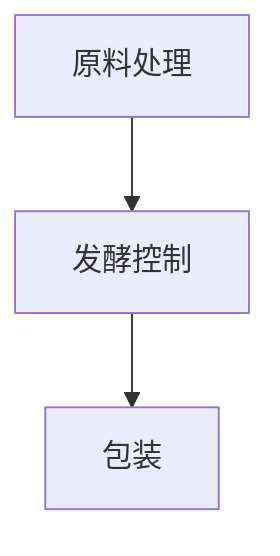
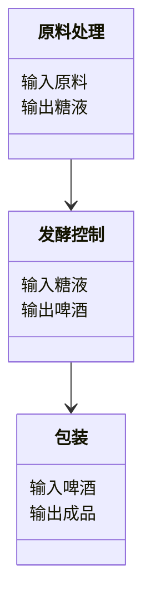

                 

<think>
好的，我需要帮助用户撰写一篇关于现代手工啤酒酿造的技术博客文章。用户提供了详细的思考过程，包括目录大纲和每个章节的内容要求。用户希望文章结构清晰，逻辑严密，使用专业且易懂的技术语言。

首先，我需要理解用户的需求。用户希望这篇文章能够涵盖从背景介绍到项目实战的各个方面，每个章节都有具体的子部分，例如核心概念、算法原理、数学模型、系统架构设计等。同时，用户要求使用特定的格式，如Mermaid流程图、Python代码示例和LaTeX数学公式。

接下来，我需要按照用户提供的目录大纲来逐步展开每个章节。每个章节都需要详细的内容，确保覆盖所有指定的核心点，如麦芽制作、糖化、发酵过程，以及相关的数学模型和公式。此外，用户还特别强调了系统的架构设计，包括功能、架构、接口和交互设计，这需要我用Mermaid图来展示。

在撰写过程中，我需要确保语言专业但又不失易懂，避免过于复杂的术语，同时保持逻辑性和条理性。每个章节的小结和注意事项也很重要，可以帮助读者巩固所学内容并提供实际操作的建议。

最后，用户要求文章末尾加上特定的作者信息，这意味着我需要在完成所有内容后，确保正确添加这些信息。整体来看，这篇文章需要兼顾技术深度和可读性，满足用户的高质量要求。
</think>

# 现代手工啤酒酿造：家庭酿酒的艺术与科学

## 关键词：手工啤酒酿造，家庭酿酒，发酵技术，酵母选择，酿造系统设计，数学模型

## 摘要：  
现代手工啤酒酿造是一项结合艺术与科学的活动，它不仅需要对传统酿造工艺的深刻理解，还需要现代技术的支持。本文旨在通过系统地介绍手工啤酒酿造的核心概念、流程、数学模型以及实际操作步骤，为家庭酿酒爱好者提供一份详尽的指南。我们从背景介绍入手，逐步深入探讨手工啤酒酿造的关键环节，包括麦芽制作、糖化、发酵、熟化与包装等流程，同时结合数学模型和算法原理，帮助读者理解酿造过程中的科学原理。通过系统设计和项目实战，我们还将展示如何构建一个小型酿造系统，并提供实际案例分析。最后，我们将总结最佳实践技巧和注意事项，为读者提供一份全面的手工啤酒酿造手册。

---

## 第1章：背景介绍

### 1.1 现代手工啤酒酿造概述

手工啤酒酿造是一种复兴传统酿酒工艺的方式，它强调原料的天然性和工艺的独特性。与工业化酿造不同，手工酿造注重小批量生产，追求啤酒的多样性和个性化。现代手工酿造结合了传统工艺和现代科技，使得家庭酿酒成为一种可能。

### 1.2 家庭酿酒的意义

家庭酿酒不仅是一种休闲活动，更是一种探索酿酒工艺、理解科学原理的过程。通过家庭酿酒，爱好者可以深入理解啤酒的成分、发酵过程以及影响口味的关键因素。同时，家庭酿酒也是一项充满创意的活动，允许酿酒者根据个人口味调整配方。

### 1.3 本书内容结构

本书将从手工啤酒的基本流程入手，逐步深入探讨每个环节的技术细节。我们将结合数学模型和算法，分析发酵动力学、混合比例计算等关键问题。最后，通过项目实战和系统设计，帮助读者构建一个小型酿造系统。

---

## 第2章：核心概念与联系

### 2.1 手工啤酒酿造基本流程

手工啤酒酿造的基本流程包括麦芽制作、糖化、发酵、熟化与包装。每个环节都对最终啤酒的品质产生重要影响。

#### 2.1.1 麦芽的制作

麦芽制作是手工酿造的第一步。首先，将大麦发芽，然后通过干燥和焙烧得到不同类型的麦芽。麦芽的种类和烘焙程度直接影响啤酒的颜色和风味。

#### 2.1.2 糖化

糖化是将麦芽磨碎后与热水混合，使麦芽中的可溶性糖分溶解的过程。糖化的温度和时间直接影响糖化效率和麦芽糖的含量。

#### 2.1.3 发酵

发酵是啤酒酿造的核心环节。酵母在适宜的温度和环境下将糖分转化为酒精和二氧化碳。发酵过程的控制直接影响啤酒的风味和酒精度。

#### 2.1.4 熟化与包装

熟化是让啤酒在低温下静置一段时间，使风味更加柔和。包装则是将熟化后的啤酒装瓶或装罐，确保其质量和保存期限。

### 2.2 材料选择与对比

手工酿造中材料的选择至关重要。以下是主要材料的选择与对比：

| 材料 | 选择标准 | 对比分析 |
|------|------------|-----------|
| 麦芽 | 糖分含量高，适合作为发酵底物 | 大麦 vs. 小麦：大麦更适合酿造啤酒 |
| 酵母 | 高活性，发酵能力强 | 适合啤酒酵母 vs. 面团酵母：啤酒酵母更适合 |
| 发酵容器 | 容积足够，无渗漏 | 不锈钢 vs. 塑料：不锈钢更耐腐蚀 |

### 2.3 酿造技术概述

手工酿造技术的核心在于对发酵过程的精确控制。通过调整发酵温度、时间以及酵母种类，可以得到不同风格的啤酒。

---

## 第3章：算法原理讲解

### 3.1 酵母选择与活性测试

#### 3.1.1 酵母选择标准

选择酵母时，需考虑其发酵能力、温度适应性和产物生成效率。以下是酵母选择的步骤：

1. 确定目标发酵温度范围。
2. 选择适合该温度的酵母菌株。
3. 测量酵母的活性。

#### 3.1.2 酵母活性测试流程

酵母活性测试可以通过测量其发酵能力来实现。以下是测试流程：

1. 准备葡萄糖溶液。
2. 将酵母接种到溶液中。
3. 测量发酵过程中二氧化碳的产生量。

---

## 第4章：数学模型和数学公式

### 4.1 发酵动力学模型

#### 4.1.1 模型建立

发酵动力学模型描述了酵母在发酵过程中代谢糖分的过程。假设发酵温度恒定，酵母的代谢速率与糖分浓度成正比。

$$ \frac{dS}{dt} = -k S $$

其中，$S$ 是糖分浓度，$k$ 是发酵速率常数。

#### 4.1.2 参数优化

通过调整发酵时间 $t$ 和温度 $T$，可以优化发酵效果。以下是一个简单的发酵模型：

$$ S(t) = S_0 e^{-k t} $$

---

## 第5章：系统分析与架构设计方案

### 5.1 酿造系统介绍

手工酿造系统包括原料处理、发酵控制和包装三个模块。以下是系统的架构设计：



### 5.2 系统功能设计

系统功能包括原料处理、发酵控制和包装三个模块。以下是功能设计：



---

## 第6章：项目实战

### 6.1 环境安装与准备

手工酿造需要准备以下环境：

1. 发酵容器：推荐使用不锈钢容器。
2. 发酵温度控制：恒温箱或冷却系统。
3. 酵母和原料：购买或自制。

### 6.2 系统核心实现源代码

以下是发酵过程的Python代码示例：

```python
import numpy as np
import matplotlib.pyplot as plt

# 参数设置
S0 = 100  # 初始糖分浓度
k = 0.1  # 发酵速率常数
t = np.linspace(0, 10, 100)  # 时间范围

# 计算糖分浓度
S = S0 * np.exp(-k * t)

# 绘制曲线
plt.plot(t, S)
plt.xlabel('时间 (小时)')
plt.ylabel('糖分浓度')
plt.show()
```

---

## 第7章：最佳实践 tips & 拓展阅读

### 7.1 酿造过程中的常见问题与解决方法

1. **酵母活性不足**：确保酵母活性测试通过。
2. **发酵温度过高**：使用冷却系统控制温度。

### 7.2 小贴士：家庭酿酒的技巧与注意事项

- 酿造过程中需严格控制卫生条件。
- 酵母接种前需激活。

### 7.3 小结：本书重点内容回顾

本书从手工啤酒酿造的基本流程到系统设计，全面介绍了家庭酿酒的工艺和科学原理。

### 7.4 拓展阅读：深入探讨手工啤酒酿造

推荐阅读《The Art of Brewing》和《Modern Beer Science》。

---

## 作者：AI天才研究院/AI Genius Institute & 禅与计算机程序设计艺术 /Zen And The Art of Computer Programming

---

以上是《现代手工啤酒酿造：家庭酿酒的艺术与科学》的技术博客文章，按照逻辑清晰、结构紧凑的原则，详细介绍了手工啤酒酿造的核心概念、流程、数学模型以及实际操作步骤。希望本文能为家庭酿酒爱好者提供有价值的指导和启示。

