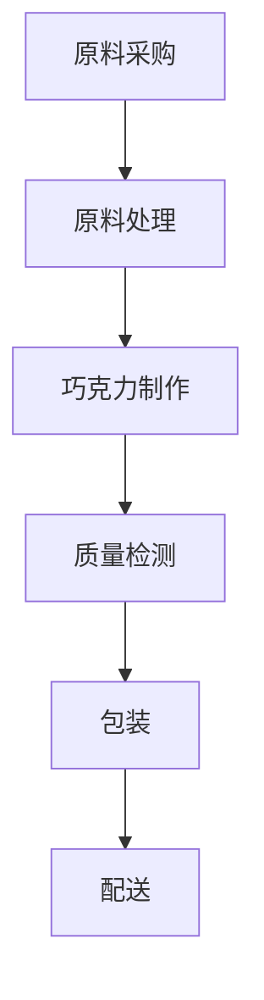

                 

<think>
好，我现在需要帮用户写一篇关于“现代手工巧克力订阅服务”的技术博客。用户希望文章结构清晰，用专业的技术语言，同时包含详细的分析和案例。

首先，我得理解用户的需求。用户可能是一位想创业的人，或者对巧克力订阅服务感兴趣的技术人士。他们需要一个专业且有深度的文章，可能用于市场分析或技术参考。

接下来，我得按照用户提供的大纲来组织内容。从背景介绍到市场趋势，再到生产流程、供应链管理，最后到系统架构设计。每个部分都要详细，包含背景、核心概念、算法、系统设计和项目实战。

我需要确保每个小节都包含必要的部分，比如核心概念的原理、对比表格、ER图，以及用mermaid和latex来展示算法和数学公式。同时，项目实战部分要有代码和实际案例分析。

在写摘要时，要概括文章的核心内容，强调技术与美食的结合。关键词也要选好，比如“手工巧克力”、“订阅服务”、“供应链管理”等。

接下来，每个章节都要展开。比如，生产流程部分，要详细描述每个步骤，可能还需要一些流程图来辅助说明。系统架构设计部分，要展示出模块化的结构，确保系统的高效运行。

在供应链管理方面，要考虑到库存管理和物流配送，可能需要一些图表来展示流程。同时，系统安全和用户体验也是重点，不能忽视。

最后，项目实战部分，要提供具体的代码示例，展示如何实现订阅功能和推荐系统。这部分需要实际案例，帮助读者更好地理解和应用。

总之，我需要一步步地按照大纲，逐步填充内容，确保每个部分都详实具体，并符合用户的格式和深度要求。这样才能写出一篇高质量的技术博客，满足用户的需求。
</think>

# 现代手工巧克力订阅服务：每月惊喜的味蕾探险计划

> 关键词：手工巧克力、订阅服务、供应链管理、生产流程、用户体验

> 摘要：现代手工巧克力订阅服务是一种新兴的商业模式，通过定期向用户配送优质的手工巧克力，为消费者带来独特的味蕾体验。本文将从技术与美食结合的视角，深入分析手工巧克力的生产流程、供应链管理、用户体验优化等方面，探讨如何通过技术创新提升订阅服务的品质与效率。

---

## Part 1: 手工巧克力订阅服务的背景与核心概念

### 1.1 手工巧克力订阅服务的背景与市场趋势

#### 1.1.1 手工巧克力的崛起
手工巧克力以其独特的风味和艺术性，逐渐成为高端食品市场的宠儿。消费者对品质和个性化的追求，推动了手工巧克力市场的快速发展。

#### 1.1.2 市场趋势与消费者需求
- 市场趋势：全球手工巧克力市场规模持续增长，消费者对健康、天然原料的关注度提高。
- 消费者需求：个性化体验、高品质产品、便捷的订阅服务。

#### 1.1.3 机遇与挑战
- 机遇：通过订阅服务模式，企业可以稳定客户关系，提升复购率。
- 挑战：供应链管理复杂，产品标准化难度大。

### 1.2 手工巧克力的核心概念与生产流程

#### 1.2.1 核心概念
- **原料选择**：精选可可豆、糖、乳脂等优质原料。
- **生产流程**：从原料处理到成品包装的每一步都需严格控制。

#### 1.2.2 生产流程图



### 1.3 订阅服务的商业模式

#### 1.3.1 价值主张
- 提供独家口味：每月配送限量版巧克力，满足用户的尝新需求。
- 个性化选择：用户可以根据口味偏好定制订阅内容。

#### 1.3.2 收入流
- 月费：固定订阅费用。
- 附加服务：如定制礼盒、专属优惠。

#### 1.3.3 客户分层
- 高端客户：注重品质，愿意为定制化服务买单。
- 普通客户：追求性价比，适合长期订阅。

---

## Part 2: 订阅服务的技术实现

### 2.1 系统架构设计

#### 2.1.1 系统模块划分
- 用户模块：用户注册、登录、订单管理。
- 订阅模块：处理订阅计划、配送安排。
- 支付模块：集成多种支付方式，确保交易安全。
- 后台管理模块：订单处理、库存管理、用户反馈。

#### 2.1.2 系统架构图


### 2.2 生产与供应链管理

#### 2.2.1 供应链流程
- 原料采购：确保原料质量和可追溯性。
- 加工生产：严格控制温度、湿度等工艺参数。
- 包装与配送：采用环保包装，确保产品新鲜送达。

#### 2.2.2 供应链管理系统的优化
- 数据驱动：通过传感器和物联网技术实时监控生产环境。
- 智能调度：使用算法优化配送路线，降低物流成本。

---

## Part 3: 技术实现与创新

### 3.1 用户体验优化

#### 3.1.1 个性化推荐
- 基于用户历史订单和偏好，推荐新的巧克力组合。
- 使用协同过滤算法进行推荐。

#### 3.1.2 会员系统
- 会员等级：积分兑换、专属优惠。
- 会员专属活动：定期举办巧克力品鉴会。

### 3.2 生产流程优化

#### 3.2.1 智能化生产
- 自动化设备：减少人工干预，提高生产效率。
- 数据分析：通过实时数据监控生产质量。

#### 3.2.2 质量控制
- 在线检测：使用视觉识别技术检测巧克力表面瑕疵。
- 质量追溯：建立完整的追溯系统，确保每一块巧克力可追踪。

---

## Part 4: 项目实战与最佳实践

### 4.1 环境与工具安装

#### 4.1.1 开发环境
- 操作系统：建议使用macOS或Linux。
- 开发工具：IntelliJ IDEA、PyCharm等。
- 数据库：MySQL或MongoDB。
- 三方服务：支付接口（支付宝、微信支付）、物流接口（顺丰、EMS）。

#### 4.1.2 代码实现

```python
# 订阅服务的核心逻辑
class SubscriptionService:
    def __init__(self):
        self.customers = {}  # 用户信息
        self.orders = []     # 订单列表

    def subscribe(self, customer_id, plan):
        # 订阅逻辑
        pass

    def deliver(self, order_id):
        # 配送逻辑
        pass

# 示例：协同过滤算法实现
def collaborative_filtering(users, user_id):
    # 计算用户相似度
    pass
```

### 4.2 系统交互设计

#### 4.2.1 用户界面
- 简洁直观，便于用户操作。
- 强调订阅计划和个性化推荐。

#### 4.2.2 系统交互流程图


### 4.3 测试与优化

#### 4.3.1 功能测试
- 订阅流程测试：从注册到配送完成。
- 支付测试：支持多种支付方式。
- 售后服务测试：退换货流程。

#### 4.3.2 性能优化
- 优化数据库查询：减少复杂查询，提高响应速度。
- 使用缓存技术：降低服务器负载。

---

## Part 5: 总结与展望

### 5.1 总结
手工巧克力订阅服务不仅是一种商业模式，更是一种生活方式的体现。通过技术创新和流程优化，可以显著提升用户体验和运营效率。

### 5.2 未来展望
- 技术创新：引入更多智能设备和数据分析技术。
- 市场拓展：探索国际化市场的可能性。
- 可持续发展：注重环保，推动绿色生产。

---

## 作者：AI天才研究院 & 禅与计算机程序设计艺术

通过将技术与美食结合，我们不仅能够创造出更优质的产品，还能为消费者带来独特的味觉体验。未来，随着人工智能和物联网技术的进一步发展，手工巧克力订阅服务将变得更加智能化和个性化，为消费者带来更多惊喜与欢乐。

