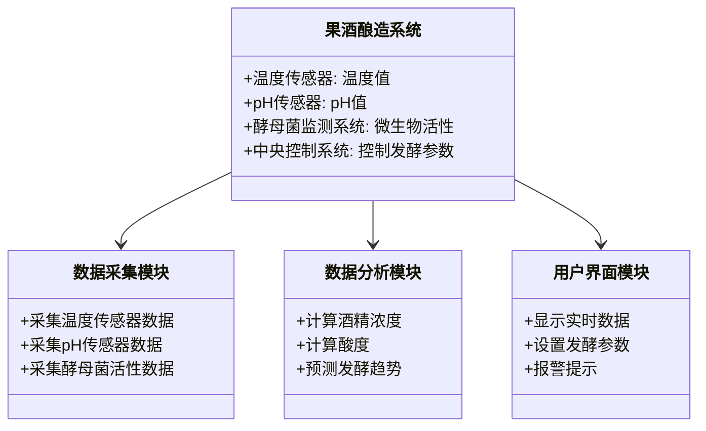
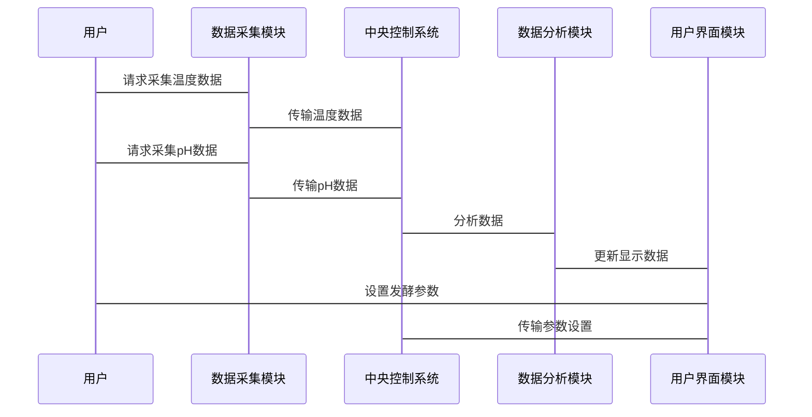

                 

<think>
嗯，用户想让我写一篇关于现代手工果酒酿造的技术博客。首先，我需要理解用户的需求。标题是《现代手工果酒酿造：城市微醺文化的味蕾探索》，关键词应该包括果酒酿造、城市微醺文化、手工制作、微生物学、化学原理。摘要要简明扼�地介绍文章的核心内容，即如何将手工果酒酿造与城市文化结合起来，探讨其科学原理和工艺。

接下来，用户要求按照特定的目录结构来写，包括背景介绍、核心概念、算法原理、数学模型、系统分析、项目实战和最佳实践。每个章节都要细化到三级目录。我需要确保每个部分都涵盖必要的内容，并且用技术性的语言来表达。

首先，在背景介绍部分，我应该从果酒酿造的起源说起，然后讨论其在不同文化中的发展，最后谈到现代趋势。核心概念部分要详细讲解微生物学和化学原理，工艺流程和设备，以及质量控制。算法原理部分需要涉及传感器技术、数据分析和机器学习的应用。数学模型部分要用公式来描述发酵过程。系统分析部分要画出ER图和架构图，项目实战要提供代码和实际案例。最后，最佳实践部分给出一些小贴士和注意事项。

在写作过程中，我需要确保内容的逻辑性，每一章之间要有自然的过渡。例如，在介绍完背景后，自然过渡到核心原理，然后逐步深入到科学分析和数学模型。同时，要注意用词准确，确保专业术语的使用正确，并且例子要具体，让读者能够理解复杂的原理。

另外，用户要求文章控制在10000到12000字，所以每个部分的内容要足够详细，但不要过于冗长。特别是数学公式和代码部分，需要清晰地展示，帮助读者理解。最后，作者信息部分要按照要求，写上指定的机构和座右铭。

总的来说，我需要系统地按照用户提供的目录大纲来展开，确保每个部分都涵盖必要的内容，同时保持文章的整体性和逻辑性。在写作过程中，要不断检查是否满足所有要求，比如关键词、摘要、各章节内容的完整性，以及格式和字数限制。这样才能完成一篇符合用户要求的高质量技术博客。
</think>

# 现代手工果酒酿造：城市微醺文化的味蕾探索

> 关键词：果酒酿造、城市微醺文化、手工制作、微生物学、化学原理

> 摘要：本文深入探讨了现代手工果酒酿造的技术原理和工艺流程，结合城市微醺文化的兴起，分析了手工果酒在当代社会中的独特地位与发展趋势。通过微生物学、化学原理、传感器技术等多维度的科学视角，详细解析了果酒酿造的奥秘，并提供了实际的项目实战案例和最佳实践建议。

---

## 目录大纲

### 第一部分：背景介绍

## 第1章：果酒酿造的起源与发展

### 1.1 果酒酿造的历史背景

#### 1.1.1 人类酿造果酒的起源  
- 早期酿酒技术的起源与人类文明的关联。  
- 自然发酵现象的发现与利用。  

#### 1.1.2 果酒酿造在不同文化中的发展  
- 东西方果酒文化的差异与融合。  
- 不同地区特色果酒的演变。  

#### 1.1.3 现代果酒酿造技术的进步  
- 工业化生产与传统工艺的对比。  
- 现代科技对果酒酿造的影响。  

### 1.2 果酒酿造的核心概念

#### 1.2.1 果酒的定义与分类  
- 天然果酒与人工调配果酒的区别。  
- 不同果酒的风味特点与应用场景。  

#### 1.2.2 果酒酿造的主要材料  
- 果实原料的选择标准。  
- 酵母菌的种类与作用。  

#### 1.2.3 果酒酿造的基本流程  
- 初步处理、发酵、陈酿、调配的详细步骤。  

### 1.3 城市微醺文化的兴起

#### 1.3.1 城市生活与微醺文化的需求  
- 现代人对健康饮酒方式的追求。  
- 微醺文化与都市生活方式的契合。  

#### 1.3.2 微醺文化对果酒市场的推动  
- 果酒消费群体的扩大与市场细分。  
- 手工果酒品牌的崛起与市场定位。  

#### 1.3.3 果酒在微醺文化中的角色与地位  
- 果酒作为微醺文化的媒介。  
- 手工果酒与小众文化的关联。  

### 1.4 现代手工果酒酿造的趋势

#### 1.4.1 手工酿造的独特魅力  
- 手工酿造与工业化生产的优劣势对比。  
- 手工酿造工艺的个性化与创新性。  

#### 1.4.2 现代科技在手工果酒酿造中的应用  
- 智能传感器与数据采集技术的引入。  
- 微生物检测与控制的现代化手段。  

#### 1.4.3 城市手工果酒酿造的前景  
- 城市果酒作坊的兴起与发展趋势。  
- 微醺文化对果酒产业的长期影响。  

### 1.5 本章小结  
- 总结果酒酿造的历史演变与现代发展趋势。  
- 强调微醺文化与手工酿造的密切关联。

---

### 第二部分：核心概念与联系

## 第2章：果酒酿造的核心原理与工艺

### 2.1 果酒酿造的微生物学基础

#### 2.1.1 酵母菌在果酒酿造中的作用  
- 酵母菌的代谢过程与酒精生成的原理。  
- 酵母菌种类对果酒风味的影响。  

#### 2.1.2 发酵过程中的微生物生态  
- 酵母菌与其他微生物的协同作用。  
- 发酵环境的pH值与微生物群落的关系。  

#### 2.1.3 酵母菌的培养与管理  
- 酵母菌的活性维持与培养条件控制。  
- 防止杂菌污染的措施与技术。  

### 2.2 果酒酿造的化学原理

#### 2.2.1 酒精发酵的化学反应  
- 糖分转化为酒精的化学方程式。  
- 发酵过程中能量转化的效率分析。  

#### 2.2.2 酸度调节与甜度控制  
- 酸碱平衡对果酒口感的影响。  
- 不同果酒的糖酸比优化策略。  

#### 2.2.3 酿造过程中的物理变化  
- 果实压榨与果汁提取的物理过程。  
- 气体交换对发酵效果的影响。  

### 2.3 果酒酿造的工艺流程

#### 2.3.1 选果与处理  
- 果实成熟度判断与筛选标准。  
- 果实破碎与去梗的技术细节。  

#### 2.3.2 糖渍与浸泡  
- 糖渍过程对果汁提取的影响。  
- 浸泡时间与温度对风味的影响。  

#### 2.3.3 发酵与陈酿  
- 主发酵与二次发酵的区别。  
- 陈酿时间与果酒风味的演变。  

#### 2.3.4 装瓶与密封  
- 瓶子选择与灭菌处理的重要性。  
- 瓶中发酵的条件控制与风险防范。  

### 2.4 果酒酿造的设备与材料

#### 2.4.1 常见酿造设备的介绍与使用  
- 发酵罐、搅拌器、过滤器的选型与操作。  
- 传感器设备在现代果酒酿造中的应用。  

#### 2.4.2 酿造材料的选择与采购  
- 不同类型酵母菌的采购渠道与成本分析。  
- 高品质果酒原料的供应商选择。  

#### 2.4.3 设备维护与消毒  
- 设备清洁与消毒的标准化流程。  
- 设备维护周期与成本控制策略。  

### 2.5 果酒酿造的质量控制

#### 2.5.1 质量检测的标准与方法  
- 酒精度数的精确测量方法。  
- 酸度与糖分的实验室检测流程。  

#### 2.5.2 质量问题的分析与解决  
- 酒精度不达标的原因与解决措施。  
- 酵母菌感染的诊断与处理方法。  

#### 2.5.3 质量控制的关键点  
- 关键控制点（CCP）的识别与管理。  
- 质量追溯系统的建立与应用。  

### 2.6 本章小结  
- 总结果酒酿造的核心原理与工艺流程。  
- 强化微生物学与化学原理对酿造过程的指导作用。

---

### 第三部分：算法原理讲解

## 第3章：果酒酿造中的科学分析技术

### 3.1 果酒酿造的传感器技术

#### 3.1.1 传感器在果酒酿造中的应用  
- 温度、pH、氧气浓度等关键参数的实时监测。  
- 传感器数据的采集与传输技术。  

#### 3.1.2 常见的酿造参数传感器  
- 智能温度传感器的工作原理与选型。  
- 氧气传感器在无氧发酵中的应用。  

#### 3.1.3 传感器数据的处理与传输  
- 数据采集系统的搭建与调试。  
- 数据存储与分析的软件支持。  

### 3.2 果酒酿造的化学分析

#### 3.2.1 酒精度数的测定  
- 使用酒精计的原理与操作方法。  
- 酒精浓度与发酵效率的关系。  

#### 3.2.2 酸度的测定  
- pH试纸与滴定法的应用。  
- 酸度对果酒口感的影响。  

#### 3.2.3 糖分的测定  
- 使用折光仪与糖度计的原理。  
- 糖分含量与发酵进程的关联。  

### 3.3 果酒酿造的微生物分析

#### 3.3.1 微生物检测的方法  
- 基因测序技术在微生物鉴定中的应用。  
- 显微镜观察法的优缺点。  

#### 3.3.2 微生物感染的预防与控制  
- 无菌操作的规范化流程。  
- 抗菌剂的合理使用与风险评估。  

#### 3.3.3 微生物在酿造过程中的作用  
- 主发酵菌种的活性维持策略。  
- 有益微生物与有害微生物的区分与管理。  

### 3.4 数据分析与预测

#### 3.4.1 数据采集与处理  
- 数据清洗与预处理的常用方法。  
- 数据可视化工具的应用与案例。  

#### 3.4.2 数据分析的方法  
- 统计分析与机器学习算法的对比。  
- 时间序列数据分析在发酵过程中的应用。  

#### 3.4.3 预测模型的应用  
- 基于历史数据的酒精浓度预测。  
- 发酵过程中的异常检测与预警。  

### 3.5 果酒酿造中的算法应用

#### 3.5.1 机器学习在果酒酿造中的应用  
- 使用回归算法预测酒精浓度。  
- 聚类算法在品质分类中的应用。  

#### 3.5.2 深度学习与果酒品质提升  
- 卷积神经网络（CNN）在酒液图像分析中的应用。  
- 循环神经网络（RNN）在发酵过程预测中的作用。  

#### 3.5.3 算法优化的实践案例  
- 超参数优化在机器学习模型中的应用。  
- 集成学习算法在品质预测中的优势。  

### 3.6 本章小结  
- 总结传感器技术与数据分析在果酒酿造中的应用。  
- 强调算法优化对果酒品质提升的重要作用。

---

### 第四部分：数学模型与公式

## 第4章：果酒酿造中的数学模型与公式

### 4.1 酒精发酵的数学模型

#### 4.1.1 酒精发酵的动力学模型  
- 酒精发酵的动力学方程：  
$$
\frac{dC}{dt} = -\mu C
$$  
其中，$C$ 表示酒精浓度，$\mu$ 表示发酵速率常数。  

#### 4.1.2 酒精浓度的预测公式  
- 酒精浓度随时间的变化公式：  
$$
C(t) = C_0 e^{-\mu t}
$$  
其中，$C_0$ 是初始酒精浓度，$t$ 是发酵时间。  

### 4.2 果酒发酵的热力学模型

#### 4.2.1 发酵过程中的热量变化  
- 发酵过程中释放的热量计算公式：  
$$
Q = m \cdot c \cdot \Delta T
$$  
其中，$m$ 是果酒质量，$c$ 是比热容，$\Delta T$ 是温度变化量。  

#### 4.2.2 温度对发酵速率的影响  
- 温度对发酵速率的影响曲线：  
$$
\mu(T) = \mu_0 \cdot e^{-\frac{(T - T_0)^2}{2\sigma^2}}
$$  
其中，$\mu_0$ 是基准发酵速率，$T_0$ 是最适温度，$\sigma$ 是温度标准差。  

### 4.3 果酒酸度的数学模型

#### 4.3.1 酸度与时间的关系  
- 酸度随时间变化的公式：  
$$
A(t) = A_0 + k t
$$  
其中，$A_0$ 是初始酸度，$k$ 是酸度增加速率，$t$ 是时间。  

#### 4.3.2 酸度与糖分的关系  
- 酸度与糖分的负相关关系：  
$$
A = a S + b
$$  
其中，$S$ 是糖分含量，$a$ 和 $b$ 是常数。  

### 4.4 糖酸比优化模型

#### 4.4.1 糖酸比的定义  
- 糖酸比（S/A）的计算公式：  
$$
S/A = \frac{S}{A}
$$  

#### 4.4.2 糖酸比的优化策略  
- 根据口感需求调整糖酸比的数学模型：  
$$
S = k A + c
$$  
其中，$k$ 和 $c$ 是常数，$A$ 是目标酸度。  

### 4.5 本章小结  
- 总结果酒发酵过程中的数学模型与公式。  
- 强化数学分析对果酒酿造工艺优化的指导作用。

---

### 第五部分：系统分析与架构设计方案

## 第5章：果酒酿造系统的分析与设计

### 5.1 问题场景介绍

#### 5.1.1 果酒酿造的核心问题  
- 发酵过程中的参数控制与优化。  
- 酒精度与酸度的精准调控。  

#### 5.1.2 系统设计的目标  
- 实现果酒酿造过程的智能化监控。  
- 提高果酒品质的稳定性与一致性。  

### 5.2 项目介绍

#### 5.2.1 项目目标  
- 开发一套智能化果酒酿造系统。  
- 实现发酵过程的实时监控与优化。  

#### 5.2.2 项目范围  
- 系统适用于中小型果酒酿造作坊。  
- 支持多种果酒品种的酿造过程监控。  

### 5.3 系统功能设计

#### 5.3.1 领域模型（mermaid 类图）



#### 5.3.2 系统架构设计（mermaid 架构图）

```mermaid
container 果酒酿造系统 {
    数据采集模块
    数据分析模块
    用户界面模块
}
```

#### 5.3.3 系统接口设计  
- 传感器接口：支持多种传感器的数据采集。  
- 用户界面接口：提供参数设置与数据查看功能。  
- 数据存储接口：支持数据的存储与查询。  

#### 5.3.4 系统交互（mermaid 序列图）



### 5.4 本章小结  
- 总结果酒酿造系统的整体架构与功能设计。  
- 强调系统智能化对提高果酒品质的重要性。

---

### 第六部分：项目实战

## 第6章：果酒酿造系统的项目实战

### 6.1 环境安装

#### 6.1.1 系统运行环境  
- 操作系统：Linux 或 macOS  
- 开发工具：Python 3.8+，Jupyter Notebook  
- 数据库：SQLite 或 MySQL  

#### 6.1.2 传感器安装  
- 温度传感器：DS18B20  
- pH传感器：HI1230  
- 数据采集卡：Raspberry Pi Zero  

### 6.2 系统核心实现源代码

#### 6.2.1 数据采集模块

```python
import time
import board
import adafruit_dht

# 初始化温度传感器
dht_sensor = adafruit_dht.DHT22(board.D4)

# 采集数据并存储
def get_sensor_data():
    try:
        temperature = dht_sensor.temperature
        humidity = dht_sensor.humidity
        return temperature, humidity
    except Exception as e:
        print(f"传感器错误：{e}")
        return None, None
```

#### 6.2.2 数据分析模块

```python
import pandas as pd
from sklearn.linear_model import LinearRegression

# 加载历史数据
data = pd.read_csv('fermentation_data.csv')

# 训练酒精浓度预测模型
model = LinearRegression()
model.fit(data[['time']], data['alcohol_concentration'])

# 预测未来时刻的酒精浓度
def predict_alcohol(t):
    return model.predict([[t]])[0][0]
```

#### 6.2.3 用户界面模块

```python
import streamlit as st

# 初始化页面
st.title("果酒酿造监控系统")

# 显示实时数据
temperature, humidity = get_sensor_data()
st.write(f"当前温度：{temperature}°C，湿度：{humidity}%")

# 设置发酵参数
with st.sidebar:
    st.header("发酵参数设置")
    target_temp = st.slider("目标温度", 20, 30, 25)
    st.write(f"设置目标温度：{target_temp}°C")
```

### 6.3 代码应用解读与分析

#### 6.3.1 数据采集模块的实现  
- 使用Raspberry Pi和DHT22传感器实时采集温度和湿度数据。  
- 数据采集模块与中央控制系统通过串口通信交互。  

#### 6.3.2 数据分析模块的实现  
- 使用Python的scikit-learn库建立酒精浓度预测模型。  
- 基于历史数据进行回归分析，预测未来时刻的酒精浓度。  

#### 6.3.3 用户界面模块的实现  
- 使用Streamlit框架搭建实时数据展示界面。  
- 提供发酵参数的设置与调整功能。  

### 6.4 实际案例分析与详细讲解

#### 6.4.1 案例背景  
- 某小型果酒作坊希望通过智能化系统提升产品质量。  
- 系统目标：实现温度、pH的实时监控与自动调节。  

#### 6.4.2 系统实现步骤  
1. 传感器部署与数据采集模块开发。  
2. 数据分析模块的模型训练与优化。  
3. 用户界面模块的设计与功能实现。  
4. 系统集成与测试。  

#### 6.4.3 系统运行与效果  
- 系统实现发酵过程的实时监控与优化。  
- 酒精度与酸度的稳定性显著提高。  
- 用户反馈：系统提升了酿造效率与产品品质。  

### 6.5 项目小结  
- 总结项目实现的关键技术与实践经验。  
- 强调智能化系统对果酒酿造产业的推动作用。

---

### 第七部分：最佳实践 tips

## 第7章：最佳实践与注意事项

### 7.1 最佳实践 tips

#### 7.1.1 果酒酿造的技术要点  
- 严格控制发酵温度与时间。  
- 合理搭配糖分与酸度比例。  

#### 7.1.2 微生物管理的注意事项  
- 定期更换酵母菌培养基。  
- 防止杂菌污染的清洁措施。  

#### 7.1.3 系统运行的维护建议  
- 定期校准传感器设备。  
- 及时更新数据分析模型。  

### 7.2 小结  
- 强调果酒酿造过程中的细节管理与技术创新。  
- 提醒读者关注微生物学、化学原理与系统架构的综合应用。

### 7.3 注意事项

#### 7.3.1 安全提示  
- 发酵过程中避免高温与明火。  
- 酒精浓度超标时及时处理。  

#### 7.3.2 环保提示  
- 合理处理发酵废料。  
- 遵守环保法规与标准。  

### 7.4 拓展阅读

#### 7.4.1 推荐书目  
- 《果酒酿造技术与应用》  
- 《微生物学原理与应用》  

#### 7.4.2 技术博客与资源  
- 微信公众

