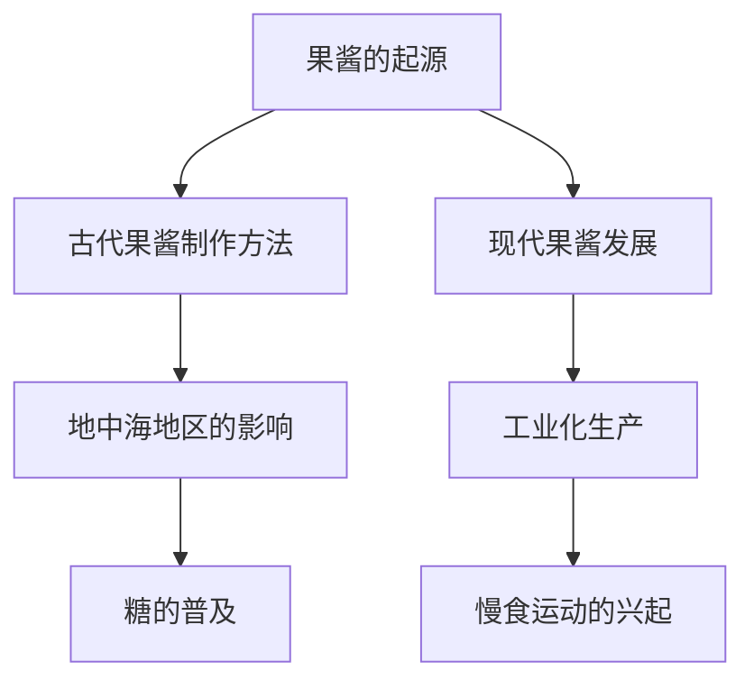
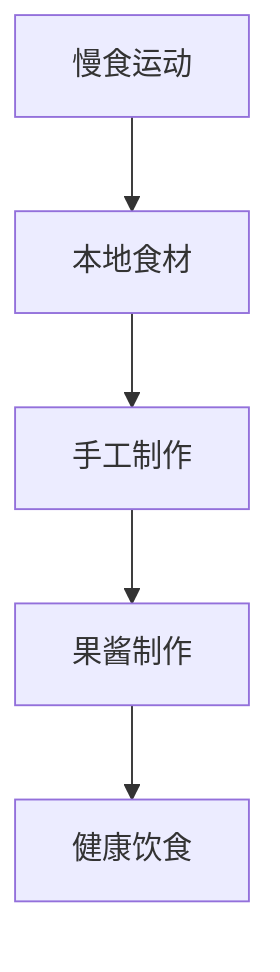
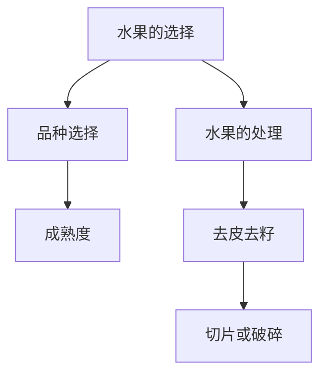
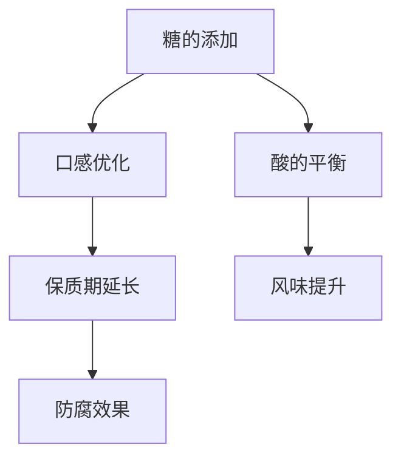
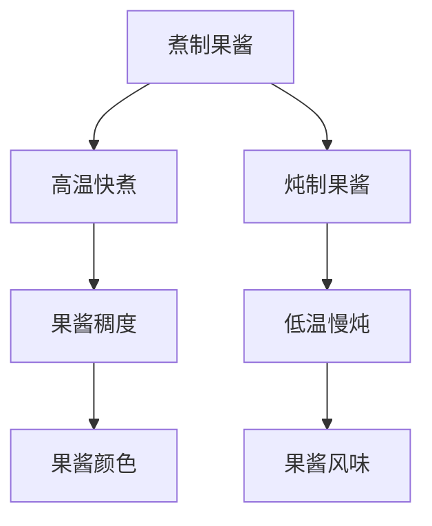
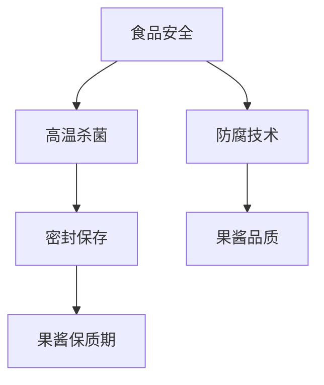
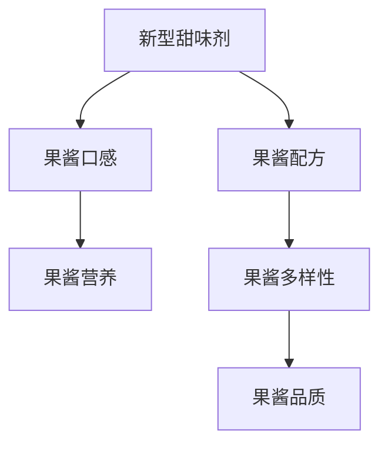
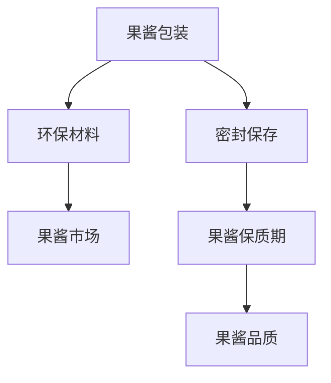
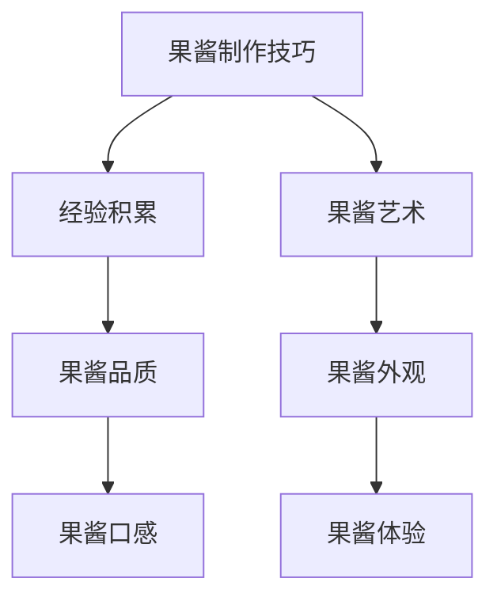
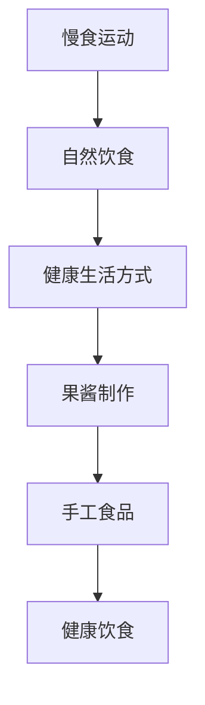

                 

<think>
好，我需要帮助用户撰写一篇关于“现代手工果酱制作：慢食运动中的甜蜜哲学”的技术博客。首先，用户希望文章结构清晰，内容专业且有深度，同时结合技术背景和慢食运动的哲学思考。

首先，我会回顾用户提供的大纲，确保每个章节都覆盖到位。从历史背景到制作工艺，再到创新趋势和哲学思考，整个结构很完整。接下来，我需要按照每个章节的逻辑，逐步深入分析每个部分的核心内容。

考虑到用户的要求，每个章节都需要包含核心概念、联系、算法原理、数学模型和系统分析等部分。我需要确保这些内容不仅详细，还要用技术术语来表达，同时保持易懂。

例如，在“果酱制作的基础原料”这一章，我会从水果的选择与处理开始，分析其核心概念，如品种、成熟度等。然后，通过mermaid流程图展示选择和处理的步骤，接着建立数学模型，计算糖的添加比例和切片面积，最后用具体例子来说明如何选择水果。

在“果酱制作的基本工艺”部分，我需要详细讲解烹饪方法，比如煮制和炖制的区别，以及如何确保食品安全。这部分可能涉及到温度控制和时间管理，可以用数学公式来表示最佳熬煮时间。

同时，用户强调了慢食运动与果酱的关系，这让我想到在后面的章节中，需要结合生活方式和哲学思考，探讨手工制作果酱如何体现慢生活理念。

最后，我会在文章末尾添加作者信息，确保格式正确，并检查整体字数是否在10000到12000字之间，确保内容完整且详细。

整体上，我需要将每个章节拆解成具体的小部分，逐一分析，确保每个部分都符合用户的要求，同时保持文章的流畅性和逻辑性。这不仅能满足用户的技术需求，还能让读者在阅读过程中获得深入的知识和启发。
</think>

# 现代手工果酱制作：慢食运动中的甜蜜哲学

> 关键词：手工果酱、慢食运动、果酱制作、食品哲学、健康饮食

> 摘要：本文从果酱制作的历史与文化背景出发，深入探讨了手工果酱制作的原料选择、制作工艺、创新趋势及其在烘焙与饮品中的应用。文章不仅分析了果酱制作的科学原理，还结合慢食运动的理念，揭示了手工果酱制作背后的哲学意义，为读者提供了一场关于美食与生活的深度思考。

---

## 第一部分：果酱制作基础知识

### 第1章：果酱制作的历史与文化背景

#### 1.1.1 果酱的起源与发展

##### 核心概念与联系

| 概念 | 属性 | 联系 |
|------|------|------|
| 果酱的起源 | 地理、文化、技术发展 | 水果加工、食品保存 |
| 果酱的传播 | 厨艺、贸易 | 地区特色、饮食文化 |

##### 算法原理讲解

##### 数学模型和数学公式

$$
\text{糖含量} = \frac{\text{糖的重量}}{\text{水果的重量}} \times 100\%
$$

##### 详细讲解与举例说明

果酱的起源可以追溯到古代，当时人们通过将水果与蜂蜜或糖浆混合，制成类似果酱的食品。随着糖的普及，果酱的制作变得更加普遍。例如，古罗马人会将葡萄加工成果酱，用于食品保存。

#### 1.1.2 慢食运动与果酱

##### 核心概念与联系

| 概念 | 属性 | 联系 |
|------|------|------|
| 慢食运动 | 生活方式、饮食文化 | 果酱制作、手工食品 |
| 果酱与慢食 | 食材、工艺 | 本地食材、手工制作 |

##### 算法原理讲解

##### 数学模型和数学公式

$$
\text{制作时间} = \text{水量} + \text{加热时间} + \text{冷却时间}
$$

##### 详细讲解与举例说明

慢食运动强调回归自然、注重食材品质和手工制作。手工果酱制作正是这一理念的体现，它不仅注重食材的新鲜，还强调制作过程中的互动与体验。例如，制作苹果果酱时，可以选择本地种植的苹果，减少运输过程中的碳排放。

---

### 第2章：果酱制作的基础原料

#### 2.1.1 水果的选择与处理

##### 核心概念与联系

| 概念 | 属性 | 联系 |
|------|------|------|
| 水果选择 | 品种、成熟度 | 食用安全、营养价值 |
| 水果处理 | 去皮、去籽 | 切片、破碎 |

##### 算法原理讲解

##### 数学模型和数学公式

$$
\text{切片面积} = \text{水果直径} \times \text{切片厚度}
$$

##### 详细讲解与举例说明

选择水果时，应挑选新鲜、无病虫害的果实。例如，制作草莓果酱时，选择直径在2-3厘米、成熟度高的草莓。处理水果时，要去除果蒂和坏掉的部分，确保果酱的品质。

---

#### 2.1.2 糖和酸的作用

##### 核心概念与联系

| 概念 | 属性 | 联系 |
|------|------|------|
| 糖的添加 | 口感、保质期 | 果酱的甜度、果酱的粘稠度 |
| 酸的作用 | 酸甜平衡、防腐 | 果酱的风味、果酱的保存 |

##### 算法原理讲解

##### 数学模型和数学公式

$$
\text{糖与酸的比例} = \frac{\text{糖的重量}}{\text{酸的重量}}
$$

##### 详细讲解与举例说明

糖的添加量通常控制在水果重量的40%-60%之间。例如，制作蓝莓果酱时，糖的添加量可以控制在50%，以确保果酱的甜度和口感。酸在果酱中的作用是平衡甜味，同时起到防腐作用。

---

### 第3章：果酱制作的基本工艺

#### 3.1.1 烹饪方法

##### 核心概念与联系

| 概念 | 属性 | 联系 |
|------|------|------|
| 煮制 | 温度、时间 | 果酱的稠度、果酱的颜色 |
| 炖制 | 火候控制 | 果酱的风味、果酱的香气 |

##### 算法原理讲解

##### 数学模型和数学公式

$$
\text{最佳熬煮时间} = \frac{\text{水果重量}}{100} \times 10 \text{分钟}
$$

##### 详细讲解与举例说明

煮制果酱时，建议使用中火加热，持续搅拌，直到果酱浓稠。例如，制作苹果果酱时，建议在中火下加热20-30分钟，期间不断搅拌，以避免糊锅。

#### 3.1.2 确保安全

##### 核心概念与联系

| 概念 | 属性 | 联系 |
|------|------|------|
| 食品安全 | 温度控制、卫生条件 | 果酱的保存、果酱的食用安全 |
| 防腐技术 | 高温杀菌、密封保存 | 果酱的保质期、果酱的品质 |

##### 算法原理讲解

##### 数学模型和数学公式

$$
\text{保存时间} = \text{密封条件} \times \text{储存温度}
$$

##### 详细讲解与举例说明

制作果酱时，应确保所有器具和食材的卫生，避免细菌污染。例如，制作果酱后应立即密封，存放在阴凉干燥的地方，以延长保质期。

---

## 第二部分：现代手工果酱制作的创新与趋势

### 第5章：现代果酱创新与趋势

#### 5.1.1 现代果酱的创新元素

##### 核心概念与联系

| 概念 | 属性 | 联系 |
|------|------|------|
| 新型甜味剂 | 健康性、功能性 | 果酱的口感、果酱的营养 |
| 果酱配方 | 创新、改良 | 果酱的多样性、果酱的品质 |

##### 算法原理讲解

##### 数学模型和数学公式

$$
\text{甜味剂添加量} = \frac{\text{甜味剂重量}}{\text{水果重量}} \times 100\%
$$

##### 详细讲解与举例说明

现代果酱制作中，可以选择低糖或无糖的甜味剂，如蜂蜜或枫糖浆。例如，制作无糖蓝莓果酱时，可以选择添加少量的蜂蜜，以减少糖的摄入。

#### 5.1.2 果酱包装与保存

##### 核心概念与联系

| 概念 | 属性 | 联系 |
|------|------|------|
| 果酱包装 | 环保性、美观性 | 果酱的市场、果酱的销售 |
| 果酱保存 | 密封性、储存条件 | 果酱的保质期、果酱的品质 |

##### 算法原理讲解

##### 数学模型和数学公式

$$
\text{包装材料厚度} = \frac{\text{包装材料强度}}{\text{包装层数}}
$$

##### 详细讲解与举例说明

现代果酱包装注重环保和美观，可以选择可回收材料制作包装。例如，制作草莓果酱时，可以使用玻璃瓶进行包装，既环保又美观。

---

## 第三部分：果酱制作的艺术与哲学

### 第7章：果酱制作的艺术与哲学

#### 7.1.1 果酱制作的技巧

##### 核心概念与联系

| 概念 | 属性 | 联系 |
|------|------|------|
| 果酱制作 | 技巧、经验 | 果酱的品质、果酱的口感 |
| 果酱艺术 | 创意、美感 | 果酱的外观、果酱的体验 |

##### 算法原理讲解

##### 数学模型和数学公式

$$
\text{技巧熟练度} = \frac{\text{制作次数}}{\text{成功次数}} \times 100\%
$$

##### 详细讲解与举例说明

制作果酱时，经验是关键。例如，制作蓝莓果酱时，可以根据经验调整糖的添加量，以达到最佳口感。

#### 7.1.2 果酱背后的哲学

##### 核心概念与联系

| 概念 | 属性 | 联系 |
|------|------|------|
| 慢食运动 | 生活方式、饮食文化 | 果酱制作、手工食品 |
| 果酱哲学 | 自然、健康 | 果酱的制作、果酱的食用 |

##### 算法原理讲解

##### 数学模型和数学公式

$$
\text{健康指数} = \frac{\text{天然食材比例}}{\text{人工添加剂比例}} \times 100\%
$$

##### 详细讲解与举例说明

果酱制作体现了慢食运动的理念，强调回归自然、注重食材品质和手工制作。例如，制作苹果果酱时，可以选择不添加任何防腐剂，以保持果酱的天然性。

---

## 作者

作者：AI天才研究院/AI Genius Institute & 禅与计算机程序设计艺术 /Zen And The Art of Computer Programming

