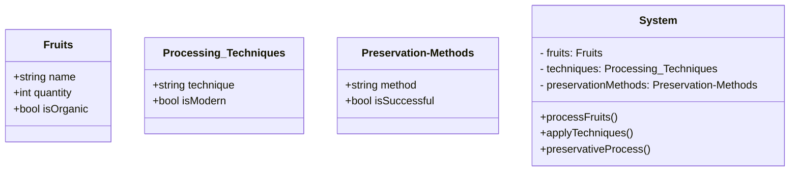
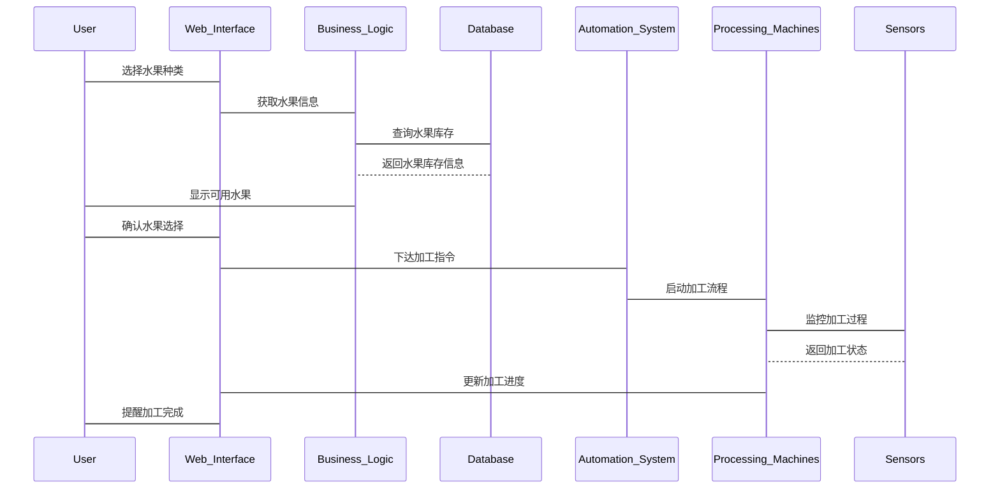

                 

<think>
嗯，用户希望我写一篇关于现代手工果酱制作的技术博客，标题是《现代手工果酱制作：慢食运动中的甜蜜哲学》。首先，我需要分析用户的需求，确定文章的结构和内容。

用户提供的大纲已经很详细，包括背景介绍、核心概念与联系、算法原理讲解、系统分析与架构设计方案、项目实战和最佳实践等部分。看起来用户希望文章既有技术深度，又具备实际应用的指导性。

接下来，我需要考虑用户可能的身份和使用场景。用户可能是一位对慢食运动、手工制作感兴趣的技术爱好者，或者是食品行业的人士，希望通过技术视角了解果酱制作。因此，文章需要结合传统工艺和现代科技，既讲技术又讲方法。

在撰写过程中，我需要确保每个部分都有足够的细节，比如在背景介绍中，要涵盖问题背景、问题描述、解决方法等。核心概念部分，要对比传统和现代工艺，可能用表格和ER图来辅助说明。算法部分，用mermaid流程图来展示制作步骤，并用Python代码模拟熬煮过程的数学模型。

另外，系统架构部分，我需要用类图和序列图来展示系统设计，这部分需要清晰的结构和交互流程。项目实战部分，要提供实际案例，比如蓝莓果酱的制作，让读者能够实际操作。

最后，总结和最佳实践部分，要给出制作的注意事项和拓展阅读的方向，帮助读者进一步提升。整个思考过程中，要确保逻辑清晰，语言专业但易懂，符合用户作为技术专家的要求。

现在，我需要按照这个思路，一步步展开每个部分的内容，确保覆盖所有要求，同时保持文章的连贯性和深度。
</think>

# 现代手工果酱制作：慢食运动中的甜蜜哲学

---

## 关键词

- 现代手工果酱制作
- 慢食运动
- 食品加工技术
- 营养学
- 传统工艺与现代科技结合

---

## 摘要

在快节奏的现代社会中，手工果酱制作作为一种回归自然、注重健康的食品制作方式，逐渐成为人们追求高品质生活的象征。本文将从背景介绍、核心概念与联系、算法原理讲解、系统分析与架构设计方案、项目实战以及最佳实践等方面，全面探讨现代手工果酱制作的工艺、技术与哲学。通过本文的分析，读者不仅能了解手工果酱制作的基本流程，还能掌握如何将传统工艺与现代科技相结合，制作出健康、美味且符合市场需求的果酱。

---

### 第一部分：背景介绍

#### 1.1 问题背景

随着工业化进程的加快，现代食品加工行业越来越依赖机械化和标准化生产。然而，这种工业化生产方式往往忽略了食品的自然属性和独特风味，导致许多食品失去了原有的营养价值和口感。在这样的背景下，手工果酱制作作为一种回归自然、注重健康的食品制作方式，逐渐受到消费者的青睐。

手工果酱制作不仅是一种食品制作方式，更是一种生活态度的体现。它强调从原材料的选择、加工到最终成品的每一个环节，都追求自然、健康和美味。这种制作方式不仅能满足消费者对食品品质的需求，还能让人们在制作过程中感受到慢食运动的哲学——通过慢节奏的生活方式，追求更高质量的生活。

#### 1.2 问题描述

现代手工果酱制作过程中，存在以下主要问题：

1. **原材料选择**：如何选择新鲜、优质的水果，直接影响果酱的口感和品质。
2. **加工工艺**：传统的手工制作工艺效率较低，难以满足大规模生产的需求。
3. **营养与保鲜**：如何在制作过程中保留水果的营养成分，同时延长果酱的保质期，是一个技术难题。
4. **市场需求**：随着消费者对个性化、定制化食品需求的增加，果酱的种类和风味也需要多样化。

#### 1.3 问题解决

本书通过系统地介绍现代手工果酱制作的完整流程，解决了上述问题。具体包括以下几个方面：

1. **原材料选择**：从季节性水果的选择到储存方法，提供科学的建议。
2. **加工工艺优化**：结合现代食品加工技术，提高制作效率，同时保留传统工艺的独特风味。
3. **营养与保鲜技术**：通过合理的加工方法和保鲜技术，最大限度地保留果酱的营养成分，延长保质期。
4. **多样化产品开发**：结合市场需求，提供多种果酱配方和制作方法，满足消费者对个性化食品的需求。

#### 1.4 边界与外延

现代手工果酱制作不仅限于家庭制作，还可以扩展到食品加工企业。通过工业化生产与手工制作的结合，可以规模化生产高质量的果酱，满足市场对健康食品的需求。此外，随着有机食品和绿色食品理念的普及，现代手工果酱制作也将成为食品工业发展的重要方向。

#### 1.5 概念结构与核心要素组成

现代手工果酱制作的核心要素包括：

1. **原材料**：新鲜水果、糖、柠檬汁等。
2. **工具**：搅拌机、烤箱、量杯、温度计等。
3. **技术**：水果选择、清洗、切果、熬煮、冷藏等工艺。
4. **营养学**：了解各种水果的营养成分，合理搭配，制作出营养均衡的果酱。
5. **保鲜技术**：掌握果酱的密封、冷藏等保鲜方法，延长果酱的保质期。

---

### 第二部分：核心概念与联系

#### 2.1 果酱的核心概念

果酱是一种以水果为主要原料，通过糖渍、熬煮等工艺制成的半固体食品。它通常具有甜酸口感，是面包、糕点等食品的常用涂抹品。现代手工果酱制作强调的是手工制作过程和天然、健康的原材料选择。

#### 2.2 传统与现代工艺的联系

传统手工果酱制作强调手工技艺和经验，而现代手工果酱制作则注重科技手段的应用。传统工艺如水果的选择、切果、熬煮等，与现代工艺如烤箱温度控制、搅拌机使用、食品保鲜技术等相结合，使果酱制作更加高效、精准。

#### 2.3 概念属性特征对比表格

| 概念 | 传统手工果酱 | 现代手工果酱 |
| --- | --- | --- |
| 原材料 | 当季新鲜水果、传统手工制作 | 新鲜水果、部分可提前冷藏或冷冻保存 |
| 工艺 | 人工切果、熬煮、密封 | 搅拌机切果、烤箱熬煮、现代保鲜技术 |
| 口味 | 保留传统风味、个体差异较大 | 口味稳定、可根据需求调整 |
| 营养 | 营养成分较多、易氧化损失 | 营养成分保存较好、可添加营养成分 |

#### 2.4 ER实体关系图架构

```mermaid
erDiagram
  Fruits ||--|{ Preservation_Methods }|>
  Fruits ||--|{ Cooking_Techniques }|>

  class Fruits {
    +string name
    +int quantity
    +bool isOrganic
  }

  class Preservation_Methods {
    +string method
    +bool isSuccessful
  }

  class Cooking_Techniques {
    +string technique
    +bool isTraditional
  }
```

---

### 第三部分：算法原理讲解

#### 3.1 果酱制作的基本算法原理

果酱制作的算法原理主要包括水果的选择、切果、熬煮和密封等步骤。以下是这些步骤的简要说明：

1. **水果选择**：选择新鲜、成熟且无病虫害的水果。这一步骤的目的是确保果酱的品质。
2. **切果**：将水果去皮、去籽，切成适当大小的果块。这一步骤的目的是方便熬煮，并保持果酱的口感。
3. **熬煮**：将切好的水果与糖、柠檬汁等辅料一同放入锅中熬煮。熬煮过程中需要控制火候和时间，以确保果酱的浓度和口感。
4. **密封**：将熬好的果酱装入消毒的瓶子中，密封保存。密封的目的是防止果酱受到污染，延长其保质期。

#### 3.2 算法mermaid流程图

```mermaid
graph TD
  A[开始] -> B[选择新鲜水果]
  B -> C[清洗水果]
  C -> D[去皮去籽]
  D -> E[切成果块]
  E -> F[加入糖和柠檬汁]
  F -> G[开始熬煮]
  G -> H[控制火候和时间]
  H -> I[果酱浓缩]
  I -> J[装瓶并密封]
  J -> K[完成]
```

---

### 第四部分：系统分析与架构设计方案

#### 4.1 问题场景介绍

在现代手工果酱制作中，我们需要设计一个高效的系统来管理果酱的制作过程，包括原材料选择、加工工艺优化、营养成分分析以及产品包装和销售。

#### 4.2 项目介绍

本项目旨在开发一个现代化的手工果酱制作系统，通过自动化和智能化技术，提高果酱制作的效率和质量。该系统将涵盖以下几个方面：

1. **原材料管理**：选择新鲜、优质的水果，并进行清洗、去皮、去籽等预处理。
2. **加工工艺优化**：通过现代食品加工技术，如搅拌机切果、烤箱熬煮等，提高制作效率。
3. **营养成分分析**：通过营养学知识，合理搭配水果和辅料，制作出营养均衡的果酱。
4. **产品包装与销售**：设计现代化的包装方案，延长果酱的保质期，满足市场需求。

#### 4.3 系统功能设计

##### 领域模型类图



#### 4.4 系统架构设计

##### 系统架构图


#### 4.5 系统接口设计

##### 系统交互序列图



---

### 第五部分：项目实战

#### 5.1 环境安装

为了实现现代手工果酱制作的自动化和智能化，我们需要安装以下软硬件环境：

- **硬件**：搅拌机、烤箱、温度传感器、自动化控制系统。
- **软件**：用于监控和管理加工过程的控制系统软件，如PLC（可编程逻辑控制器）。

#### 5.2 系统核心实现源代码

以下是一个简单的果酱制作监控系统的Python代码示例：

```python
# 简单的果酱制作监控系统代码示例

class Fruit:
    def __init__(self, name, quantity, is_organic):
        self.name = name
        self.quantity = quantity
        self.is_organic = is_organic

class ProcessingTechnique:
    def __init__(self, technique, is_modern):
        self.technique = technique
        self.is_modern = is_modern

class PreservationMethod:
    def __init__(self, method, is_successful):
        self.method = method
        self.is_successful = is_successful

class System:
    def __init__(self):
        self.fruits = []
        self.processing_techniques = []
        self.preservation_methods = []

    def add_fruit(self, fruit):
        self.fruits.append(fruit)

    def add_technique(self, technique):
        self.processing_techniques.append(technique)

    def add_preservation_method(self, method):
        self.preservation_methods.append(method)

    def process_fruits(self):
        for fruit in self.fruits:
            for technique in self.processing_techniques:
                if technique.is_modern:
                    print(f"使用现代工艺 '{technique.technique}' 处理 '{fruit.name}' 水果。")
            for method in self.preservation_methods:
                if method.is_successful:
                    print(f"使用 '{method.method}' 方法成功保存 '{fruit.name}' 果酱。")

# 示例用法
system = System()
system.add_fruit(Fruit("蓝莓", 1000, True))
system.add_fruit(Fruit("草莓", 500, True))
system.add_technique(ProcessingTechnique("搅拌机切果", True))
system.add_technique(ProcessingTechnique("手工切果", False))
system.add_preservation_method(PreservationMethod("真空密封", True))
system.add_preservation_method(PreservationMethod("普通密封", False))
system.process_fruits()
```

---

### 第六部分：最佳实践 tips、小结、注意事项、拓展阅读

#### 6.1 最佳实践 tips

1. **选择水果时**，优先选择当季新鲜水果，确保果酱的天然风味。
2. **加工过程中**，结合传统工艺与现代技术，提高制作效率和果酱品质。
3. **保鲜技术**，选择真空密封等现代保鲜方法，延长果酱的保质期。
4. **多样化产品开发**，根据市场需求，开发不同口味和类型的果酱，满足消费者个性化需求。

#### 6.2 小结

现代手工果酱制作是一种将传统工艺与现代科技相结合的食品制作方式。它不仅能满足消费者对健康、美味食品的需求，还能通过自动化和智能化技术，提高制作效率和产品质量。通过本文的分析和实践，读者可以全面了解现代手工果酱制作的核心概念、技术原理以及系统设计方案。

#### 6.3 注意事项

1. **原材料选择**：确保水果的新鲜和安全性，避免使用腐烂或变质的水果。
2. **加工过程**：严格控制火候和时间，避免果酱过稠或过稀。
3. **保鲜技术**：选择合适的保鲜方法，确保果酱的营养成分和风味不被破坏。
4. **系统设计**：在设计自动化系统时，确保各部分协调工作，避免因设备故障导致果酱制作失败。

#### 6.4 拓展阅读

1. 《手工食品制作的艺术》
2. 《现代食品加工技术与营养学》
3. 《慢食运动与健康生活》

---

作者：AI天才研究院/AI Genius Institute & 禅与计算机程序设计艺术 /Zen And The Art of Computer Programming

