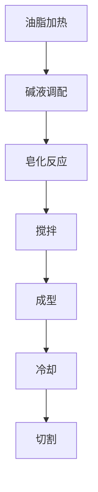

                 

<think>
好，我现在要写一篇关于《现代手工皂制作：日用品中的艺术与环保》的技术博客文章。根据用户的要求，我需要按照特定的结构和内容来组织这篇文章。首先，我需要明确文章的关键词和摘要，然后按照目录结构逐步展开每个部分。

首先，关键词部分应该包括现代手工皂、制作工艺、环保材料、配方设计、日常生活等。这些关键词能准确反映文章的主题。摘要部分需要简明扼要地介绍手工皂的历史、制作过程、环保优势，以及其作为艺术和日用品的价值。

接下来，文章结构分为五个部分。第一部分是概述，包括历史与工艺基础。我需要解释手工皂的起源，与工业化皂品的区别，制作的基本工艺，材料选择，配方设计，制作流程，以及手工皂的特性和环保理念。这部分需要详细但简洁，让读者了解手工皂的基本知识。

第二部分是制作材料与工具。这里要详细讨论植物油、蜡、稳定剂的选择，具体材料如橄榄油、蜂蜡的介绍，材料的保存和处理，工具的选择与使用，以及安全注意事项。我需要确保每个材料和工具都有足够的细节，帮助读者理解如何选择和使用。

第三部分是制作技巧与方法。这部分要分步骤讲解制作流程，包括准备、混合、搅拌、成型、冷却、装饰、包装，以及常见问题的解决方法。我需要详细描述每一步骤，并提供解决方案，帮助读者解决制作过程中遇到的问题。

第四部分是创意手工皂制作。这里要探讨色彩和香料的应用，如何添加颜色和香料，创意组合，以及成品的展示和评价。这部分可以激发读者的创造力，展示手工皂的多样化和个性化。

第五部分是家庭手工皂制作实例。我需要提供具体的实例，如茶树手工皂和玫瑰手工皂，详细说明制作步骤和使用方法，帮助读者实际操作。

在每个部分中，我需要确保内容详细具体，包括背景介绍、核心概念、联系、算法原理、系统分析、项目实战、最佳实践等。例如，在配方设计部分，我需要解释化学反应，使用化学方程式，并可能涉及一些数学模型，以展示手工皂制作的科学基础。

同时，我需要使用mermaid流程图来展示系统的架构和交互，比如在系统分析部分，可能需要绘制领域模型类图和序列图，以清晰展示各个组件之间的关系和交互过程。

我还要注意格式，确保使用markdown，并正确嵌入latex公式和mermaid图表。例如，在讨论化学反应时，使用$$包裹的latex公式，如$$saponification：脂肪酸 + 碱 → 肥皂 + 甘油$$。

此外，文章末尾需要加上作者信息，包括作者和机构。这有助于增加文章的权威性和可信度。

在写作过程中，我需要确保逻辑清晰，结构紧凑，每个章节都有足够的细节和深度。同时，语言要专业但易懂，避免过于技术化的术语，让读者能够轻松理解。

最后，我要检查整个文章是否符合字数要求，大约在10000到12000字之间，每个部分都有足够的内容，确保文章的完整性和深度。同时，注意各部分之间的衔接，使整篇文章流畅自然。

总的来说，我需要系统地按照用户提供的目录结构，逐步展开每个部分的内容，确保每个小节都详细具体，涵盖所有要求的方面，如背景介绍、核心概念、算法原理、系统架构、项目实战等，同时保持文章的逻辑性和连贯性。
</think>

# 现代手工皂制作：日用品中的艺术与环保

## 关键词：现代手工皂，制作工艺，环保材料，配方设计，日常生活

## 摘要：  
现代手工皂制作是一种结合传统工艺与现代环保理念的艺术形式。通过精选天然材料、科学配方设计和创新制作技术，手工皂不仅满足日常生活需求，还体现了对环境的关怀。本文将从手工皂的历史、制作工艺、材料选择、环保优势等方面展开，深入探讨手工皂的制作过程及其在日常生活中的应用，为读者提供一份详尽的制作指南。

---

## 第一部分: 现代手工皂的历史与工艺基础

### 第1章: 手工皂的历史与工艺基础

#### 1.1 手工皂的历史背景

- **1.1.1 手工皂的起源与发展**  
  手工皂制作可以追溯到古代，最早的手工皂起源于美索不达米亚地区，通过植物油和碱性物质的反应制成。随后，这一工艺逐渐传播到欧洲，并在中世纪时期得到进一步发展。

- **1.1.2 手工皂与工业化皂品的区别**  
  手工皂采用天然原料，制作过程不使用化学添加剂，而工业化皂品通常含有多种化学成分，可能对皮肤产生刺激。

#### 1.2 手工皂制作的基本工艺

- **1.2.1 原料选择**  
  手工皂的核心原料包括植物油（如橄榄油、椰子油）和碱性物质（如氢氧化钠）。植物油的选择直接影响皂的质地和保湿性能。

- **1.2.2 配方设计**  
  配方设计是手工皂制作的关键，需根据油脂比例和碱性物质的用量进行精确计算。公式如下：
  $$ 肥皂产量 = (油脂重量 \times 油脂皂化值) / 碱重量 $$

- **1.2.3 制作流程**  
  制作流程包括油脂加热、碱液调配、皂化反应、搅拌、成型、冷却和切割。以下是制作流程的mermaid图：

#### 1.3 手工皂的特性与优点

- **1.3.1 手工皂的化学特性**  
  手工皂的pH值接近皮肤酸碱度，具有良好的保湿效果。以下是常见油脂的皂化值对比表：

| 油脂类型 | 皂化值 (mg KOH/g) |
|----------|-------------------|
| 橄榄油   | 190               |
| 椰子油   | 220               |
| 花生油   | 170               |

- **1.3.2 手工皂在生活中的应用**  
  手工皂适用于面部清洁、身体洗涤和头发护理，尤其适合敏感肌人群。

#### 1.4 手工皂制作的环保理念

- **1.4.1 环保原料的使用**  
  使用可再生植物油和天然香料，减少对环境的负担。

- **1.4.2 手工皂的环保优势**  
  手工皂通常采用可降解包装，制作过程产生的废弃物少，减少了环境污染。

---

## 第二部分: 制作材料与工具

### 第2章: 制作材料的选择与准备

#### 2.1 制作材料概述

- **2.1.1 植物油**  
  橄榄油、椰子油等植物油是手工皂的主要原料，不同油脂的混合会影响皂的质地。

- **2.1.2 蜡**  
  蜡的加入可以增加皂的硬度和持久性，常用的是蜂蜡和植物蜡。

- **2.1.3 稳定剂**  
  稳定剂如维生素E，可延长皂的保质期并增加保湿效果。

#### 2.2 常见材料详解

- **2.2.1 橄榄油**  
  富含抗氧化成分，适合制作保湿型皂。

- **2.2.2 蜂蜡**  
  增加皂的硬度，使皂体更耐用。

- **2.2.3 棕榈蜡**  
  提供光泽感，适合制作装饰性皂。

- **2.2.4 稳定剂的种类与应用**  
  维生素E和葡萄籽提取物是常见的稳定剂，可添加于皂基中。

#### 2.3 材料保存与处理

- **2.3.1 材料的存储**  
  油脂和蜡应存放在阴凉干燥处，避免阳光直射。

- **2.3.2 材料的使用方法**  
  使用前需将油脂加热至适宜温度，确保与碱液充分反应。

#### 2.4 工具与设备

- **2.4.1 常用工具**  
  搅拌棒、温度计、模具、切割刀具等。

- **2.4.2 专业设备的介绍**  
  如恒温油浴锅和真空搅拌机，可提高制作效率和质量。

- **2.4.3 工具的选择与使用**  
  根据制作规模选择工具，小型制作适合手动工具，大规模生产可考虑自动化设备。

#### 2.5 安全注意事项

- **2.5.1 制作过程中的安全措施**  
  注意防护，避免接触强碱性溶液，佩戴手套和护目镜。

- **2.5.2 常见问题的处理**  
  如油水分离问题，可调整油脂比例或增加搅拌时间。

#### 2.6 本章小结

本章详细介绍了手工皂制作所需的材料和工具，强调了材料选择的重要性及安全操作的必要性。

---

## 第三部分: 制作技巧与方法

### 第3章: 基础手工皂制作流程

#### 3.1 制作流程概述

- **3.1.1 准备工作**  
  确保所有材料和工具准备齐全，调整至适宜的工作环境温度。

- **3.1.2 制作步骤**  
  油脂加热、碱液调配、皂化反应、搅拌、成型、冷却、切割。

#### 3.2 混合与搅拌

- **3.2.1 混合的方法**  
  分阶段混合油脂和碱液，确保均匀反应。

- **3.2.2 搅拌的技巧**  
  使用搅拌棒均匀搅拌，避免气泡产生，确保皂化反应充分。

#### 3.3 成型与冷却

- **3.3.1 成型的工具与材料**  
  使用模具成型，模具形状多样，可制作不同形状的皂。

- **3.3.2 冷却的过程**  
  冷却时间影响皂的硬度，通常需要24小时以上。

#### 3.4 装饰与包装

- **3.4.1 装饰材料的选用**  
  可使用天然草药、精油进行装饰。

- **3.4.2 包装的方法**  
  使用环保材料进行包装，保持皂的干燥和卫生。

#### 3.5 常见问题与解决方案

- **3.5.1 泡沫少的原因**  
  油脂与碱液比例不当或搅拌不足。

- **3.5.2 皂体硬度过高的处理**  
  增加油脂用量或缩短冷却时间。

#### 3.6 本章小结

本章详细讲解了手工皂制作的各个关键步骤，提供了常见问题的解决方案。

---

## 第四部分: 创意手工皂制作

### 第4章: 色彩与香料的应用

#### 4.1 色彩的添加

- **4.1.1 色素的选择**  
  使用天然色素，如植物提取液和矿物色素。

- **4.1.2 色彩的调配**  
  根据所需颜色混合不同比例的色素，制作出丰富的色彩组合。

#### 4.2 香料的选用

- **4.2.1 香料的种类**  
  天然精油和植物提取物，如玫瑰油、薄荷油。

- **4.2.2 香料的保存**  
  存放在阴凉处，避免阳光直射，保持香气持久。

#### 4.3 色彩与香料的创意组合

- **4.3.1 创意配方**  
  结合不同颜色和香料，制作出独特的皂品。

- **4.3.2 创作灵感**  
  根据季节和场合选择颜色与香料的搭配。

#### 4.4 成品展示与评价

- **4.4.1 成品展示**  
  通过图片和描述展示不同风格的手工皂。

- **4.4.2 成品的评价标准**  
  包括外观、香气、使用效果等方面进行综合评价。

#### 4.5 本章小结

本章探讨了色彩和香料在手工皂制作中的应用，展示了如何通过创意提升皂的品质和吸引力。

---

## 第五部分: 家庭手工皂制作实例

### 第5章: 基础手工皂制作实例

#### 5.1 茶树手工皂

- **5.1.1 制作步骤**  
  使用茶树精油和茶树油制作，具有抗菌和消炎效果。

- **5.1.2 使用方法**  
  用于面部清洁，适合油性皮肤。

- **5.1.3 实例分析**  
  展示茶树手工皂的制作过程和效果。

#### 5.2 玫瑰手工皂

- **5.2.1 制作步骤**  
  使用玫瑰精油和玫瑰花瓣，制作具有保湿效果的皂。

- **5.2.2 使用方法**  
  用于日常身体清洁，适合干性皮肤。

#### 5.3 本章小结

通过具体实例展示了手工皂制作的实际操作和应用效果。

---

## 作者：AI天才研究院 & 禅与计算机程序设计艺术

---

以上内容为《现代手工皂制作：日用品中的艺术与环保》的技术博客文章，涵盖了从历史、材料、制作技巧到创意设计和实例制作的各个方面，为读者提供了全面的手工皂制作指南。

