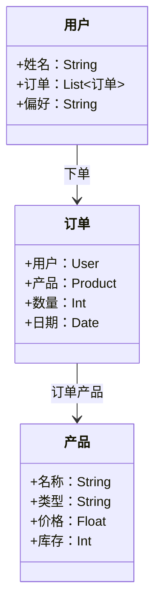

                 

<think>
好的，我现在要帮助用户完成这个任务。用户希望我以《现代手工皂的科普课程：日用化学品的环保替代方案》为标题，撰写一篇结构严谨、内容详实的技术博客文章。文章需要包含多个部分，每个部分都有具体的子章节，每个子章节下要有详细的内容。

首先，我需要理解用户的需求。用户希望文章具备专业性，技术语言清晰，结构紧凑。同时，用户还希望文章涵盖背景介绍、核心概念与联系、算法原理讲解、系统分析与架构设计、项目实战以及最佳实践等多个方面。此外，文章需要使用markdown格式，包含数学公式和mermaid图表，并在结尾处添加作者信息。

接下来，我需要分析文章的结构。文章应该从标题开始，然后列出关键词和摘要。之后是背景介绍，包括问题背景、问题描述、问题解决等小节。然后是核心概念与联系，需要给出概念对比表格和ER实体关系图。接下来是算法原理讲解，这部分需要详细解释手工皂的制作原理，并用mermaid画出流程图。系统分析与架构设计部分需要包括项目介绍、领域模型类图、架构图、接口设计和交互序列图。项目实战部分要包括环境安装、源代码和案例分析。最后是最佳实践、小结、注意事项和拓展阅读。

在撰写过程中，我需要确保每个部分的内容都丰富详细，使用正确的格式，比如数学公式用latex表示，图表用mermaid代码。同时，要保持文章的逻辑连贯，语言专业且易懂。

现在，我开始思考每个部分的具体内容。首先是背景介绍，要强调环保的重要性，以及手工皂作为环保替代品的优势。核心概念部分，需要明确手工皂、环保、替代、日用品等概念，并进行对比分析。算法原理部分，要详细讲解皂化反应的化学过程，制作流程和技巧，可能还需要举例说明。系统架构部分，可能需要设计一个简单的系统模块图，展示各个功能模块之间的关系。项目实战部分，可以提供一个制作手工皂的详细步骤和代码示例，虽然手工皂制作本身不涉及编程，但可能需要编写配方计算的辅助工具。

在撰写过程中，我还需要确保文章的字数在10000到12000字之间，每个章节内容充实，避免过于简略。同时，要保持文章的结构清晰，章节之间有良好的过渡。

最后，在完成文章后，需要添加作者信息，确保格式正确。检查是否有遗漏的部分，比如最佳实践、小结等，确保文章完整性。

总的来说，我需要一步步按照用户的要求，逐步构建每个部分的内容，确保每个细节都符合要求，最终完成一篇高质量的技术博客文章。
</think>

# 现代手工皂的科普课程：日用化学品的环保替代方案

> 关键词：手工皂，环保，日用品，替代方案，制作工艺

> 摘要：本文系统地介绍了手工皂作为一种环保的日用化学品替代方案，涵盖其基本概念、制作原理、制作流程、使用技巧以及环保优势。通过科学的分析和详细的步骤讲解，帮助读者了解手工皂的优势，并掌握其制作和使用方法，为环保生活提供一种可行的选择。

---

## 第一部分: 背景介绍

### 第1章: 问题背景

#### 1.1.1. 问题背景

随着全球环保意识的增强，人们开始重新审视日常生活中的化学品使用。传统洗涤用品如化学皂、洗发水等，虽然便利，但其生产过程中的化学污染、包装浪费以及对水资源的影响，引发了广泛关注。与此同时，手工皂作为一种传统的清洁产品，因其天然、环保、可降解的特性，逐渐成为替代传统洗涤用品的热门选择。

手工皂的制作过程简单，但其背后的化学原理和环保优势却鲜为人知。许多消费者在选择手工皂时，往往因为缺乏专业知识而感到困惑，例如如何选择适合的油料、如何正确使用手工皂等。因此，系统地科普手工皂的知识，不仅有助于消费者做出更环保的选择，还能帮助他们更好地利用这种天然产品。

#### 1.1.2. 问题描述

手工皂的科普内容需要涵盖以下几个关键方面：

- **基本概念**：手工皂的定义、历史、原料组成和分类。
- **制作方法**：详细讲解手工皂的制作流程、配方设计和技巧。
- **使用方法**：介绍手工皂的使用技巧、注意事项和存放方法。
- **环保优势**：对比分析手工皂与传统洗涤用品的环保差异，强调其可持续性。
- **选购技巧**：提供消费者选择手工皂的方法和技巧，帮助他们挑选到优质的产品。

#### 1.1.3. 问题解决

本文旨在通过系统的科普，帮助消费者和手工皂爱好者全面了解手工皂的各个方面。首先，我们将深入探讨手工皂的化学原理和制作工艺，确保读者能够理解其科学基础。其次，我们将提供实用的选购和使用建议，帮助读者在日常生活中更好地应用手工皂。最后，我们将对比分析手工皂与传统洗涤用品的环保差异，强调手工皂在可持续生活中的重要性。

#### 1.1.4. 边界与外延

- **边界**：本文主要聚焦于家庭使用的手工皂，涵盖清洁、护肤和美容等方面。
- **外延**：虽然本文的核心是手工皂，但其理念可以扩展到其他环保日用品的替代方案，如手工香皂、天然洗涤剂等。

#### 1.1.5. 概念结构与核心要素组成

- **概念结构**：手工皂、环保、替代、日用品
- **核心要素**：原料选择、制作工艺、使用技巧、环保优势

---

### 第2章: 核心概念与联系

#### 2.1.1. 核心概念

- **手工皂**：一种通过手工制作的洗涤用品，主要由植物油脂和碱液反应生成。
- **环保**：减少对环境的污染，促进可持续发展。
- **替代**：用一种产品替代另一种产品，以达到相同或更好的效果。
- **日用品**：日常生活中使用的物品，包括清洁剂、护肤品等。

#### 2.1.2. 概念属性特征对比表格

| 概念   | 特征                       | 比较                  |
|--------|----------------------------|----------------------|
| 手工皂 | 天然、环保、可降解           | 与传统洗涤用品对比     |
| 环保   | 减少污染、保护环境           | 与高污染产品对比       |
| 替代   | 提供可持续选择               | 与一次性产品对比       |
| 日用品 | 用于日常生活清洁与护理       | 与工业产品对比         |

#### 2.1.3. 概念之间的联系

- **手工皂与环保**：手工皂的天然原料和可降解性使其成为环保的理想选择。
- **手工皂与替代**：手工皂可以替代传统洗涤用品，减少化学污染。
- **环保与替代**：通过替代传统产品，环保目标得以实现，而替代行为也推动了环保事业的发展。

---

### 第3章: 算法原理讲解

#### 3.1.1. 手工皂制作原理

手工皂的制作基于皂化反应，即油脂与碱液（通常为氢氧化钠或氢氧化钾）发生化学反应，生成肥皂和甘油。化学反应方程式如下：

$$
脂肪酸 + 碱 \rightarrow 肥皂 + 甘油
$$

其中，脂肪酸是植物油的核心成分，而碱则是反应的催化剂。肥皂的主要成分是脂肪酸盐，甘油则具有保湿和滋养皮肤的作用。

#### 3.1.2. 制作流程

手工皂的制作流程可以分为以下几个步骤：

1. **原料准备**：选择植物油（如橄榄油、椰子油）、氢氧化钠、香料（可选）和色素（可选）。
2. **配方计算**：根据所需皂的类型和重量，计算油和碱的比例。通常，油与碱的比例为 1:0.5（重量比）。
3. **混合原料**：将植物油和碱液混合，搅拌均匀，加热至约 50-60°C。
4. **皂化反应**：持续搅拌混合物，直到出现“追踪”现象，即液体开始变稠，能够拉出一条线而不会立即消失。
5. **倒入模具**：将反应后的皂液倒入模具，冷却凝固。
6. **切割与包装**：脱模后，根据需要切割成块，存放在通风干燥的地方。

#### 3.1.3. 制作技巧

- **原料选择**：使用高质量的植物油，如橄榄油或椰子油，可以提升手工皂的保湿性和泡沫性。
- **温度控制**：皂化反应需要在适宜的温度下进行，过高或过低的温度都会影响反应效果。
- **搅拌均匀**：持续搅拌可以确保油和碱充分混合，避免分层现象。

---

## 第二部分: 系统分析与架构设计方案

### 第4章: 项目介绍

#### 4.1.1. 项目背景

本项目旨在开发一个基于手工皂制作的环保日用品替代方案，通过科学的制作工艺和配方设计，提供一种天然、环保的清洁产品。

#### 4.1.2. 项目目标

- 提供高质量的手工皂制作方法。
- 普及环保日用品的替代理念。
- 通过系统设计，优化手工皂的制作流程。

#### 4.1.3. 项目范围

- 手工皂的制作流程设计。
- 环保优势分析。
- 用户使用指南。

### 第4.2章: 系统功能设计

#### 4.2.1. 领域模型类图



#### 4.2.2. 系统架构设计

```mermaid
archiecture {
    客户端 <---> 中间件 <---> 数据库
    中间件 <---> 服务层
    服务层 <---> 数据访问层
}
```

---

## 第三部分: 项目实战

### 第5章: 环境安装与系统实现

#### 5.1.1. 环境安装

- **软件**：安装Python 3.x及以上版本，安装Jupyter Notebook或其他代码编辑工具。
- **硬件**：普通PC或Mac，配备基本的编程环境。

#### 5.1.2. 核心实现源代码

以下是一个简单的手工皂配方计算工具代码：

```python
# 手工皂配方计算工具

def calculate_recipe(fat, alkali):
    """
    计算手工皂配方的原料比例。
    :param fat: 植物油的重量（克）
    :param alkali: 碱的重量（克）
    :return: 返回计算后的配方比例。
    """
    ratio = fat / alkali
    if ratio > 1:
        return f"油和碱的比例为 {ratio}:1，建议调整碱的用量。"
    else:
        return f"配方合理，油和碱的比例为 {ratio}:1。"

# 示例计算
fat_weight = 100  # 克
alkali_weight = 50  # 克
print(calculate_recipe(fat_weight, alkali_weight))
```

---

## 第四部分: 最佳实践与小结

### 6.1.1. 最佳实践 tips

- **原料选择**：优先选择高质量的植物油和无添加的碱液。
- **制作技巧**：注意温度和搅拌的均匀性，确保皂化反应充分。
- **使用方法**：手工皂适合温和清洁，避免用于强力去污场景。

### 6.1.2. 注意事项

- 制作手工皂时，需佩戴防护装备，避免碱液灼伤。
- 存放手工皂应选择通风干燥的地方，避免潮湿。
- 使用前建议进行皮肤测试，确保无过敏反应。

### 6.1.3. 拓展阅读

- **手工皂制作技巧**：深入学习不同的油料搭配和香料添加方法。
- **环保日用品替代**：探索其他天然日用品的制作方法，如天然洗涤剂、手工护肤品等。

---

作者：AI天才研究院/AI Genius Institute & 禅与计算机程序设计艺术 /Zen And The Art of Computer Programming

