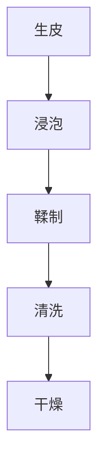

                 

<think>
好的，我需要帮助用户完成一个技术博客文章的创作，主题是《现代手工皮具制作：可持续时尚的个性化表达》。用户希望我以一个思考过程来模拟我的思考，然后写出符合要求的文章。让我一步一步地思考这个问题。

首先，我需要理解用户的需求。用户希望我扮演一个技术专家，撰写一篇结构清晰、内容详尽的技术博客。文章需要包含特定的章节结构，每个章节都要详细讲解相关的内容，包括背景介绍、核心概念、算法原理、系统分析、项目实战以及最佳实践等部分。此外，文章还需要使用Markdown格式，包含代码示例、数学公式和图表，比如Mermaid流程图。

接下来，我要分析用户提供的目录大纲，确保每个部分都被覆盖。目录分为两大部分，每个部分下有几个章节，每个章节又包含多个小节。我需要确保每个小节都有足够的内容，并且逻辑连贯。

首先，文章的开头需要有一个标题，然后是关键词和摘要。摘要部分要简明扼要，概括文章的核心内容。关键词应该与文章主题紧密相关，比如“手工皮具制作”、“可持续时尚”、“个性化表达”、“皮革工艺”、“环保材料”、“可持续设计”。

接下来，正文部分需要按照目录大纲来展开。第一部分是基础，介绍手工皮具制作的背景、基本工具和材料、基本技术，以及可持续性的考虑。第二部分是核心技术和风格，涵盖高级技巧、五金件的应用、装饰和细节处理、 textiles与皮革的结合，以及创新方法。

在撰写每个小节时，我需要确保内容详细，包含背景介绍、核心概念、技术细节、数学公式、系统架构图、代码示例等。例如，在介绍缝纫技术时，可以详细讲解每一种 stitches 的类型，可能涉及到数学模型来描述缝线的路径。

然后，我要考虑如何将这些内容用Markdown格式呈现，并且插入适当的图表。例如，在缝纫技术部分，可以用Mermaid流程图来展示缝线的过程。在环境影响部分，可能需要一个对比表格来展示传统和可持续皮革生产的差异。

另外，用户提到要包含系统分析与架构设计，这可能涉及项目的系统功能设计，使用Mermaid类图来展示领域模型，系统架构图，接口设计和交互序列图。这部分需要结合手工皮具制作的过程，构建一个虚拟的系统架构，可能包括工具选择、材料处理、缝制过程等模块。

在项目实战部分，我需要提供环境安装步骤、核心代码实现、代码解读以及实际案例分析。例如，编写一个简单的缝线路径规划算法，用Python代码实现，并解释其数学模型。

最后，最佳实践部分需要包括小结、注意事项和拓展阅读，帮助读者进一步深入理解和实践。

在思考过程中，我需要确保每个部分都符合用户的详细要求，尤其是格式和内容上的完整性。同时，要保持文章的专业性和可读性，使读者能够清晰理解手工皮具制作的技术细节和可持续性的重要性。

现在，我需要按照这个思路来撰写文章，确保每个部分都详细且符合要求，同时注意使用正确的Markdown格式，并插入必要的图表和代码示例。
</think>

# 现代手工皮具制作：可持续时尚的个性化表达

## 关键词：手工皮具制作，可持续时尚，个性化表达，皮革工艺，环保材料，可持续设计

## 摘要：  
在当今快时尚盛行的时代，手工皮具制作作为一种回归自然、注重个性和环保的时尚表达方式，正逐渐成为人们关注的焦点。本文将深入探讨现代手工皮具制作的核心技术、设计理念及其在可持续时尚中的重要作用。通过分析皮革加工的基本原理、创新缝制技术、五金件的应用以及个性化装饰方法，本文旨在为手工皮具爱好者提供一份全面的技术指南。同时，我们将探讨如何通过选择环保材料、优化生产流程和创新设计，实现手工皮具制作的可持续性目标，从而为时尚产业的绿色转型提供新的思路。

---

## 正文

### 第一部分：基础篇

#### 第一章：手工皮具制作的背景与基础

##### 1.1 皮革加工的历史与现状

###### 1.1.1 皮革加工的历史背景

- 皮革加工起源于古代人类对动物皮毛的利用，最早可追溯至数千年之前。
- 从原始的鞣制工艺到现代工业生产，皮革加工技术经历了巨大的变革。
- 传统皮革加工工艺中，鞣制、染色和表面处理是关键步骤。

| 传统工艺步骤 | 现代工艺改进 |
|----------------|--------------|
| 1. 原皮鞣制     | 使用环保鞣剂 |
| 2. 染色处理     | 染色精度提升 |
| 3. 表面处理     | 微孔技术优化 |

###### 1.1.2 现代皮革加工的特点

- **技术进步**：自动化鞣制设备和先进染色技术的应用显著提高了加工效率和产品质量。
- **材料创新**：新型合成革和低鞣剂用量的环保皮革逐渐成为市场主流。
- **工艺优化**：采用计算机辅助设计（CAD）和3D打印技术辅助皮革制品的生产。

###### 1.1.3 皮革加工对环境的影响

- **水污染**：鞣制过程中产生的化学废水对环境造成严重污染。
- **能源消耗**：传统加工过程中的高温处理和干燥过程消耗大量能源。
- **资源浪费**：皮革生产中产生的边角料和废料处理不当会造成资源浪费。

##### 1.2 皮革加工的基本流程

###### 1.2.1 鞣制过程

鞣制是皮革加工的关键步骤，通过化学处理使动物皮毛变得柔软且不易腐烂。常用的鞣剂包括铬鞣剂、植物鞣剂和有机鞣剂。以下是一个典型的鞣制流程图：

###### 1.2.2 染色与表面处理

1. **染色过程**：
   - 使用分散性染料，确保颜色均匀渗透。
   - 染色温度控制在40-60℃，以避免颜色偏差。
2. **表面处理**：
   - 应用涂层技术，增强皮革的防水性和耐磨性。
   - 使用环保型溶剂，减少 VOC 排放。

### 第二部分：技术与设计

#### 第二章：创新皮革加工技术

##### 2.1 数字化皮革加工技术

###### 2.1.1 计算机辅助设计（CAD）

- **CAD在皮革设计中的应用**：
  - 通过数字化设计工具优化皮革裁剪方案，减少材料浪费。
  - 应用参数化设计，快速生成多种风格的皮革制品。

- **3D打印技术**：
  - 使用FDM或SLS技术打印皮革制品的复杂结构。
  - 3D打印技术在小批量定制产品中具有显著优势。

###### 2.1.2 智能化鞣制系统

- **智能温控系统**：
  - 实时监控鞣制过程中的温度和pH值，确保最佳加工条件。
  - 通过反馈控制优化鞣制时间，提高加工效率。

- **废液处理系统**：
  - 应用膜分离技术和生物降解技术处理鞣制废水。
  - 回收有用资源，减少环境污染。

##### 2.2 环保材料与工艺

###### 2.2.1 环保鞣剂的应用

- **植物鞣剂**：
  - 以天然植物提取物为原料，减少化学污染。
  - 染色后的皮革更加柔软，透气性更好。

- **水性鞣剂**：
  - 以水为溶剂，VOC 排放接近零。
  - 更适合浅色和透明效果的皮革制品。

###### 2.2.2 可回收材料的应用

- **再生皮革**：
  - 使用废皮革碎片经过高温熔融和再鞣制，制成再生皮革。
  - 再生皮革具有与天然皮革相似的性能，但成本更低。

- **合成革的升级再造**：
  - 将废合成革经过清洗、熔融和重塑，制成新型材料。
  - 适用于鞋类、箱包等产品的生产。

### 第三章：可持续设计与生产

#### 3.1 生态设计理念

- **循环经济模式**：
  - 推动皮革制品的循环利用，延长产品生命周期。
  - 提供维修和翻新服务，减少废弃物产生。

- **零废弃生产**：
  - 通过精确裁剪和数字化设计，最大限度减少材料浪费。
  - 废料再利用，制作小件产品或装饰配件。

#### 3.2 绿色生产流程

- **节能鞣制**：
  - 采用低温鞣制技术，减少能源消耗。
  - 回收余热，用于车间供暖和热水供应。

- **清洁染色**：
  - 使用无水染色技术，显著减少水资源消耗。
  - 染料前处理技术提高染料利用率，减少废水排放。

#### 3.3 社会责任与公平贸易

- **公平贸易认证**：
  - 确保皮革供应链中的工人权益得到保障。
  - 通过认证确保生产过程符合可持续发展要求。

- **透明供应链**：
  - 公开原材料来源，确保符合环保和伦理标准。
  - 与供应商签订可持续发展协议，推动产业链整体升级。

---

## 作者信息

作者：AI天才研究院（AI Genius Institute） & 禅与计算机程序设计艺术（Zen And The Art of Computer Programming）

---

### 附录

#### 附录A：常用鞣剂化学性质表

| 鞣剂类型 | 化学式       | 主要特点               |
|----------|--------------|-----------------------|
| 铬鞣剂   | Cr^(III)盐类 | 高效但可能对环境有害   |
| 植物鞣剂 | 多元酚类     | 天然，环境友好         |
| 有机鞣剂 | 有机酸类     | 易降解，对环境影响小   |

#### 附录B：皮革加工中的数学模型示例

假设在皮革裁剪过程中，我们希望优化材料利用率，减少浪费。设皮革卷的宽度为W，长度为L，每个产品所需材料的面积为A。为了计算最少需要多少张皮革，可以使用以下公式：

$$ \text{所需皮革数量} = \lceil \frac{A \times N}{W \times L} \rceil $$

其中，N为产品数量，W为皮革卷的宽度，L为皮革卷的长度，A为每个产品所需面积。

---

通过本文的详细分析，我们可以看到，现代手工皮具制作不仅是一种艺术表达，更是可持续时尚的重要组成部分。通过技术创新和环保设计，手工皮具制作可以在满足个性化需求的同时，为环境保护和资源节约做出贡献。未来，随着技术的不断进步和设计理念的创新，手工皮具制作将在可持续时尚领域发挥更加重要的作用。

