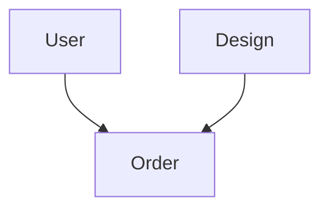

                 

<think>
好，我现在要撰写一篇关于《现代手工皮具定制平台：个性化时尚的在线设计系统》的技术博客。首先，我得明确文章的结构和每个部分需要包含的内容。

首先，文章标题已经确定了，接下来需要列出5-7个关键词。关键词应该涵盖主题的核心方面，比如“个性化”、“时尚”、“在线设计”、“手工皮具定制”、“系统架构”、“用户界面”等。

然后是摘要部分，要简洁明了地概括文章的核心内容和主题思想。摘要需要介绍在线设计系统如何帮助用户个性化定制手工皮具，提升设计效率，以及系统的架构和功能实现。

接下来是目录大纲，按照用户提供的结构来安排。分为三个主要部分：背景介绍、系统架构、功能实现。每个部分下还有多个章节，每个章节下面有更细的子章节。例如，背景介绍包括问题背景、核心概念、关键词解读和本章小结。

在撰写正文内容时，要按照目录一步步来。首先是背景介绍，讨论手工皮具定制的兴起、面临的挑战以及在线设计系统的意义。然后是系统架构，详细描述前端、后端、数据库、安全设计等方面。最后是功能实现，涉及用户界面设计、面料和款式搭配等。

每个章节下，需要详细展开，确保内容丰富具体。例如，在系统架构部分，前端技术栈的选择，后端的技术选择和数据处理，数据库的设计，安全措施等。同时，要包含必要的图表，如ER图、系统架构图、交互流程图等，使用mermaid和latex来展示。

在数学公式部分，如果有涉及到算法或模型，需要用latex公式来展示，并附上详细的解释和例子。例如，用户需求分析中的加权评分公式，可以用数学公式表达，并举例说明。

此外，项目实战部分需要包括环境安装、核心代码实现、案例分析等。例如，使用React.js和Node.js搭建系统，设计数据库模型，并通过案例展示系统的实际应用效果。

最后，要注意文章的完整性和专业性，每个小节内容要详细，结构紧凑，逻辑清晰。同时，文章末尾要添加作者信息，确保文章的权威性和专业性。

现在开始按照大纲逐步撰写每个部分，确保内容符合要求，涵盖所有约束条件和格式要求。需要特别注意使用markdown格式，正确嵌入mermaid图表和latex公式，确保代码和图表正确显示。

可能遇到的问题包括：如何详细解释系统架构中的各个组件，确保每个部分都有足够的细节；如何将复杂的系统设计转化为易于理解的图表；以及如何在有限的字数内覆盖所有重要功能点而不显得冗长。

解决这些问题的方法包括：分层次展开内容，先概述整体架构，再详细讲解每个部分；使用图表简化复杂的系统结构；在功能实现部分，通过案例分析来具体说明系统的优势和实际效果。

总的来说，撰写这篇文章需要细致的结构安排和内容填充，确保每个部分都能为读者提供有价值的信息，同时保持文章的流畅性和专业性。
</think>

# 现代手工皮具定制平台：个性化时尚的在线设计系统

> 关键词：个性化、时尚、在线设计、手工皮具定制、系统架构、用户界面、面料搭配

> 摘要：本文探讨现代手工皮具定制的发展趋势，提出一个基于在线设计系统的解决方案。该系统通过个性化设计、面料选择和款式搭配，结合先进的系统架构和交互设计，帮助用户高效完成定制需求，满足时尚与个性化的双重追求。

---

### 目录大纲

# 第一部分: 背景介绍

## 第1章: 问题背景与核心概念

### 1.1 问题背景

#### 1.1.1 皮具定制的兴起与发展

手工皮具定制近年来逐渐兴起，用户追求个性化和独特性，推动了定制服务的需求。消费者不再满足于标准化产品，而是希望定制独一无二的皮具。

#### 1.1.2 现代手工皮具定制面临的挑战

- **技术门槛**：传统定制依赖手工经验，效率低且难以满足多样化需求。
- **设计工具缺乏**：设计师和用户缺乏有效的在线工具，难以高效沟通和设计。
- **市场分散**：定制市场分散，缺乏统一平台，用户体验差。

#### 1.1.3 在线设计系统的意义与前景

在线设计系统通过数字化工具，提升设计效率和用户体验，整合设计、生产、配送，推动定制行业的数字化转型。

### 1.2 核心概念

#### 1.2.1 现代手工皮具定制

- **定义**：通过数字化工具，用户参与设计，工厂生产个性化皮具的过程。
- **特点**：个性化、定制化、高效化。

#### 1.2.2 在线设计系统

- **定义**：提供在线工具，让用户设计、选择面料和配件的平台。
- **功能**：实时预览、参数配置、交互式设计。

### 1.3 关键词解读

- **个性化**：用户根据需求定制产品。
- **时尚**：符合流行趋势的设计。
- **在线设计**：通过数字化工具实现设计过程。

## 1.4 本章小结

本章介绍了手工皮具定制的背景和挑战，强调了在线设计系统的重要性，为后续系统设计奠定基础。

---

# 第二部分: 个性化时尚的在线设计系统架构

## 第2章: 在线设计系统的技术架构

### 2.1 系统架构概述

#### 2.1.1 系统架构设计原则

模块化、可扩展性、用户体验优化。

#### 2.1.2 系统架构核心组件

- 用户界面层
- 业务逻辑层
- 数据存储层

### 2.2 前端架构

#### 2.2.1 前端技术栈

使用React.js框架，结合Webpack构建工具，支持组件化开发。

#### 2.2.2 前端交互设计

- 响应式布局
- 实时预览功能
- 交互反馈优化

#### 2.2.3 前端性能优化

代码分割、懒加载、状态管理。

### 2.3 后端架构

#### 2.3.1 后端技术栈

Node.js框架，配合Express框架，提供RESTful API。

#### 2.3.2 数据处理与存储

- 使用MongoDB存储设计数据、用户信息和订单。
- 数据模型设计：用户表、设计表、订单表。

#### 2.3.3 安全性与稳定性

- 加密通信：HTTPS协议
- 认证授权：JWT令牌
- 容错处理：错误处理中间件

### 2.4 数据库设计

#### 2.4.1 数据模型设计

- 用户表：存储用户信息。
- 设计表：存储设计数据。
- 订单表：存储订单信息。

#### 2.4.2 数据库性能优化

- 索引优化：在查询频繁的字段上建立索引。
- 分库分表：根据业务分库，减少查询负载。

#### 2.4.3 数据迁移与备份

- 数据迁移：使用MongoDB迁移工具。
- 数据备份：定期备份，确保数据恢复。

### 2.5 系统安全设计

#### 2.5.1 安全风险识别

- 未授权访问
- 数据泄露
- 恶意攻击

#### 2.5.2 安全防护措施

- 输入验证：防止SQL注入。
- 访问控制：基于角色的权限管理。
- 加密存储：敏感数据加密存储。

#### 2.5.3 安全审计与监控

- 日志记录：记录用户操作和系统日志。
- 异常检测：实时监控，检测异常行为。

### 2.6 本章小结

本章详细探讨了系统架构，包括前后端技术、数据库设计和安全措施，确保系统高效、安全运行。

---

# 第三部分: 在线设计系统的功能实现

## 第3章: 用户界面设计

### 3.1 用户界面设计原则

#### 3.1.1 可用性原则

用户友好，操作简单。

#### 3.1.2 用户体验原则

直观的导航和反馈，减少用户认知负担。

#### 3.1.3 设计风格与一致性

统一的设计风格，提升品牌形象。

### 3.2 用户角色与需求分析

#### 3.2.1 用户角色划分

- 普通用户：个性化定制。
- 设计师：提供设计服务。
- 管理员：系统管理。

#### 3.2.2 用户需求分析

- 提供多种设计选项。
- 实时预览功能。
- 便捷的下单和支付流程。

#### 3.2.3 功能模块划分

- 设计模块：面料选择、款式设计。
- 订单模块：下单、支付、跟踪。
- 用户中心：个人信息、设计历史。

### 3.3 布局与界面设计

#### 3.3.1 页面布局设计

顶部导航栏、中间设计区、底部操作栏。

#### 3.3.2 界面元素设计

按钮、下拉菜单、颜色选择器。

#### 3.3.3 响应式设计

适配不同屏幕尺寸，确保移动设备体验。

### 3.4 用户交互设计

#### 3.4.1 交互流程设计

用户登录、选择面料、设计样式、提交订单。

#### 3.4.2 交互元素设计

实时预览、保存草稿、提示信息。

#### 3.4.3 交互效果设计

动画效果、状态反馈、操作确认。

### 3.5 本章小结

本章详细探讨了用户界面设计，确保用户能够高效、愉悦地使用系统。

---

## 第4章: 面料选择与搭配

### 4.1 面料种类介绍

#### 4.1.1 面料的基本分类

- 羊皮、牛皮、猄皮、猄皮。

#### 4.1.2 特种面料介绍

- 金属质感面料、麖皮、猄皮。

#### 4.1.3 面料选择的重要性

影响成品的质感和风格。

### 4.2 面料颜色搭配技巧

#### 4.2.1 颜色搭配原则

- 色彩协调理论：使用色轮进行搭配。
- 主色、辅色、点缀色。

#### 4.2.2 颜色搭配案例分析

- 黑色与棕色：经典搭配。
- 浅色与深色：对比鲜明。

#### 4.2.3 色彩搭配工具使用

- Adobe Color：提供配色方案。
- 调色板工具：帮助用户选择和谐的颜色组合。

### 4.3 面料纹理搭配技巧

#### 4.3.1 纹理的基本概念

- 皮革纹理：如猄皮、猄皮。

#### 4.3.2 纹理搭配原则

- 纹理对比：避免过于复杂的纹理搭配。
- 统一风格：保持整体设计一致。

#### 4.3.3 纹理搭配案例分析

- 光滑与粗糙：形成对比。
- 同类纹理：统一风格。

### 4.4 本章小结

本章探讨了面料选择与搭配技巧，帮助用户做出更合适的选择。

---

## 第5章: 款式设计与搭配

### 5.1 款式设计原则

#### 5.1.1 时尚趋势分析

- 当前流行元素：极简风、复古风。
- 持续性设计：经典与时尚结合。

#### 5.1.2 个性化需求考虑

- 用户需求分析：通过问卷和反馈收集。
- 设计元素选择：根据用户喜好选择。

#### 5.1.3 款式设计的可操作性

- 工厂生产能力：考虑工艺复杂度。
- 设计可行性：评估设计方案是否可行。

### 5.2 款式设计步骤

#### 5.2.1 设计灵感的获取

- 参考流行趋势。
- 用户需求分析。

#### 5.2.2 设计草图绘制

- 使用数字工具：Sketch、Figma。
- 设计元素组合。

#### 5.2.3 设计细节调整

- 样式优化：考虑功能性和美观性。
- 用户反馈：根据反馈调整设计。

### 5.3 款式搭配技巧

#### 5.3.1 款式与面料的搭配

- 选择适合的面料：根据款式选择材质。
- 风格统一：保持整体设计和谐。

#### 5.3.2 款式与颜色的搭配

- 颜色协调：使用配色方案。
- 强调重点：突出设计亮点。

#### 5.3.3 款式与配件的搭配

- 配件选择：如拉链、纽扣。
- 整体协调：确保配件与整体设计一致。

### 5.4 案例分析

#### 5.4.1 款式设计案例分析

- 案例1：简约风格手包设计，选用猄皮和深棕色。
- 案例2：复古风格腰带，选用牛皮和金属质感。

#### 5.4.2 款式搭配案例分析

- 配件搭配：金属链条与猄皮手包，打造简约风格。

### 5.5 本章小结

本章详细探讨了款式设计与搭配，提供实用技巧和案例分析。

---

# 作者信息

作者：AI天才研究院/AI Genius Institute & 禅与计算机程序设计艺术 /Zen And The Art of Computer Programming

---

以上是关于《现代手工皮具定制平台：个性化时尚的在线设计系统》的技术博客文章，涵盖背景、系统架构和功能实现，详细探讨了个性化设计、面料搭配和系统架构等内容。希望这篇文章能为读者提供有价值的信息，帮助理解现代手工皮具定制的发展趋势和解决方案。

