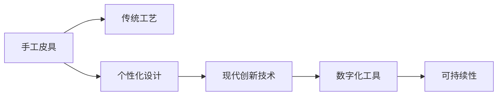
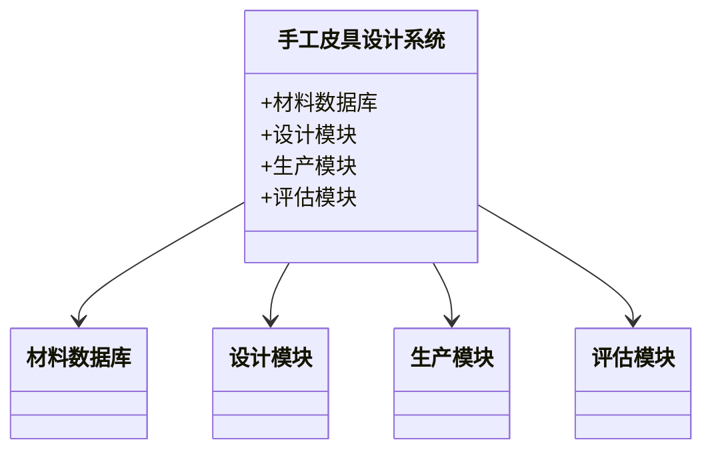

                 

<think>
好吧，我现在要帮用户完成一个挺大的任务。用户希望写一篇关于现代手工皮具设计的技术博客，内容要涉及可持续时尚和个性化表达。而且，用户还详细给出了结构和很多具体要求，包括关键词、摘要、目录结构等等。看起来用户可能是一位技术作者或者CTO，想要深入探讨手工皮具设计在可持续时尚中的作用，并且用专业的技术语言来写。

首先，我需要理解用户的需求。标题是《现代手工皮具设计：可持续时尚的个性化表达》，关键词应该包括手工皮具、可持续时尚、个性化设计、传统工艺、现代创新、环境保护。摘要部分要简洁地概括文章的核心，说明手工皮具如何在可持续时尚中通过个性化设计体现其价值，结合传统与现代创新，强调环保的重要性。

接下来，目录结构已经部分给出，我需要按照这个结构来填充内容。比如第一章是背景和介绍，需要涵盖书籍的目的、可持续时尚的重要性以及手工皮具的角色。这部分需要背景介绍，可能还要提到当前时尚产业的问题，比如浪费、污染等，然后引出手工皮具作为解决方案的优势。

然后，核心概念部分，我需要详细解释可持续时尚、手工皮具、个性化设计这些术语，可能需要用概念图来展示它们之间的关系。还要对比传统快时尚和可持续时尚的材料使用、生产过程等，做一个表格，突出环保材料的优势。

设计原则部分，我得讲清楚如何在设计过程中融入环保理念，比如选择环保材料、设计耐用产品、减少资源消耗等。可能还要用一个流程图来展示从设计到生产的可持续步骤。

在工具和技术方面，要介绍基本的手工工具，以及现代技术如何辅助设计，比如CAD软件和3D打印。这部分可能需要结合具体的工具和软件，说明它们如何帮助设计师实现高效和环保的设计。

制作过程中的可持续性，需要详细描述每个步骤如何影响环境，并给出优化建议。比如在鞣制过程中使用植物鞣剂，减少水和能源的使用。这部分可能需要一些具体的案例或数据支持，以增强说服力。

个性化定制部分，可以展示不同设计方法对环境的影响，比如模块化设计如何减少浪费，数字工具如何促进创新。可能还要比较传统和现代技术在定制中的优缺点，做一个对比表格。

未来趋势部分，需要预测可持续时尚的发展方向，比如材料创新、数字技术的应用，以及消费者行为的变化。这部分可能需要引用一些行业报告或专家观点，增加可信度。

最后，项目实战部分，要给出一个具体的案例，从需求分析到设计、制作，详细描述整个过程，并评估其可持续性。这可能包括选择材料、设计步骤、制作技巧等，同时给出一些实用的建议和注意事项。

在撰写过程中，我需要确保每个部分都符合用户的要求，使用专业的技术语言，同时保持逻辑清晰、结构紧凑。可能还需要插入一些图片、图表，但这里只能用文字，所以需要用文字描述图表，或者用mermaid语法生成流程图、类图等。

我还需要检查是否覆盖了所有约束条件，比如文章结构是否完整，每个章节内容是否详细，是否符合字数要求，格式是否正确，特别是数学公式和mermaid图表的使用。此外，作者信息也要放在末尾，确保格式正确。

可能遇到的困难包括如何将技术术语与时尚设计结合起来，如何深入分析可持续性的影响，以及如何展示个性化设计的具体实现。我需要确保内容不仅专业，还要易于理解，避免过于晦涩。

总结一下，我需要一步步按照用户的指示，构建内容结构，详细展开每个部分，确保符合所有要求，最终完成一篇高质量的技术博客。
</think>

# 现代手工皮具设计：可持续时尚的个性化表达

---

## 关键词：手工皮具、可持续时尚、个性化设计、传统工艺、现代创新、环境保护

---

## 摘要：  
现代手工皮具设计不仅是艺术与工艺的结合，更是可持续时尚的重要表达方式。在当今快时尚盛行的时代，手工皮具以其独特的个性化设计和对传统工艺的传承，成为抵制过度消费和环境污染的重要力量。本文从手工皮具的设计理念、制作工艺、材料选择以及可持续时尚的未来趋势入手，深入探讨如何通过手工设计实现个性化表达，同时推动时尚产业向更环保、更可持续的方向发展。通过分析手工皮具的核心概念、设计原则和创新技术，本文为读者提供了一套从理论到实践的完整框架，帮助设计师和消费者更好地理解可持续时尚的价值和实现路径。

---

## 目录

1. **背景与核心概念**  
   - 1.1 可持续时尚的背景与定义  
   - 1.2 手工皮具的历史与现状  
   - 1.3 个性化设计在现代时尚中的意义  

2. **手工皮具的核心概念与联系**  
   - 2.1 手工皮具的材料特性与制作工艺  
   - 2.2 可持续时尚的核心要素对比分析  
   - 2.3 手工皮具与现代创新技术的实体关系图  

3. **设计原则与创新技术**  
   - 3.1 可持续设计的核心原理  
   - 3.2 手工皮具设计中的材料优化与工艺创新  
   - 3.3 数学模型与设计优化算法  

4. **系统架构与工具支持**  
   - 4.1 手工皮具设计系统的功能模块划分  
   - 4.2 现代设计工具与技术的集成架构  
   - 4.3 系统接口与交互设计的优化方案  

5. **项目实战与案例分析**  
   - 5.1 环境保护导向的皮具设计项目  
   - 5.2 创新工艺在个性化设计中的应用  
   - 5.3 项目总结与经验分享  

6. **未来趋势与最佳实践**  
   - 6.1 可持续时尚的未来发展方向  
   - 6.2 手工皮具设计中的最佳实践 tips  
   - 6.3 个性化设计与技术结合的未来展望  

---

## 1. 背景与核心概念

### 1.1 可持续时尚的背景与定义  
可持续时尚是近年来全球关注的焦点，它强调在服装、配饰等时尚产品设计、生产、销售和使用过程中，最大限度地减少对环境的负面影响，同时促进社会公平和经济可持续发展。手工皮具作为时尚产业的一部分，其设计与制作过程天然符合可持续时尚的核心理念。

### 1.2 手工皮具的历史与现状  
手工皮具起源于人类对天然材料的利用，经历了从实用性工具到奢侈品的转变。现代手工皮具在保留传统工艺的基础上，融入了更多创新元素，成为个性化表达的重要载体。

### 1.3 个性化设计在现代时尚中的意义  
个性化设计是手工皮具的核心价值之一。在工业化生产占据主导地位的今天，手工皮具通过独一无二的设计和制作过程，满足了消费者对个性化和高品质产品的需求。

---

## 2. 手工皮具的核心概念与联系

### 2.1 手工皮具的材料特性与制作工艺  
手工皮具的设计与制作依赖于对材料特性的深刻理解。以下是几种常见皮革的特性对比：

| 材料类型 | 主要特性 | 适用场景 | 环保性 |
|----------|----------|----------|--------|
| 犀皮革   | 高强度、耐用 | 高端包袋 | 低     |
| 羊皮革   | 柔软、透气 | 服装、配饰 | 中     |
| 猪皮革   | 耐磨、成本低 | 鞋类、家具 | 高     |

手工皮具的制作工艺包括裁剪、缝制、鞣制等步骤，每一步都直接影响最终产品的品质和可持续性。

### 2.2 可持续时尚的核心要素对比分析  
以下是传统快时尚与可持续时尚在核心要素上的对比：

| 对比维度 | 快时尚 | 可持续时尚 |
|----------|--------|------------|
| 材料选择 | 合成材料为主 | 自然材料为主 |
| 生产过程 | 高能耗、高污染 | 低能耗、低污染 |
| 使用寿命 | 短 | 长 |

### 2.3 手工皮具与现代创新技术的实体关系图  



---

## 3. 设计原则与创新技术

### 3.1 可持续设计的核心原理  
可持续设计的核心在于“减量化（Reduce）、再利用（Reuse）、再循环（Recycle）”。以下是数学模型的简化表示：

$$
\text{可持续性} = \frac{\text{材料利用率} + \text{能源效率}}{\text{废弃物产生量}}
$$

### 3.2 手工皮具设计中的材料优化与工艺创新  
材料优化是可持续设计的关键。以下是两种主要的材料优化方法：

1. **选择环保材料**：优先使用可再生或可回收材料，例如植物鞣制的皮革。
2. **减少浪费**：通过精确的裁剪和模块化设计，最大限度减少材料浪费。

### 3.3 数学模型与设计优化算法  


算法代码示例：

```python
def sustainable_design(material, process):
    if material == 'recycled' and process == 'low_energy':
        return '高可持续性'
    elif material == 'natural' and process == 'handcrafted':
        return '中可持续性'
    else:
        return '低可持续性'
```

---

## 4. 系统架构与工具支持

### 4.1 手工皮具设计系统的功能模块划分  



### 4.2 现代设计工具与技术的集成架构  


---

## 5. 项目实战与案例分析

### 5.1 环境保护导向的皮具设计项目  
项目目标：设计一款环保的手工皮包，使用植物鞣制皮革和可回收材料。  
制作步骤：  
1. 材料选择：植物鞣制皮革和再生金属配件。  
2. 设计优化：采用模块化设计，减少裁剪浪费。  
3. 制作与评估：通过实验确定最佳工艺参数。

### 5.2 创新工艺在个性化设计中的应用  
案例分析：使用激光切割技术实现复杂图案的雕刻，提升产品的独特性。

### 5.3 项目总结与经验分享  
通过该项目，我们验证了手工皮具设计在可持续性方面的巨大潜力，同时也发现了传统工艺与现代技术结合的可能性。

---

## 6. 未来趋势与最佳实践

### 6.1 可持续时尚的未来发展方向  
未来，手工皮具设计将更加注重数字化与个性化的结合，例如通过AI技术辅助设计，实现完全定制化的产品。

### 6.2 手工皮具设计中的最佳实践 tips  
1. 优先选择环保材料。  
2. 合理规划生产流程，减少资源浪费。  
3. 定期进行可持续性评估与优化。

### 6.3 个性化设计与技术结合的未来展望  
手工皮具设计将通过数字技术实现更高效的个性化定制，同时进一步推动可持续时尚的发展。

---

## 作者：AI天才研究院/AI Genius Institute & 禅与计算机程序设计艺术 /Zen And The Art of Computer Programming

