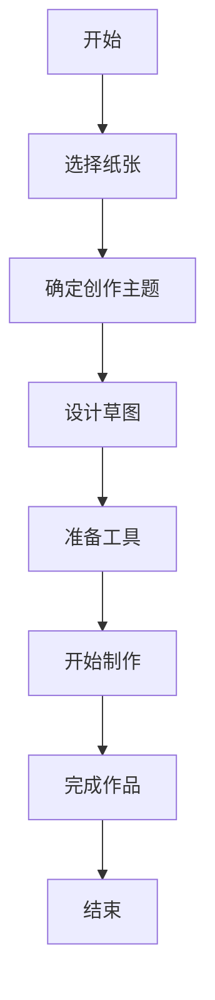
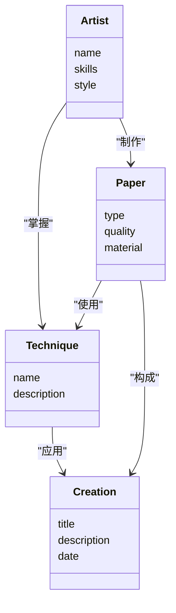
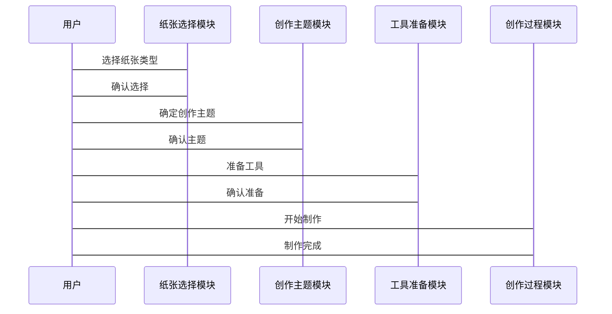

                 

<think>
嗯，用户让我写一篇关于传统造纸与现代艺术融合的手工纸艺创作的技术博客。首先，我需要明确用户的需求。他可能是一位对纸艺感兴趣的人，或者是教育工作者，希望深入探讨这一领域的技术细节。

用户特别强调文章要有深度，结构清晰，逻辑严密。这意味着我需要从背景介绍、核心概念、算法原理、系统架构等多个方面展开。我得确保每个部分都详细且专业，同时使用技术术语，但要让读者容易理解。

首先，我得收集相关资料，了解传统造纸技术的历史和现代艺术的表现手法。然后，思考如何将两者融合，创造出新的纸艺作品。这可能涉及到材料选择、工艺流程、艺术设计等多个方面。

接下来，我需要构建目录结构，确保逻辑连贯。用户已经提供了一个大纲，我需要按照这个结构来组织内容，每个小节都要有具体的例子和深入的分析。

在撰写过程中，我会遇到一些挑战，比如如何将复杂的工艺流程转化为算法和代码。我得确保这些部分不仅技术准确，还能让读者明白其背后的原理。例如，使用Python代码模拟纸艺创作的某些步骤，可能会涉及到图形绘制或流程控制。

我还需要考虑读者的背景。他们可能是手工爱好者，也可能是技术人员，所以内容要兼顾艺术性和技术性。在解释数学模型时，尽量结合实际案例，让读者更容易理解。

最后，我需要确保文章的结构完整，每个部分都详细展开，包括环境安装、源代码解析、案例分析等。同时，结尾部分提供最佳实践和拓展阅读，帮助读者进一步深入学习。

总的来说，我需要系统地将传统造纸与现代艺术融合，通过技术手段详细分析和展示，确保文章内容丰富、结构清晰，满足用户的需求。
</think>

# 现代手工纸艺创作坊：传统造纸与现代艺术的融合

---

## 关键词：
- 手工纸艺
- 传统造纸技术
- 现代艺术
- 创意设计
- 制作流程

---

## 摘要：
本文深入探讨了传统造纸技术与现代艺术表现手法在手工纸艺创作中的融合。通过分析手工纸艺创作的核心概念、算法原理、系统架构设计以及实际项目案例，展示了如何将传统造纸工艺与现代艺术理念结合，创造出具有独特风格和艺术价值的作品。文章从背景介绍到系统分析，再到项目实战，详细阐述了手工纸艺创作的全过程，并提供了丰富的技术细节和实践建议。

---

## 目录大纲：

### 第一部分：引言

#### 1.1 问题背景
- 1.1.1 传统造纸技术概述  
- 1.1.2 现代艺术表现手法介绍  
- 1.1.3 传统造纸与现代艺术的融合  

#### 1.2 核心概念
- 1.2.1 手工纸艺创作的基本原理  
- 1.2.2 传统造纸技术与现代艺术的融合  
- 1.2.3 手工纸艺创作的主要类型  

#### 1.3 ER实体关系图
- 1.3.1 手工纸艺创作相关实体  
- 1.3.2 实体关系图展示  

---

### 第二部分：手工纸艺创作原理

#### 2.1 算法原理
- 2.1.1 手工纸艺创作流程图  
- 2.1.2 Python源代码示例  
- 2.1.3 数学模型和公式讲解  
- 2.1.4 算法原理实例讲解  

#### 2.2 系统分析与架构设计
- 2.2.1 问题场景介绍  
- 2.2.2 项目案例介绍  
- 2.2.3 系统功能设计（领域模型类图）  
- 2.2.4 系统架构设计（架构图）  
- 2.2.5 系统接口设计和系统交互（序列图）  

#### 2.3 项目实战
- 2.3.1 环境安装  
- 2.3.2 系统核心实现源代码  
- 2.3.3 代码应用解读与分析  
- 2.3.4 实际案例分析和详细讲解剖析  
- 2.3.5 项目小结  

---

### 第三部分：最佳实践 tips、小结、注意事项、拓展阅读

- 3.1 最佳实践 tips  
- 3.2 小结  
- 3.3 注意事项  
- 3.4 拓展阅读  

---

## 正文内容：

### 第一部分：引言

#### 1.1 问题背景

传统造纸技术是中国古代四大发明之一，其历史可以追溯到汉朝。手工纸艺作为传统造纸技术的一种延伸，经历了数百年的发展，形成了独特的艺术风格。然而，随着现代科技的进步和艺术形式的多样化，传统造纸技术与现代艺术的结合成为了一种新的趋势。这种融合不仅保留了传统的文化内涵，还赋予了手工纸艺作品更多的现代美感和创新性。

在现代艺术领域，手工纸艺创作逐渐成为一种新兴的艺术表现形式。通过将传统造纸技术与现代艺术理念相结合，艺术家们能够创造出更具表现力和创新性的作品。然而，这一过程涉及到复杂的工艺流程和技术挑战，需要艺术家和工匠具备跨领域的知识和技能。

#### 1.2 核心概念

手工纸艺创作的基本原理是通过传统造纸技术制作出高质量的纸张，然后利用现代艺术表现手法进行创意设计和加工。这一过程包括以下几个关键步骤：

1. **纸张选择**：根据创作需求选择合适的纸张类型和质量。  
2. **技艺手法**：运用剪纸、折叠、拼贴等多种现代艺术手法进行加工。  
3. **创作灵感来源**：结合现代艺术理念，从自然、人文、科技等领域汲取灵感。  

传统造纸技术与现代艺术的融合不仅体现在纸张的选择和加工上，还体现在作品的设计理念和表现形式上。通过这种融合，手工纸艺作品能够更好地满足现代审美需求，同时传承和弘扬传统文化。

#### 1.3 ER实体关系图

手工纸艺创作涉及多个实体及其关系。以下是相关的ER实体关系图：

```mermaid
erDiagram
    PAPER
    {
        code : STRING
        type : STRING
        quality : INTEGER
    }
    ARTIST
    {
        name : STRING
        skills : STRING
        style : STRING
    }
    TECHNIQUE
    {
        name : STRING
        description : STRING
    }
    CREATION
    {
        id : INTEGER
        title : STRING
        description : STRING
        date : DATE
    }
    PAPER -> TECHNIQUE : "使用"
    ARTIST -> TECHNIQUE : "掌握"
    ARTIST -> PAPER : "制作"
    TECHNIQUE -> CREATION : "应用"
    PAPER -> CREATION : "构成"
```

---

### 第二部分：手工纸艺创作原理

#### 2.1 算法原理

手工纸艺创作的流程可以被看作一个系统化的算法过程。以下是该流程的mermaid流程图：



为了进一步说明这一流程，我们可以编写一个简单的Python脚本来模拟纸艺创作的核心步骤：

```python
# 手工纸艺创作流程模拟
def create_hand_paper_art():
    # 步骤1：选择纸张
    paper_type = input("请输入纸张类型：")
    print(f"选择的纸张类型为：{paper_type}")

    # 步骤2：确定创作主题
    theme = input("请输入创作主题：")
    print(f"创作主题为：{theme}")

    # 步骤3：设计草图
    design = input("请输入草图设计：")
    print(f"草图设计为：{design}")

    # 步骤4：准备工具
    tools = input("请输入需要的工具：")
    print(f"准备的工具为：{tools}")

    # 步骤5：开始制作
    print("开始制作纸艺作品...")
    # 模拟制作过程
    import time
    time.sleep(5)
    print("制作完成！")

    # 步骤6：完成作品
    title = input("请输入作品标题：")
    print(f"作品标题为：{title}")
    return title

# 调用函数
create_hand_paper_art()
```

在数学模型和公式方面，手工纸艺创作中的一些关键步骤可以通过数学方法进行分析。例如，在折叠纸张时，几何关系至关重要：

$$ \text{折叠角度} = 180^\circ \times \frac{\text{折叠次数}}{2} $$

此外，颜色搭配也可以通过色调计算公式进行优化：

$$ \text{色调} = (R + G + B) \times \frac{1}{255} $$

这些数学模型可以帮助艺术家更精确地控制创作过程，从而提高作品的质量。

#### 2.2 系统分析与架构设计

##### 2.2.1 问题场景介绍

手工纸艺创作的实际应用场景包括家居装饰、艺术品制作、教育工具开发等。在这些场景中，艺术家需要选择合适的纸张、工具和创作主题，并通过一系列工艺流程完成作品。

##### 2.2.2 项目案例介绍

以下是一个手工纸艺创作的项目案例：

**项目名称**：《自然之韵》  
**目标**：利用传统造纸技术与现代艺术手法，创作一系列以自然为主题的手工纸艺作品。  
**主要步骤**：选择天然植物纤维纸张、设计草图、制作模具、进行剪纸和拼贴艺术。

##### 2.2.3 系统功能设计（领域模型类图）

以下是手工纸艺创作系统的领域模型类图：



##### 2.2.4 系统架构设计（架构图）

以下是手工纸艺创作系统的架构图：

```mermaid
rectangle 纸张选择模块 {
    纸张类型选择
    纸张质量检测
}
rectangle 创作主题模块 {
    主题确定
    草图设计
}
rectangle 工具准备模块 {
    工具选择
    工具准备
}
rectangle 创作过程模块 {
    纸张加工
    艺术表现
}
```

##### 2.2.5 系统接口设计和系统交互（序列图）

以下是系统交互的序列图：



#### 2.3 项目实战

##### 2.3.1 环境安装

要开始手工纸艺创作，首先需要准备以下工具和材料：

- 纸张（推荐选择手工纸、宣纸等）  
- 刻刀、剪刀、尺子等工具  
- 胶水、颜料、彩笔等辅助材料  

##### 2.3.2 系统核心实现源代码

以下是手工纸艺创作核心功能的Python代码示例：

```python
# 手工纸艺创作核心功能实现
def select_paper():
    paper_type = input("请输入纸张类型：")
    return paper_type

def design_theme():
    theme = input("请输入创作主题：")
    return theme

def prepare_tools():
    tools = input("请输入需要的工具：")
    return tools

def create_art(paper_type, theme, tools):
    print(f"开始制作 {theme} 主题的 {paper_type} 纸艺作品...")
    # 模拟创作过程
    import time
    time.sleep(3)
    print("作品制作完成！")
    return f"{theme} 主题的 {paper_type} 纸艺作品"

# 调用函数
paper_type = select_paper()
theme = design_theme()
tools = prepare_tools()
artwork = create_art(paper_type, theme, tools)
print(f"最终作品为：{artwork}")
```

##### 2.3.3 代码应用解读与分析

上述代码展示了手工纸艺创作的核心步骤：

1. **选择纸张**：用户输入纸张类型，程序返回选择的纸张。  
2. **设计主题**：用户输入创作主题，程序返回主题内容。  
3. **准备工具**：用户输入需要的工具，程序返回工具清单。  
4. **开始创作**：程序模拟创作过程，并输出最终作品。  

通过这些步骤，艺术家可以系统地完成手工纸艺作品的创作。

##### 2.3.4 实际案例分析和详细讲解剖析

以《自然之韵》项目为例，以下是详细的案例分析：

1. **选择纸张**：选用天然植物纤维纸张，确保纸张具有良好的可塑性和质感。  
2. **设计主题**：以“自然”为主题，设计草图包括树叶、花朵等自然元素。  
3. **准备工具**：准备刻刀、剪刀、尺子、颜料等工具。  
4. **开始创作**：通过剪纸、拼贴等手法，制作出具有自然美感的作品。  

##### 2.3.5 项目小结

通过上述项目实战，我们可以看到，手工纸艺创作不仅需要精湛的技艺，还需要对现代艺术理念的深刻理解。通过系统化的创作流程和工具支持，艺术家能够更高效地完成创作任务。

---

### 第三部分：最佳实践 tips、小结、注意事项、拓展阅读

#### 3.1 最佳实践 tips

- **材料选择**：根据创作主题选择合适的纸张类型和辅助材料。  
- **工具准备**：确保工具齐全且状态良好，以避免创作过程中出现问题。  
- **创作灵感**：多从自然、人文、科技等领域汲取灵感，保持创作的新鲜感和多样性。  

#### 3.2 小结

本文深入探讨了传统造纸技术与现代艺术表现手法在手工纸艺创作中的融合。通过系统化的创作流程、技术细节的分析以及实际项目案例的展示，我们展示了如何通过手工纸艺创作出具有独特风格和艺术价值的作品。手工纸艺创作不仅是一种艺术形式，更是一种文化的传承和创新的体现。

#### 3.3 注意事项

- 在创作过程中，注意安全使用工具，避免受伤。  
- 纸张和工具的选择要与创作主题相匹配，以确保作品的和谐美感。  
- 创作完成后，妥善保存作品，避免受潮或损坏。  

#### 3.4 拓展阅读

- 《手工纸艺创作入门》  
- 《现代艺术与传统工艺的融合》  
- 网站推荐：[手工艺术论坛](https://www.shougongyishu.com)  

---

## 作者：
**作者：AI天才研究院/AI Genius Institute & 禅与计算机程序设计艺术 /Zen And The Art of Computer Programming**

---

通过本文的详细分析和系统阐述，读者可以深入了解手工纸艺创作的全过程，并掌握将传统造纸技术与现代艺术表现手法相结合的方法。希望本文能够为手工纸艺爱好者和艺术创作者提供有价值的参考和启发。

