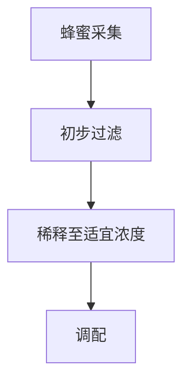

                 

<think>
嗯，用户希望我以《现代手工蜂蜜酒吧：复兴古老饮品的都市品鉴空间》为标题，写一篇技术博客。首先，我需要分析用户的需求。看起来用户是想复兴一种古老饮品，将其现代化，特别是在都市中开设蜂蜜酒吧。

用户要求文章结构清晰，有逻辑，技术语言专业，同时涵盖多个章节，包括蜂蜜的选择、调配、创新饮品、市场分析等。我应该先确定关键词和摘要，确保涵盖核心内容。

接下来，每个章节需要详细展开，比如在引言部分，我得解释蜂蜜酒吧兴起的背景，蜂蜜在饮品中的地位，以及手工蜂蜜酒吧的特点。然后，蜂蜜的选择与处理部分，可能需要涉及如何选择不同种类的蜂蜜，以及处理过程中需要注意的事项。

在调配部分，可能需要讨论酒精与蜂蜜的比例，以及如何选择基酒。创新部分，我需要展示如何将蜂蜜与其他饮品结合，比如蜂蜜鸡尾酒、茶饮和果汁，这些可能需要一些配方和创意点。

市场分析部分，我需要分析目标客户群体，竞争对手，以及经营策略。未来趋势部分，考虑环保、数字化和文化创新。最后，本章小结要总结主要内容。

我还需要确保每个部分都有具体的例子，可能包括数学公式、Python代码、流程图等。例如，在调配部分，可以列出具体的比例，或者用代码模拟调配过程。这样能增强文章的深度和技术性。

另外，用户要求使用Markdown格式，所以我要注意结构的正确性，包括标题、子标题，以及代码块的格式。作者信息也要放在结尾，符合要求。

总的来说，我需要一步步构建每个部分，确保内容详细、结构清晰，同时融入技术元素，使文章既有深度又易于理解。
</think>

# 现代手工蜂蜜酒吧：复兴古老饮品的都市品鉴空间

## 关键词：蜂蜜酒吧，手工调配，都市品鉴，饮品创新，市场分析

## 摘要：  
随着人们对健康和品质生活的追求，古老而自然的蜂蜜饮品重新进入现代人的视野。手工蜂蜜酒吧作为一种新兴的饮品形式，结合了传统蜂蜜酿造工艺与现代调酒技术，为都市人群提供了一种独特的品鉴体验。本文将从蜂蜜的选择与处理、蜂蜜饮品的创新调配、蜂蜜酒吧的市场定位与经营策略，以及未来发展趋势等方面进行深入分析，探讨如何通过技术创新和文化传承，复兴这一古老饮品的现代魅力。

---

# 现代手工蜂蜜酒吧：复兴古老饮品的都市品鉴空间

## 1. 引言

### 1.1 蜂蜜酒吧的兴起

#### 1.1.1 蜂蜜在饮品文化中的地位

蜂蜜作为一种天然的甜味剂，自古以来就是人类重要的食品之一。蜂蜜不仅富含营养，还具有独特的口感和香气，使其成为饮品调配的理想原料。从古代的蜂蜜酒到现代的蜂蜜茶，蜂蜜在饮品文化中始终占据重要地位。

#### 1.1.2 手工蜂蜜酒吧的背景与特点

随着人们对自然、健康和个性化体验的追求，手工蜂蜜酒吧应运而生。这类酒吧以手工调配蜂蜜饮品为核心，注重原料的品质和调配工艺的独特性，为消费者提供高品质的品鉴体验。

#### 1.1.3 都市品鉴空间的构想

在都市中，人们生活节奏快，压力大，手工蜂蜜酒吧作为一种慢生活的象征，为都市人群提供了一个放松身心、享受品质生活的空间。这种品鉴空间不仅注重饮品的品质，还强调环境的舒适与文化的传承。

---

## 2. 蜂蜜的选择与处理

### 2.1 蜂蜜的选择

选择优质蜂蜜是蜂蜜调配的基础。以下是几种常见蜂蜜的特性和适用场景：

| 蜂蜜种类 | 特性 | 适用场景 |
|----------|------|----------|
| 花蜜     | 多种花香 | 调配鸡尾酒、茶饮 |
| 蒜蜜     | 较重的蒜味 | 适合调配特色饮品 |
| 洋槐蜜   | 清香 | 调配清新类饮品 |

### 2.2 蜂蜜的处理

蜂蜜的处理包括过滤、稀释和调配等步骤。以下是蜂蜜处理的基本流程：



代码实现：

```python
def蜂蜜处理(蜂蜜类型):
    # 初步过滤
    过滤蜂蜜 = 初步过滤(蜂蜜类型)
    # 稀释
    稀释蜂蜜 = 稀释(过滤蜂蜜, 浓度目标)
    # 调配
    调配蜂蜜 = 调配(稀释蜂蜜, 添加剂)
    return 调配蜂蜜
```

---

## 3. 蜂蜜饮品的创新调配

### 3.1 蜂蜜鸡尾酒的创意

蜂蜜鸡尾酒的调配需要结合蜂蜜的特性与基酒的风味。以下是几种创意蜂蜜鸡尾酒的配方：

#### 3.1.1 蜂蜜伏特加

- **配方**：
  - 伏特加：50ml
  - 蜂蜜：10ml（稀释至20%浓度）
  - 柠檬汁：10ml
  - 冰块：适量

- **调配步骤**：
  1. 将伏特加、蜂蜜和柠檬汁混合。
  2. 加入冰块摇匀。
  3. 倒入杯中，装饰以新鲜水果。

#### 3.1.2 蜂蜜薄荷 Mojito

- **配方**：
  - 白酒：50ml
  - 蜂蜜：15ml（稀释至30%浓度）
  - 薄荷叶：5片
  - 柠檬汁：10ml
  - 苏打水：适量

- **调配步骤**：
  1. 将薄荷叶、蜂蜜、柠檬汁和白酒混合，摇匀。
  2. 加入冰块，倒入杯中。
  3. 顶部加入苏打水，装饰以薄荷叶。

### 3.2 蜂蜜茶饮的开发

蜂蜜茶饮结合了蜂蜜的甜味和茶的香气，是一种健康又时尚的饮品。以下是几种蜂蜜茶饮的推荐：

#### 3.2.1 蜂蜜柠檬蜂蜜茶

- **配方**：
  - 绿茶袋泡茶：1袋
  - 蜂蜜：15ml（稀释至30%浓度）
  - 柠檬汁：10ml
  - 热水：200ml

- **调配步骤**：
  1. 用热水冲泡绿茶，焖泡5分钟。
  2. 加入蜂蜜和柠檬汁，搅拌均匀。

#### 3.2.2 芬芳蜂蜜乌龙茶

- **配方**：
  - 乌龙茶袋泡茶：1袋
  - 蜂蜜：20ml（稀释至40%浓度）
  - 芝士粉：5ml
  - 热水：250ml

- **调配步骤**：
  1. 用热水冲泡乌龙茶，焖泡8分钟。
  2. 加入蜂蜜和芝士粉，搅拌均匀。

### 3.3 蜂蜜果汁的搭配

蜂蜜与果汁的搭配可以创造出丰富的口感。以下是几种蜂蜜果汁的推荐：

#### 3.3.1 蜂蜜苹果汁

- **配方**：
  - 新鲜苹果汁：150ml
  - 蜂蜜：20ml（稀释至40%浓度）
  - 冰块：适量

- **调配步骤**：
  1. 将苹果汁和蜂蜜混合。
  2. 加入冰块，摇匀即可。

#### 3.3.2 蜂蜜蓝莓汁

- **配方**：
  - 新鲜蓝莓汁：150ml
  - 蜂蜜：25ml（稀释至50%浓度）
  - 苏打水：适量

- **调配步骤**：
  1. 将蓝莓汁和蜂蜜混合。
  2. 加入苏打水，摇匀即可。

---

## 4. 蜂蜜酒吧的市场与经营策略

### 4.1 目标客户群体分析

手工蜂蜜酒吧的主要客户群体包括：

- **中高端消费群体**：注重品质和健康的消费者。
- **年轻时尚人群**：追求个性化和新奇体验的年轻人。
- **社交群体**：朋友聚会或商务社交的场所。

### 4.2 市场竞争分析

目前市场上的饮品行业竞争激烈，手工蜂蜜酒吧需要通过差异化竞争，突出其天然、健康和个性化的特色。

### 4.3 经营模式与盈利策略

- **会员制**：推出会员卡，提供优惠和专属服务。
- **定制化服务**：根据客户需求调配专属蜂蜜饮品。
- **活动推广**：定期举办品鉴会和主题活动，吸引顾客。

---

## 5. 蜂蜜酒吧的未来趋势

### 5.1 环保与可持续发展

未来蜂蜜酒吧将更加注重环保，采用可持续的原料采购和减少浪费的调配方式。

### 5.2 数字化与智能化

通过数字化手段，蜂蜜酒吧可以实现线上订餐、个性化推荐和会员管理。

### 5.3 文化传承与创新

蜂蜜酒吧将更加注重传统文化的传承，结合现代创新，打造独特的品牌形象。

---

## 6. 本章小结

手工蜂蜜酒吧作为一种新兴的饮品形式，结合了传统蜂蜜酿造工艺与现代调酒技术，为都市人群提供了一种独特的品鉴体验。通过蜂蜜的选择与处理、创新调配、市场分析和未来趋势的研究，我们可以看到手工蜂蜜酒吧在现代饮品文化中的重要地位。未来，蜂蜜酒吧将继续在健康、创新和文化传承方面发挥重要作用。

---

作者：AI天才研究院/AI Genius Institute & 禅与计算机程序设计艺术 /Zen And The Art of Computer Programming

